# Campus A-01 Wired Lab Guide  
## Provisioning a Campus Fabric

This Lab Guide:

https://github.com/arista-rockies/Workshops/blob/main/Campus/2026_Campus_Workshop/A-01/2026_Campus_A-01_Wired_Lab%20Guide.md

---

## Table of Contents
1. [Full Lab Topology](#1-full-lab-topology)
2. [POD Topology](#2-pod-topology)
3. [Accessing CloudVision as a Serivce](#3-accessing-cloudvision-as-a-service)
4. [Onbaording a new device into CVaaS](#4-onboarding-a-new-device-into-cvaas)

---

# 1. Full Lab Topology

---

## 2. POD Topology

---

## 3. Accessing CloudVision as a Service
1. Go to the Arista Ignition GUI via: https://ignition.campus-atd.net/ 
- Enter the 6 digit Access Code found on the Pod Handout Worksheet 
- Click.  

2. Click the **CVaaS** tile

3. You will now be logged into CloudVision

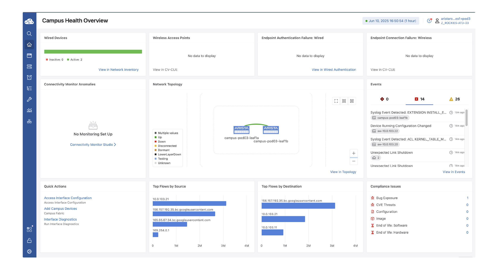

---

## 4. Onboarding a new device into CVaaS

In this lab you will be configuring the switches through CloudVision. Today you will be adding a second Leaf Switch to an existing Campus Fabric/POD using Cloud Vision’s guided workflow.

1. Login to CloudVision, then click on the **Network Hierarchy** menu option.

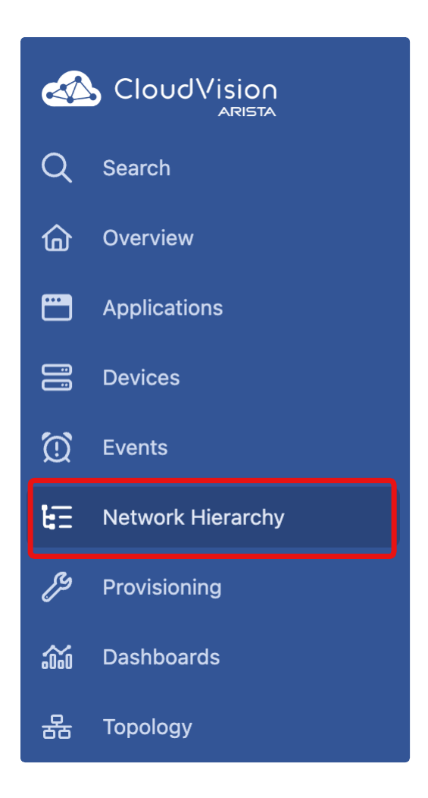

2. Navigate through the Network Hierarchy Tree to: **Network > Workshop > IT-Bldg > IDF1**

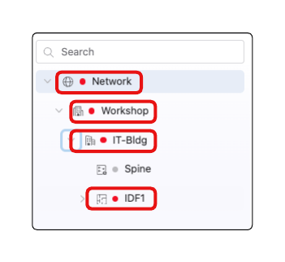

3. Hover your mouse over **IDF1** and select the **3 dots** that appear. Select **Add Device** to begin the device provisioning guided workflow.

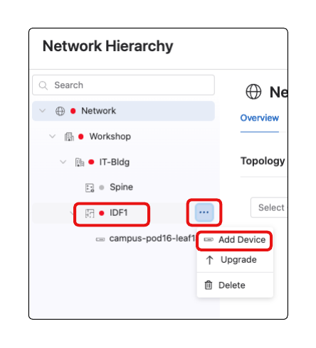

4. The Deployment Details should be pre-populated. Verify the value in each section (provided below),

   -  Deployment Type: **Access Pod**
   -  Campus: **Workshop**  
   -  Campus-Pod: **IT-Bldg**  
   -   Access-Pod: **IDF1**  
   -   Under **Select Available Devices** select the **check box** with a hostname of **sw-10.#.#.#**
   -  Select **Continue**

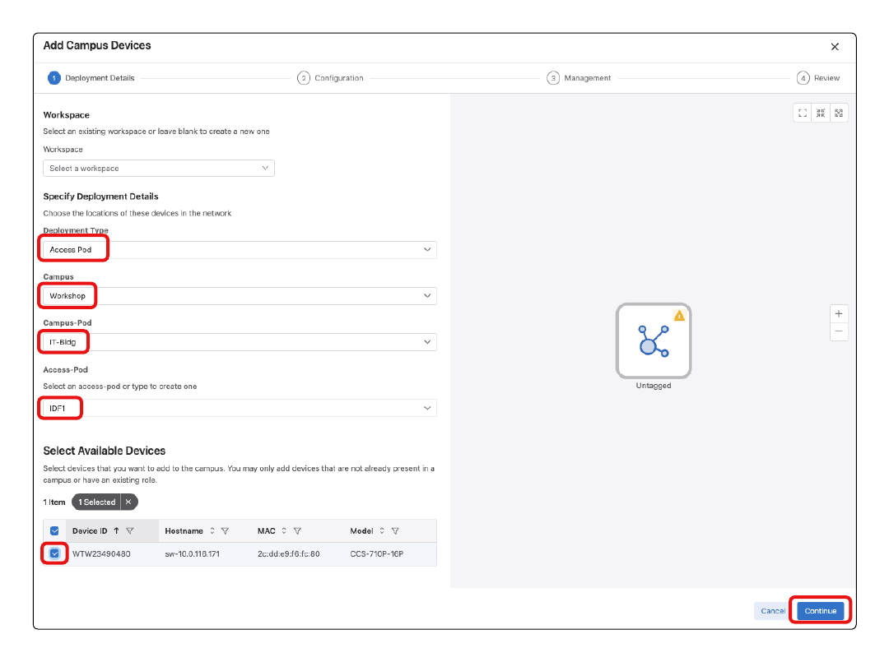

5. Locate the new device being added under **Role Assignment**. 

   -  Update the hostname from **sw-[IP_ADDRESS]** to **campus-pod[POD#]-leaf1b**  
   -   Under Role select **Leaf** 
   -  Select **Continue**

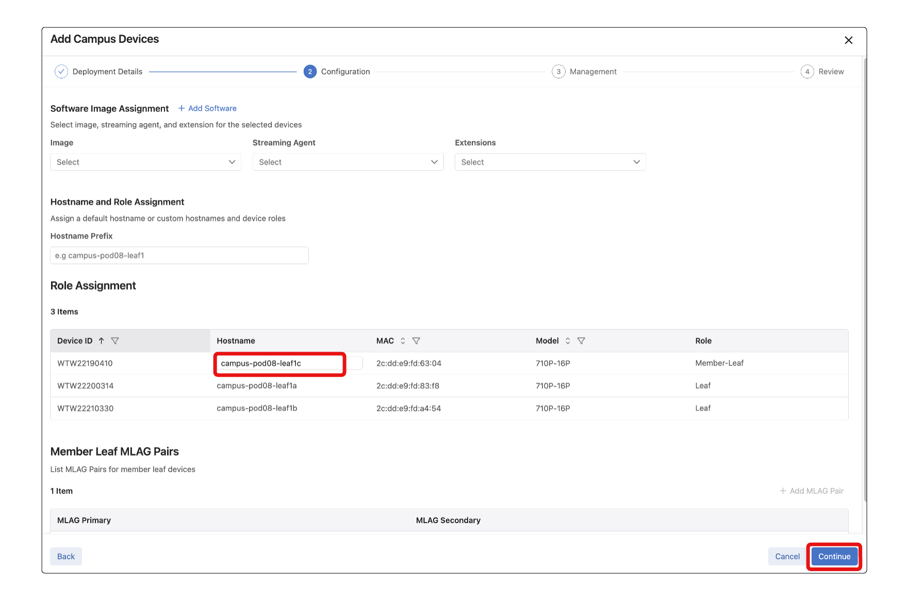

*(Although not part of the lab today, this next section of the workflow allows us to set the leaf we are currently provisioning to also provide Zero Touch Provisioning workflow to switches that are downstream from this new Leaf.)*

6. Select **Continue**

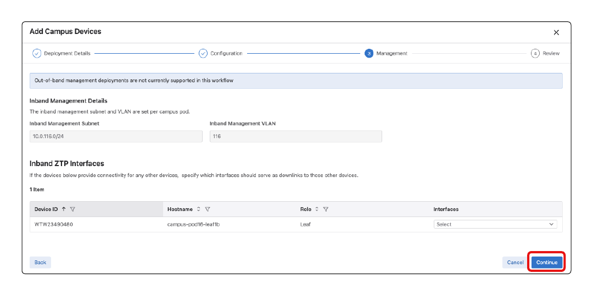

7. Select **Build Workspace**

*The inputs provided in the guided workflow will be used to generate inputs within CloudVision Studios. (This may take up to 1 minute)*

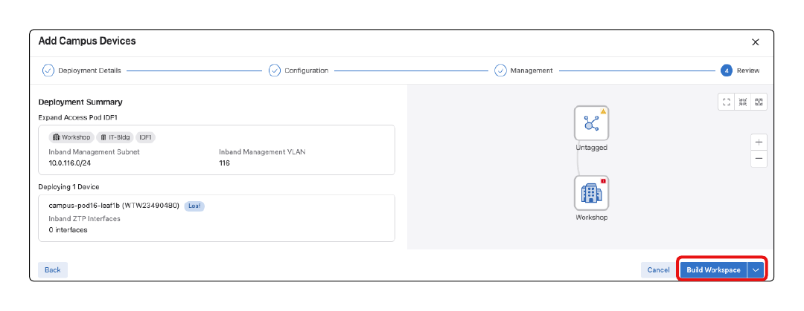

8. After the Workspace has completed building you will get 2 small window pop ups.
    - **Workspace created successfully**
    - **Success**. 
    - Select the **X** on these boxes 
    - Select **Review Workspace**

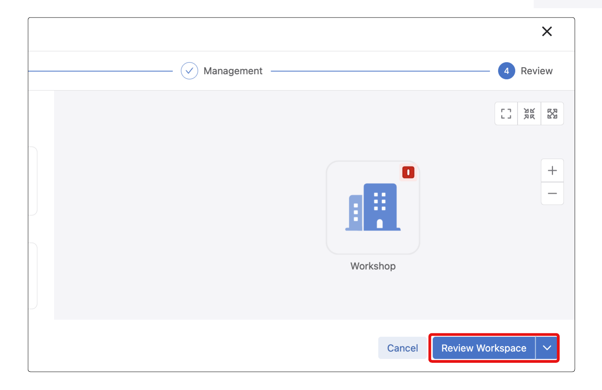

9. This will bring you into the Workspace that was generated from the guided workflow. You should see 2 devices (leaf1a and your newly added switch) shown under Proposed Configuration.

    - Take some time to review the proposed configuration.
    - leaf1a - Check for the creation of a new port-channel and mlag configuration.
    - leaf1b - Complete provisioned switch configuration

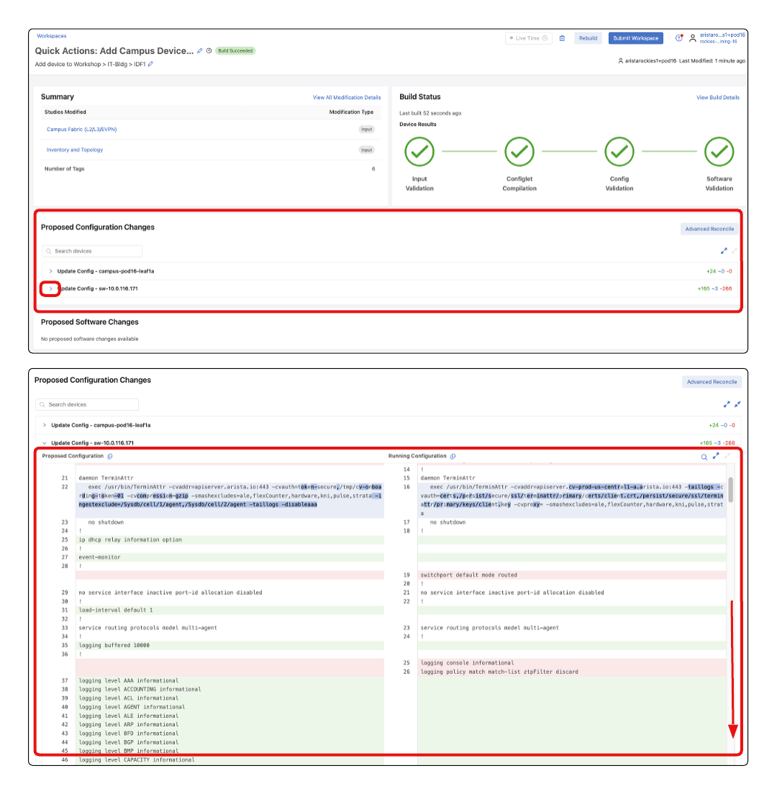

10. After taking some time to review the workspace select **Submit Workspace**.

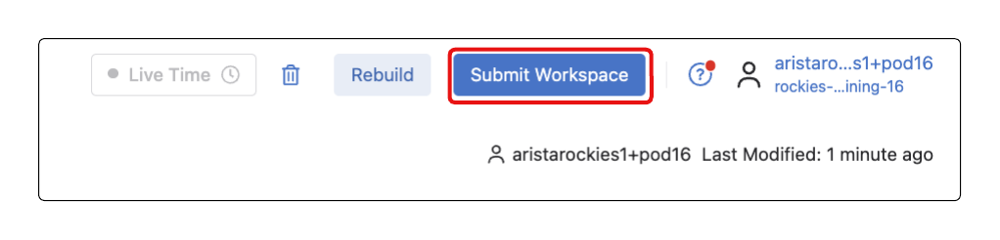

11. Select **View Change Control**.

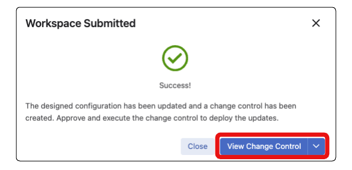

12. This will bring us to the Change Control that was created by the workspace submission. In this step we will be utilizing a Change Control Templates.
     - Click **Select a Template**
     - From the available dropdown select **Leaf Provisioning**.*(This template will add a 60 second delay before pushing configuration to leaf1a to ensure leaf1b gets the proposed configuration first)*
     - Select **Apply Template**.

*A change control template provides the ability to create a configurable structure for repeatable change control operations*

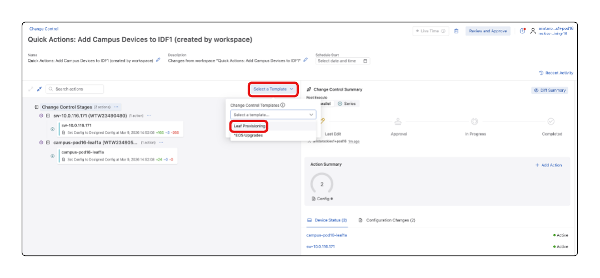

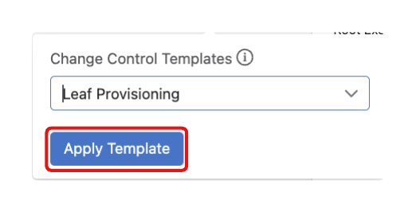

13. The template selected will update the Change Control Stages into 2 sections. The first section will begin the configuration on the new Leaf immediately. The second section will delay pushing the configuration changes for 60 seconds, then configure leaf1a. You can expand all change control stages by selecting the 2 arrows facing away from each

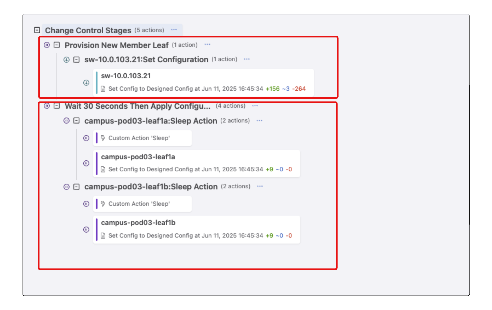

14. Select **Review and Approve**

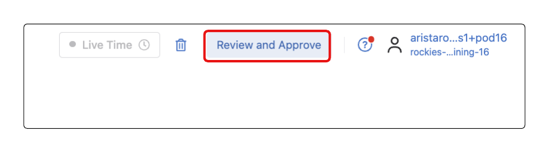

15. Up until this point, we have not made any changes to the actual running configuration of the devices. You can take some time to once again review the proposed configuration changes then select **Approve and Execute**.

*If Approve and Execute is not present select the Slider next to Execute Immediately.*

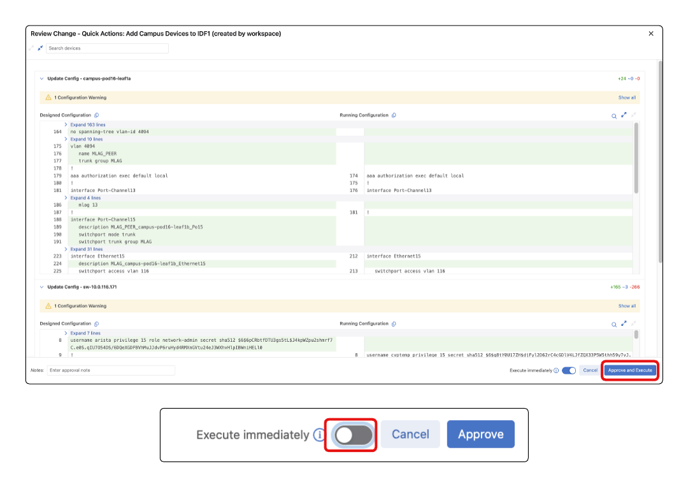

16. The change control will execute and apply all the proposed configuration changes to the devices. The newly added device will be reloaded as it exits Zero Touch Provisioning (ZTP) mode and boots up with the designed configuration. You can review the Change Control logs by selecting Logs in the change control window.

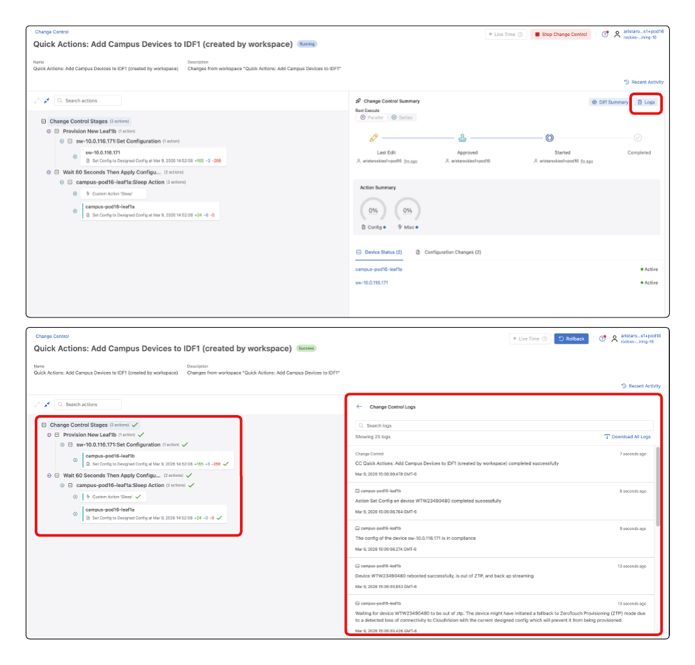

17. Upon the completion of the Change Control we have deployed the configuration and provisioned leaf1b.

LAB GUIDE COMPLETE
