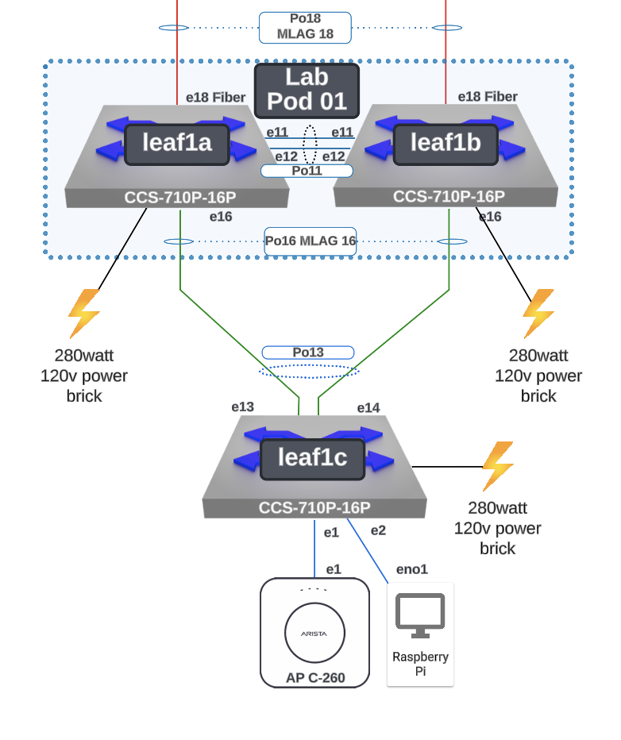
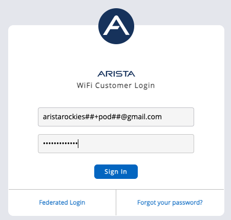
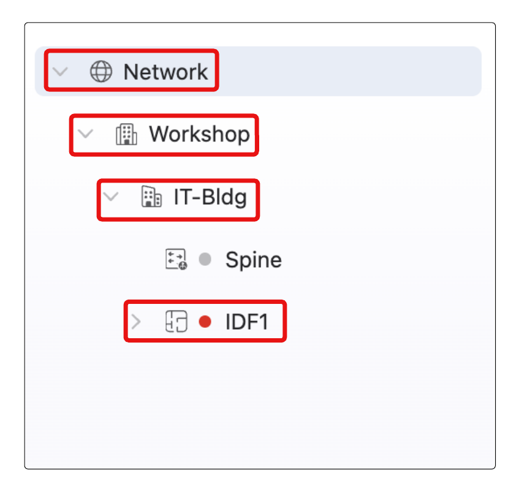
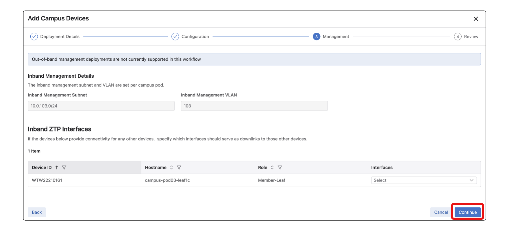
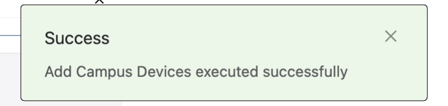
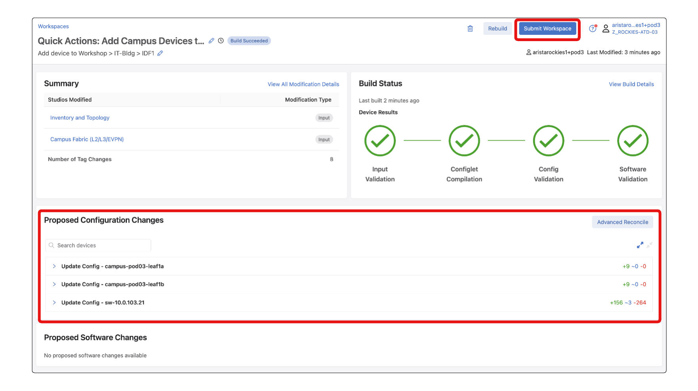
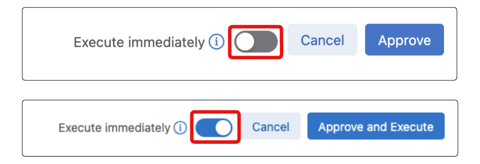

# Campus A-01 Wired Lab Guide  
## Provisioning a Campus Fabric

This Lab Guide:

https://github.com/arista-rockies/Workshops/tree/main/Campus

---

## Table of Contents

Full Lab Topology  
POD Topology  
1. Accessing CloudVision as a Service  
2. Onboarding a new device into CVaaS  

---

## Full Lab Topology

---

## POD Topology

---

## 1. Accessing CloudVision as a Service

In your Google Chrome browser, enter the following URL: https://www.arista.io/ to access CloudVision as a Service (CVaaS).

1. In the “Organization” box enter the Organization name “rockies-training-##” where ## is a 2 digit character between 01-20 that was assigned to your lab/Pod, then click “Enter”.

2. Click the Log in with Launchpad button and provide your assigned lab/Pod email address and password:

3. You will now be logged into CloudVision

---

## 2. Onboarding a new device into CVaaS

In this lab you will be configuring the switches through CloudVision. Today you will be adding a Member Leaf Switch to an existing Campus Fabric/POD using Cloud Vision’s guided workflow.

1. Login to CloudVision, then click on the Network Hierarchy menu option.

2. Navigate through the Network Hierarchy Tree to: **Network > Workshop > IT-Bldg > IDF1**

3. Hover your mouse over IDF1 and select the 3 dots that appear. Select Add Device to begin the device provisioning guided workflow.

4. The Deployment Details should be pre-populated. Verify the value in each section (provided below),

    a. Campus: Workshop  
    b. Campus-Pod: IT-Bldg  
    c. Access-Pod: IDF1  
    d. Select the box for the device under Select Available Devices with a hostname of sw-10.#.#.# and then select Continue

5. Locate the new device being added under Role Assignment. Update the hostname from sw-[IP_ADDRESS] to campus-pod[POD#]-leaf1c. Select Continue.

6. Select Continue

*(Although not part of the lab today, this section of the workflow allows us to set the member leaf we are currently provisioning to also provide Zero Touch Provisioning workflow to switches that are downstream from this new Member Leaf.)*

7. The inputs provided in the guided workflow will be used to generate inputs within CloudVision Studios. We will select Build Workspace and those inputs will generate the configuration to provision our new device. (This may take up to 1 minute)

8. After the Workspace has completed building you will get a small window pop up state Success. Select the X and continue to the next step

9. Now that CloudVision has built out the workspace, lets select Review Workspace to review the proposed configuration.

10. This will bring you into the Workspace that was generated from the guided workflow. You should see 3 devices (leaf1a, leaf1b, and your newly added switch) shown under Proposed Configuration.

    *  Take some time to review the proposed configuration.
    * leaf1a/b - Check for the creation of a new port-channel and interface c. configuration to leaf1c
    * leaf1c - Complete provisioned switch configuration

After taking some time to review the workspace select Submit Workspace.

11. Select View Change Control.

12. This will bring us to the Change Control that was created by the workspace submission. In this step we will be utilizing Change Control Templates.

(A change control template provides the ability to create a configurable structure for repeatable change control operations)

    a. Select a Template
    b. From the available dropdown select Member Leaf Provisioning.(This template will add a 30 second delay before pushing configuration to leaf1a and leaf1b to ensure leaf1c gets the proposed configuration first)
    c. Select Apply Template.

13. The template selected will update the Change Control Stages into 2 sections. The first section will begin the configuration on the new Member Leaf immediately. The second section will delay pushing the configuration changes for 30 seconds, then configure the Leaf Switches.

14. Select Review and Approve

15. Up until this point we have not made any changes to the actual running configuration of the devices. You can take some time to once again review the proposed configuration changes then select Approve and Execute.

If Approve and Execute is not present select the Slider next to Execute Immediately.

16. The change control will execute and apply all the proposed configuration changes to the devices. The newly added device will be reloaded as it exits Zero Touch Provisioning (ZTP) mode and boots up with the designed configuration. You can review the Change Control logs by selecting Logs in the change control window.

17. Upon the completion of the Change Control we have deployed the configuration and provisioned leaf1c.

LAB GUIDE COMPLETE