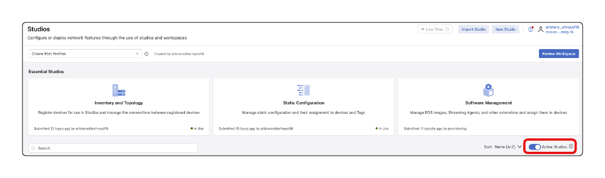
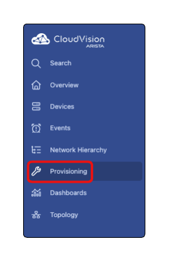
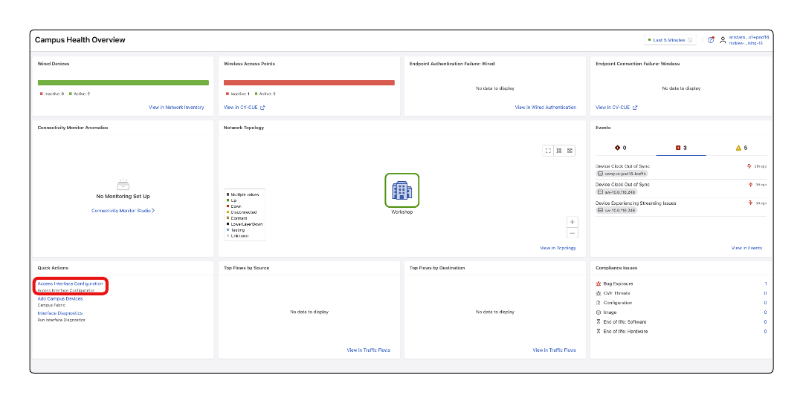
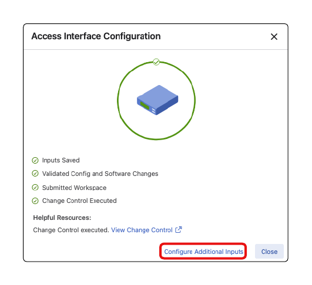
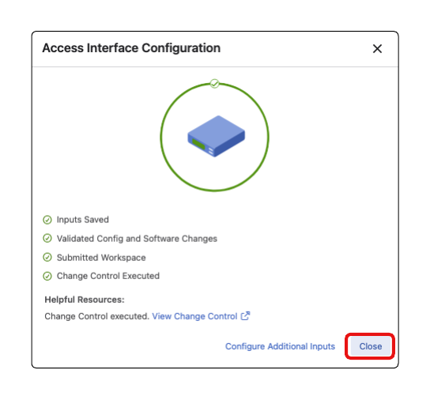

# Campus A-02 Wired Lab Guide

## Access Interface Configuration

This Lab Guide:

https://github.com/arista-rockies/Workshops/tree/main/Campus

---

## Table of Contents

1. Full Lab Topology  
2. POD Topology  
3. Accessing CloudVision as a Service  
4. Creating Port Profiles  
5. Assigning Port Profiles for AP and RPI  

---

## Full Lab Topology

---

## POD Topology

---

## 1. Accessing CloudVision as a Service

In your Google Chrome browser, enter the following URL:  
https://www.arista.io/ to access CloudVision as a Service (CVaaS).

1. in the “Organization” box enter the Organization name “rockies-training-##” where ## is a 2 digit character between 01-20 that was assigned to your lab/Pod, then click “Enter”.

2. Click the Log in with Launchpad button and provide your assigned lab/Pod email address and password:

You will now be logged into CloudVision

---

## 2. Creating Port Profiles

This lab will help you create port profiles and apply them to interfaces in your ATD network.

1. Click on the **Provisioning** menu option, then choose **Studios**

2. Click Create Workspace and name it Create Port Profiles then select Create. A workspace acts as a sandbox where you can stage your configuration changes before deploying them

3. Disable the Active Studios toggle to display all available CloudVision Studios (which when enabled will only show used/active Studios).  
*Note:- the toggle may already be in the disabled position.*

4. Create two port profiles using the Access Interface Configuration studio that will be used to provision connected hosts.

   a. Launch the Access Interface Configuration
  

   b. Click Add Port Profile, name it “Wireless-Access-Point”, and click the arrow on the right

   c. Enter the following values on this configuration page

 - Description: “Wireless-Access-Point”  
 - Enabled: Yes  

- Mode: Access  
- VLANs: “1##” where ## is a 2 digit character between 01-20 that was assigned to your lab/Pod. e.g Pod01 is VLAN101, Pod13 is VLAN113  

- Port-Channel:
  - Port-Channel: Yes
  - Description: Wireless Access Point Port-Channel
  - Mode: Active
  - Enabled: Yes
  - MLAG: Yes
  - Select LACP Fallback

*The Wireless Access Point has the capability to run a port channel but is not currently configured as such. We will use LACP fallback so we may provision the Access Point with its current configuration*

- LACP Fallback
  - Mode: Individual

- POE:  
    - Reboot Action: Maintain  
    - Link Down Action: Maintain  
    - Shutdown Action: Maintain  

d. Navigate back to Access interface Configuration by clicking on the top

e. Click Add Port Profile, name it “Wired-RasPi”, and click the arrow on the right

f. Enter the following values on this configuration page
  - Description: “Wired-RasPI”  
  - Enabled: Yes  

  - Mode: Access  
  - VLANs: “1##” where ## is a 2 digit character between 01-20 that was assigned to your lab/Pod. e.g Pod01 is VLAN101, Pod13 is VLAN113  
  - Spanning Tree
    - Portfast: edge
    - BPDU Guard: enabled

  - 802.1X: Enabled = Yes  
  - Click MAC Based Authentication

  - Set Enabled:Yes
    - Navigate back to the previous page

  - POE:  
     - Reboot Action: Maintain   
     - Link Down Action: Maintain  
     - Shutdown Action: Maintain  

5. Review and Submit the Workspace

  - Click Review Workspace

*Note that none of the device configurations have been changed after submitting this workspace*
   
  - Click Submit Workspace

c. Click Close

---

## 3. Assigning Port Profiles for AP and RPI

1. Assign the configured port profiles to the switches access ports

  - Click Overview option on the navigation bar

  - Locate the Quick Actions panel on the lower left of the screen and Click Access Interface Configuration

  - Device Type: **Access Pod**
  - Campus: **Workshop**
  - Campus Pod: **IT-Bldg**
  - Access Pod: **IDF1**

*Note: These should be the only one options for each drop-down.*

  - **Select** to highlight port **Ethernet1** on switch labeled **campus-pod{$POD#}-leaf1b**
  - Port Profile: **Wired-RasPi**
  - Enabled: **Yes** 
  - Click **Submit**

  - Once the Change Control has been executed, click **Configure Additional Inputs** to configure another access port

  - Device Type: **Access Pod**
  - Campus: **Workshop**
  - Campus Pod: **IT-Bldg**
  - Access Pod: **IDF1**
  - **Select** to highlight port **Ethernet14** on switches labeled **campus-pod{$POD#}-leaf1a and b**
  - Port Profile: **Wireless-Access-Point**
  - Enabled: **Yes** 
  - Click **Submit**

  - Once the Change Control has been executed, click Finish

---

LAB GUIDE COMPLETE
