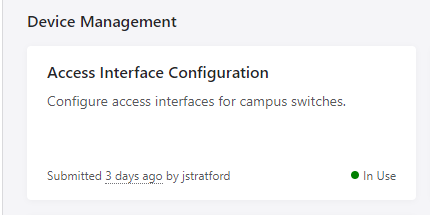
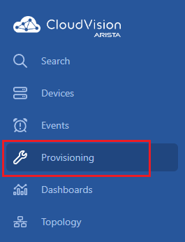
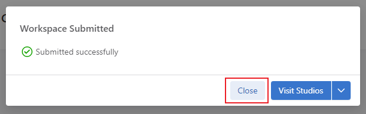
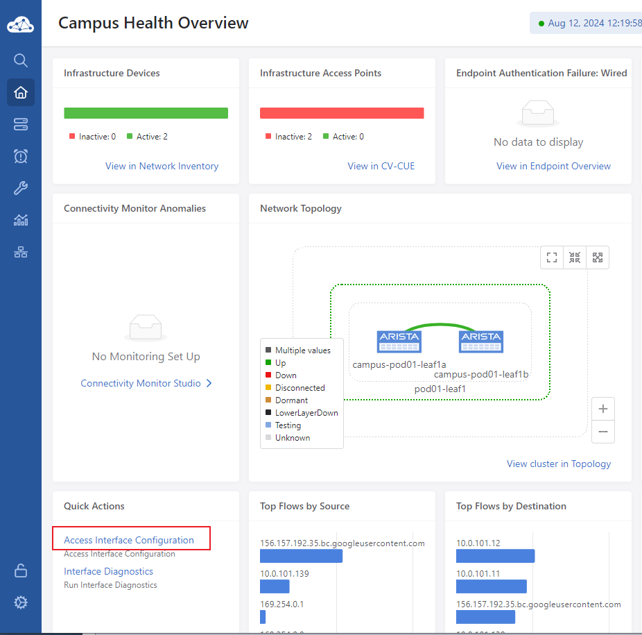
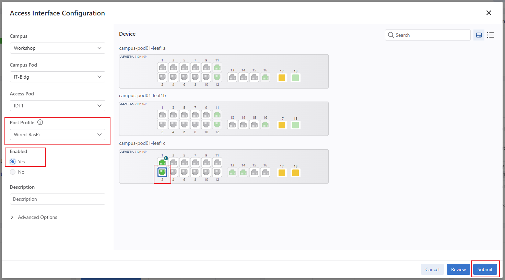
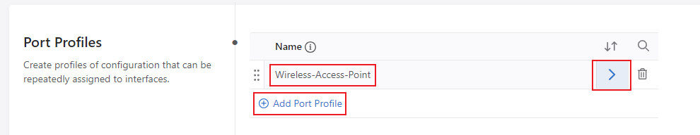

# Campus A-02 Wired Lab Guide

## Access Interface Configuration

This Lab Guide:

https://github.com/arista-rockies/Workshops/tree/main/Campus

---

## Table of Contents

1. Full Lab Topology  
2. POD Topology  
3. Accessing CloudVision as a Service  
4. Creating Port Profiles  
5. Assigning Port Profiles for AP and RPI  

---

## Full Lab Topology

---

## POD Topology

---

## 1. Accessing CloudVision as a Service

In your Google Chrome browser, enter the following URL:  
https://www.arista.io/  
to access CloudVision as a Service (CVaaS).

in the “Organization” box enter the Organization name “rockies-training-##” where ## is a 2 digit character between 01-20 that was assigned to your lab/Pod, then click “Enter”.

Click the Log in with Launchpad button and provide your assigned lab/Pod email address and password:

You will now be logged into CloudVision

---

## 2. Creating Port Profiles

This lab will help you create port profiles and apply them to interfaces in your ATD network.

Click on the Provisioning”menu option, then choose Studios

Click Create Workspace and name it Create Port Profiles then select Create. A workspace acts as a sandbox where you can stage your configuration changes before deploying them

Disable the Active Studios toggle to display all available CloudVision Studios (which when enabled will only show used/active Studios).  
*Note:- the toggle may already be in the disabled position.

Create two port profiles using the Access Interface Configuration studio that will be used to provision connected hosts.

Launch the Access Interface Configuration

Click Add Port Profile, name it “Wireless-Access-Point”, and click the arrow on the right

Enter the following values on this configuration page

Description: “Wireless-Access-Point”  

Enabled: Yes  

Mode: Access  

VLANs: “1##” where ## is a 2 digit character between 01-20 that was assigned to your lab/Pod. e.g Pod01 is VLAN101, Pod13 is VLAN113  

POE:  

Reboot Action: Maintain  

Link Down Action: Maintain  

Shutdown Action: Maintain  

Navigate back to Access interface Configuration by clicking on the top

Click Add Port Profile, name it “Wired-RasPI”, and click the arrow on the right

Enter the following values on this configuration page

Description: “Wired-RasPI”  

Enabled: Yes  

Mode: Access  

VLANs: “1##” where ## is a 2 digit character between 01-20 that was assigned to your lab/Pod. e.g Pod01 is VLAN101, Pod13 is VLAN113  

802.1X: Enabled = Yes  

Click MAC Based Authentication

Set Enabled:Yes

Navigate back to the previous page

POE:  

Reboot Action: Maintain  

Link Down Action: Maintain  

Shutdown Action: Maintain  

Review and Submit the Workspace

Click Review Workspace

Note that none of the device configurations have been changed after submitting this workspace

Click Submit Workspace

Click Close

---

## 3. Assigning Port Profiles for AP and RPI

Assign the configured port profiles to the switches access ports

Click Overview option on the navigation bar

Locate the Quick Actions panel on the lower left of the screen and Click Access Interface Configuration

Select the Campus (Workshop), Campus Pod (IT-Bldg), and Access Pod(IDF1)  
*Note: there is only one option for each drop-down.

Select to highlight port Ethernet1 on bottom switch: campus-pod<##>-leaf1c  
*Note: you will may see the bottom device with a hostname format: sw-<IP> Example: sw-10.0.113.40

Choose the Port Profile of Wireless-Access-Point

Click Yes radio button under Enabled

Click Submit

Once the Change Control has been executed, click Configure Additional Inputs to configure another access port

Again, select the Campus (Workshop), Campus Pod (IT-Bldg), and Access Pod(IDF1)

Select to highlight port Ethernet2 on campus-pod<##>-leaf1c (hostname may not match)

Choose the Port Profile of “Wired-RasPI”

Click Yes radio button under Enabled

Click Submit

Once the Change Control has been executed, click Finish

---

LAB GUIDE COMPLETE
