# Campus A-02 Wired Lab Guide

## Access Interface Configuration

## This Lab Guide:
[Campus A-02 Wired Lab Guide - Access Interface Configuration](https://github.com/arista-rockies/Workshops/blob/main/Campus/2026_Campus_Workshop/A-02/2026_Campus_A-02_Wired_Lab_Guide.md)

---

## Table of Contents

1. [Full Lab Topology](#1-full-lab-topology)
2. [POD Topology](#2-pod-topology)
3. [Accessing CloudVision as a Service](#3-accessing-cloudvision-as-a-service)
4. [Creating Port Profiles](#4-creating-port-profiles)
5. [Assigning Port Profiles for AP and RPI](#5-assigning-port-profiles-for-ap-and-rpi)

---

## 1. Full Lab Topology

---

## 2. POD Topology

---

## 3. Accessing CloudVision as a Service

1. Go to the Arista Ignition GUI via: https://ignition.campus-atd.net/ 
- Enter the 6 digit Access Code found on the Pod Handout Worksheet 
- Click.  

2. Click the **CVaaS** tile

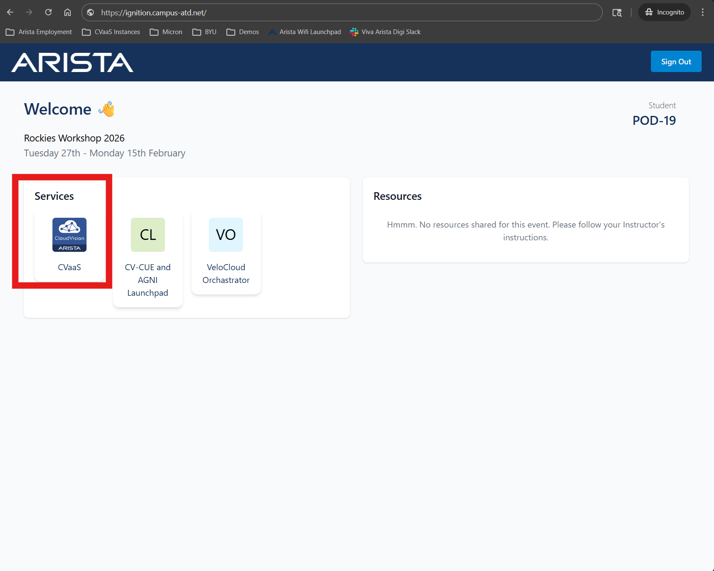

3. You will now be logged into CloudVision

---

## 4. Creating Port Profiles

This lab will help you create 2 port profiles and apply them to interfaces in your Lab network.

### Wireless AP Port Profile ###

1. Assign the configured port profiles to the switches access ports

    - Navigate to **Network Hierarchy**
    - Navigate through 
      - **Network**  
      - **Workshops** 
      - **IT-Bldg**  
      - **IDF1**

2. Select the **Front Panel** tab

3. Select **Ethernet1** on **leaf1b**
    - Select **Configure**

4. Under the profile section Select **+ Create New Profile**

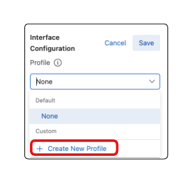

4. Under the **General** Section 
    - Name: **Wireless-Access-Point**
    - Enabled: **Yes**

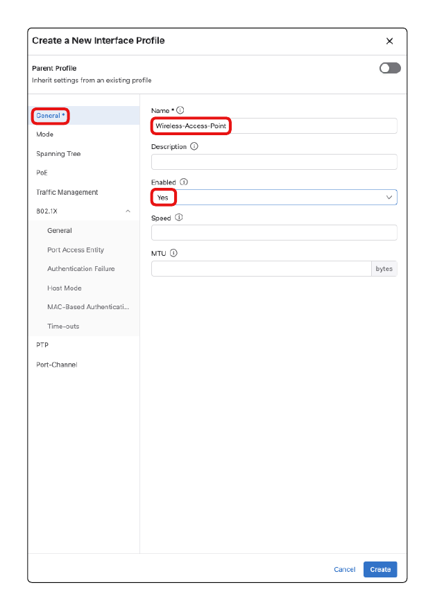

5. Under the **Mode** Section
    - Mode: **Access**
    - VLANs: **1##** where **##** is a 2 digit character assigned to your lab/Pod. e.g Pod01 is VLAN101, Pod13 is VLAN113  

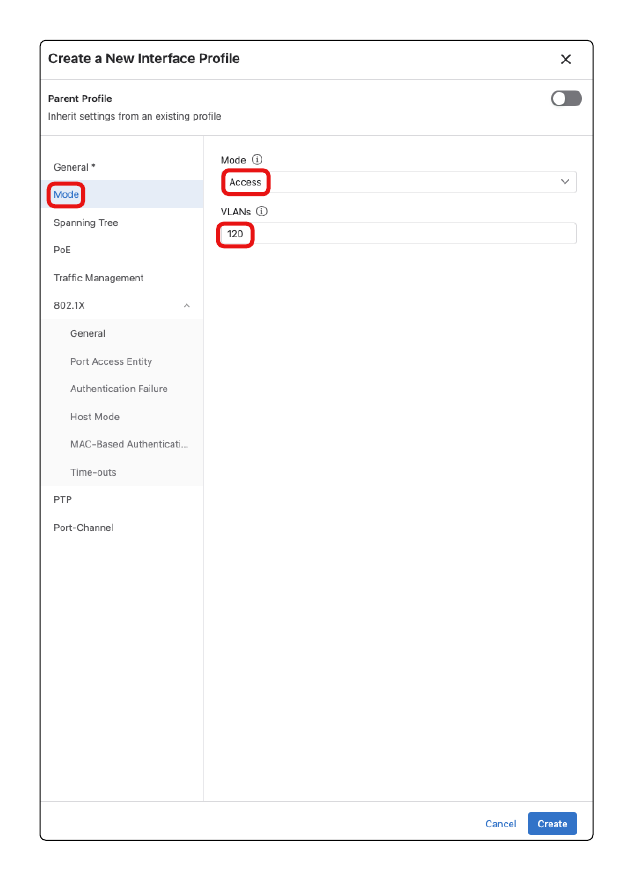

6. Under the **PoE** Section
    - Reboot Action: **Maintain** 
    - Link Down Action: **Maintain** 
    - Shutdown Action: **Maintain** 

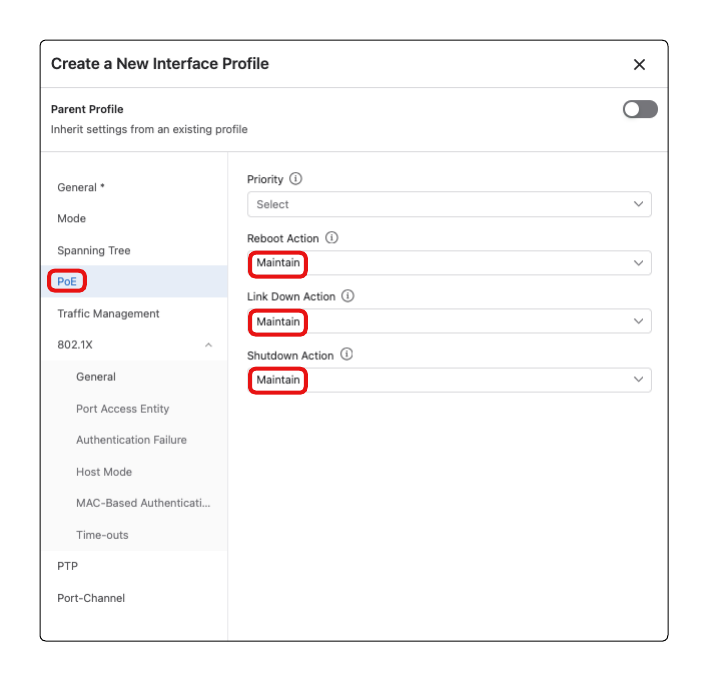

7. Under the **Port-Channel** Section
    - Port-Channel: **Yes**
    - Description: **Wireless Access Point Port-Channel**
    - Enabled: **Yes**
    - Mode: **Active**
    - MLAG: **Yes**
    - LACTP Fallback Mode: **Individual**

*The Wireless Access Point has the capability to run a port channel but is not currently configured as such. We will use LACP fallback so we may provision the Access Point with its current configuration*

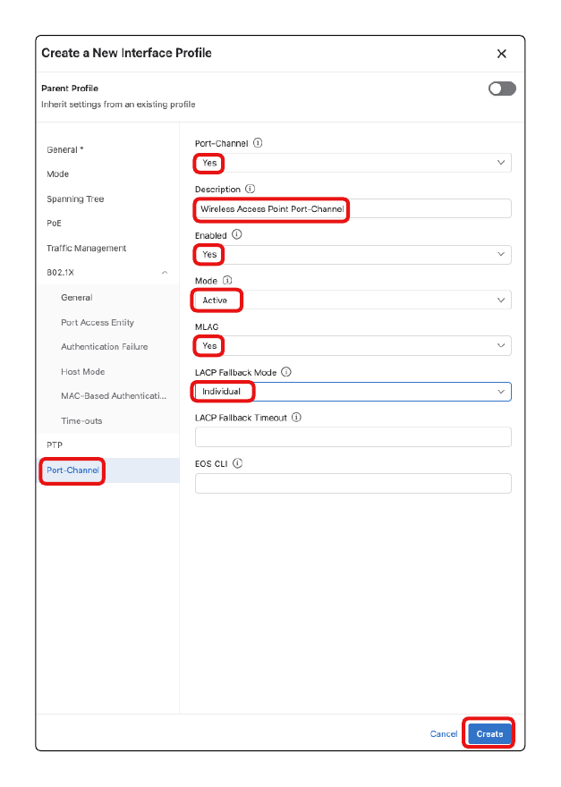

8. Select **Create**

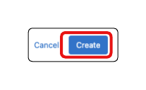

9. Select **Close**

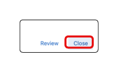

10. Return to the **Interface Configuration** section and Under the profile Section once again select **+ Create New Profile**

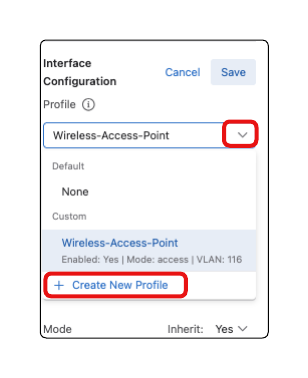

11. Under the **General** Section
    - Description: **Wired-RasPi**
    - Enabled: **Yes**  

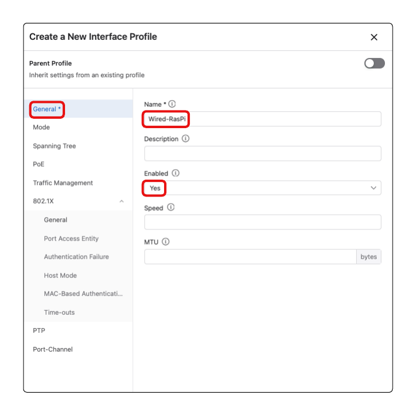

12. Under the **Mode** Section
    - Mode: **Access**
    - VLANs: **1##** where **##** is a 2 digit character assigned to your lab/Pod. e.g Pod01 is VLAN101, Pod13 is VLAN113  

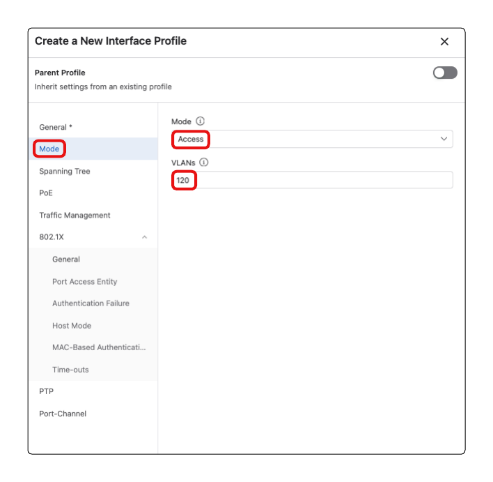

13. Under the **Spanning Tree** Section
    - Portfast: **Edge**
    - BPDU Guard: **Enabled**

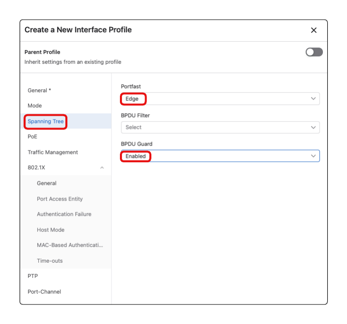

14. Under the **PoE** Section
    - Reboot Action: **Maintain** 
    - Link Down Action: **Maintain** 
    - Shutdown Action: **Maintain** 

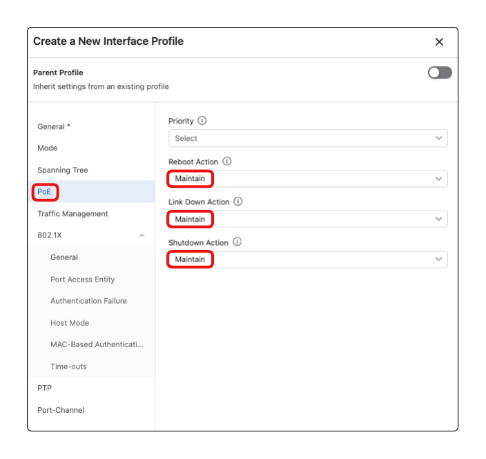

15. Under the **802.1x > General** Section
    - Enabled: **Yes** 

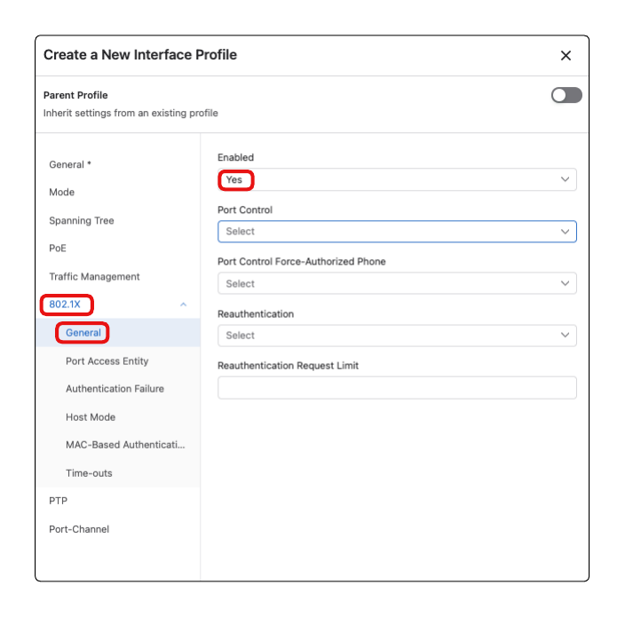

16. Under the **802.1x > MAC-Based Authentication** Section
    - Enabled: **Yes** 

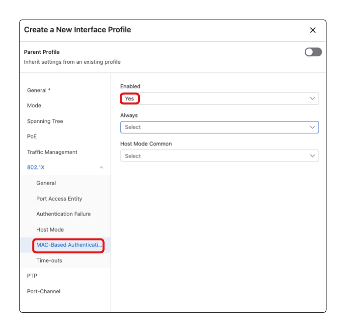

17. Select **Create**

18. After the Workspace has built Select **Review**

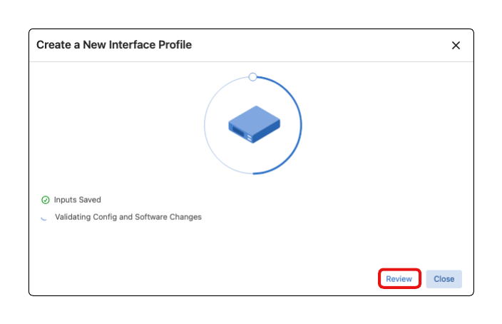

19. Select **Submit Workspace** to save the proposed port profile.

*Note at this time no configuration changes are being made. You have only configured that Port Profiles that we will use in the next next section to configure our interfaces*

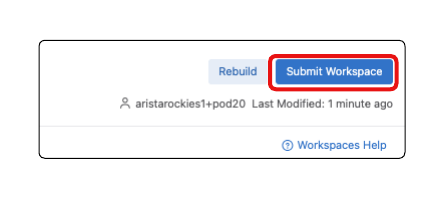

20. Select **Visit Studios**

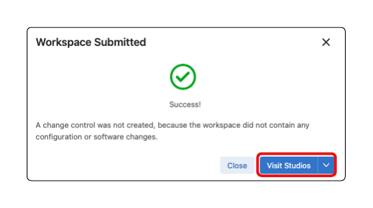

**LAB SECTION COMPLETE**

---

## 5. Assigning Port Profiles for AP and RPI

Assign the configured port profiles to the switches access ports

1. Navigate to **Network Hierarchy**
    - Navigate through 
      - **Network**  
      - **Workshops** 
      - **IT-Bldg**  
      - **IDF1**

2. Select the **Front Panel** tab

3. Select **Ethernet1** on **leaf1b**
    - Select **Configure**

4. A new **Interface Configuration** section should be available where you selected Configure. 
    - Profile: **Wired-RasPi**
    - Select **Save**

5. De-Select **Ethernet1** on **leaf1b** and Select **Ethernet14** on **leaf1a**
    - Select **Configure**

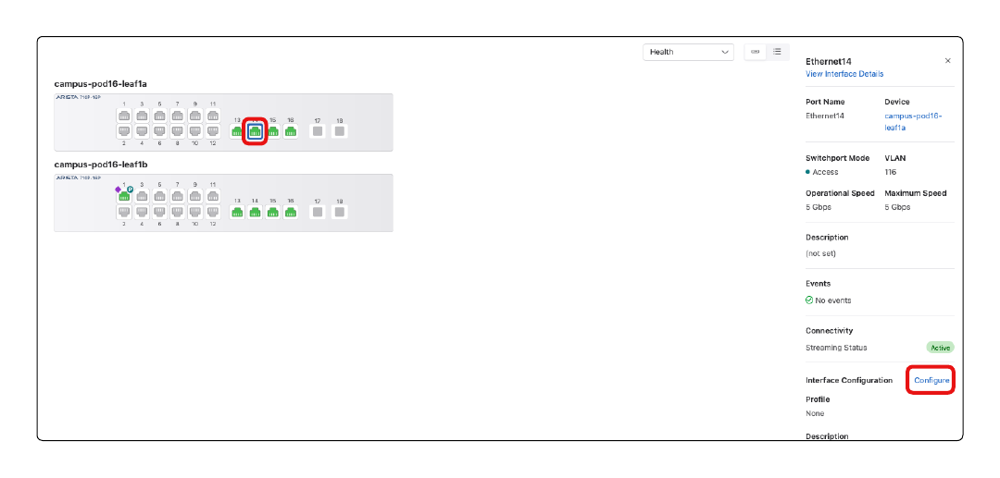

6. A new **Interface Configuration** section should be available where you selected Configure. 
    - Profile: **Wireless-Access-Point**
    - Select **Save**

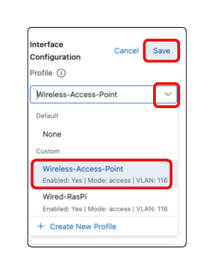

7. De-Select **Ethernet14** on **leaf1a** and Select **Ethernet14** on **leaf1b**
    - Select **Configure**

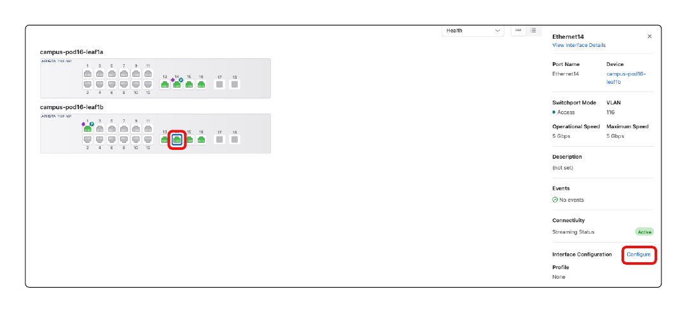

8. A new **Interface Configuration** section should be available where you selected Configure. 
    - Profile: **Wired-Access-Poin**
    - Select **Save**

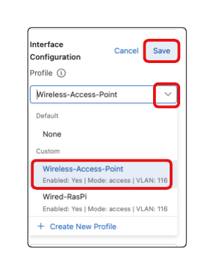

9. Towards the bottom center of your screen you should see a black bar. Select the **Clipboard Icon**

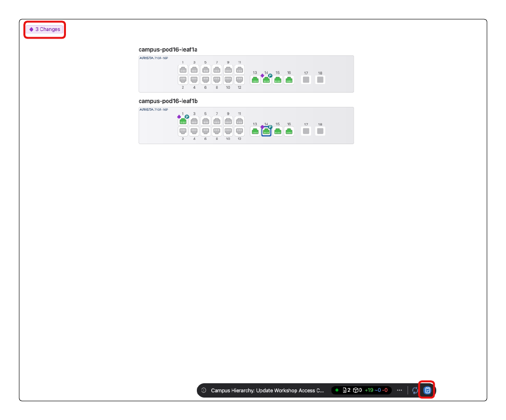

10. This will bring you to the Workspace Review Page.
    -  Review the proposed changes 
    -  Select **Submit Workspace**

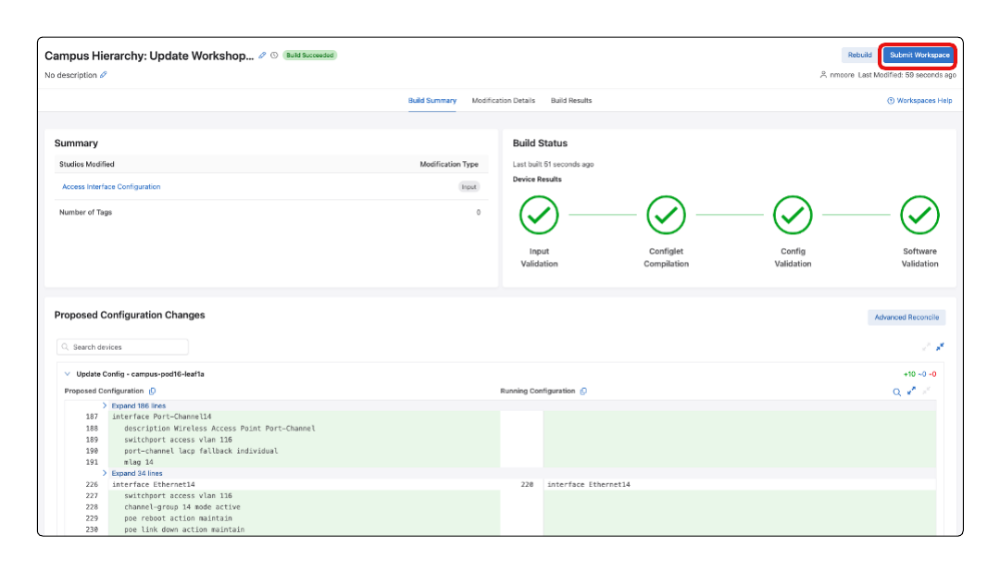

11. Select **View Change Control**

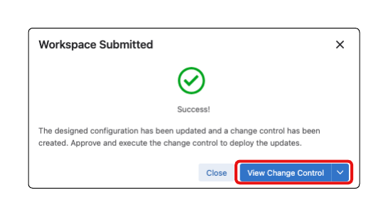

12. This will bring you to the Change Control. 
     - Select **Review and Approve**

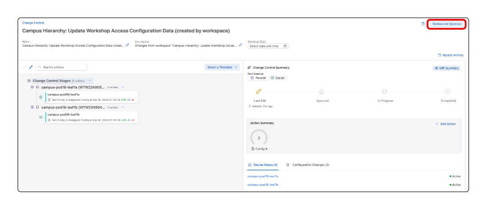

13. Review the proposed changes and select **Approve and Execute**

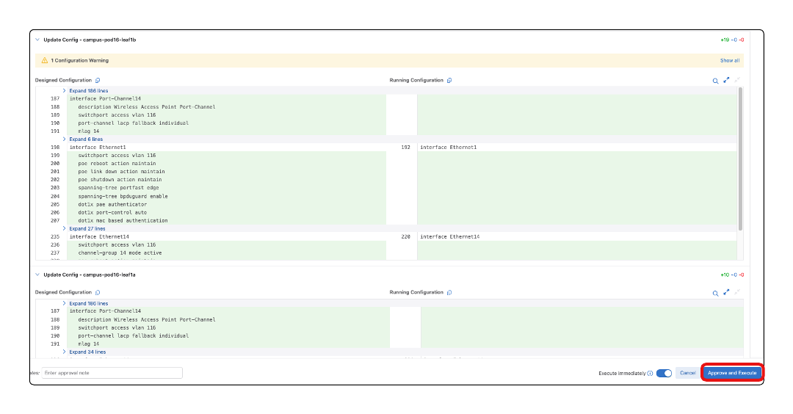

14. Once the Change Control completes, that switches now have the interface profiles active in their configuration.

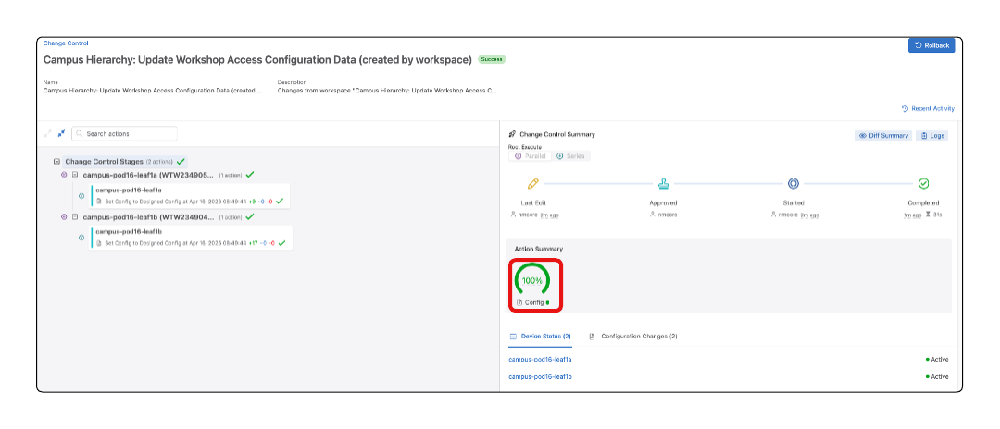

**LAB GUIDE COMPLETE**
