# Campus A-02 Wired Lab Guide

## Access Interface Configuration

This Lab Guide:

https://github.com/arista-rockies/Workshops/tree/main/Campus

---

## Table of Contents

1. [Full Lab Topology](#1-full-lab-topology)
2. [POD Topology](#2-pod-topology)
3. [Accessing CloudVision as a Serivce](#3-accessing-cloudvision-as-a-service)
4. [Creating Port Profiles](#4-creating-port-profiles)
5. [Assigning Port Profiles for AP and RPI](#5-assigning-port-profiles-for-ap-and-rpi)

---

## 1. Full Lab Topology

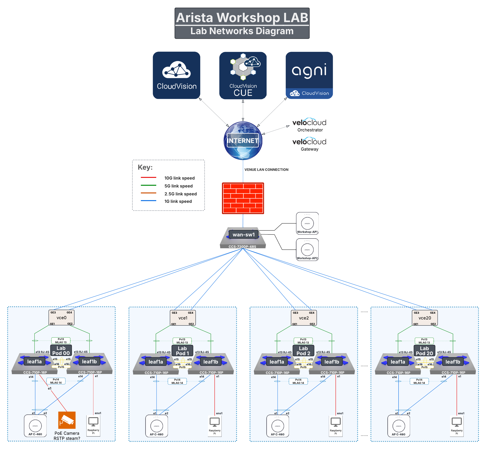

---

## 2. POD Topology

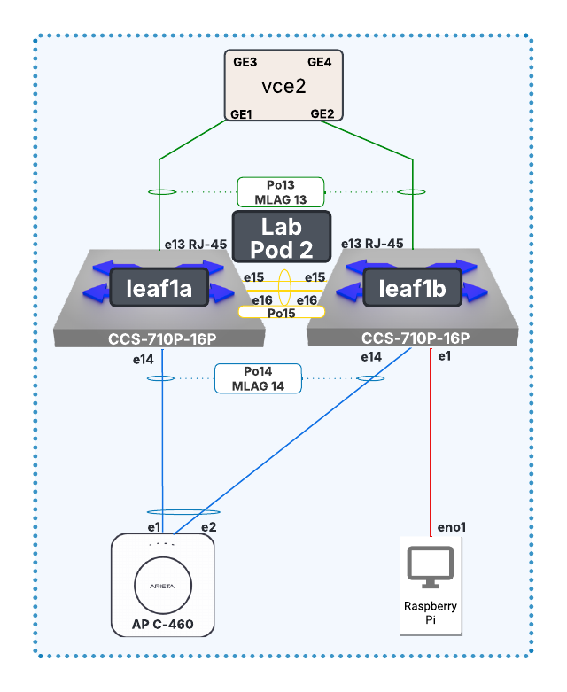

---

## 3. Accessing CloudVision as a Service

1. In your Google Chrome browser, enter the following URL: https://www.arista.io/ to access CloudVision as a Service (CVaaS).
   - In the **“Organization”** box enter the Organization name **rockies-training-##** where **##** is a 2 digit character between 01-20 that was assigned to your lab/Pod, then click **Enter**.

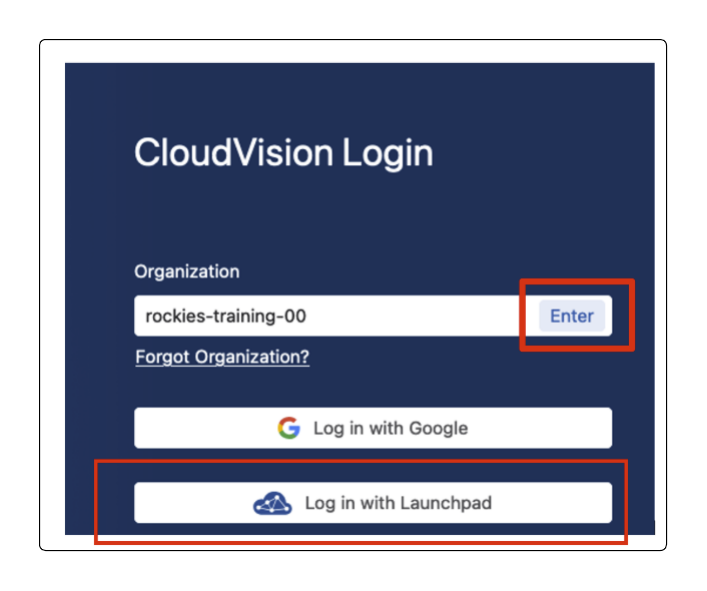

2. Click the Log in with Launchpad button and provide your assigned lab/Pod email address and password:

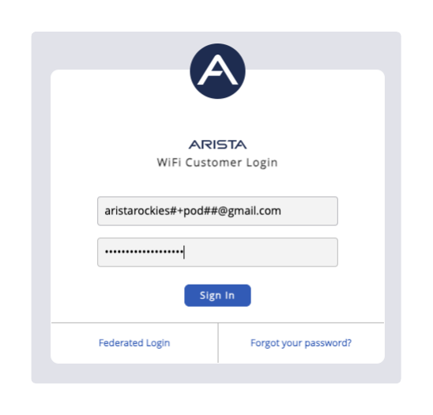

3. You will now be logged into CloudVision

---

## 4. Creating Port Profiles

This lab will help you create 2 port profiles and apply them to interfaces in your Lab network.

1. Click on the **Provisioning** menu option, then choose **Studios**

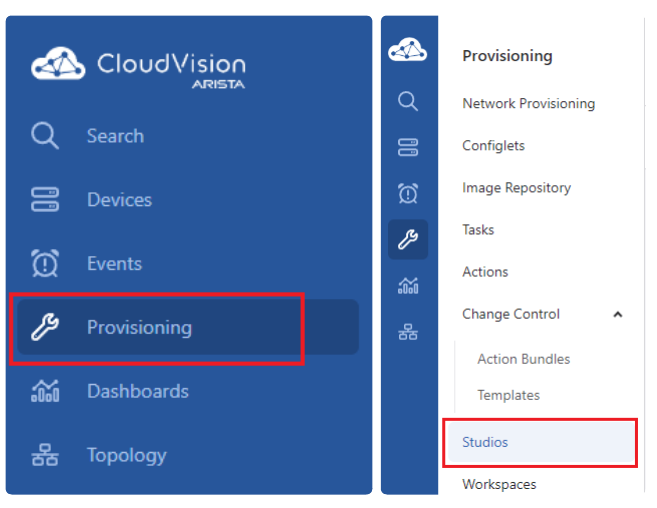

In order to make any changes within the Studios framework, you need to create a Workspace.

2. Click **Create Workspace** 
    - name it **Create Port Profiles** 
    - Select **Create**. 
    
*A workspace acts as a sandbox where you can stage your configuration changes before deploying them*

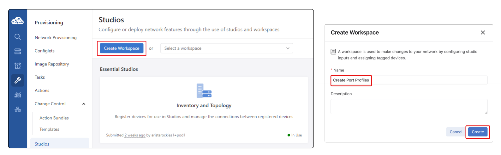

3. Select the **Access Interface Configuration Studio**
  

4. Click **Add Port Profile**, 
    - name it “Wireless-Access-Point”
    - Click the **expand arrow** on the right of the new profile name

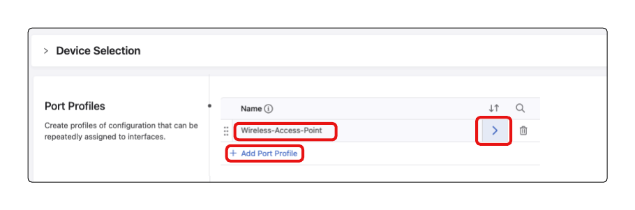

5. Enter the following values on this configuration page

    - Description: **Wireless-Access-Point**
    - Enabled: **Yes** 

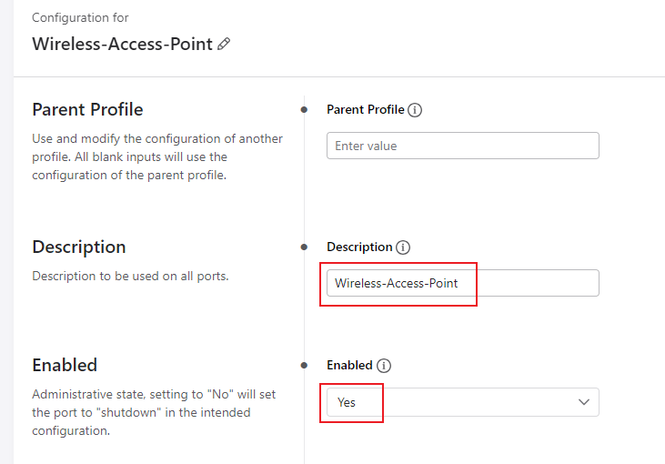

6. Configure the VLAN and Mod
    - Mode: **Access**  
    - VLANs: **1##** where **##** is a 2 digit character assigned to your lab/Pod. e.g Pod01 is VLAN101, Pod13 is VLAN113  

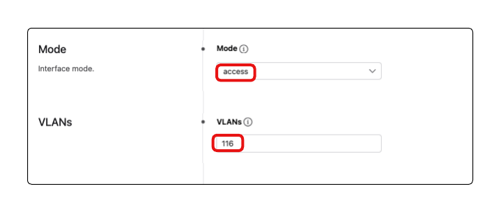

7. Port-Channel:
    - Port-Channel: **Yes**
    - Description: **Wireless Access Point Port-Channel**
    - Mode: **Active**
    - Enabled: **Yes**
    - MLAG: **Yes**
    - Select **LACP Fallback**

*The Wireless Access Point has the capability to run a port channel but is not currently configured as such. We will use LACP fallback so we may provision the Access Point with its current configuration*

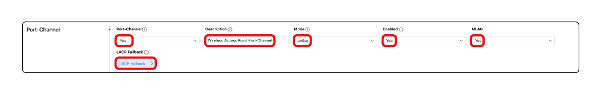

8. LACP Fallback
    - Mode: **Individual**
    - Navigate back to the previous page by clicking the breadcrump labeled **Wireless-Access-Point**

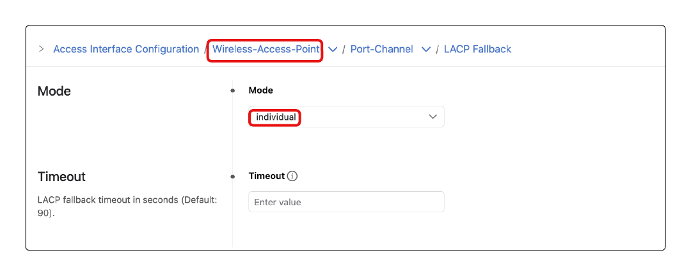

9. POE:  
    - Reboot Action: **Maintain**
    - Link Down Action: **Maintain**  
    - Shutdown Action: **Maintain** 

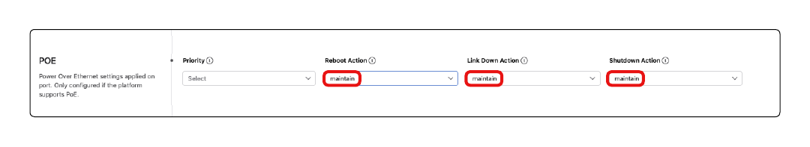

10. Navigate back to the Access interface Configuration Studio landing page by clicking the breakdrumb labeled **Access Interface Configuration** toward top of your window

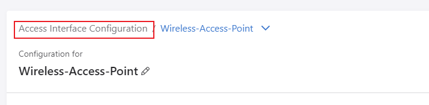

11. Click Add Port Profile 
    - Name the profile **Wired-RasPi** 
    - Click the **expand arrow** on the right of the new profile name

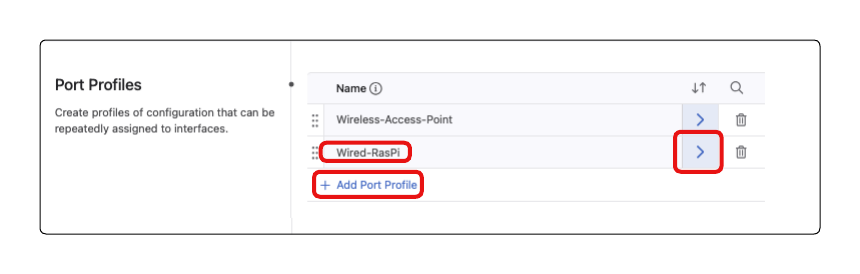

12. Enter the following values on this configuration page
    - Description: **Wired-RasPi**
    - Enabled: **Yes**  

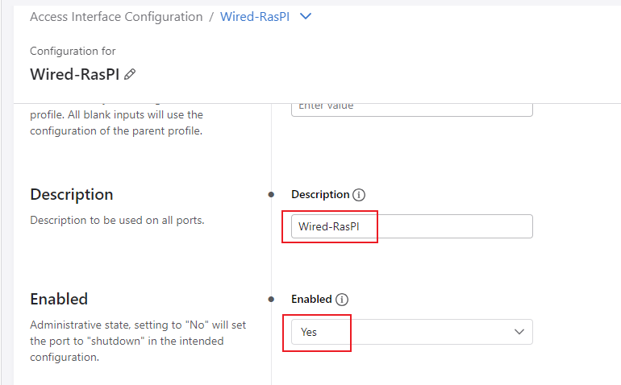

13. Mode, VLAN and Spanning-tree:
    - Mode: **Access**  
    - VLANs: **1##** where **##** is a 2 digit character assigned to your lab/Pod. e.g Pod01 is VLAN101, Pod13 is VLAN113  
    - Spanning Tree
      - Portfast: **edge**
      - BPDU Guard: **enabled**

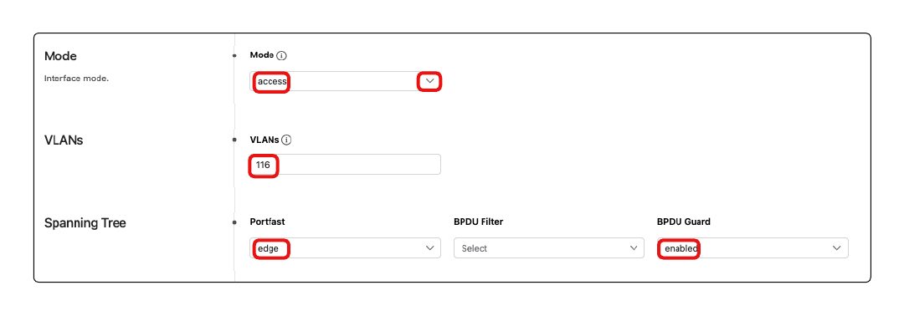

14. 802.1X:
    - Enabled: **Yes**  
    - Click **MAC Based Authentication**

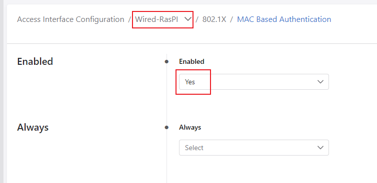

15. Mac Based Authentication:
    - Set Enabled: **Yes**
    - Navigate back to the previous page by clicking the breadcrump labeled **Wired-RasPi**

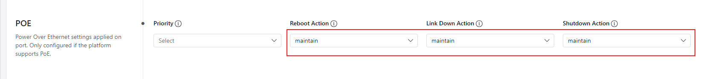

16. POE:  
     - Reboot Action: **Maintain**   
     - Link Down Action: **Maintain** 
     - Shutdown Action: **Maintain** 

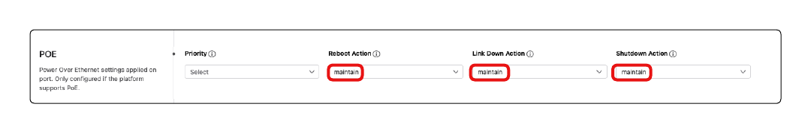

17. Select **Review Workspace**

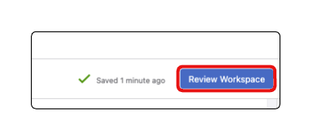

*Note that no device configurations changes are being proposed. We have simply created the **template** we will use to assign configuration to an interface*
   
18. Select **Submit Workspace**

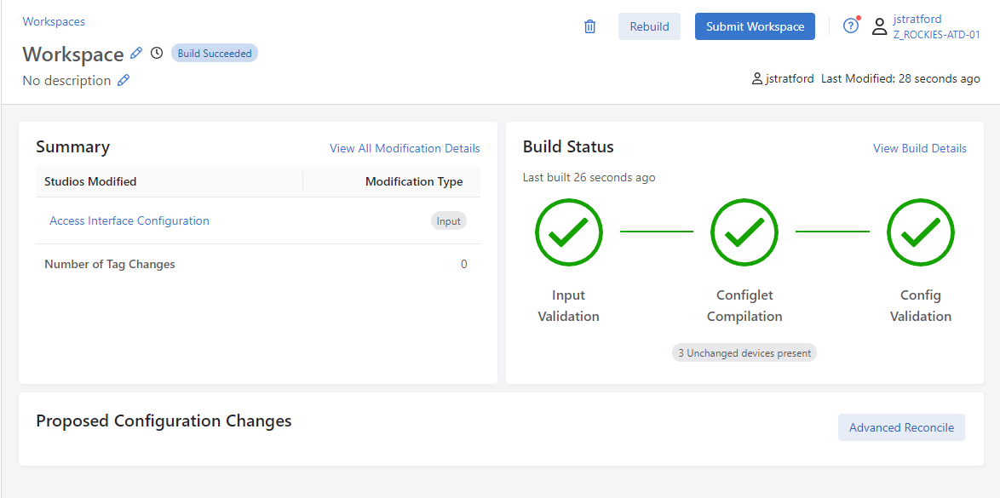

19. Click **Close**

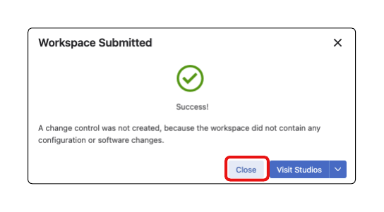

**Lab Section Complete!**

---

## 5. Assigning Port Profiles for AP and RPI

1. Assign the configured port profiles to the switches access ports

    - Navigate to **Network Hierarchy**
    - Navigate through 
      - **Network**  
      - **Workshops** 
      - **IT-Bldg**  
      - **IDF1**

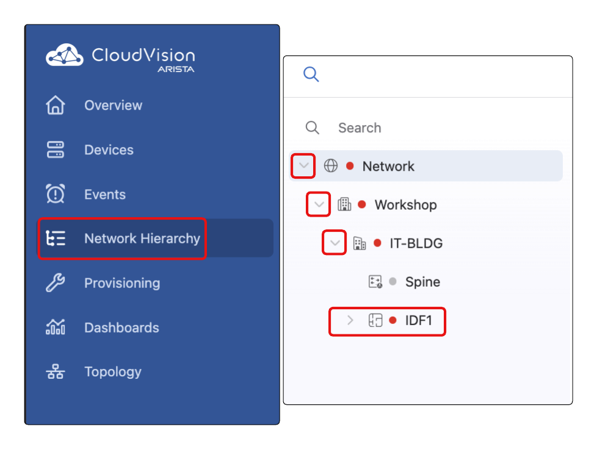

2. Select the **Front Panel** tab

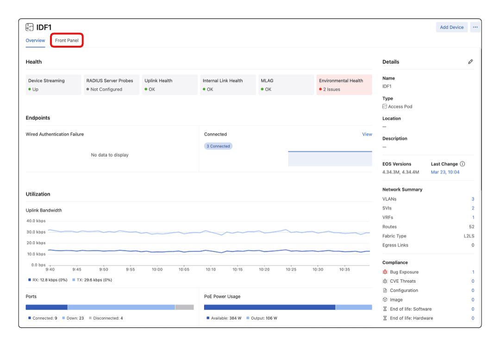

3. Select **Ethernet1** on **leaf1b**
    - Select **Configure**

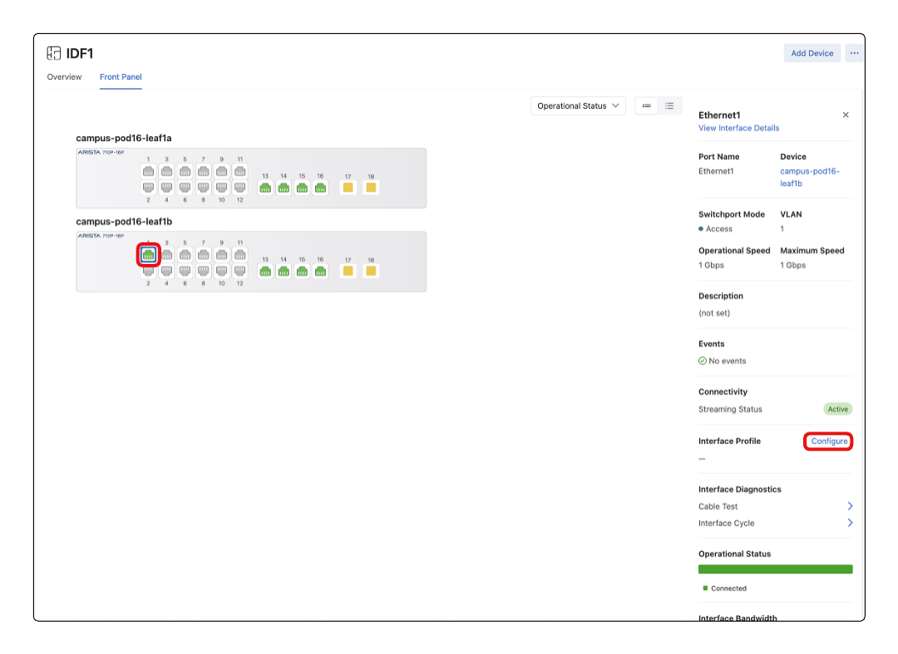

4. All Fields should be pre-populated except the below
    - Port Profile: **Wired-RasPi**
    - Enabled: **Yes**
    - Select **Submit**

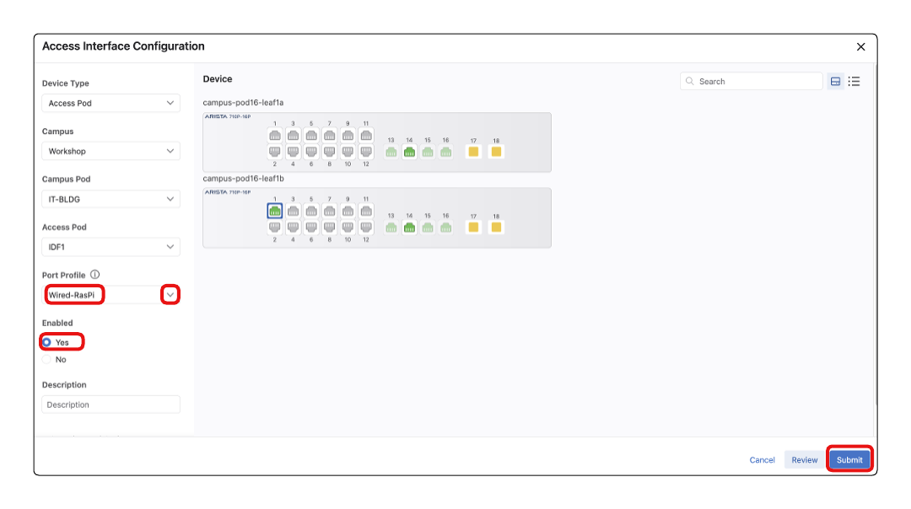

5. Once the Change Control has been executed, click **Close** 

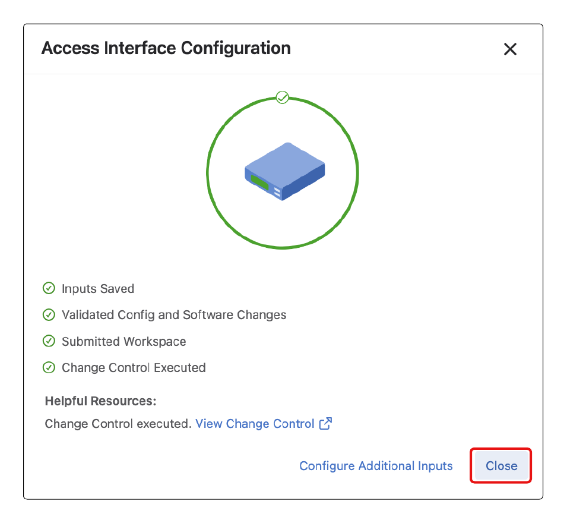

6. AP Interface Configuration
  - Select **Ethernet14** on both **leaf1a** and **leaf1b**
  - Select **Configure**
  

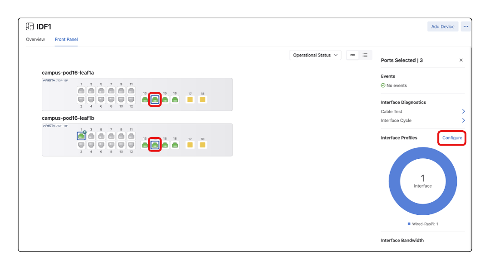

7. All Fields should be pre-populated except the below
    - Port Profile: **Wireless-Access-Point**
    - Enabled: **Yes**
    - Select **Submit**

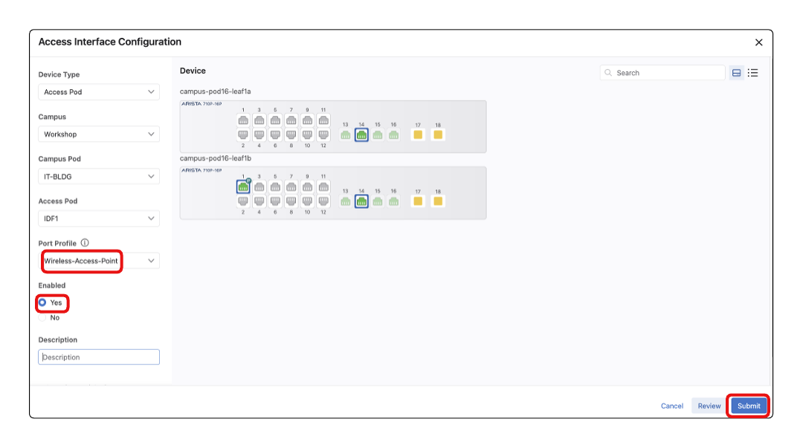

8. Select **Close**

---

**LAB GUIDE COMPLETE!**
