# Campus A-03 Wired Lab Guide

## Day-2 Operations, Dashboards, and Events

This Lab Guide:

https://github.com/arista-rockies/Workshops/tree/main/Campus

---

## Table of Contents

Full Lab Topology  
POD Topology  
1. Accessing CloudVision as a Service  
2. Operations: Add a VLAN  
3. Rollback a Change Control  
4. Dashboards (Built-in and Custom)  
5. Events  
6. Customize Notifications  

---

## Full Lab Topology

---

## POD Topology

---

## 1. Accessing CloudVision as a Service

In your Google Chrome browser, enter the following URL:  
https://www.arista.io/  
to access CloudVision as a Service (CVaaS).

1. In the “Organization” box enter the Organization name “rockies-training-##” where ## is a 2 digit character between 01-20 that was assigned to your lab/Pod, then click “Enter”.

2. Click the Log in with Launchpad button and provide your assigned lab/Pod email address and password:

3. You will now be logged into CloudVision

---

## 2. Operations: Add a VLAN

Adding a VLAN is a common provisioning task. Let’s use the existing Campus Fabric Studio to add an incremental configuration (add a VLAN). This VLAN will be specific to your pod and not routable outside.

1. Select Provisioning, then Studios

2. Create a new Workspace and name it similar to  “<add-vlan2##>” where ## is your pod number. Examples:

Pod 1 = VLAN 201  
Pod 2 = VLAN 202  
…  
Pod 13 = VLAN 213  
etc.

3. Once the workspace is created, open the existing Campus Fabric (L2/L3/EVPN) studio: (If the Studios main page is not present you may have to select the blue Studios breadcrumb towards the top left of the page)

  a. Within the Campus Fabric studio, validate that the Device Selection still applies to All Devices

  b. Within the Campus Services (Non-VXLAN) select the Campus:Workshop expand arrow button on the right

4. Add new VLAN and add to the “IT-Bldg” Campus POD.

  a. Within the Campus: Workshop section, click the Campus-Pod: IT-Bldg name or the right arrow Expand button

OR

  b. click the Add VLAN button

  c. Once an entry is added for VLAN <2##>, click the right arrow Expand button

  d. Customize the new VLAN by giving it a name

  e. Add the VLAN to the Access-Pod by clicking Add Pod and selecting IDF1

You can skip entries for all of the remaining sections.

4. Review and Submit Workspace

  a. Click “Review Workspace” to submit the staged changes.

  b. Notice that the Studio is adding the VLAN to all three devices within the Pod as well as adding the newly created VLAN to the trunk interfaces.

  c. Once you review the changes, click Submit Workspace

  d. Click View Change Control

  e. Review the Change Control and select “Review and Approve”

  f. If necessary toggle the Execute Immediately button and select Approve and Execute

5. Verify the VLAN has been added to the device configuration by using the Devices Comparison function.

  a. Click Devices then Comparison menu, and select a Time Comparison

  b. Select Time Comparison and under Select device… choose a device from the list, such as leaf1c

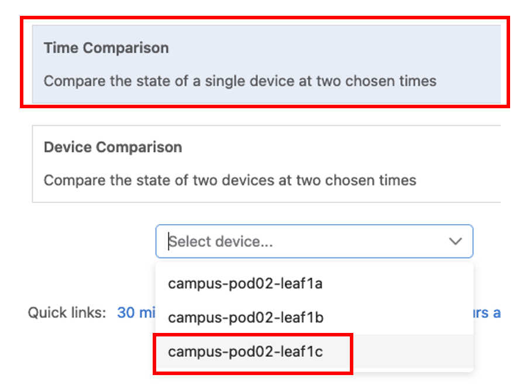

  c. Select a time period, for example 30 minutes ago and click the Compare button 

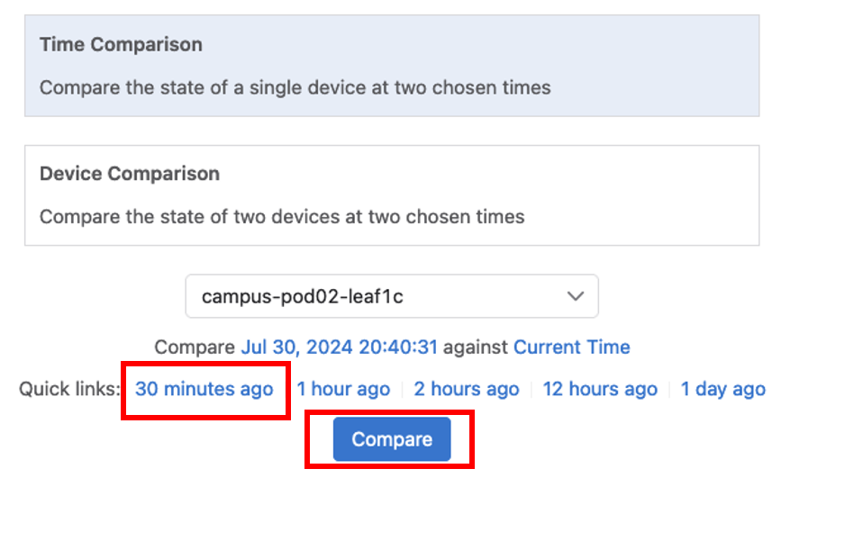

  d. The first screen presented shows the overview is unchanged:

  e. Select the Configuration section

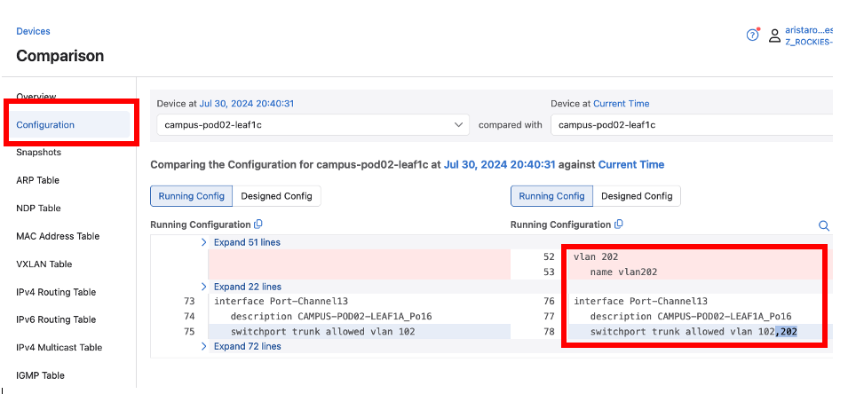

*Note: Notice that the configuration has been updated. Feel free to explore other comparisons by feature. Since this VLAN was localized only, no new IP routes or MAC addresses should be learned.*

Lab section completed! In the next lab section you will see how to roll back a previous change control

---

## 3. Rollback a Change Control

A common operational task is to roll back a specific configuration and restore back to previous state. You may need to do this for all devices affected by a change, or only a subset of devices under troubleshooting.

CloudVision change controls allow this flexibility for granular change management per device and fleet-wide

1. Let’s roll back the change control we used to add a VLAN via Studios.

  a. First go to Provisioning then Change Control menu. Select the change control corresponding to your VLAN addition

  b. Click the Rollback button

  c. In the next screen, select the top list check mark to select all the devices and click Create Rollback Change Control

  d. Verify the Configuration Changes section by clicking “View Diff”  Once you have reviewed the change, click the Review and Approve button

  e. You’ll be presented with one more opportunity to review the changes. Select Execute Immediately if not already toggled on and Approve and Execute

  f. Monitor the change control for completion to ensure the added VLAN is cleaned up on all three switches.

You have now successfully added a VLAN through Studios and then rolled back that change across all switches.

---

## 4. Dashboards (Built-in and Custom)

Dashboards are an important way to visualize commonly requested information. This lab section shows you how to navigate the built-in dashboards and customize your own.

1. Built in Dashboard: “Campus Health Overview”

  a. Open the Dashboards Section to arrive at the Dashboards landing page.

  b. Select the built-in Campus Health Overview dashboard

  c. You’ll be presented with a curated selection of common campus related monitoring tools

*Note: We will explore the Quick Actions interactive functions of this dashboard in another lab section.* 

  d. Feel free to explore the Campus Health dashboard briefly and then navigate back to the Dashboards landing page by selecting Dashboards in the upper left.

2. Built in Dashboard: “Device Hardware”

  a. Next, Select the Device Hardware dashboard

  b. By default, this dashboard selects all devices. Change the dashboard to select only leaf1c by deleting the current query device:*. Replace with the query device:campus-pod[pod#]leaf1c

  c. Once you’ve selected an individual device, the dashboard will filter to results for only this device.

  d. Navigate back to the Dashboards landing page by clicking Dashboards in upper left.

3. Next, let’s add a new customized dashboard.

  a. Click the New Dashboard button.

  b. Select the pencil next to Untitled dashboard

  c. Provide a useful name for the Dashboard, such as “Pod-##” Security and Performance”

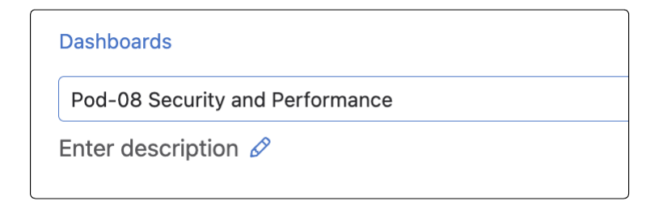

  d. Next, let’s add a combination of visualizations which have both security and performance related metrics.First, click the drop down on the upper right and change from Metrics to Summaries

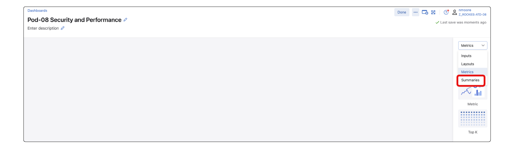

    i. Within the Summaries list, Click on, or drag the Compliance widget into the dashboard canvas

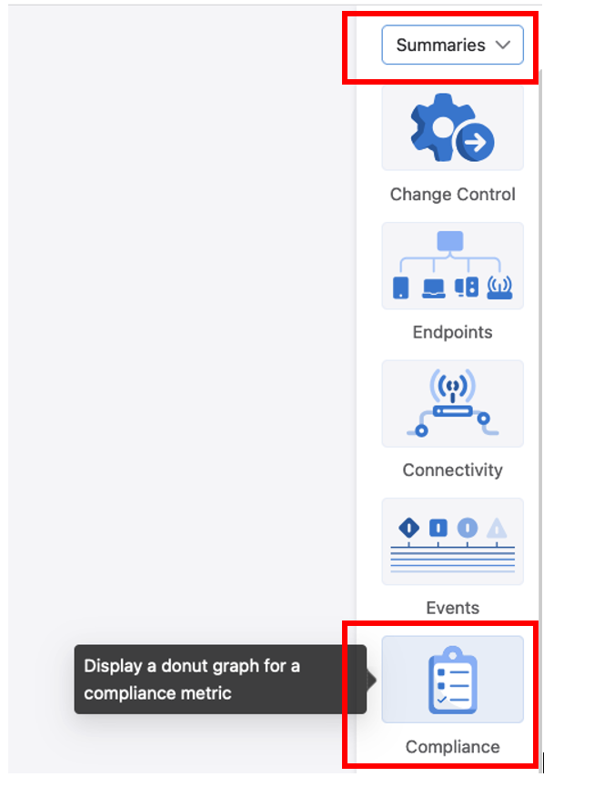

    ii. Within the Compliance tile now added to your dashboard, select the Click to Configure button

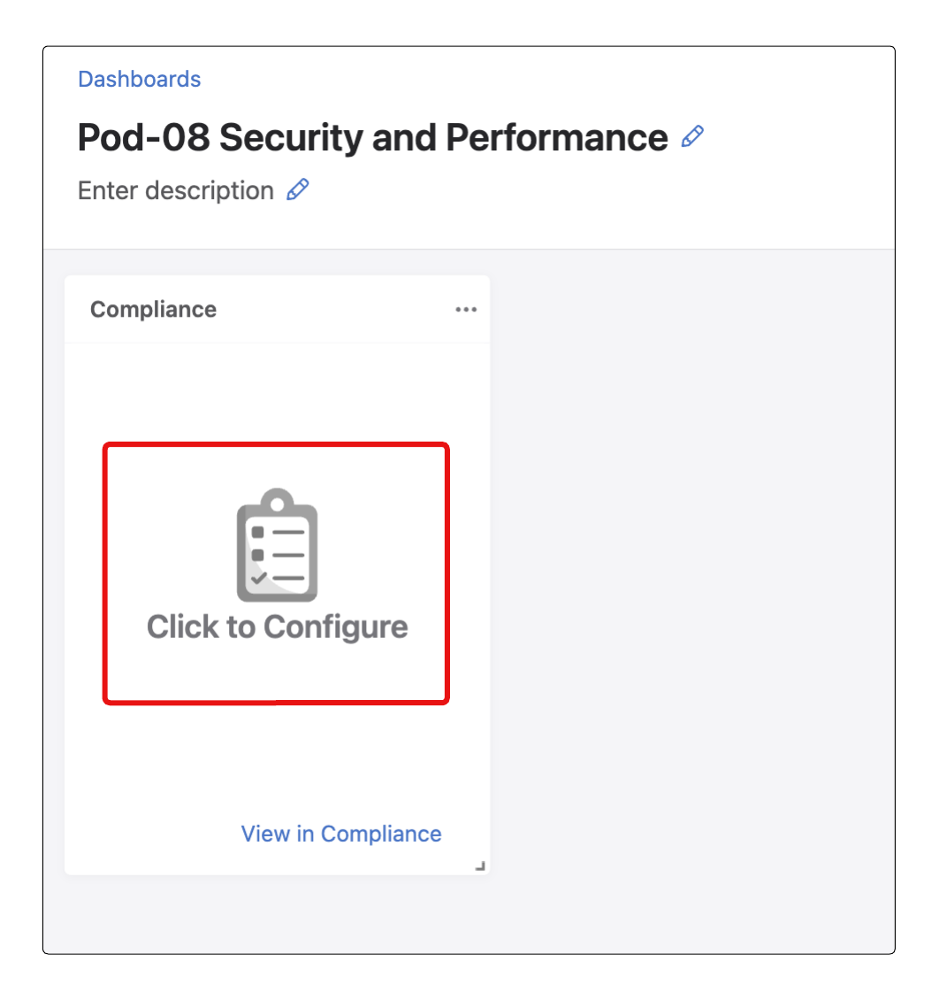

    iii. Within the right side menu bar, within Compliance Metric select Image Compliance

    iv. Dismiss the customization menu by clicking the X in upper right corner

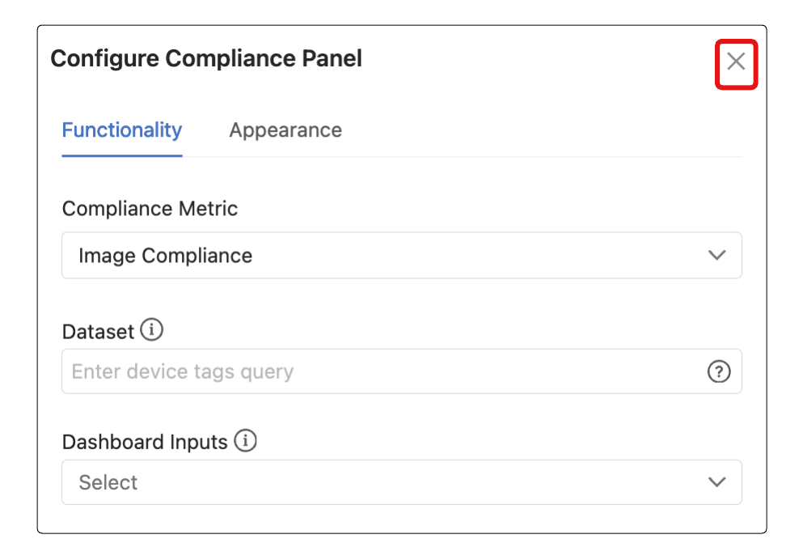

    v. Next, change the Summaries menu back to Metrics

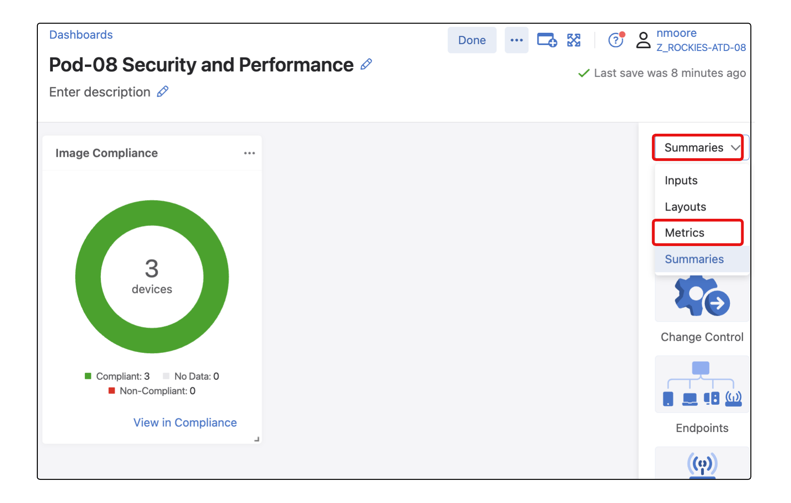

    vi. Within the Metrics menu, click Metric on the right side to add this tile to the canvas, then select Click to Configure.

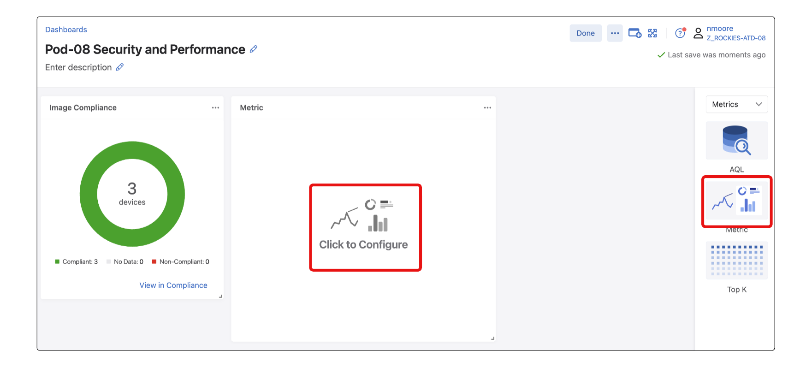

    vii. Select Horizon Graph from the available Visualization options.

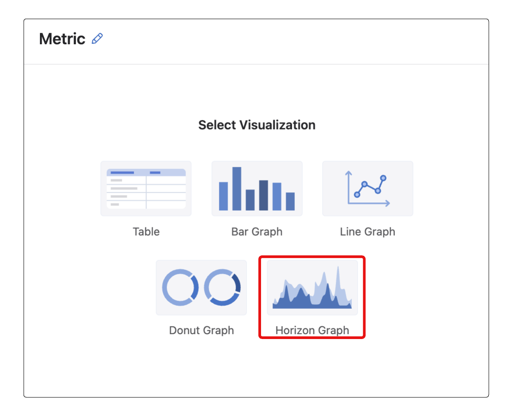

    viii. On the right hand of the screen, under Metrics scroll down and select CPU Utilization

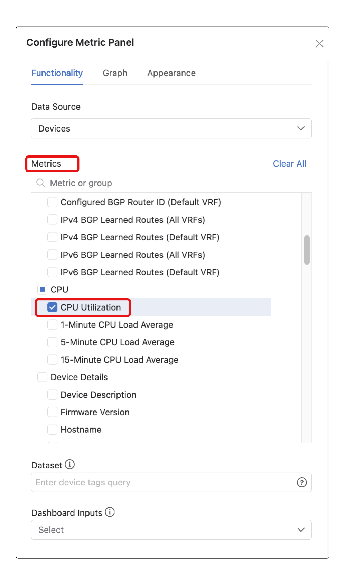

    ix. Dismiss the customization menu with the X button in upper right

*Note: You can drag the tiles around by the respective menu bars and resize each tile using the lower right corner handles.*

    x. Save and complete the dashboard customization by clicking the Done button in upper menu bar

4. Exporting and Importing Dashboards Sharing your Dashboard across Cloudvision systems!

  a. Export a dashboard

    i. To share your dashboard -  in the upper right corner, select the three-dots … menu and click Export as JSON

    ii. Click Download in the lower right corner. This will download a file you can share with others if they wish to use your customized dashboard.

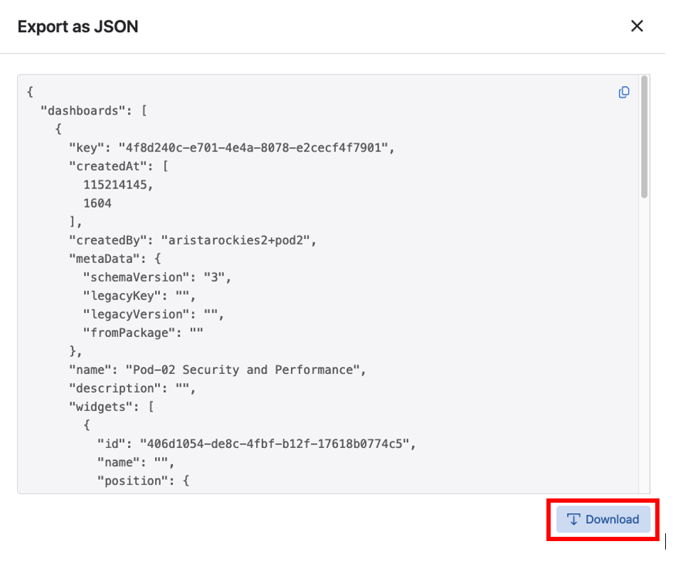

  b. Import a dashboard

    i. Navigate back to the Dashboards landing page to view the import button

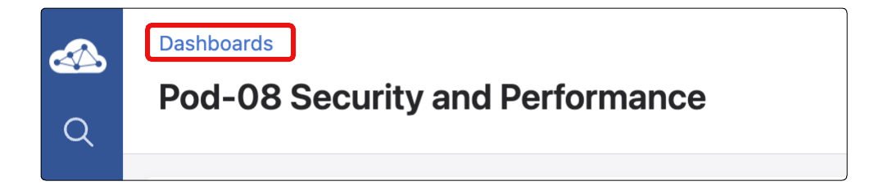

    ii. Click on Import

    iii. The import function is shown as reference only, it is not required to upload any file here. Alternatively you can use this function to share a dashboard customized with your lab partner. If you wish to import, click Select File and select the file you download in the previous step.

Lab section completed!

---

## 5. Events

In this section, we will explore the Events stream and the tools and filters to help process and manage critical errors versus informational data.

1. First Open the Events section from the menu bar:

2. Next, select a different timeframe for the summary visualization, click the current time selection and change this to 1-hour

  a. You can also toggle between a bar graph and event count display

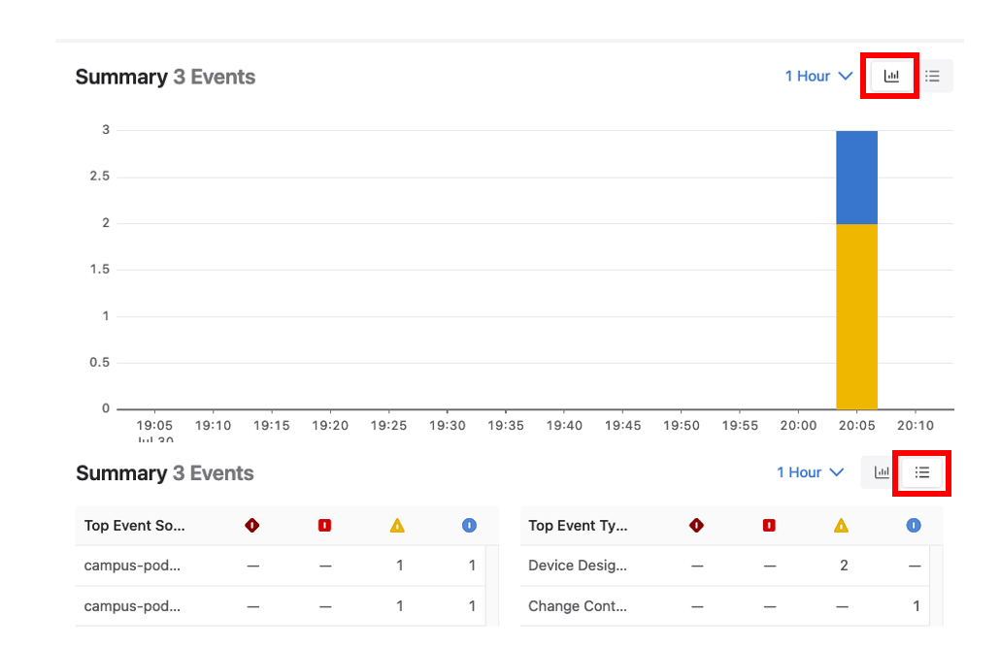

3. Focusing on the Event List next, Note the Export button to download the current Event list as CSV. Notice you can download All Events or only Selected:

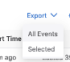

4. Next, select the Gear icon to toggle Event List Roll Up. This setting combines repeated events into groups. Toggle this On and Off, watch the effect this has on the list of Events.

5. Next, utilizing the Event Filters on the right pane is important to reduce the amount of data displayed.

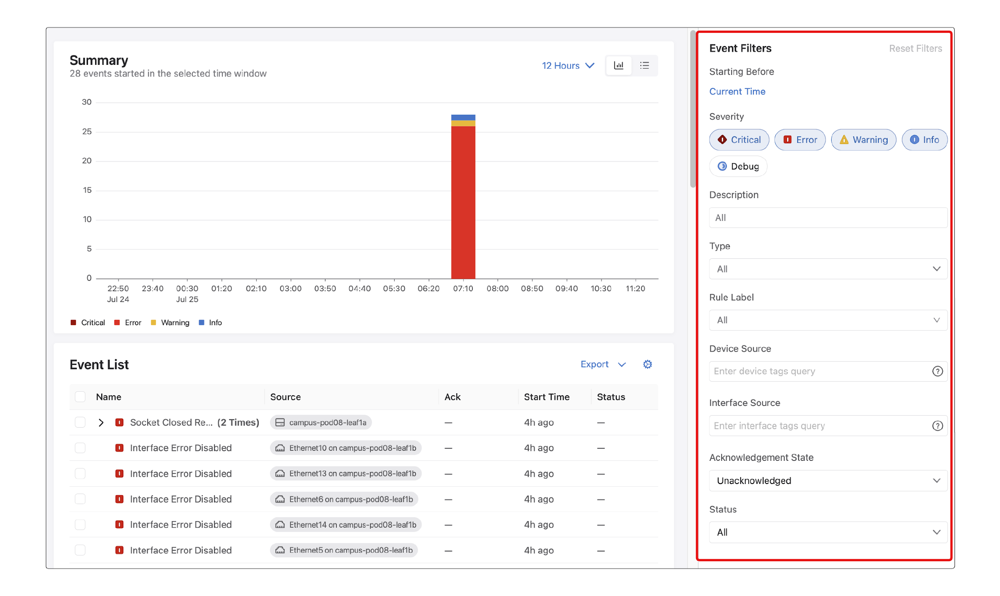

  a. Toggle Off the Warning and Info event Severity. Leave Critical and Error events selected.

  b. In the Type field, enter the string “Unexpected Link Shutdown” and any other interesting event types you are looking for, such as “Device clock out of Sync”

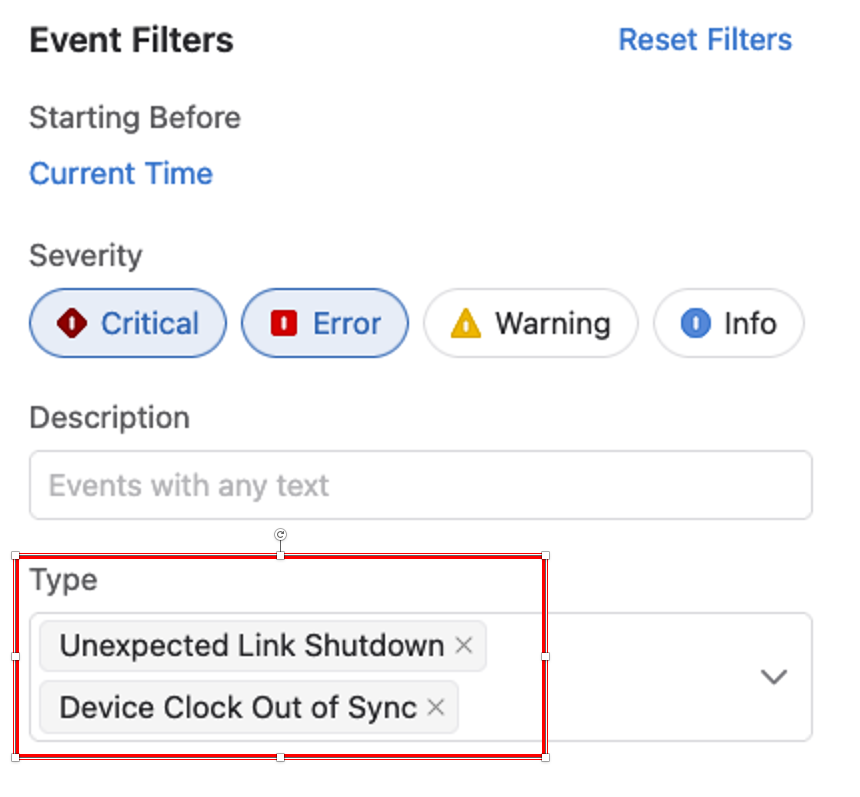

6. Acknowledge and Unacknowledging events

  a. To acknowledge from the filtered event list, select specific events and Acknowledge them.

     i. Adding a note is optional, select the Acknowledge button to mark these selected events.

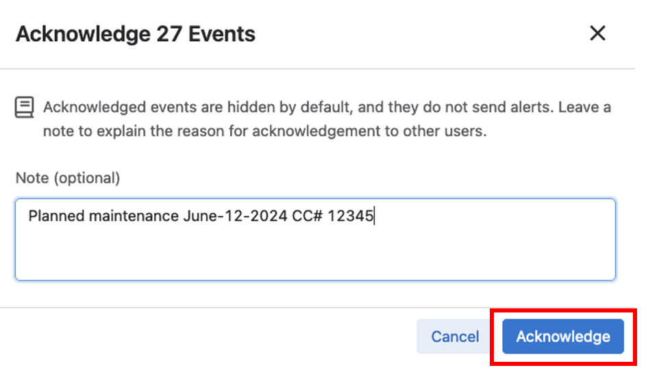

     ii. Acknowledged events are not deleted from the event list, only flagged as acknowledged and can be referenced by changing the filtered Acknowledgement State. Click Acknowledgement State and select Acknowledged

  b. Un-acknowledging an event can be done in the same way, click the box to the left of the Acknowledged event, and click Unacknowledge at the top of the event list.

**Events and filtering lab section complete!**

*The next section will show you how to customize the notifications (e.g. email, chat, SNMP, Syslog, etc) that the events generate.*

---

## 6. Customize Notifications

In this lab, you will configure CloudVision to send an email alert to an email address using the built-in “SendGrid” email service.

1. Configure “SendGrid” email service.

  a. After logging in to CloudVision, click on the “Events” menu option.

  b. Click on the “Notifications” button in the top right of the screen.

  c. Now, configure the SendGrid receiver by clicking on “Receivers” in the menu, then click on the “Add Receiver” button.

     i. Name the receiver “SendGrid for Campus ATD”, then click the “Add Configuration” button and select “SendGrid” from the menu options.

    ii. Type in a valid email address that you can receive emails at during this lab and check the “Send notification when events are resolved” checkbox.  Click the “Save” button in the upper right hand side of the screen to save your new receiver.

    iii. Once you are happy with receiver’s configuration, click the Save button at the top of the screen

2. Next, configure a “Rule” to use the new receiver.  Click on the “Rules” menu option, then click “Add Rule”

  a. Configure “Rule Conditions” for this rule.  Click on the “+ Device” button, then choose your leaf1c switch from the “Device” drop down box.

  b. Now click on the “+ Event Type” button.

  c. Add “Event Types” by choosing them from the drop down box as shown in the image below:

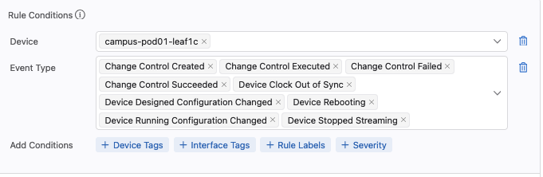

  d. Select all of the severity options by clicking on the “+ Severity” button and choosing the options from the drop down box.

  e. Next, choose your new “SendGrid for Campus ATD” receiver from the “Receiver” dropdown box, select the “Continue Checking Rules” box, and save your changes by clicking on the “Save” button.

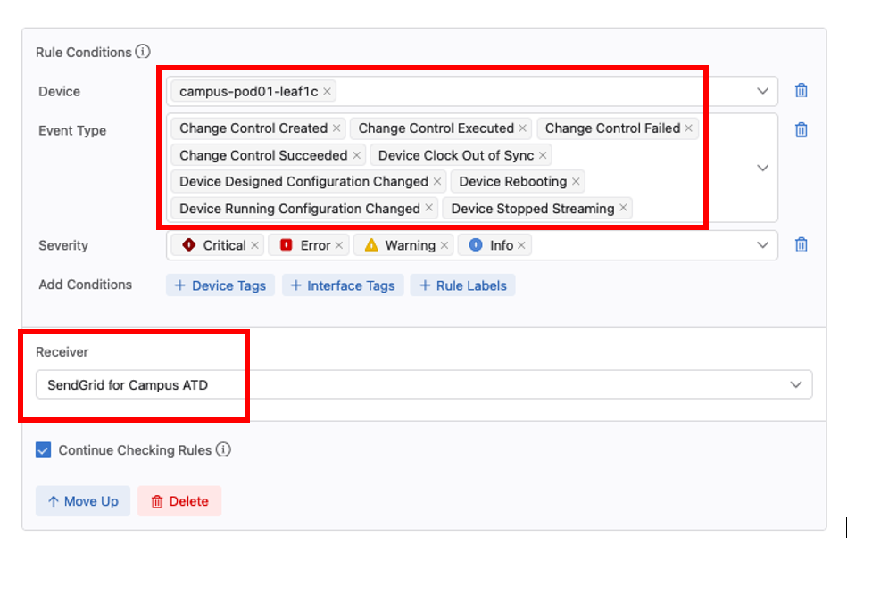

Make sure to save your changes in this screen with the Save button along the top of your screen.

3. Now test your new receiver and rule.

  a. Click on the “Status” menu option.  Configure the “Test Notification Sender” by changing the “Event Type” to be “Device Stopped Streaming” and selecting your leaf1c  from the “Device” drop down box.  Click the “Send Test Notification” button.

  b. After a minute or two, you should receive the email alert at the email address you configured in the Receiver.

Congratulations, you’ve completed the “Event Notification Lab” !

---

END OF LAB GUIDE
