# Campus B-01 Wireless Lab Guide 
## WiFi Setup  
     

## This Lab Guide: 

[Campus B-01 Wireless Lab Guide - WiFi Setup](https://github.com/arista-rockies/Workshops/blob/main/Campus/2026_Campus_Workshop/B-01/2026%20Campus%20B-01%20Wireless%20Lab%20Guide%20-%20WiFi%20setup.md)  

## Floor Plan Download:  
[Floor Plan Download](https://tinyurl.com/wififloorplan)

## Table of Contents

1. [Full Lab Topology](#1-full-lab-topology)
2. [POD Topology](#2-pod-topology)
3. [Accessing CloudVision Cognitive Unified Edge CV-CUE](#3-accessing-cloudvision-cognitive-unified-edge-cv-cue) 
4. [Launchpad](#4-launchpad)
5. [WiFi Device Registration](#5-wifi-device-registration)
6. [CV-CUE CloudVision Wifi Access](#6-cv-cue-cloudvision-wifi-access)	
7. [Assign AP Name](#7-assign-ap-name)	
8. [Managing the Configuration Hierarchy](#8-managing-the-configuration-hierarchy)	
9. [Creating an SSID](#9-creating-an-ssid)
10. [Troubleshooting](#10-troubleshooting)	
11. [Floor Plans](#11-floor-plans)	
12. [Dashboard - Client Journey](#12-dashboard---client-journey)

## 1. Full Lab Topology

---
## 2. POD Topology

---
## 3. Accessing CloudVision Cognitive Unified Edge CV-CUE
Go to the Arista CloudVision CUE portal via: [https://ignition.campus-atd.net/](https://ignition.campus-atd.net/)

* Enter the 6 digit Access Code found on the Pod Handout Worksheet  
* Click  

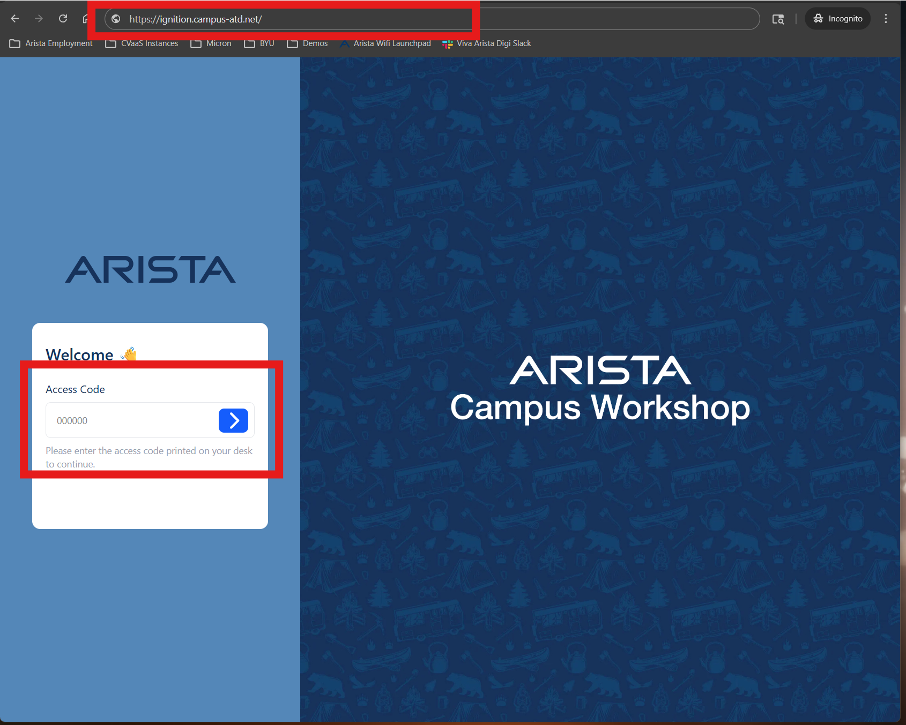  

Click the CV-CUE and AGNI Launchpad tile
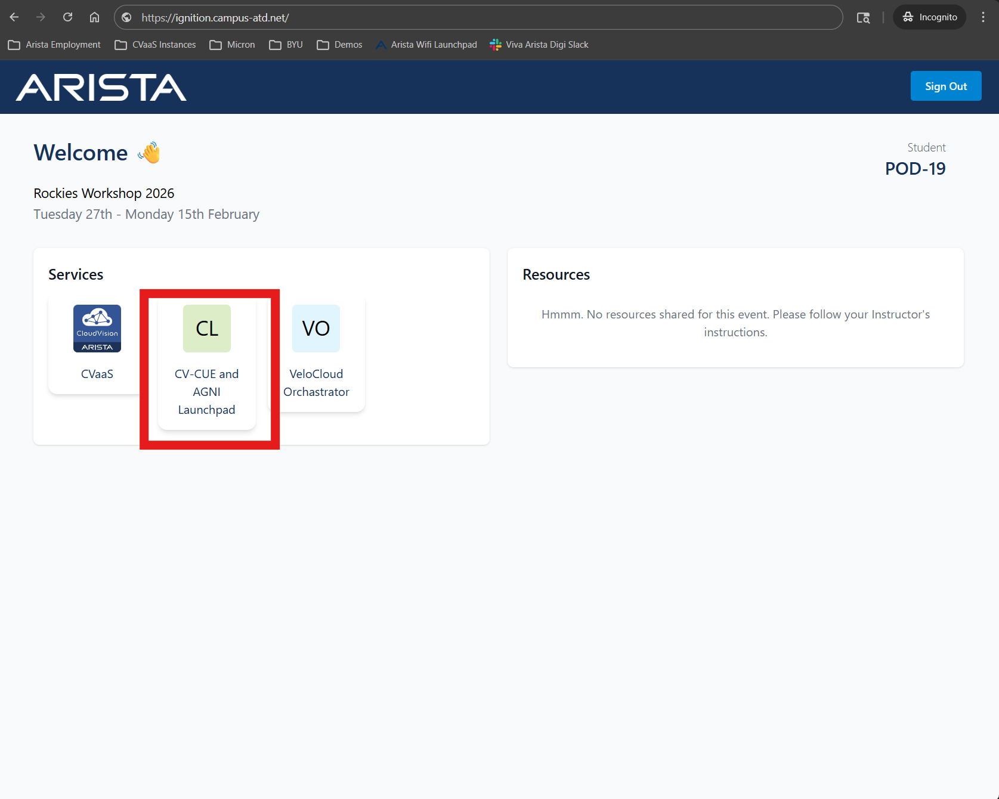  

---
## 4. Launchpad 
* Launchpad is the portal to access your Arista cloud services including **WiFi Management** (CV-CUE) and **AGNI** (Network Access Control). When you open the launcher, you are presented with management applications on the Dashboard menu and access controls with the Admin menu.

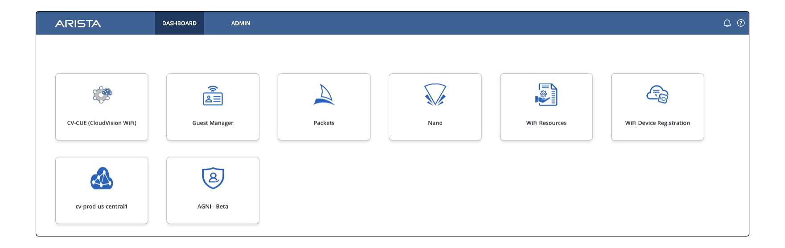

Dashboard Applications Summary:

* **CV-CUE (CloudVision WiFI) \- Wireless management and monitoring**  
* **Guest Manager** Analyze and report on user activity within your environment.   
* **Nano** allows you to manage your environment from your smartphone   
* **Packets** is an online packet capture (.pcap) debug tool allowing you to examine the association and packet information.  
* **WiFi Resources** includes documentation and eLearning has 6 ½ hours of training, also included.  
* **WiFi Device Registration** is the process for importing APs onto your account  
* **AGNI \- Beta** Arista Guardian for Network Identity (Network Access Control)

**LAB SECTION COMPLETE**

---

## 5. WiFi Device Registration 

**Reference information below \- these steps have already been done for you by event staff**

**\*Note: Arista AP serial numbers are automatically assigned to the user’s CV-CUE staging area when purchased.** In addition, specific devices can be registered for management using the [WiFi Device Registration](https://launchpad.wifi.arista.com/devices/#)  function, accessible from Launchpad Dashboard.

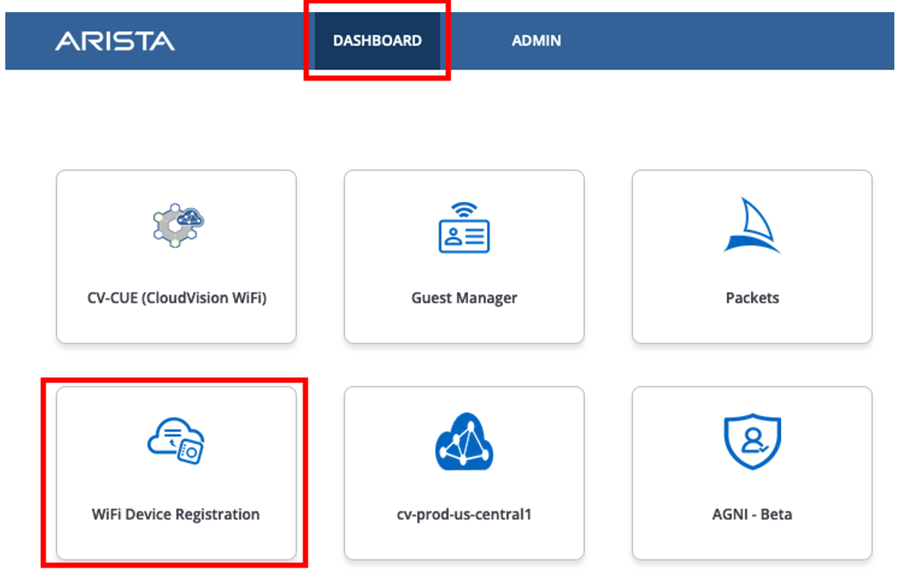
Device registration requires both the Serial Number and Registration Key information found on the back of the APs.  Additionally, a CSV containing this information can be uploaded for bulk registration operations.

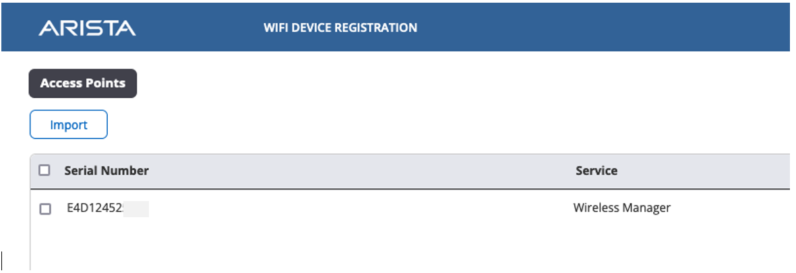 
Within the Import Function you can provide individual AP serials and keys or upload a CSV.  
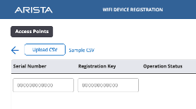

**LAB SECTION COMPLETE**

---

## 6. CV-CUE CloudVision Wifi Access

CloudVision CUE \- Cognitive Unified Edge, provides the management plane and monitoring functions for the Arista WiFi solution. 

Click on the **CV-CUE** (CloudVision WiFi) Tile in the LaunchPad from the Dashboard menu.  

When the CV-CUE interface launches, you are presented with an initial dashboard to monitor your wireless environment at a glance, we will revisit these metrics later in the lab. Since this is a new setup the initial dashboard screen will be mostly empty.  
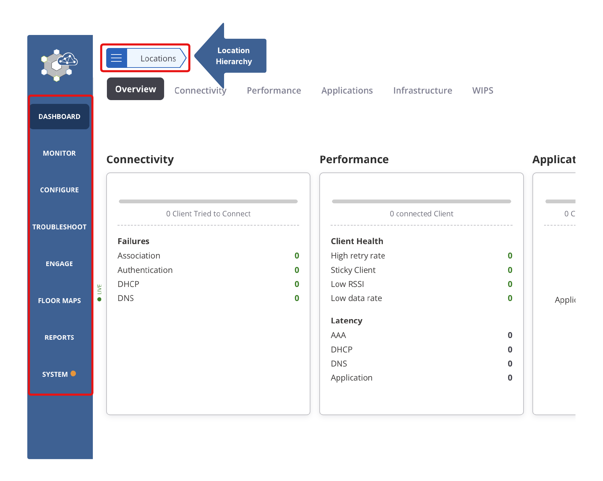

Use the left menu bar to select monitoring and configuration functions.

Take careful note of the **Locations Hierarchy** indicator throughout the user interface. This indicates which container you are monitoring or configuring.

The primary menu navigation functions are the following:

**Dashboard** \- Alerts, Client Access, Infrastructure health, Application Experience, and WIPS  
**Monitor** \- Monitor and explore Clients, APs, Radios, SSIDs, Application traffic, Tunnels  
**Configure** \- WiFi SSIDs, APs and Radios, Tunnels, RADIUS, and WIPS settings  
**Troubleshoot** \- Client connection test, packet trace, live debug logs, historic logging  
**Engage** \- User insights, Presence, Usage, 3rd party integrations  
**Floor Maps** \- Floor layouts and AP location map view  
**Reports** \- Detailed information for Infrastructure APs/Radios, Client Connectivity and Experience, WIPS detections  
**System** \- Locations Hierarchy, AP Groups, 3rd party server settings, keys and certificates 

In addition to the menu bar navigation and Locations Hierarchy, the UI provides a common Search bar, Metric summary, and Help button throughout workflows.

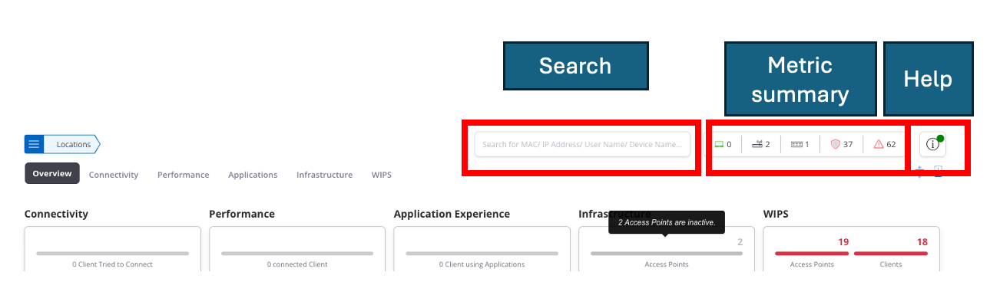

**LAB SECTION COMPLETE**

---

## 7. Assign AP Name

Access points that successfully receive an IP address, DNS, and default gateway, via DHCP, and have connectivity over HTTPS/TCP/443 to CV-CUE will be shown within CV-CUE under **Monitor** \> **WiFi**   
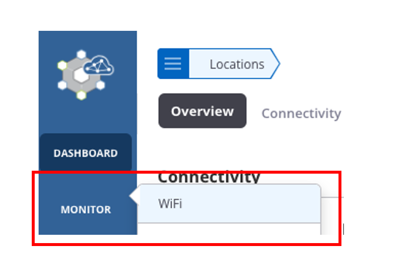 
Select the **Access Points** section and observe the discovered AP and default name “Arista\_” and the last 3 bytes of the MAC address.

Customize the AP’s name by clicking the **3-dots menu** and **Rename**

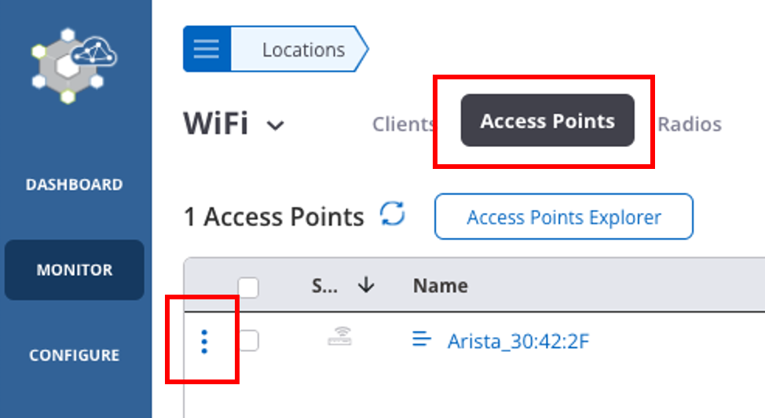 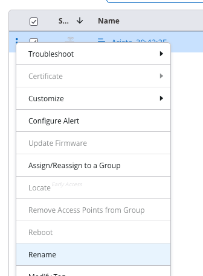 
Give the AP a name such as: “POD-**\#\#**\-FL1” where **\#\#** is a 2 digit character between 01-20 that was assigned to your lab/Pod.

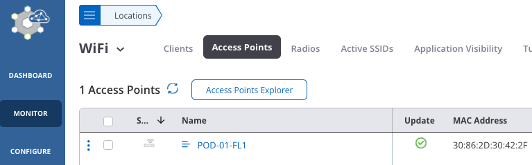

**LAB SECTION COMPLETE**

---

## 8. Managing the Configuration Hierarchy 

In **CloudVision CUE** the configuration is hierarchical. 

Shared configuration is added and edited at the parent containers. These settings are inherited down the hierarchy. For example, a guest SSID you wish to be configured on all devices can be configured at the top.  
Child containers can define the sites, buildings, functions, or any other logical construct of the wireless network and allows you to add settings at those specific levels. 

**\*Note:** At any time you can go to the question mark on the top right and choose “**Enable Help**” to make fields have notations, or search in the “**Go To Help Portal**”.

     

### Customize the Locations Hierarchy: 

Expand the “**Locations**'' pane by clicking on the hamburger icon toward the top left of the screen. Now select the three dots to the left of “**Locations**'' and click on “**Manage Navigator**”.

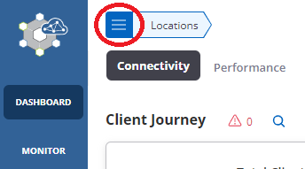            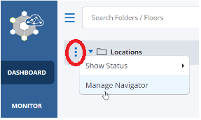

“**Manage Navigator**” is where you create and manage the hierarchy of:  **Folders, Floors, and Groups.**

* **Folders** typically represent a company, branch office name, or division.  
* **Floors** are straightforward and are where maps are placed.  
* **Groups** are a way to customize the configuration of specific device types.   
  * For example, a branch location may have a unique configuration for Outdoor APs   
  * Create a Group for the Outdoor APs, put the APs into that group and override the part of the configuration that is unique to the group. 

### Creating Folders: {#creating-folders:}

Let’s lay out a simple example Organization hierarchy to keep configurations and customizations of the wireless infrastructure.  
**\*Note:** A default “Staging Area” folder exists at the Locations root. This is where unconfigured access points reside prior to being assigned to specific locations/floors.  
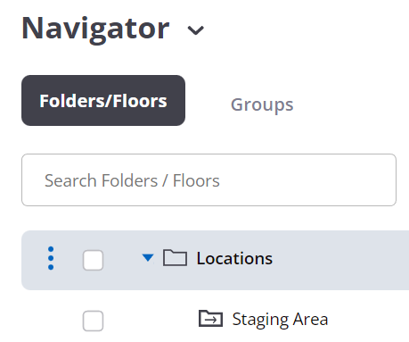

Add a folder for your Company Name. In the “**Navigator**”, select the 3 dots next to “**Locations**”:

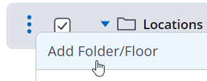

Select “**Add Folder/Floor”** and then name your new Folder **“Corp”.**

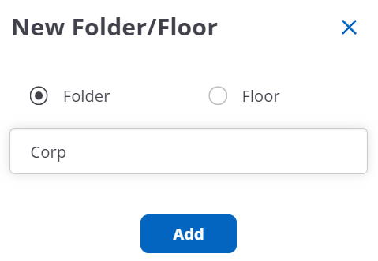  
You can optionally nest folders to further define your organization and configuration containers.

Note: the folder level is the lowest level you can customize the configuration. Configuration is not mapped to Floors directly, these are for AP placement within the Folder containers.

### Creating Floors:

Next, create 2 floors called “**1st Floor”** and “**2nd Floor”**.  Right click on the word “**Corp**” to expose the menu. Be sure to click the “**Floor**” radial button (the default is “**Folder**”)

**\*Note:**  It’s also possible to add multiple floors at once using the “**Add Multiple Folders/Floors**” menu option:  
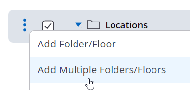    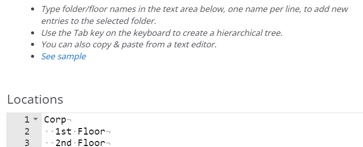

**Important:**  
**For this workshop event, we will be reducing WiFi Radio channel width and transmit power levels to avoid interference with the hosting facility.**

To customize these power settings:  Navigate to the **Configure**, **Device**, **Access Points menu** to customize the Corp Folder Settings.

Once in that menu, ensure that Corp is selected from the tree structure on the left. If you do not see the tree structure, click the hamburger icon next to “Location” in the top left to expose the tree.

You will also need to click the message at the bottom of the screen to enable modification of the configuration that is being inherited from the top level: 

“**Click here to enable editing and customize the policy**”

Then click “**Continue**” to confirm.

Set the following parameters under the **WiFi Radios** tab, **5GHz frequency**, make sure you have the “Corp” level selected/highlighted in the tree (details below):

* Channel Settings: **Manual \- type or select channel ID \#\#\# assigned to your pod**   
* Channel Width: **20MHz**  
* Transmit Power Selection: **Manual**  
* EIRP: **4 dBm**

For Channel Selection, Select **Manual** then type your pod’s assigned 5 GHz channel.  
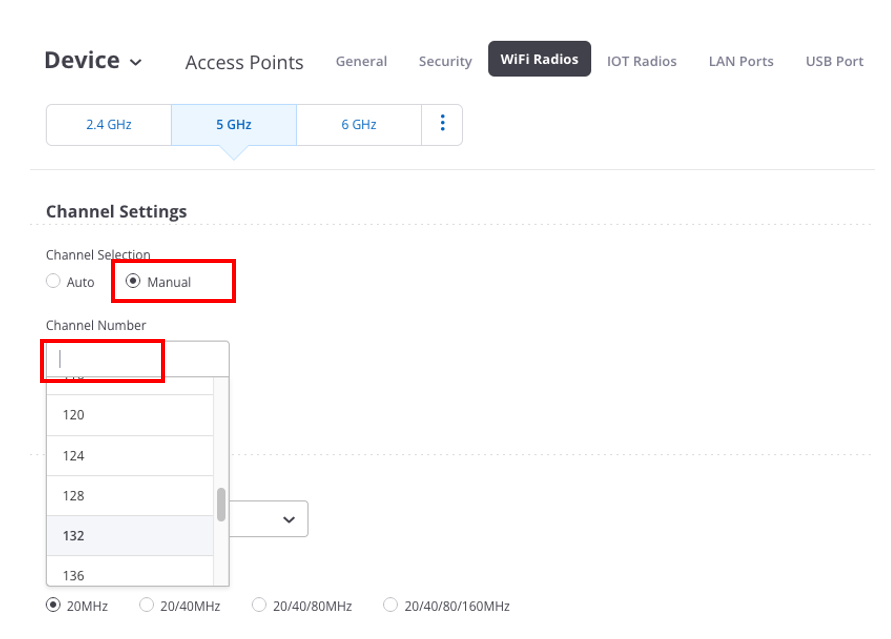 
Under Capability, select a channel width of **20MHz** 

Under Transmit Power Selection, select **Manual and set EIRP to 4**

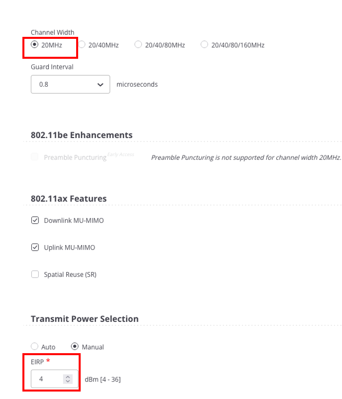

Click “**Save**” at the bottom of the page then click “**Continue**” to confirm.

**Important:**  
**The following steps activate the second wired connections from the AP to switch 1b.  This will be required for later labs.**

Next we will set parameters under the LAN Ports tab, still in the “Corp” level from the previous configuration (details below).

Set the following parameters:
* Link Aggregation 
  * Layer 2 (MAC) 

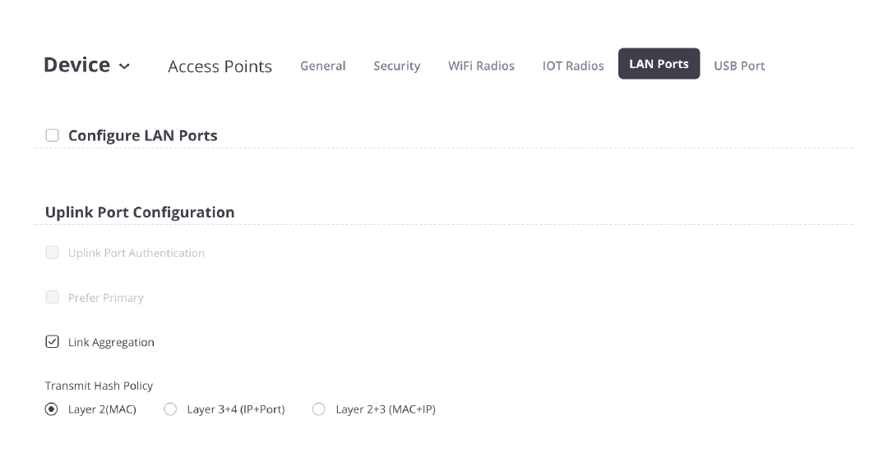

Click “Save” at the bottom of the page then click “Continue” to confirm.

### Move AP to destination folder 

Click “**Locations**” in the tree structure and choose “**Manage Navigator**”  
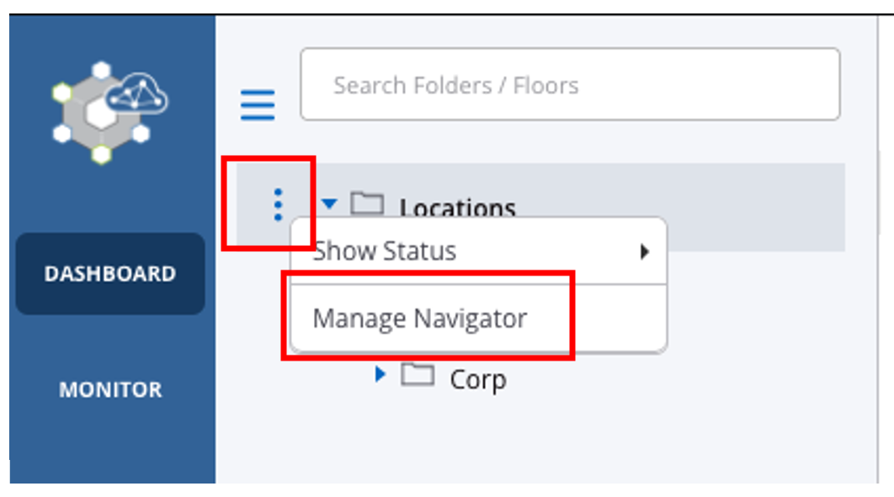

Move your AP into the “1st Floor” floor you created. To move your AP from the staging area, click on the “**Staging Area**” folder, and select “**Show Available Devices**”**.**

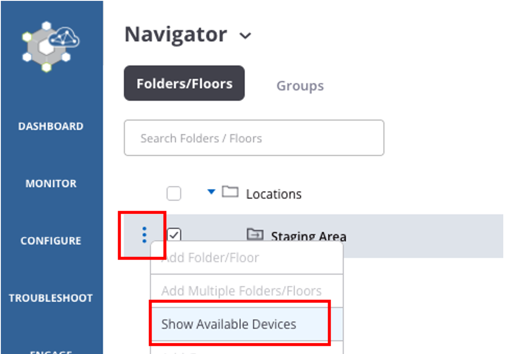
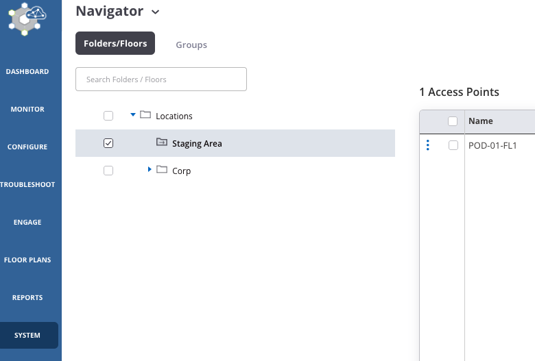

Next, click on the AP name, select  “**Move**” and then select the “**1st Floor**” folder you created earlier, and then click the “**Move**” button at the bottom of the screen.  
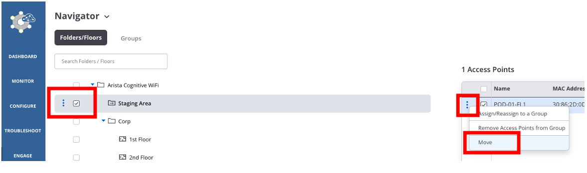 
    
In the following dialog, select your **1st Floor** and click **Move** to assign the AP.   
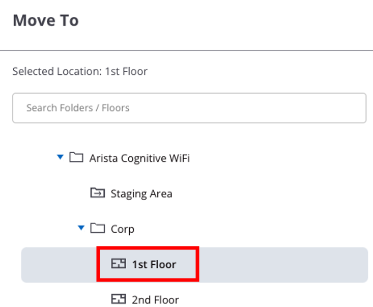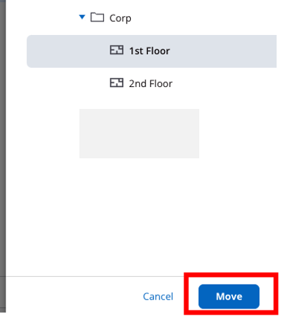

You’ll see a pop-up message to confirm the move. Click “**Move**” again to finish the process:

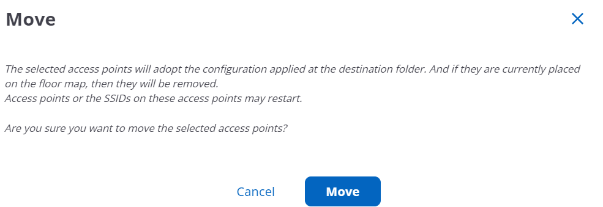

You can verify the move by selecting the “**1st Floor**” folder and then “**Show Available Devices”**.

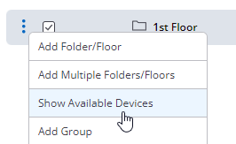   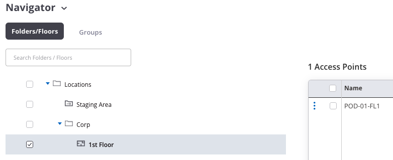

Moving APs into the folders ensures the child devices inherit the configuration of the parent hierarchy structure. This means your pod’s AP radios will have the channel and power settings applied as a shared configuration.  

**LAB SECTION COMPLETE**

---

The next section begins on the following page.

## 9. Creating an SSID

In this lab, we will be working in the “**WiFi**” configuration area. **This list is just a summary of the steps. Follow the detailed configuration steps below.**

1) Navigate to Configure \> WiFi  
2) Click **“Add SSID”** to create a new SSID (WPA2 PSK) with your **ATD-\#\#\-PSK** as the name (where **\#\#** is a 2 digit character between 01-20 that was assigned to your lab/Pod.)   
3) Click the **“Security”** tab, change the dropdown from “Open” to **“WPA2”**  
4) Use **AristaCampus** as the passkey. 

**Start** by hovering your cursor over the “**Configure**” menu option on the left side of the screen, then click “**WiFi**”.  
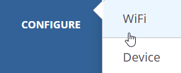

At the top of the screen, you will see where you are in the location hierarchy. If you aren’t on “**Corp**”, click on the three lines (hamburger icon) next to “**Locations**” to expand the hierarchy and choose/highlight the “**Corp**” folder.  Now click the “**Add SSID”** button on the right hand side of the screen.

With the hierarchy menu collapsed:

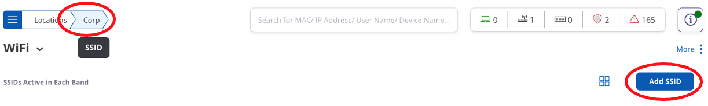

Or, with the hierarchy menu expanded:

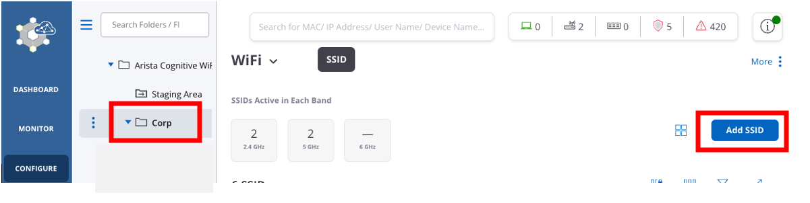

Once on the “**SSID**” page, configuration sub-category menu options will appear across the top of the page related to WiFi (the defaults are “**Basic**”, “**Security**”, and “**Network**”). You can click on these sub-category names to change configuration items related to that area of the configuration.

While we won’t be configuring them here \- In addition to “**Basic**”, “**Security**”, and “**Network**” configuration options, there are additional categories available. To make them visible, click on the 3 dots next to "**Network**" and you can see the other categories that are available to configure (i.e. “**Analytics**”, “**Captive Portal**”, etc.).

Back within the “**Basic**” menu option, name the SSID “**ATD-\#\#\-PSK”** (where **\#\#** is a 2 digit character between 01-20 that was assigned to your lab/Pod.).   
The “**Profile Name**” is used to describe the SSID and should auto-fill with the SSID’s name.

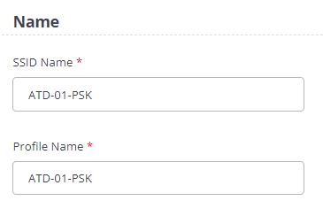

Since this is our corporate SSID, leave the “**Select SSID Type**” set to “**Private**”, but note this is where you would change it to “**Guest**” if needed.  Select **Next** at the bottom.  

In the “**Security**” sub-category, change the association type to “**WPA2**”, select the “**PSK**” radio button, enter the passkey of “**AristaCampus**”, then select “**Next”** at the bottom of the screen.

In the “**Network**” configuration sub-category, we’ll leave the “**VLAN ID**” set to “0”, which means it will use the native VLAN. If the switchport the AP is attached to is trunked, you could change this setting to whichever VLAN you want the traffic tagged with.

Network Mode:  
Select “**Bridged**” mode for this lab.   
   		For reference  

* NAT \- often used for Guest traffic to default gateway  
* L2 / L3 Tunnel \- Guest Anchor, tunneled corporate traffic, and traffic inspection

The rest of the settings can be left at the default values.

Click the “**Save & Turn SSID On”** button at the bottom of the page.

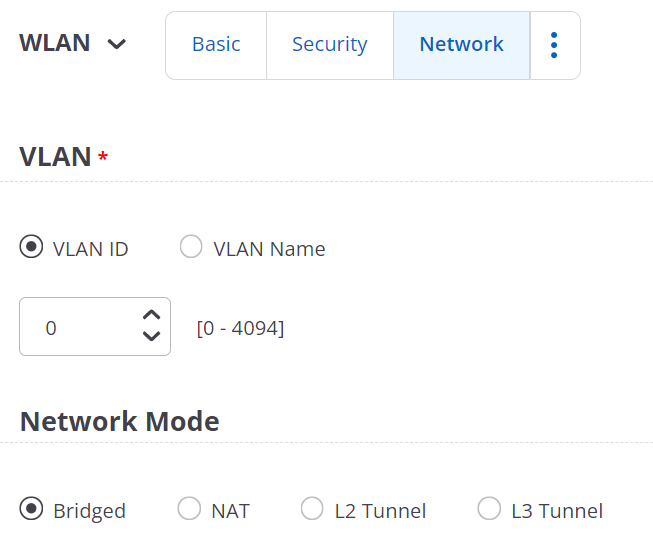 

**Please Read\!**  
**Only select the “5 GHz” option** on the next screen (**uncheck** the 2.4 GHz box if it’s checked), then click “**Turn SSID On**”.

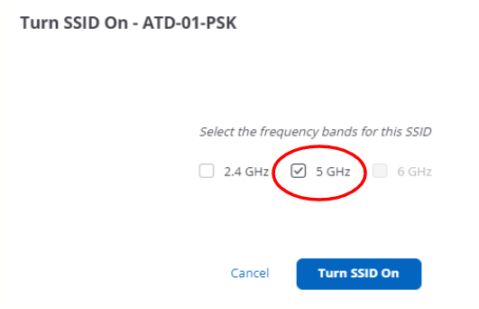

It will take a minute or two for the SSID to enable. You can check if the SSID has been enabled and add or disable SSIDs from the **“Configure”, “WiFi”** menu  
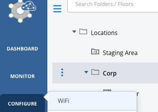  
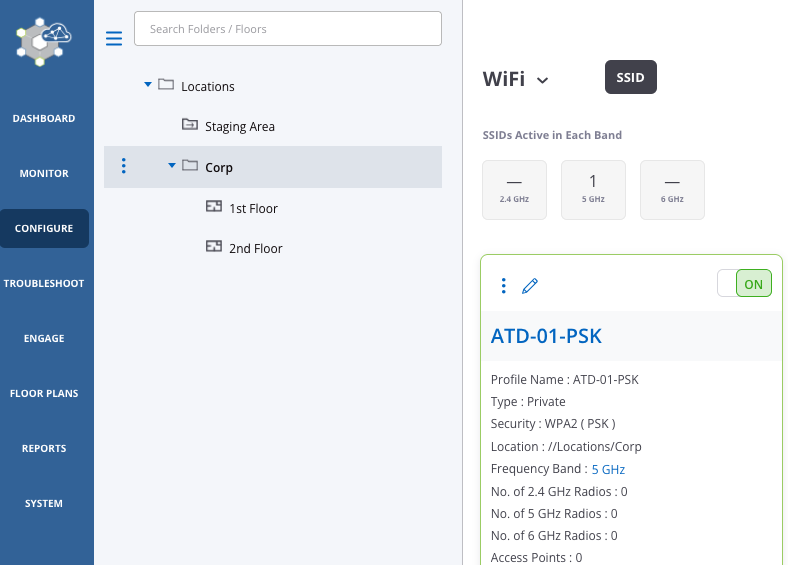

After you turn on the SSID, hover your cursor over “**Monitor**” in the left hand side menu, and then click “**WiFi**”.

Now, in the menu options at the top of the page, look at the “**Radios**” menu option.   
The **5 GHz radio should be “thumbs up”** and **2.4 and 6 GHz radios should be “thumbs down”**? It may take a minute or two for the radio to become active.   
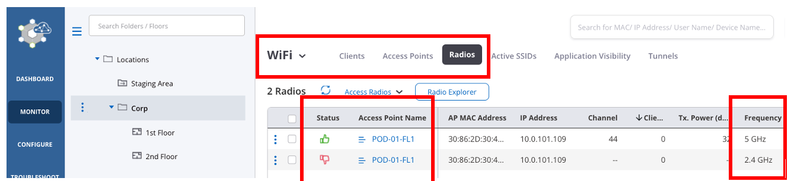

Check the “**Active SSIDs**” menu at the top of the screen.  Is your SSID listed?  
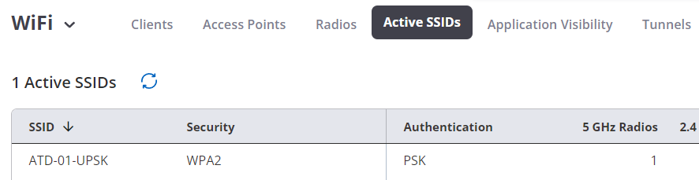

Next, go ahead and connect your phone to the SSID (PSK is “**AristaCampus**”).  Navigate to the “**Clients**” menu at the top of the screen and you should see your device.

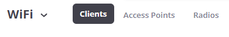

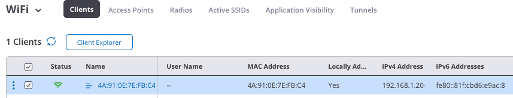

The next section begins on the following page.

**LAB SECTION COMPLETE**

---

## 10. Troubleshooting

Make sure you are at the “**Corp**” folder in the hierarchy, and then hover over “**Troubleshoot**” in the left hand menu, then click “**Packet Trace”.**

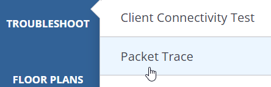

On the top right hand side of the window, click “**Auto Packet Trace”** and select the checkbox for the **SSID** you created earlier (**ATD-\#\#-PSK**). Click “**Save”** at the bottom of the window.  If you don’t see the SSID listed, make sure you are in the correct folder in the navigation pane.

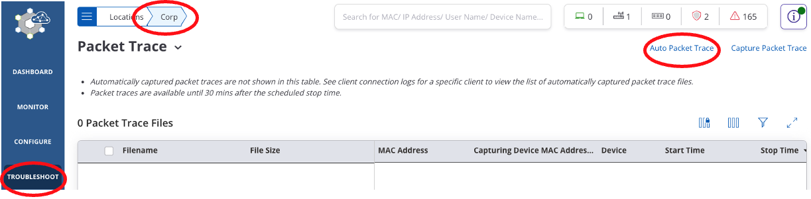
        
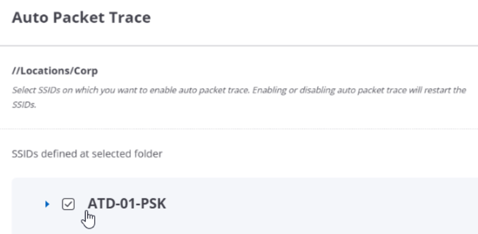

Next, connect your device to the AP and type in the wrong PSK.  Hover your cursor over the “**Monitor”** menu on the left hand side of the screen, then click “**WiFi”.**  Now click on “**Clients”** at the top of the page. You should see your device trying to connect.

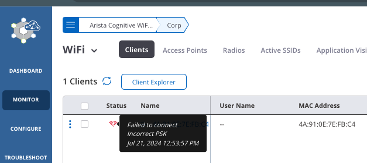

Select on the three dots next to the device name and select “**Start Live Client Debugging”.**
(images/images64.png)

Select “**30 Minutes”** in the **“Time Duration”** drop down box, select the “**Discard Logs” radio button,** then click “**Start”**.

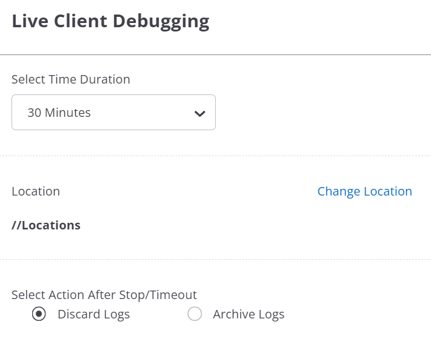

 
Next, try connecting the device again with the **wrong PSK**.  Watch and review the Live Client Debugging Log.

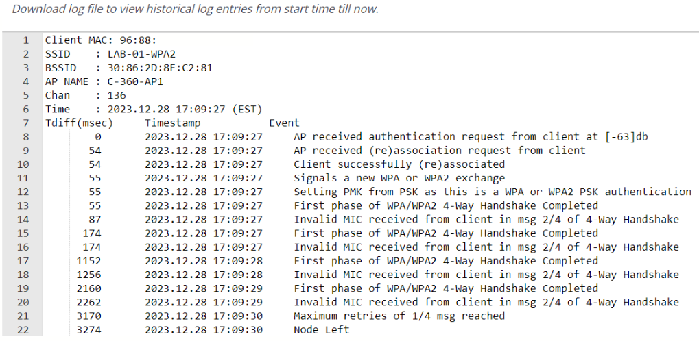

   
After that fails, try again with the **correct PSK** (“**AristaCampus**”).  Review the logs.

Stop the Live Client Debugging:  
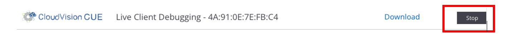

You can verify live client debugging is enabled for a specific client by hovering over its entry in the Monitor, WiFi section  
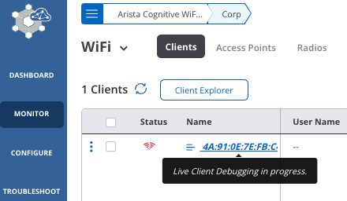

Once your device has successfully connected to the AP, click on the View Properties button under the Name Column to learn more about the specific client  
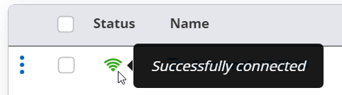     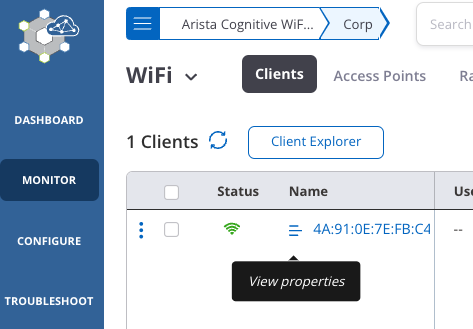

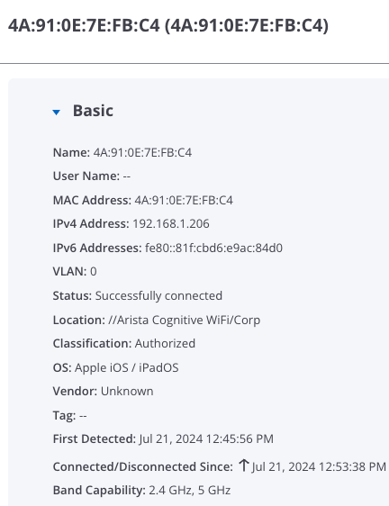

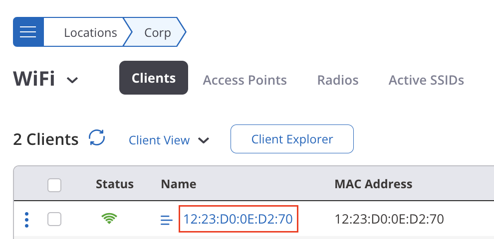

Next, click on the client name to see the client's detail page where you can gather additional information such as Root Cause Analysis, Client Events, Data Rate, Top Apps by Traffic, Client Traffic Volume, Application Experience, etc.  
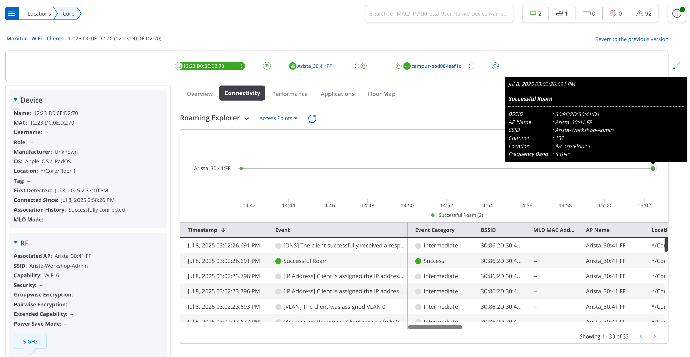

Select the Connectivity menu option, in the **Roaming Explorer** section you can see the success/failure messages, DHCP information, and other events.

Scroll down to the failed incorrect PSK entry and select “**View Packet Trace”** in the **“Packet Capture”** column (you may have to scroll to the right).  

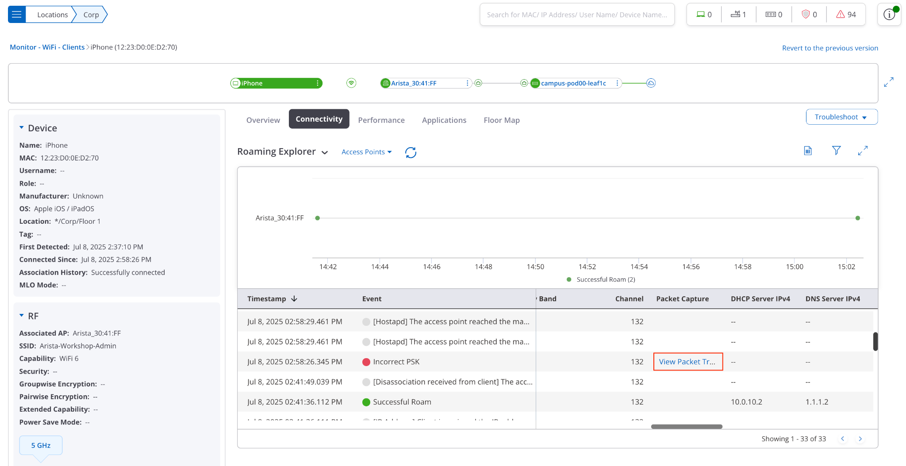

You should see a packet trace that you can download.  Click on “**View Packet Trace**”.

Select “**Open”** to open the file right within CV-CUE / Packets.  You will be in the “**Visualize**” section of Packets.

You can also download the trace and view it with WireShark if you have it installed.

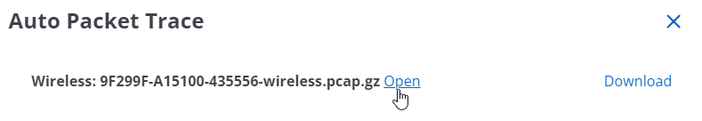

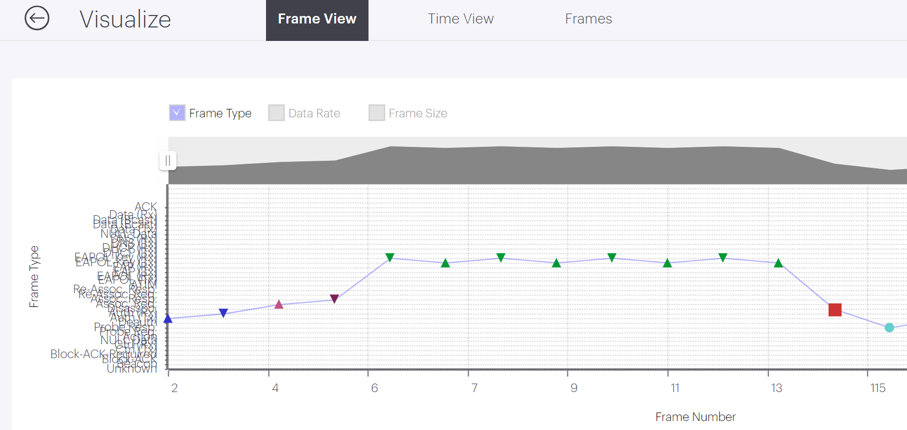

Click on “**Time View”** and “**Frames”** to look through the data and at the trace to see how Arista can help you troubleshoot.

Next, click on the back arrow icon to look at the “**Analyze”** feature.
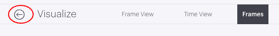

Explore the “**Analyze**” feature by clicking on the various menu options and reviewing the data.

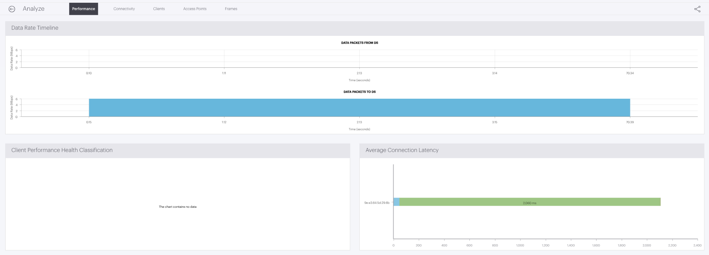

The next section begins on the following page.

**LAB SECTION COMPLETE**

---
## 11. Floor Plans

Utilize the floor plan image file provided in the Workshop Files download location and shown on the title page of this guide. Save that image to your computer.

Lab Floor Plan Download if needed: [https://tinyurl.com/wififloorplan](https://tinyurl.com/wififloorplan)

Floor plan image example:

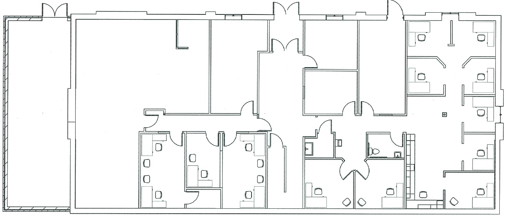

In the left hand menu, click on “**Floor Maps”.**  Make sure to set the location level to be “**1st Floor**”.    
 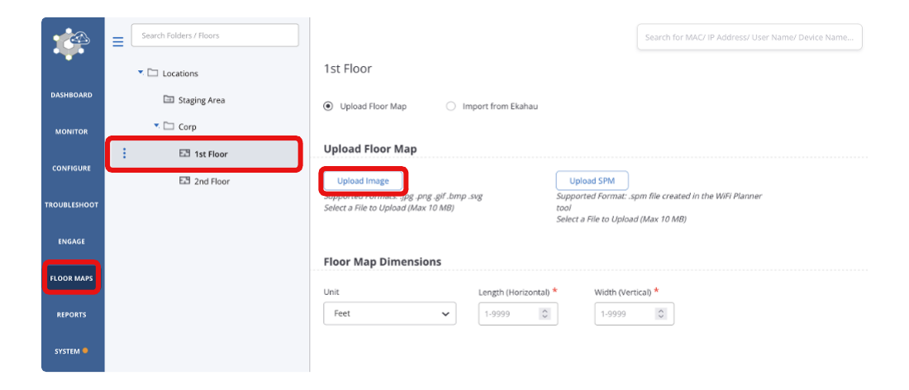

Utilize the file provided by the lab guide link for the floor plan image.

Enter floor name as “**1st Floor”,** click the **“Upload Image**” button to import the floor plan image, and use the following dimensions:  Floor Plan Dimensions: Unit: **Feet**, Length: **120**, Width: **50**

Click **“Save”** at the bottom of the screen.

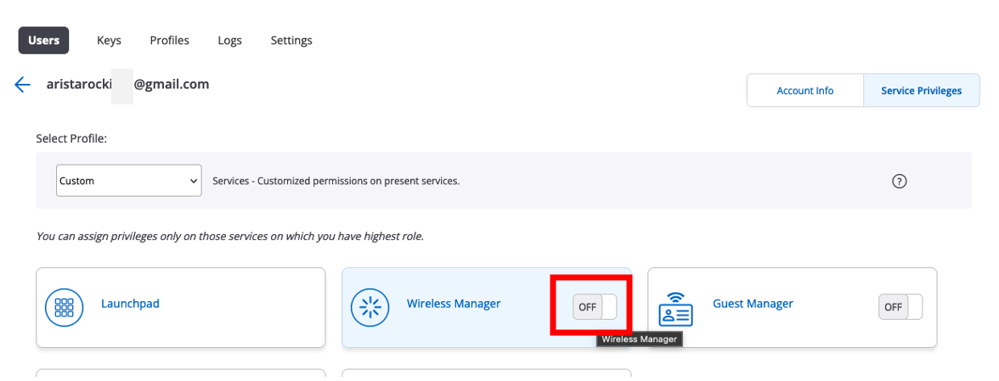

Next, drag the AP onto the map, from the right hand side menu, to see how easy placing APs is. 

If you do not see an AP, it is because your AP is assigned to another location (folder) and you’ll need to move it to the “**1st Floor**” folder (see page 8). Or, you may have the incorrect menu selected in the upper right hand corner of the screen \- choose “**Place Access Points**”.  

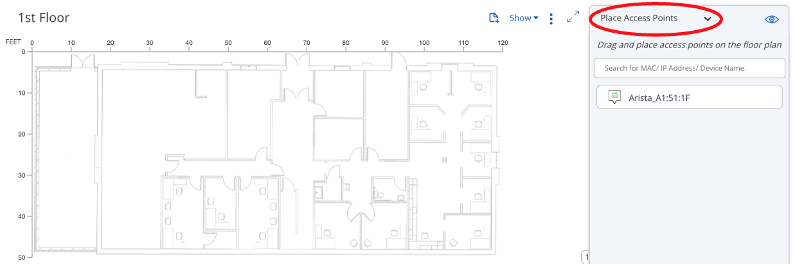

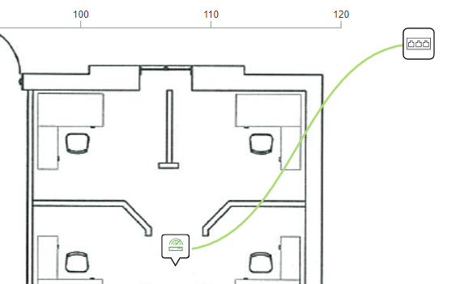
Hover over the AP image to get more information and then right-click on the AP image to see more options.  

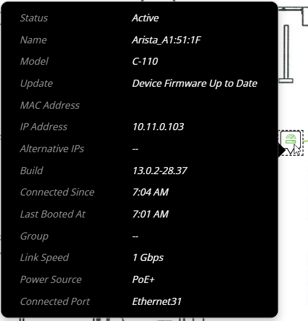               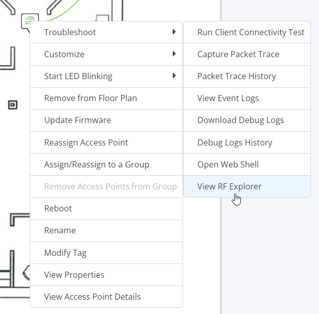

Next, explore the other menu options like **RF Heatmaps** (in the menu on the upper right hand side of the screen).

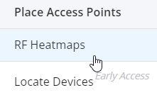

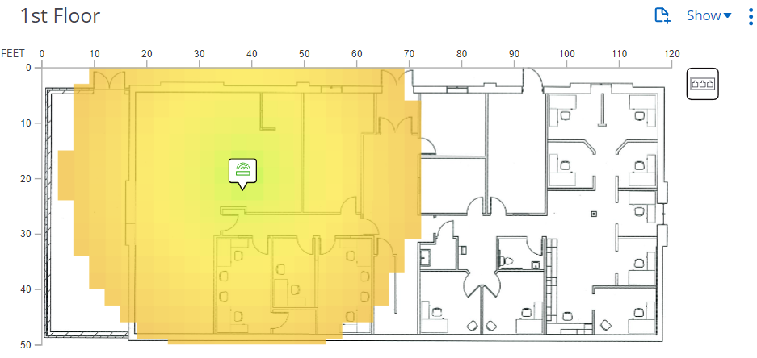

**LAB SECTION COMPLETE**

---
## 12. Dashboard - Client Journey 

Now that a client device is connected to the WiFi network we can use the dashboard functions to gain insight to the client’s journey: 

Within, click on the “**Dashboard**” menu option on the left hand side of the screen.  This opens the Dashboard Overview screen which provides us with numerous metrics for our wireless environment.    
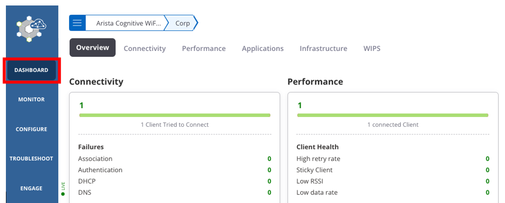  
An example of a busy environment is shown below providing a spot check of healthy areas versus problems and alerts at a glance. 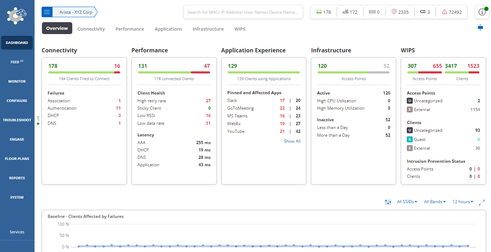

A common request for WiFi administrators is to assist when clients are unable to connect to the network. Let’s use the Dashboard and Connectivity troubleshooting workflows.

Select the **“Connectivity”** tab at the top to view the “**Client Journey**”.   
Your lab environment will report a live view of any successful or failed client associations.  
The example below shows a common mis-configuration of the PSK on the client device (from earlier section)  
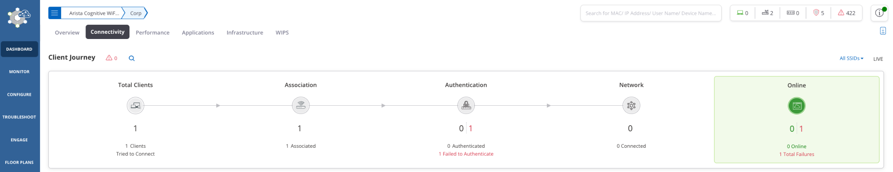

If you hover over the red warning message additional details will appear  
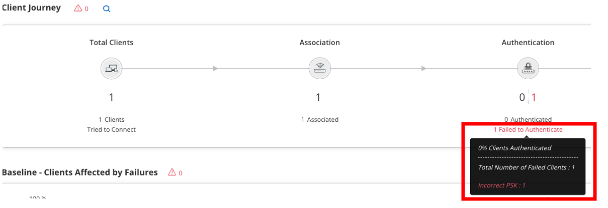 
Here the administrator is directed exactly to the problem.  
Try correcting the PSK to the correct value and viewing the updated dashboard client journey.

Select the Authentication icon to present a list of clients failing at this stage of the journey:  
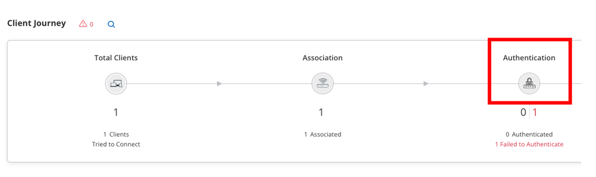

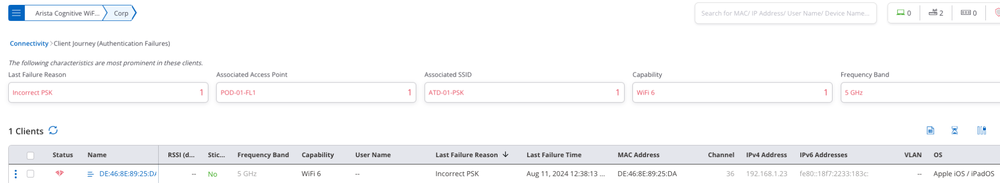 
Client MAC, frequency, failure reason, last failure, and device operating system are all presented to the administrator for troubleshooting.

Select the client device MAC for a timeline view of the client journey, and Root Cause Analysis recommendation.  
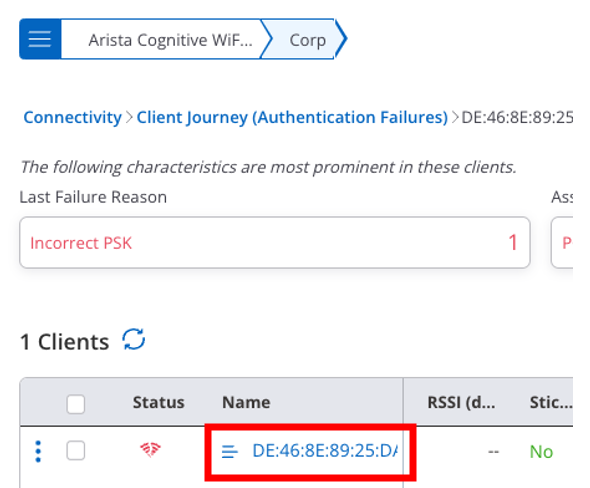 
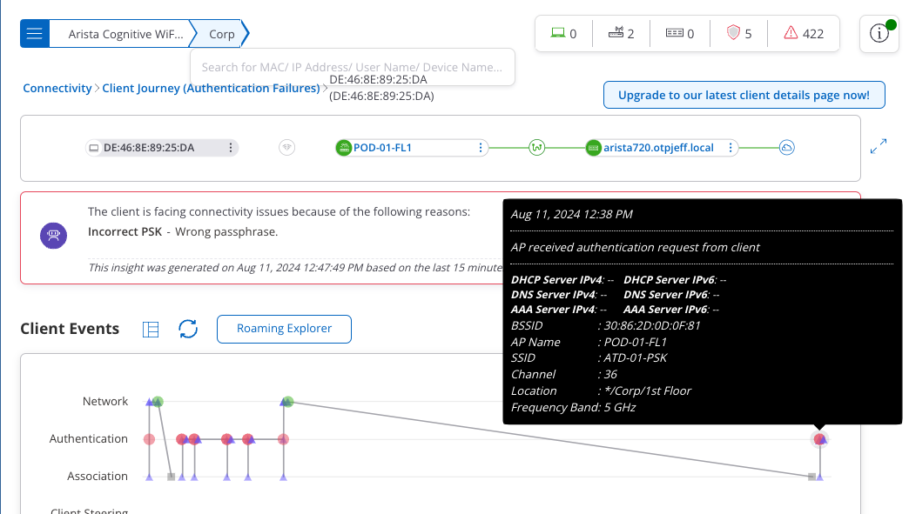

Note that the root cause engine points the user to misconfigured key.

After the client configuration is updated to the correct key, the client Events view will update and show additional metrics and network quality analysis. For example, latency to the DHCP and DNS services is recorded and alerted on if it diverges from baseline.

Hover over a recent successful client association to view metrics on demand

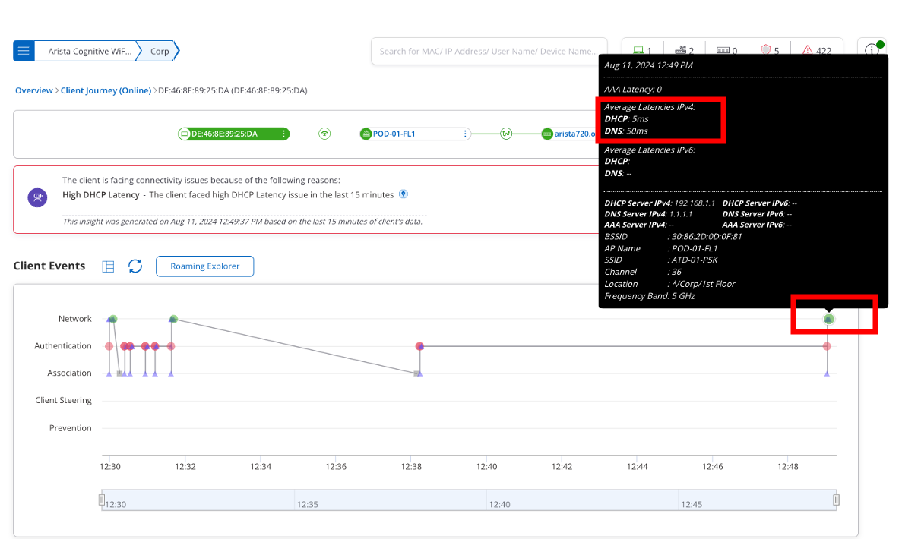

A busy example is shown below highlighting the types of connectivity failures challenging environments may show.

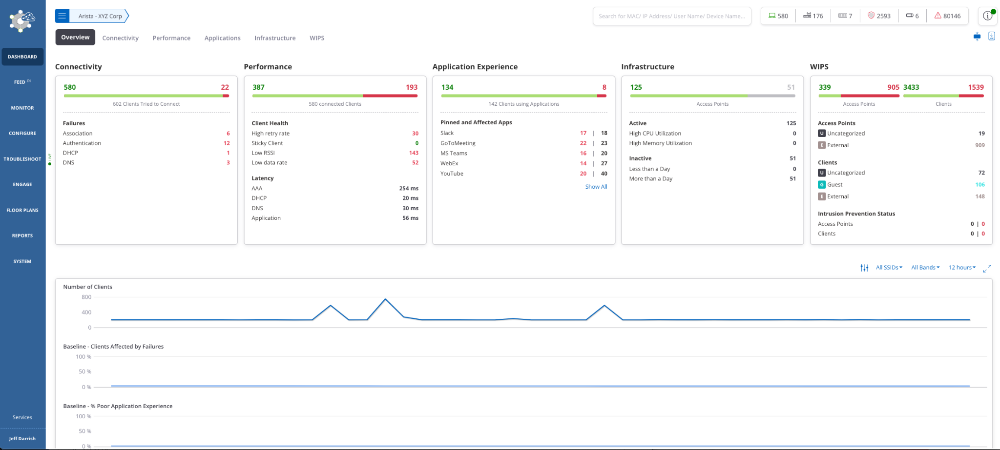

Here you can see the two basic types of issues, issues associating with the WiFi network, and networked application performance issues once they are connected. 

The “**Client Journey**” shows a live view of the users that are currently on, or trying to connect to, the wireless LAN. Browse the dashboard and look around at the baselines, and other data that is displayed.**\*Note: you can choose different baseline time frames \- from 12 hours up to 1 month**.

Here is a sample of what our “**Root Cause Analysis**” engine detection categories are which will ultimately populate the data in the “Client Journey” section:

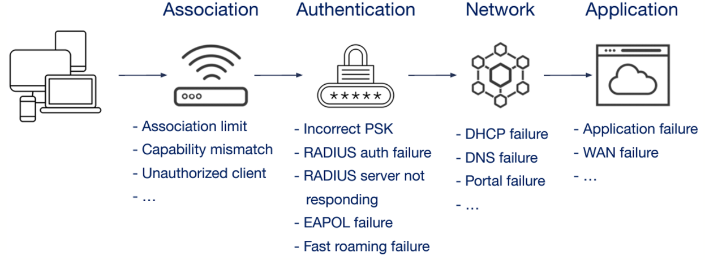

Here is some more information on the root cause analysis engine:

* RCA App Note [https://www.arista.com/assets/data/pdf/Whitepapers/Arista-RCA-App-Note.pdf](https://www.arista.com/assets/data/pdf/Whitepapers/Arista-RCA-App-Note.pdf)

Next, click the back button in your browser to return to the main Dashboard page, then click on “**Performance”** in the menu at the top of the screen

The performance dashboard shows you clients that may be having a sub optimal WiFi experience, and the average latencies for network activities like RADIUS, DHCP, and DNS.

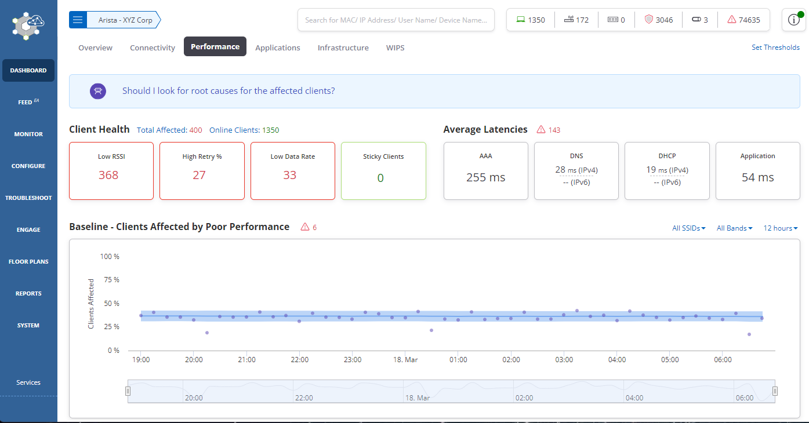

Next, click on “**Applications”** in the menu at the top of the screen.

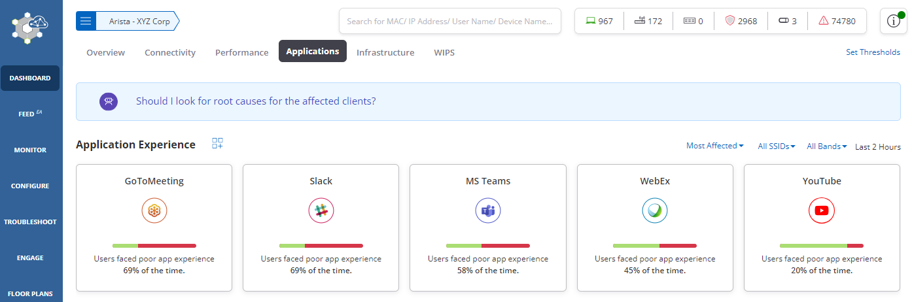

Arista CloudVision CUE leverages CloudVision’s data lake architecture with streaming telemetry, elastic cloud services, and intelligent Access Points, to offer next generation AI enabled troubleshooting workflows, such as:

* Network Baselining \- Baselines network behavior and automatically detects and highlights anomalies, using ML algorithms.  
* Root Cause Analysis Engine \- Automatically detects and classifies Wi-Fi clients’ connection failures and pinpoints the root cause in real-time.  
* Single Client Inferencing \- Identifies clients facing poor QoE, based on RF, network and application KPIs and performs root cause analysis as well as providing remediation recommendations for specific clients.  
* Automatic Packet Capture \- Proactively captures packet traces to help diagnose problems; traces are stored alongside related failures or symptoms to simplify troubleshooting later.  
* Client Emulation and Network Profiling \- Takes advantage of the multi-function radio, present in most Arista Wi-Fi APs, turning it into a client to run a wide variety of tests and proactively identify problems before users do.

For more information on the “**Application Experience**” that we use to determine the experience users have with these common real-time business applications: 

* Talk on QoE for conferencing apps

  [Classifying Voice and Video Experience in Wi-Fi |  WLPC Phoenix 2018](https://www.youtube.com/watch?v=C0sRkuCtUAU)

* Talk on QoE for web (TCP) apps

  [Web QoE: App Performance in WiFi Networks | WiFi-KS](https://youtu.be/PQLBE_I6__Q)

* QoE Whitepaper

[Arista whitepaper on App QoE](https://www.arista.com/assets/data/pdf/Whitepapers/Arista-Application-QoE.pdf)

**LAB GUIDE COMPLETE**

## Additional Information
### Accessing CV CUE
Prerequisites: The Arista Wireless AP management plane (CUE) is hosted within Arista’s public cloud presence, worldwide.  In order to complete this lab section, a default gateway is preconfigured by event staff to facilitate internet connectivity.

For more information on the TCP/UDP ports and protocols involved for management functions, see the links below:  
[https://wifihelp.arista.com/post/access-point-wireless-manager-communication](https://wifihelp.arista.com/post/access-point-wireless-manager-communication)  
[https://wifihelp.arista.com/post/tcp-and-udp-ports-used-by-arista-wi-fi-products](https://wifihelp.arista.com/post/tcp-and-udp-ports-used-by-arista-wi-fi-products)

### Add a User and Assign Privileges 

First, use the Admin menu to add a user.

Click on the **Admin** Tab at the top of the Launchpad window:

Overview of Launchpad Admin menu:

* **Users** \- Assign Access to users with different access levels as well as to specific folders  
* **Keys** \- Used with API integrations  
* **Profiles** \- Defines Access levels to CV-CUE, LaunchPad, and Guest Manager  
* **Logs** \- Download User Action Logs  
* **Settings** \- Lockout Policy, Password Policy, and 2-Factor settings

CloudVision CUE authenticates users via SAML directory integration or via the Launchpad identity providers. These can be customized with local users in Launchpad or directory single-sign-on users.

[https://arista.my.site.com/AristaCommunity/s/article/Integrating-Third-Party-SAML-Solution-Providers-with-Arista-CV-CUE](https://arista.my.site.com/AristaCommunity/s/article/Integrating-Third-Party-SAML-Solution-Providers-with-Arista-CV-CUE)

Under the Admin tab, Users section, Click **New User**

**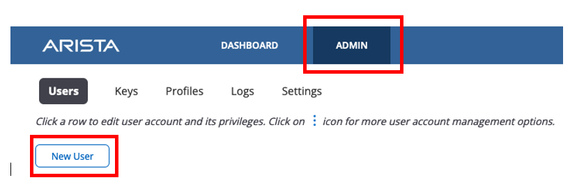**

Let's create a fake user as an example. Complete at least the following fields with false information: **Login ID**, **Email address**, **first name**, and **timezone** then click **Save in the lower right**. 

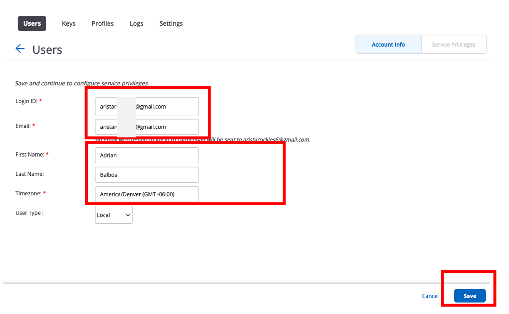 
When you click Save, a welcome email message will be sent to the user with an access link. Next let’s assign privileges to the newly created user.

### Assign User Privileges 

Click **Service Privileges**   
**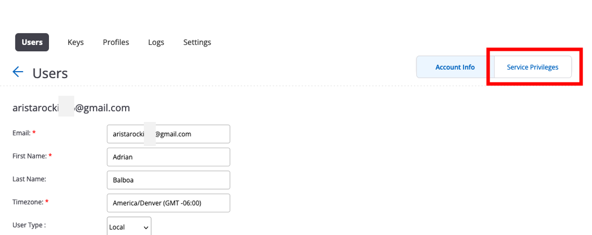**  
And click the toggle to the right of **Wireless Manager** to enable this service for the newly created user.  

* Set User Role: **Viewer**  
* **Check the boxes for  Wi-Fi Access Management** and/or **WIPS Management**.  
* **Select the default top level locations**

**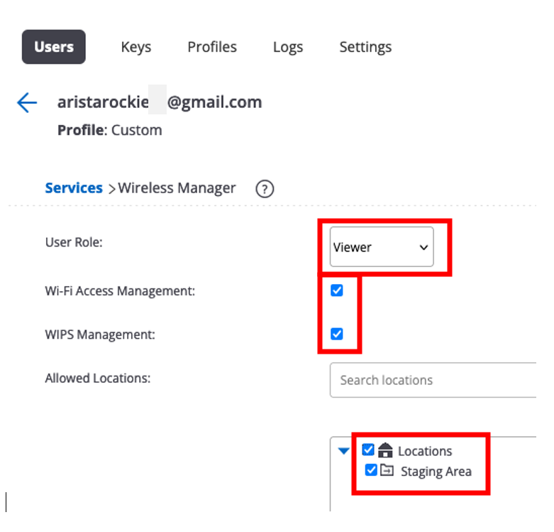**  
**Click Save** to save the user permissions 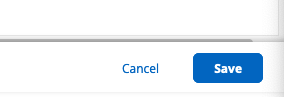

Click **Users** to return to the list of all users.

Click the 3-dots icon next to the newly created example user and click Lock / Unlock to toggle whether this user is allowed to log in  
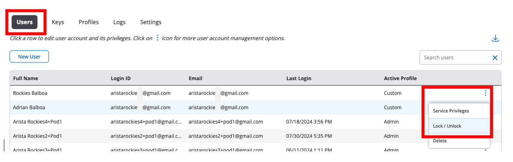

Delete the example user by selecting the 3-dots again

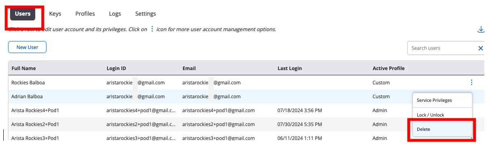

Click **Yes** to confirm the prompt  
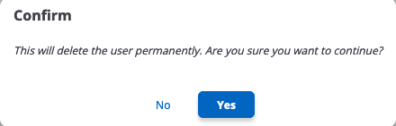

Click **Settings** to view additional authentication configuration options such as 2-Factor Authentication and password policies:  
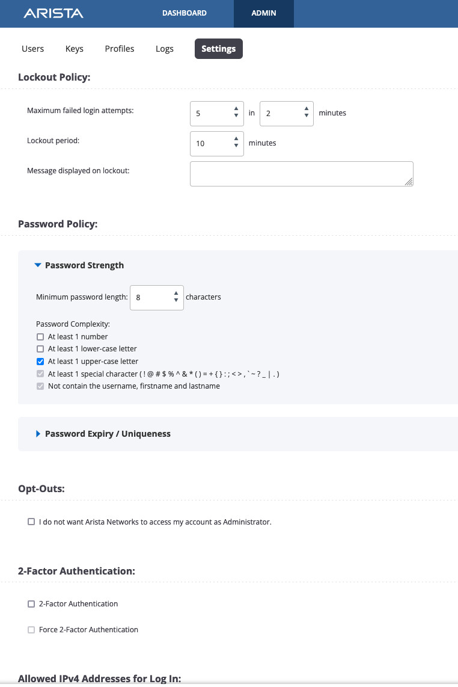

Do not make any further changes in the Settings menu.