# Campus B-02 Wireless Lab Guide WiFi Guest Access and WIPS  

     

**Links:**

1. This Lab Guide:  
   *  [https://github.com/arista-rockies/Workshops/tree/main/Campus](https://github.com/arista-rockies/Workshops/tree/main/Campus)  
2. Lab Floor Plan Download:  
   * [https://tinyurl.com/wififloorplan](https://tinyurl.com/wififloorplan) \[Arista-rockies Github\]

## Table of Contents

1. Arista WiFi Solution Diagram
2. Log in to CV-CUE CloudVision Cognitive Unified Edge	
3. Creating a Guest Captive Portal	
4. WIPS Wireless Intrusion Prevention System	
    * WIPS Classify and Prevent individual client	

## Arista WiFi Solution Diagram  

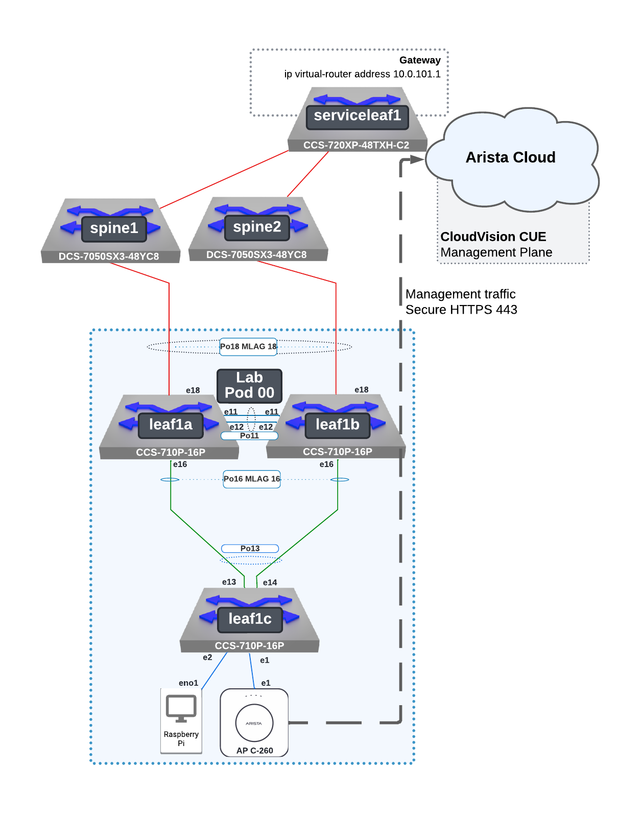

## 1. Log in to CV-CUE CloudVision Cognitive Unified Edge 

Go to the Arista GUI via: [https://launchpad.wifi.arista.com/](https://launchpad.wifi.arista.com/)

User Login is: *\[Provided by event staff\]*  
User Passwords are: *\[Provided by event staff\]*  

Click **Sign In**

Within the Launchpad Dashboard tab:

**Select CV-CUE (CloudVision WiFi).** This is the WiFi management and monitoring application.

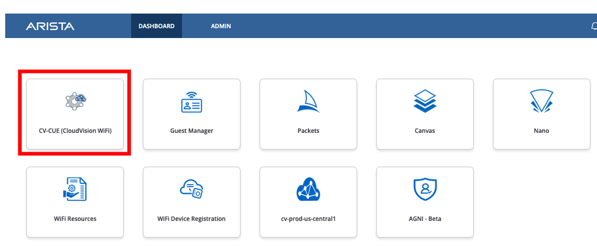

## 2. Creating a Guest Captive Portal 

CloudVision CUE allows captive portal authentication using public cloud identity providers, social media, or your organization's own directory through SAML integration.

For more information about integration of a SAML identity provider reference this link:  
[https://wifihelp.arista.com/post/saml-integration-with-captive-portal](https://wifihelp.arista.com/post/saml-integration-with-captive-portal)

Let’s now create another SSID for guest access with a captive portal page.

Ensure the Corp folder is selected, then add a Guest SSID at this level using:   
**Configure** / **WiFi** / **Add SSID** 

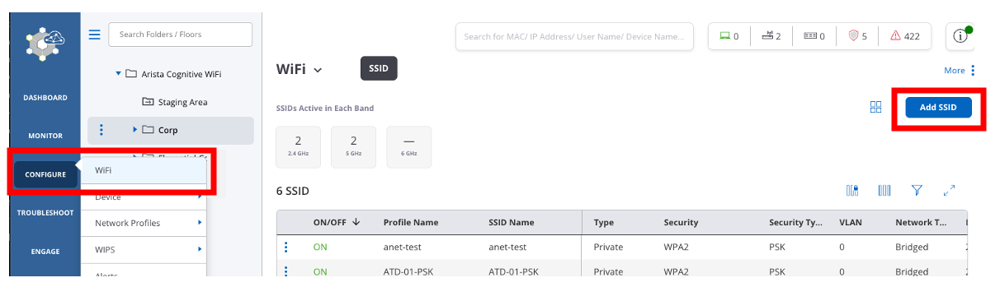

Create a Guest SSID: **LAB-\#\#-GUEST (**where **\#\#** is a 2 digit character between 01-20 that was assigned to your lab/Pod) Select SSID Type: **Guest**  
**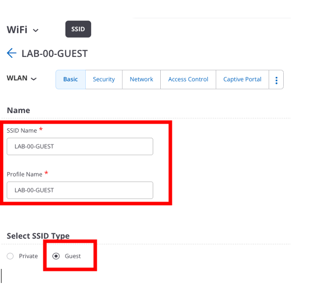**

Within Security Tab, Leave the default to Open  
**Security \- Open**  
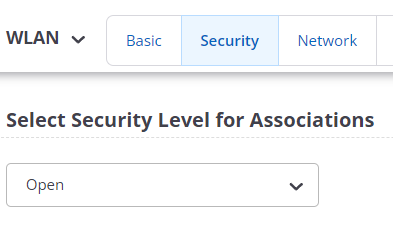**

**Network Tab:**  
VLAN ID: **0**  
Network Mode: **Bridged**   
**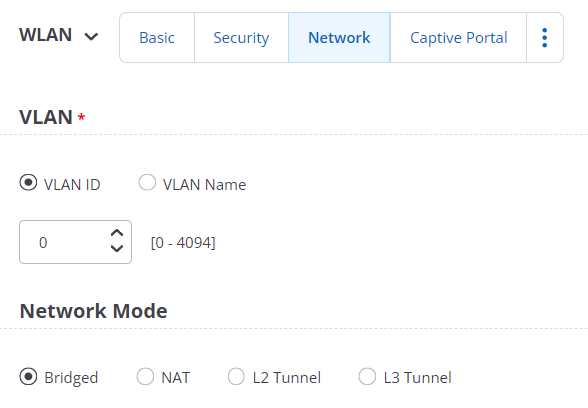**

**Access Control \- Select Client Isolation**  
**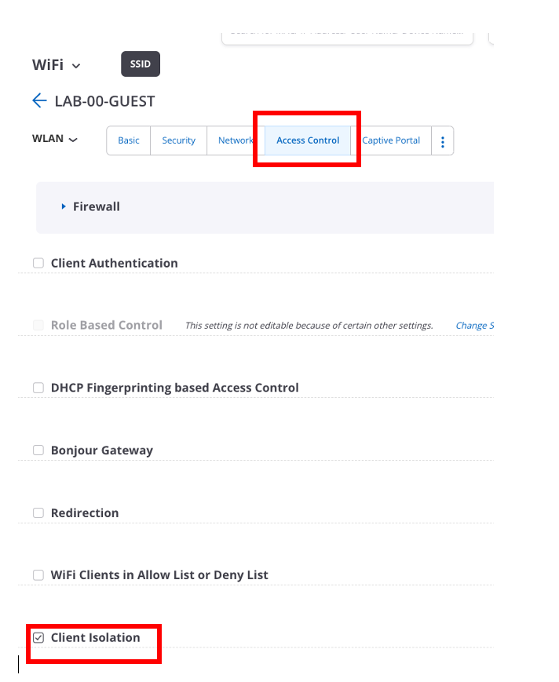**

[**Client Isolation \- Additional Info**](https://arista.my.site.com/AristaCommunity/s/article/Managing-Inter-Client-Communication-on-WiFi-Access-Points#Comm_Kna_ka05w000000tkXoAAI_83)

Next, select **Captive Portal**  

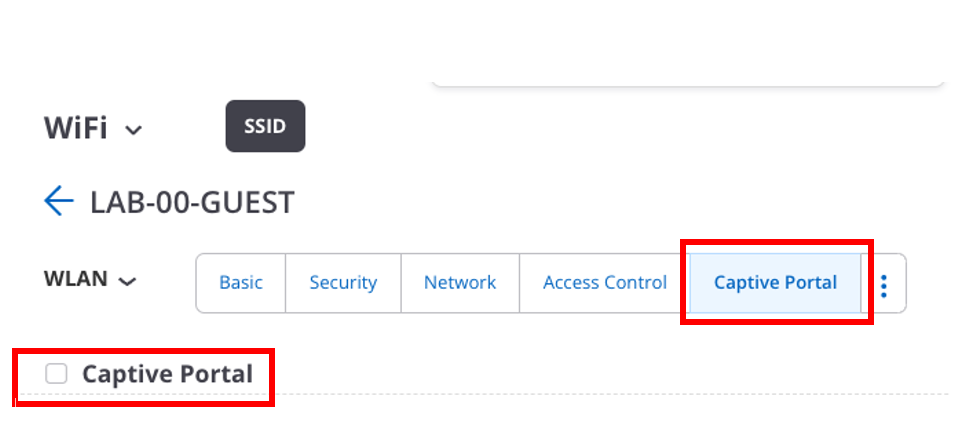

Next, let’s edit the splash page.  Hover over the Splash page and select **Edit.**  

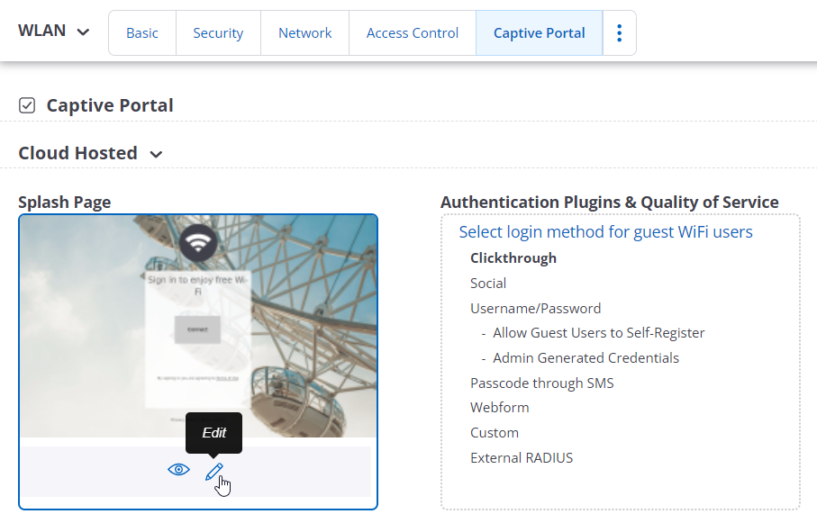

You can customize the Splash Page with the Pencil Edit icon. We will keep the defaults for this lab. 

Next, click  **Select login Method for Guest WiFi Users**

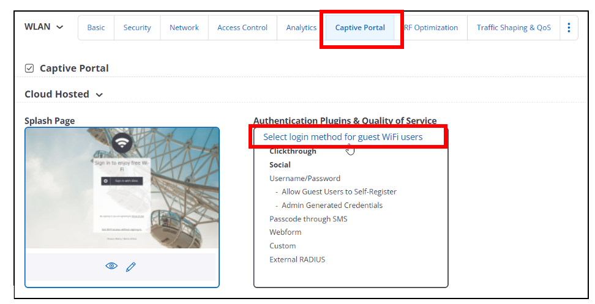

Let’s create a way to allow users to create their own username and password as well as an option to create a bulk import of users.

Select **Username/Password** and then **Allow Guest Users to Self-Register** then **Save** within the Plugins & QoS Menu.  

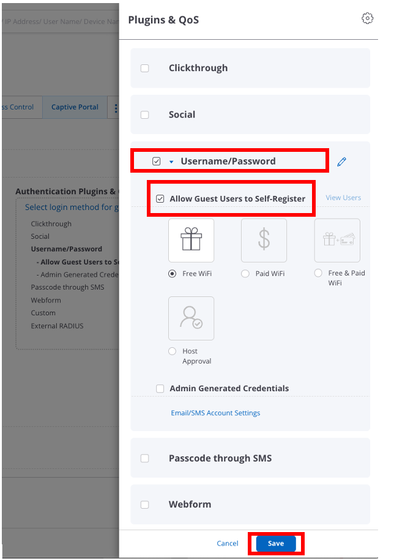

**Save at the bottom** within the Plugins & QoS Menu. 

You have now staged all the configuration for a simple guest portal. 

CloudVision CUE allows the administrator to add users for guest wireless access through a number of secure identity provider options, such as Social, custom webform, and Admin Generated Credentials.  
We will explore centralized network access control for secure and guest user access as a focus during the AGNI Lab sections.

For more information here is the [Guest Manager User Guide \- PDF](https://www.arista.com/assets/data/pdf/user-manual/um-books/WiFi-Guest-Manager-User-Guide.pdf)

For now Save the changes only, we will explore how to turn on the Guest SSID through another screen:

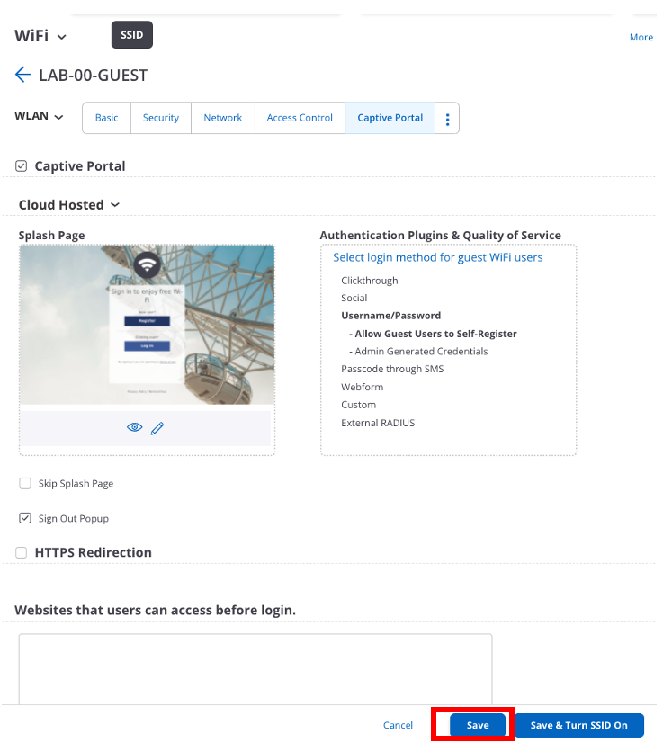

Finally, let’s see how to enable this guest SSID among the existing ones already configured:

The view below is the Table View mode. Select the Table View icon or the Card View icon in the upper right corner to change views if needed.

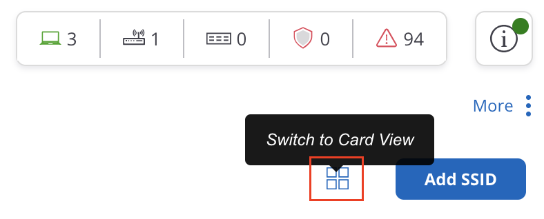

Go to **Configure**, **WiFi** (ensure you have selected the Corp folder in the hierarchy)  
Find the Guest SSID in the list and select the **3-dots menu** to “**Turn SSID On**”  

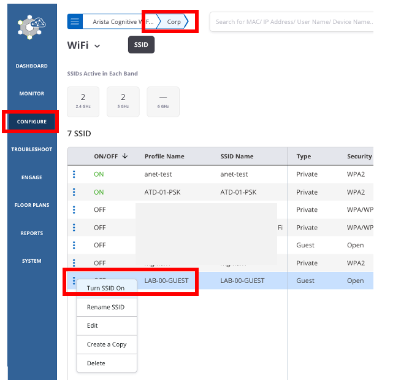

When presented with the Turn SSID On dialog, **Uncheck 2.4 GHz** to disable that frequency. And click **Turn SSID On**.  

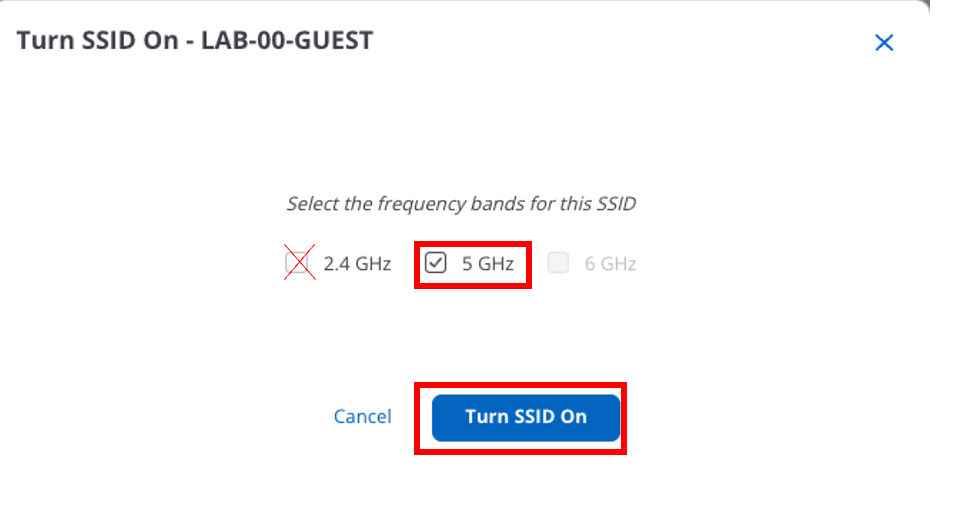 

After a few moments, your guest SSID should become available. You can test connecting the guest wireless network and should see the default splash screen to self register or log in.

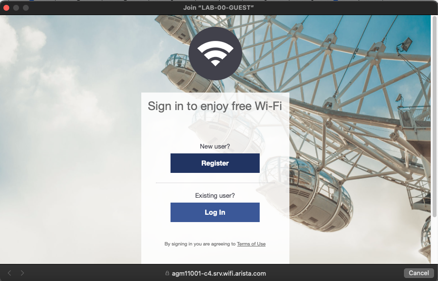

Lab section complete.

## 3. WIPS Wireless Intrusion Prevention System 

Arista Wireless Intrusion Prevention System (WIPS) leverages RF broadcast and protocol properties including packet formats like probe requests and beacons common to all 802.11 standards(including 802.11ac and 802.11ax) to detect and prevent unauthorized access.

For more information about how Arista’s WIPS feature works, refer to this whitepaper: [https://www.arista.com/assets/data/pdf/Whitepapers/Arista-Marker-Packet-Whitepaper.pdf](https://www.arista.com/assets/data/pdf/Whitepapers/Arista-Marker-Packet-Whitepaper.pdf)

Wi-Fi threats include an ever changing landscape of vulnerabilities, such as:

* Rogue APs  
* Unauthorized BYOD Client  
* Misconfigured APs  
* Client misassociation  
* Unauthorized association  
* Ad-hoc connections  
* Honeypot AP or evil twin “Pineapple”  
* AP MAC spoofing  
* DoS attack  
* Bridging client

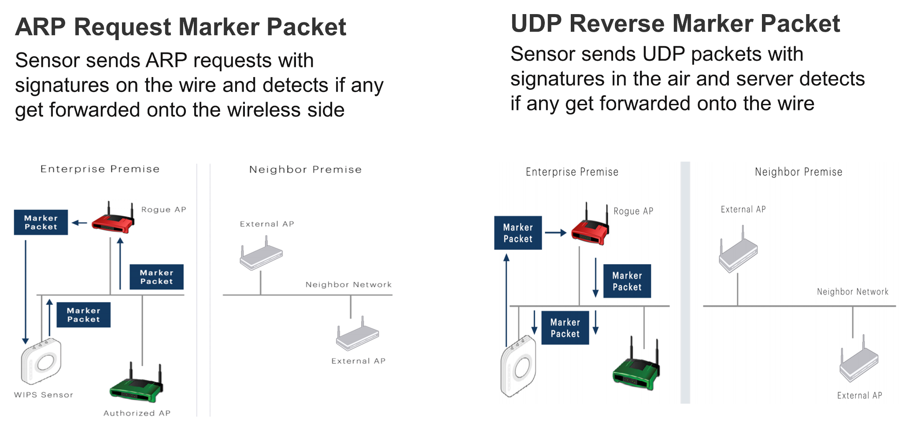

In the menu on the left hand side of the screen, hover your cursor over “**Monitor”** and then click **“WIPS”**.  Now click on **“Access Points”** and “**Clients**” in the menu at the top of the screen and explore if any Rogue APs or Clients are connected to other APs in the area.

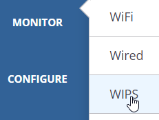

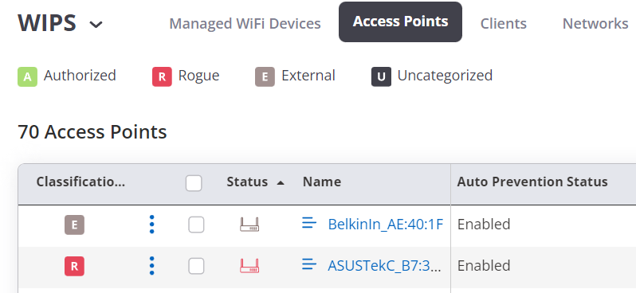

Access points that have been detected by WIPS but are not managed within Arista CV-CUE, they are designated as Rogue or External Access Points.

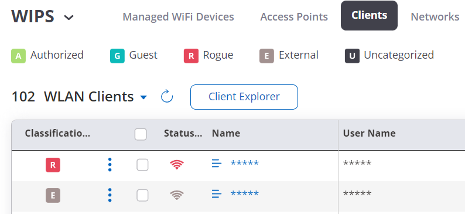

Next, let’s explore the information we can gather about the wireless environment using Arista’s WIPS.  
Select **Monitor,**  **WIPS**:

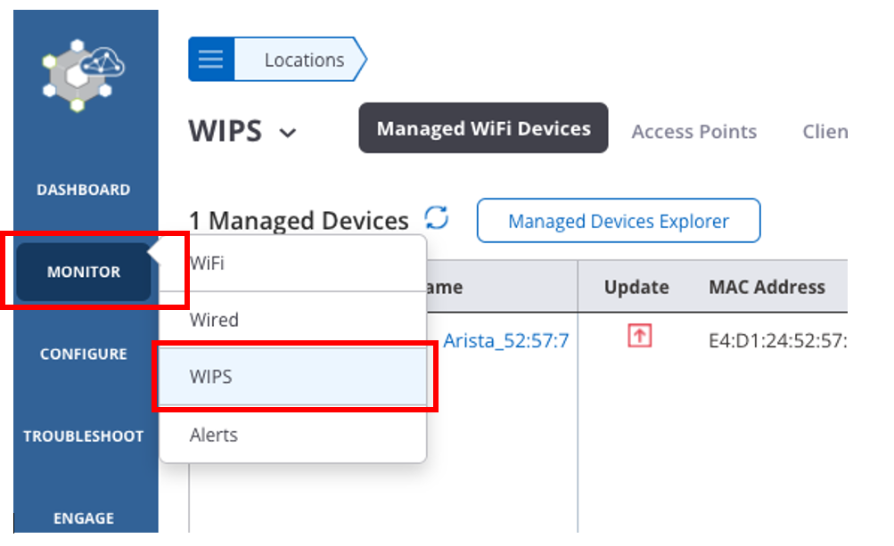

In the simple lab environment, only your pod’s single AP is part of your managed wireless infrastructure. All of the other access points and clients on the network are like crowded neighbors or businesses in a shared office work space.

Under **Monitor, WIPS, Access Points** you can see all of the detected Rogue Access points. From this screen you can reclassify, set auto-prevention, add to ban list, name or move the AP. 

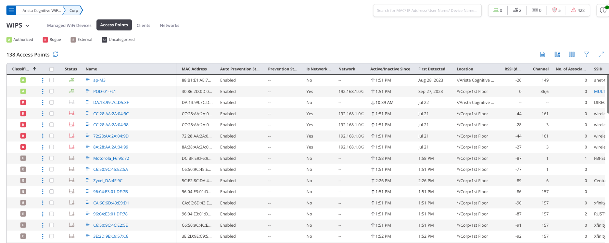

Additional information about WIPS AP classification can be found here:  
[https://www.arista.com/en/ug-cv-cue/cv-cue-wireless-intrusion-prevention-techniques](https://www.arista.com/en/ug-cv-cue/cv-cue-wireless-intrusion-prevention-techniques)

**Authorized APs**  
Access Points (APs) that are wired to the corporate network and are compliant with the Authorized Wireless LAN (WLAN) configuration defined by the Administrator in CV-CUE are classified as Authorized APs. Typically, these will be Arista APs, but the administrator can configure the Authorized WiFi policies for any AP vendors.

**Rogue Access Point**  
APs that are wired to the corporate network and do not follow the Authorized WiFi configuration defined in CV-CUE are classified as Rogue APs.  
Even if this AP is disconnected from the network, it will continue to be classified as a Rogue. These APs are a potential threat to the corporate environment and can be used for intrusion into the corporate network over Wi-Fi. It is recommended to enable Intrusion Prevention for Rogue APs so that Wi-Fi communication with these APs is always disrupted. Using the Location Tracking ability of Arista WIPS, Rogue APs should be tracked down and physically removed from the network.  
Rogue APs are displayed in Red rows on the console.

**External Access Point**  
APs that are not wired to your corporate network are classified as External APs.  
Through the connectivity tests performed by the WIPS Sensors, Wireless Manager is able to determine that these APs are not connected to the wired network. These are neighboring APs that share the same spectrum as the Authorized APs and may cause interference with your Authorized WLAN. A site survey and channel optimization should be performed to reduce radio interference from the External APs. These APs are not always a threat and hence they should not be quarantined/prevented by default, as it would disrupt neighboring Wi-Fi activity. Intrusion Prevention policies can be configured to prevent Authorized clients from connecting to External APs.

A Rogue Access point can be reclassified, moved or named from the 3-dots menu for each detected AP.

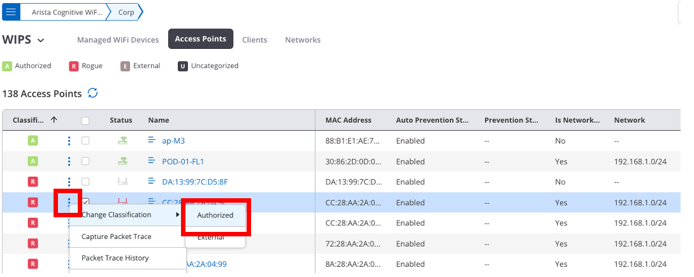

Within an existing campus WiFi environment or one with a mix of wireless solutions, these discovered APs can be explicitly allowed to show the most accurate security profile.

For this lab you do not need to authorize any APs.

### WIPS - Classify and Prevent individual client 

Next, let’s use the WIPS system to identify and prevent an example problematic client from connecting to your network.

Within **WIPS**, **Clients** Menu.  
Find your smartphone device connected to the previous Lab PSK. Reconnect it now to the PSK SSID, if it has been disconnected.

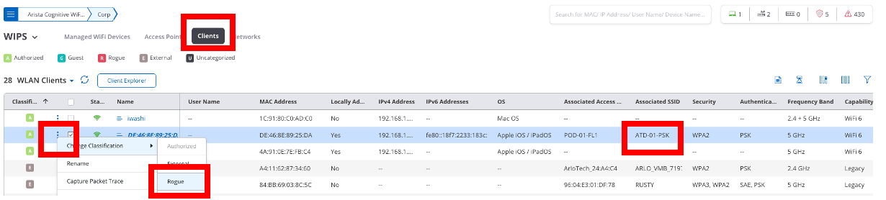 
Since this client is associated with the correct PSK for the SSID, it is automatically classified as Authorized.

Next, click the 3**\-dots menu** for the device, **Change Classification**, **Rogue**  
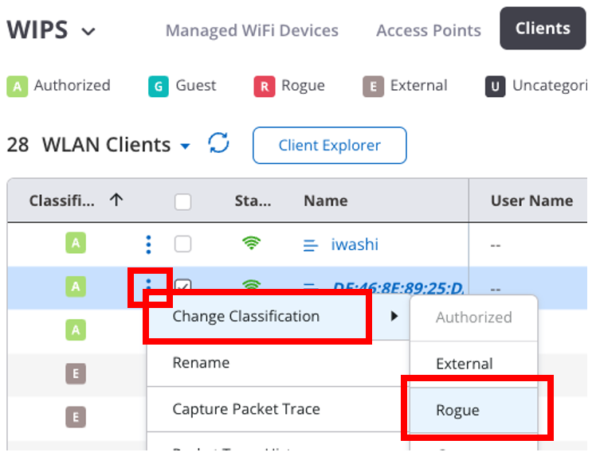

Now, **sort the clients menu by Classification column (left)** and find the red marked Rogue device.

Next, Select the **3-dots menu** for the Rogue client and click “**Prevent This Device”**

# 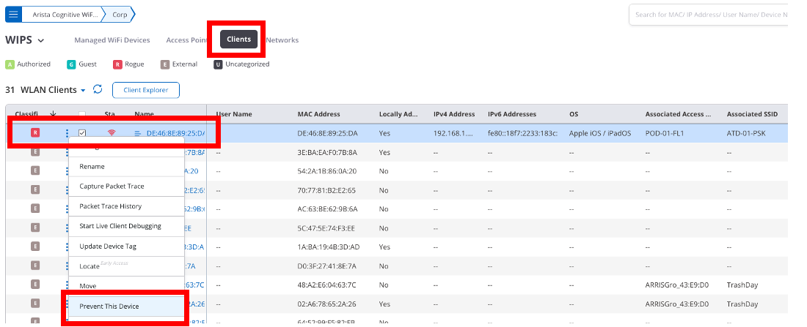

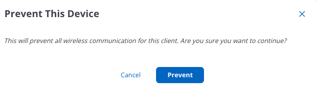 
Click Prevent to start the WIPS prevention mechanism to disrupt the selected client from sending and receiving traffic.

Try to connect to a public website with your test client device with the prevention setting enabled versus disabled (be sure to disable backup wireless/LTE radios).   
The test device should fail to connect to other devices through the protected WiFi network when prevention is active.

When you are finished, **STOP the client prevention**   
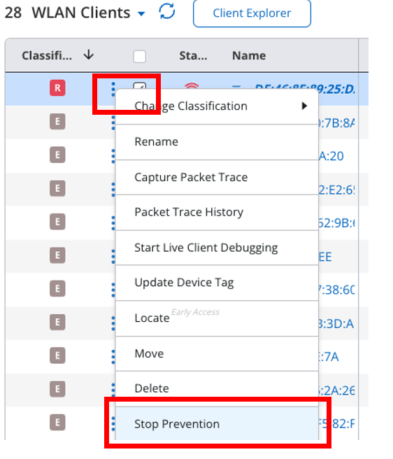

🛑   –  When you are finished, **STOP the client prevention** so that you can use this test device in upcoming labs, optionally.🛑   
 

**Lab guide complete**

