# Campus B-03 Wireless Lab Guide SSU Firmware Upgrade # 

   
**Links:**

1. This Lab Guide:  
   1. [https://github.com/arista-rockies/Workshops/tree/main/Campus](https://github.com/arista-rockies/Workshops/tree/main/Campus)  
2. Lab Floor Plan Download:  
   1. [https://tinyurl.com/wififloorplan](https://tinyurl.com/wififloorplan) \[Arista-rockies Github\]

**Table of Contents**

1. Lab Topology
2. Intro to Arista Smart System Upgrade (SSU)	
  * Prerequisites	
  * Caveats
3. Lab Start: Perform the Arista SSU on the leaf1c switch
  * Lab Conclusion


## 1. Full Lab Topology

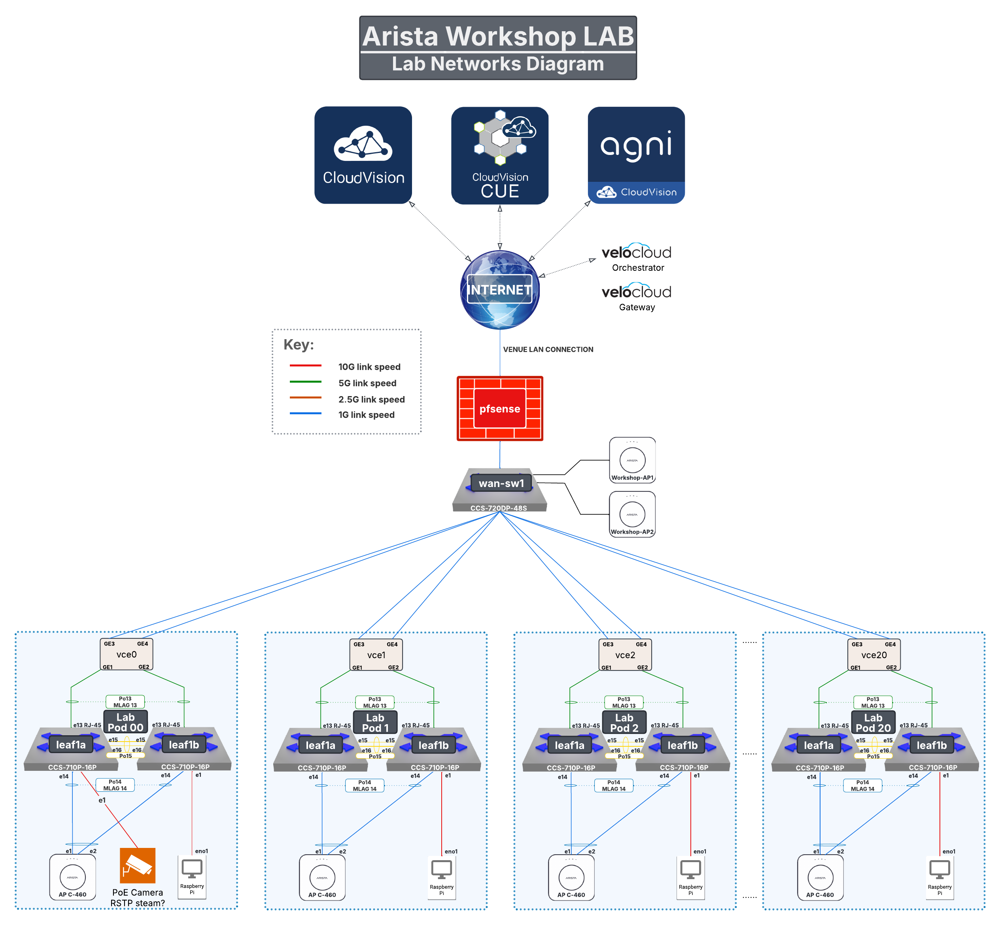


## Pod Topology


## 2.Intro to Arista Smart System Upgrade (SSU) 

SSU, or Smart System Upgrade, is a feature to minimize traffic loss when upgrading from one SSU-supported EOS version to a newer SSU-supported EOS version.  SSU is also referred to as ‘hitless’ upgrades.  The SSU feature allows a switch to maintain packet forwarding performed by the switch ASIC while the management plane performs an OS upgrade.  

Additional information about this feature can be found here  
[https://www.arista.com/en/support/toi/eos-4-15-2f/13710-hitless-ssu](https://www.arista.com/en/support/toi/eos-4-15-2f/13710-hitless-ssu)

In our workshop lab topology, pictured on the previous page, you will see that leaf1b in each pod is directly connected to the RaspberryPi client.  Traditionally, a firmware upgrade on leaf1b in the pod would cause the raspberry pi client to lose network connectivity.  In this lab, we will use Arista SSU on the leaf1b switch in your pod to perform a firmware upgrade without causing network connectivity loss on any wired client connected to the switch.  Additionally, we will simulate a failure on leaf1a so that the AP will only have an active connection to leaf1b at the time of the upgrade.  We will demonstrate the AP and wireless clients will not see any loss of network connectivity.

## Prerequisites

* Continuous POE should be configured to maintain POE power delivery to connected devices.  
* Must be running an EOS version that includes the SSU feature.   
* Must be upgrading to a new EOS version that also includes the SSU feature.  
* Spanning-tree must be running in MST mode or disabled. RSTP support is coming soon.  
* Spanning-tree edge ports must have portfast and BPDUGuard enabled.  
* If a switch is running BGP, it must be configured with graceful-restart or BGP routing information will be lost and the ASIC may fail to forward traffic.

## Caveats {#caveats}

* SSU only supports upgrades. Hitless image downgrades are not supported.  
* If a new EOS version includes an FPGA upgrade, the FPGA upgrade will be suppressed.  FPGA upgrades require a full reboot of a switch to apply.  
* Some switch features, when in use, will prevent SSU from starting.  See this link for more details  
  [https://www.arista.com/en/support/toi/eos-4-15-2f/13710-hitless-ssu\#limitations](https://www.arista.com/en/support/toi/eos-4-15-2f/13710-hitless-ssu#limitations)

## 3. Lab Start: Perform the Arista SSU on the leaf1b switch 

Let's begin the hands-on portion of this lab.  SSU can be triggered on the command line, or through CloudVision.  For this lab, we will be triggering an SSU upgrade using CloudVision.

1. Review the current version of software in use on each switch. Go to the Devices \> Inventory section.  

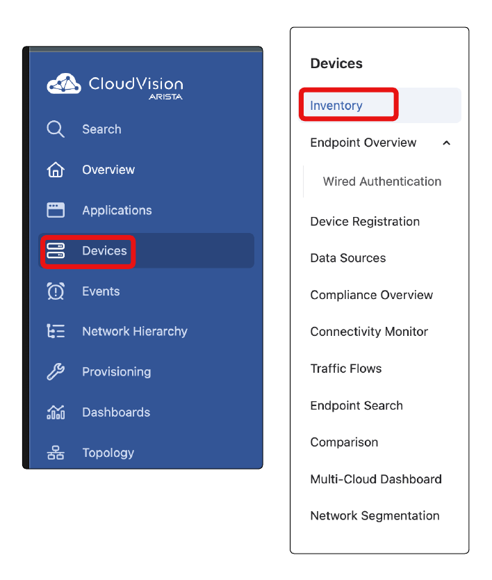 
   
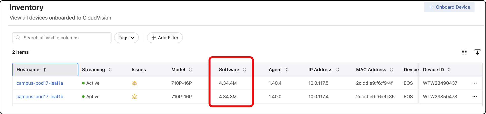

2. *Note that leaf1a and leaf1b are running a different version of code. During this section of the lab, we are going to bring leaf1b up to the same software version as leaf1a. To apply the new version of software to leaf1b we are going to utilize the Software Management Studio. Navigate to **Provisioning \> Studios**.   

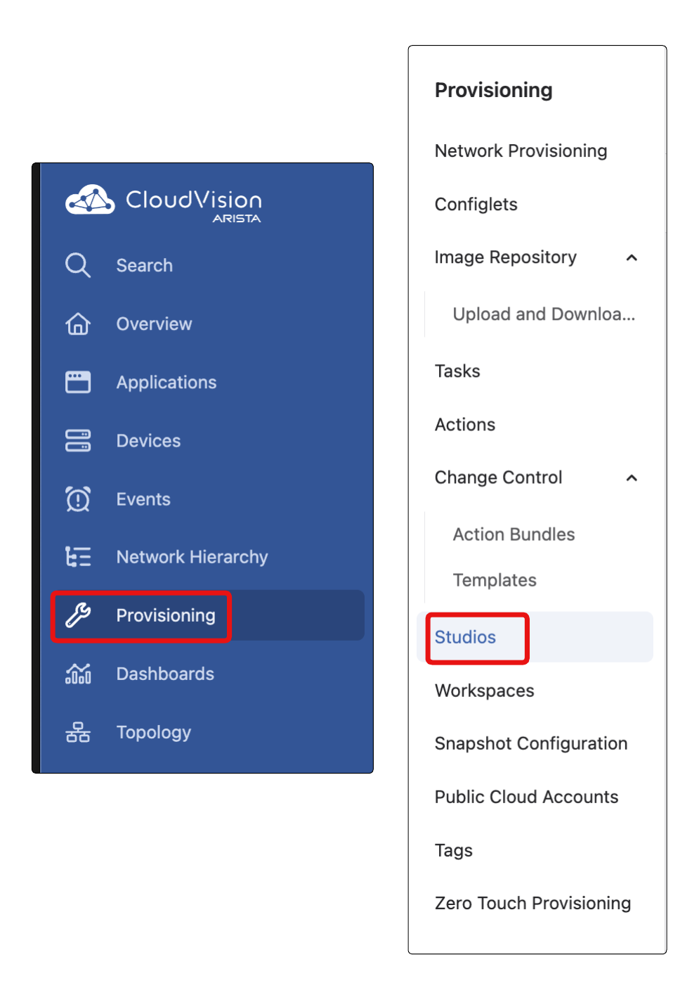 
     
     
3. You will be presented with the Studios landing page where it will display the Essential Studios and the Studios that are actively used in this lab environment. Select the **Software Management** Studio  

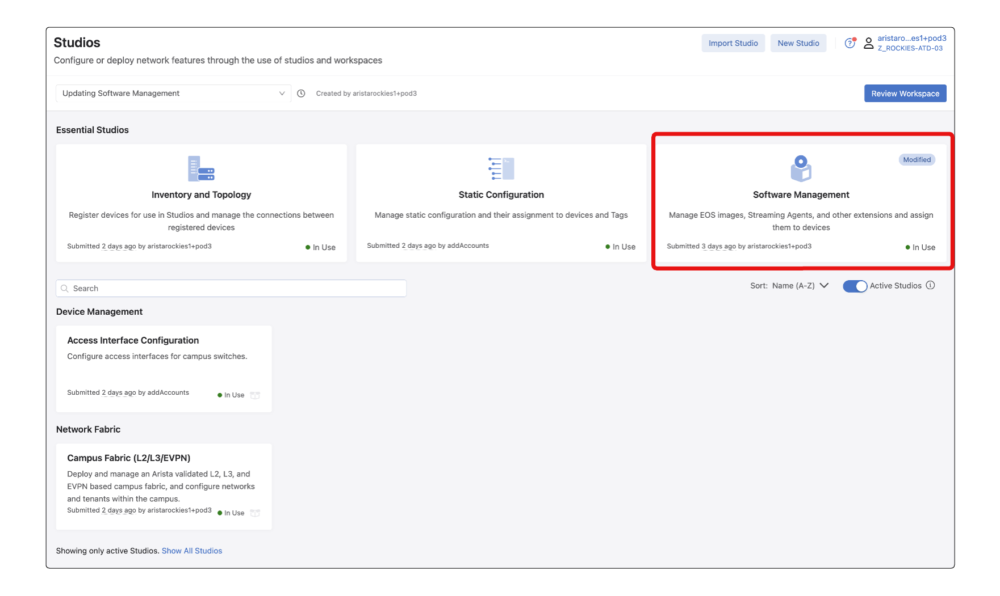

4. Review leaf1a already present in the Studio. We are now going to upgrade leaf1b. Select **Create Workspace**.  

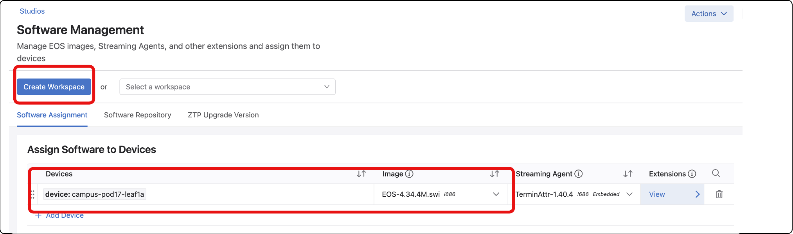
          
5. Name the Workspace **SSU Leaf1b** and select Create  

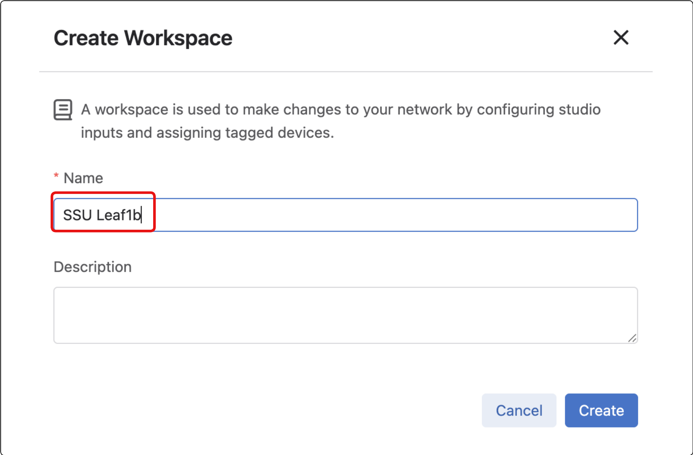 

6. Select **\+ Add Device**

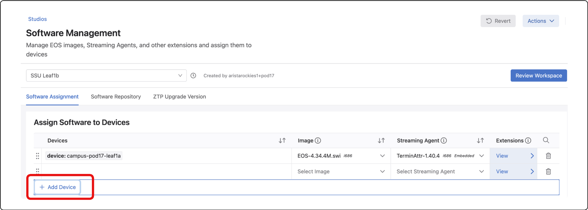

7. Within the Software Management Studio select leaf1b.  
   1. Under the **Devices** section add **device:campus-pod\[POD\#\]leaf1b**.   
   2. Under the Image section select the dropdown for **EOS-4.34.4.1M.swi**. *(The streaming agent will auto-populate with TerminAttr-1.34.)*   
   3. Select **Review Workspace**.

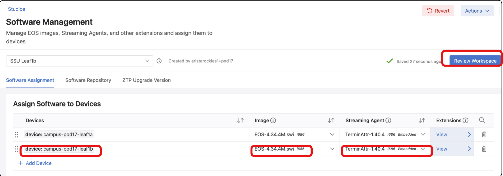

8. Review the pending workspace. Look at the Proposed Software and verify that 4.34.4.1M. Select **Submit Workspace**  

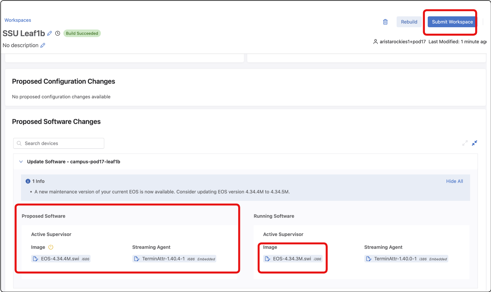 
     
9. Now that you have submitted that workspace, we have added the proposed software image for Leaf1c to the designed configuration. No changes have been made to any device up until this point. Through the change control process we will upgrade the switch to the new version. Select **View Change Control**  

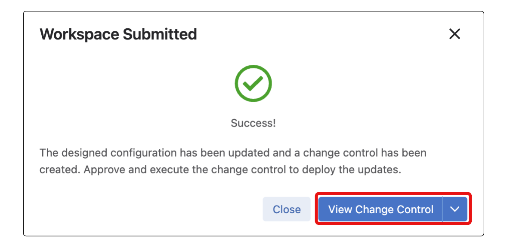  

10. We are now going to set the change control to upgrade the image using the SSU process.   
    1. Select **leaf1b** under Change Control Stages.   
    2. **Select Arguments.**

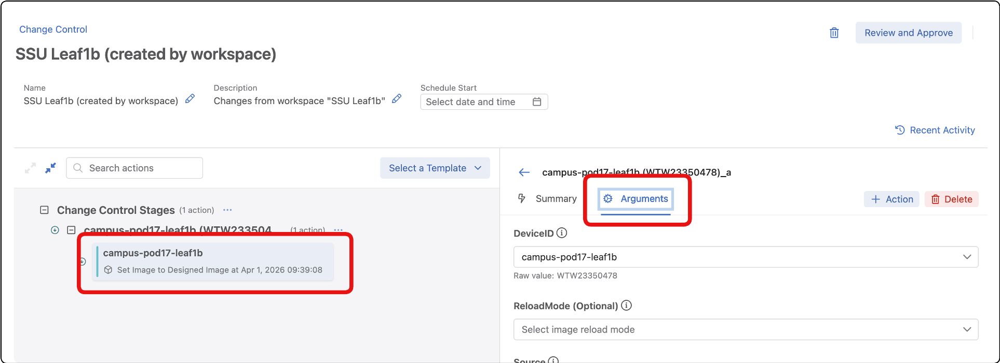

11. Under Arguments populate the following information  
    1. DeviceID \- **campus-pod\[POD\#\]-leaf1b**  
    2. ReloadMode \- from the dropdown select **SSU Only**.   
    3. Source \- **Designed Image**

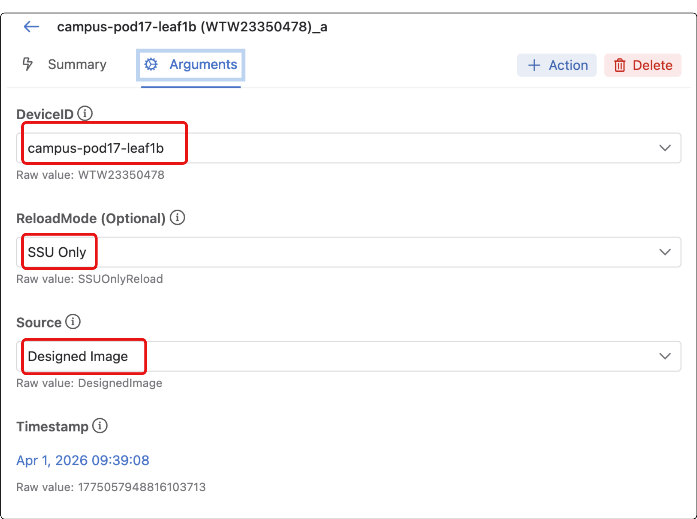

   

12. Before we apply the new firmware, let's start a ping test which will run during the switch upgrade process.  We will see that the ping traffic will continue to flow through the switch even while its software is being upgraded.  
    1. First, please make sure that your laptop is connected to the wireless network called “**ATD-\#\#\-PSK”.** Use the PSK you configured in the previous lab to associate with this wireless network.  
    2. Second, we remove the AP connection to leaf1a to assure we are relying on the switch leaf1b.  Please remove the cable between the AP and laef1a.
    2. Third, open a command prompt (or a terminal window if using a macbook), and issue the command “**ping \-t 10.0.1\#\#.1**” (or the command ‘ping 10.0.1\#\#.1 if using macbook).  Please replace **\#\#** with your pod number.  Now leave this window open for the following steps.  We will see ping packets being sent and received every second.  You are now pinging the gateway IP address for your pod from your wireless device connected to your pods access point.  The ping traffic must traverse the leaf1c switch to reach the gateway.  We should be able to observe how traffic is affected while leaf1c is upgrading during SSU.

13. Return to CloudVision. Select **Review and Approve** 

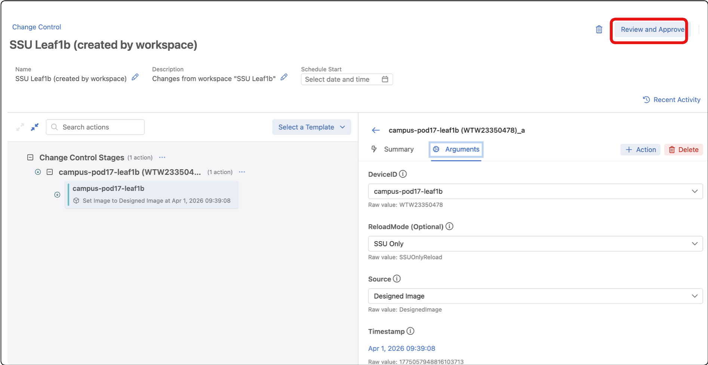 

14. Select **Approve and Execute** 

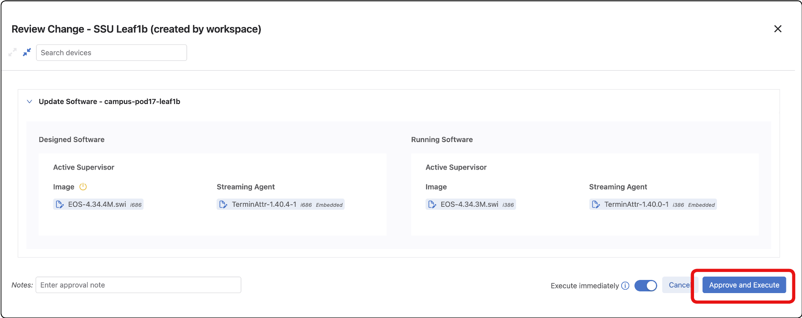 

15. The device is now going to upgrade the image. This can take a few minutes. While the change control is running.  
    1. Select the **Logs** to see details of the change as they’re happening.  
    2. Return to your terminal that is running a continuous ping

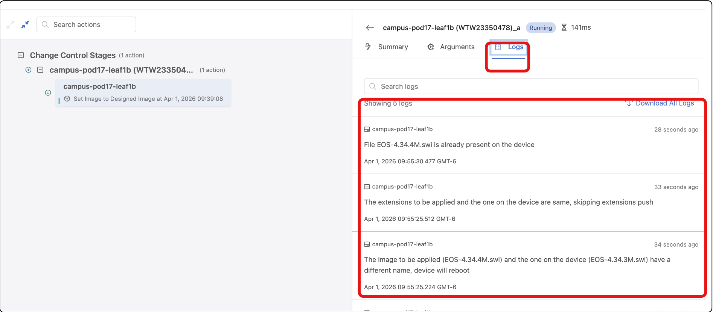

16. As our final step, take another look at the terminal window that was running the consistent pings.  You should see pings continue to flow without issue during the upgrade.  Only towards the end of the process you may see 1 or 2 pings lost as the ASIC reconnects to the updated management plane.

```
nhancock@Nates-MacBook-Pro ~ % ping 10.0.111.1
PING 10.0.111.1 (10.0.111.1): 56 data bytes
64 bytes from 10.0.111.1: icmp_seq=0 ttl=64 time=4.681 ms
64 bytes from 10.0.111.1: icmp_seq=1 ttl=64 time=4.510 ms
64 bytes from 10.0.111.1: icmp_seq=2 ttl=64 time=4.063 ms
64 bytes from 10.0.111.1: icmp_seq=3 ttl=64 time=4.417 ms
64 bytes from 10.0.111.1: icmp_seq=4 ttl=64 time=4.575 ms
64 bytes from 10.0.111.1: icmp_seq=5 ttl=64 time=5.000 ms
... trunkated for brevity
64 bytes from 10.0.111.1: icmp_seq=579 ttl=64 time=3.853 ms
64 bytes from 10.0.111.1: icmp_seq=580 ttl=64 time=3.993 ms
64 bytes from 10.0.111.1: icmp_seq=581 ttl=64 time=4.263 ms
64 bytes from 10.0.111.1: icmp_seq=582 ttl=64 time=6.234 ms
64 bytes from 10.0.111.1: icmp_seq=583 ttl=64 time=4.219 ms
64 bytes from 10.0.111.1: icmp_seq=584 ttl=64 time=3.267 ms
64 bytes from 10.0.111.1: icmp_seq=585 ttl=64 time=3.196 ms
64 bytes from 10.0.111.1: icmp_seq=586 ttl=64 time=3.535 ms
64 bytes from 10.0.111.1: icmp_seq=587 ttl=64 time=4.167 ms
64 bytes from 10.0.111.1: icmp_seq=588 ttl=64 time=3.977 ms
64 bytes from 10.0.111.1: icmp_seq=589 ttl=64 time=4.937 ms
64 bytes from 10.0.111.1: icmp_seq=590 ttl=64 time=4.248 ms
Request timeout for icmp_seq 591
64 bytes from 10.0.111.1: icmp_seq=592 ttl=64 time=4.348 ms
64 bytes from 10.0.111.1: icmp_seq=593 ttl=64 time=4.337 ms
64 bytes from 10.0.111.1: icmp_seq=594 ttl=64 time=3.766 ms
64 bytes from 10.0.111.1: icmp_seq=595 ttl=64 time=5.510 ms
64 bytes from 10.0.111.1: icmp_seq=596 ttl=64 time=4.399 ms
64 bytes from 10.0.111.1: icmp_seq=597 ttl=64 time=4.167 ms
64 bytes from 10.0.111.1: icmp_seq=598 ttl=64 time=4.033 ms
64 bytes from 10.0.111.1: icmp_seq=599 ttl=64 time=3.904 ms

```

## Lab Conclusion

We just observed how Arista SSU allows network connected devices to continue to operate on the network even while an EOS firmware update occurs on the connected switch.

LAB GUIDE COMPLETE


[def]: full-lab-topology.png