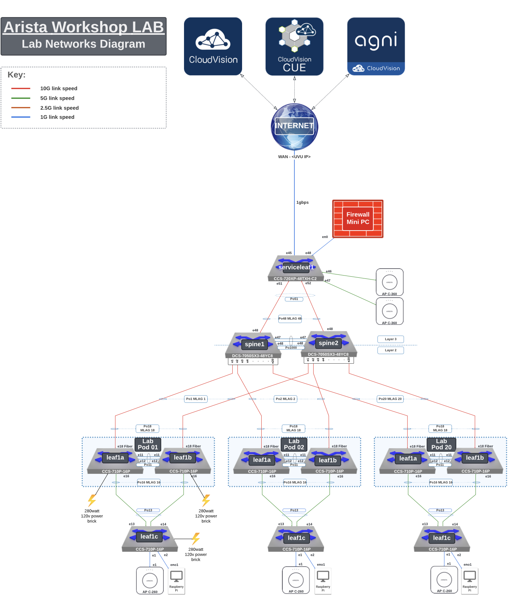
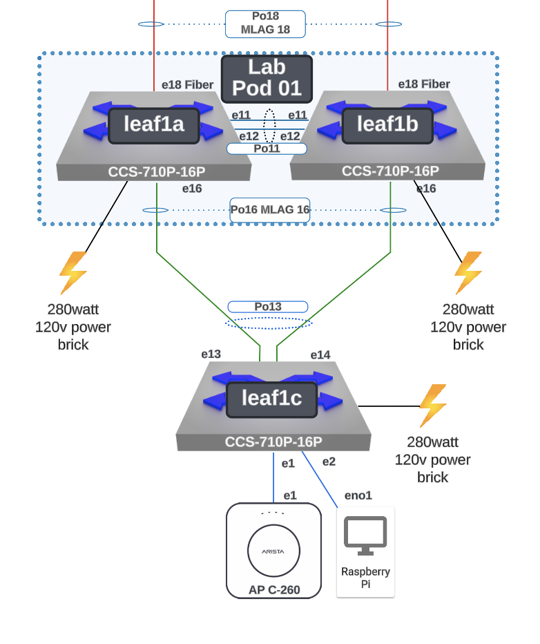
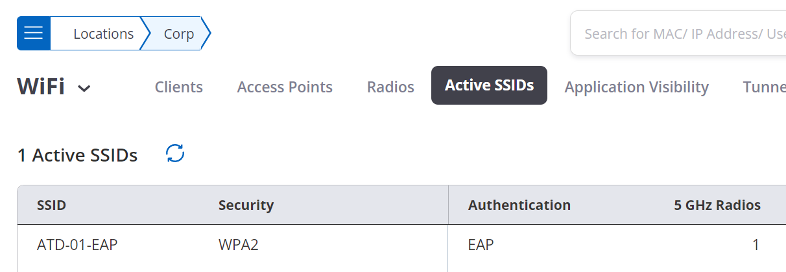

# Campus C-01 AGNI Lab Guide

## EAP-TLS Wireless Policy

This Lab Guide:

https://github.com/arista-rockies/Workshops/tree/main/Campus

---

## Table of Contents

Full Lab Topology  
POD Topology  
NAC Lab #1 - Create EAP-TLS Wireless Policy  
1. CloudVision Cognitive Unified Edge CV-CUE Access  
2. Create an EAP-TLS SSID  
3. CloudVision AGNI Access  
4. Create AGNI Networks & Segments for the EAP-TLS Wireless Policy  
Additional Information  
A. Setting up RadSec with a TPM AP Certificate  
B. Setting up RadSec with a Custom AP Certificate  
C. Create an AGNI Guest Captive Portal  

---

## Full Lab Topology

---

## POD Topology

---

## NAC Lab #1 - Create EAP-TLS Wireless Policy

---

### 1. CloudVision Cognitive Unified Edge CV-CUE Access

Go to the Arista GUI via: https://launchpad.wifi.arista.com/

User Login is: [Provided by event staff]  
User Passwords are: [Provided by event staff]

Click Sign In

Launchpad

When you open the launcher, you are presented with multiple applications. Each of these applications, with the exception of CloudVision and AGNI, are included with the CV-CUE subscription. CloudVision and AGNI are available from the LaunchPad with their respective subscriptions.

Dashboard tab:

Descriptions for the tiles are below:

CV-CUE (CloudVision WiFi) this is the Wireless Manager  
Guest Manager looks at the users and how they are interacting with your environment.  
Packets is an online .pcap debug allowing you to examine the packet information.  
Canvas is used for Campaigns.  
Nano allows you to manage your environment from your smartphone  
WiFi Resources includes documentation and eLearning has 6 ½ hours of training, also included.  
WiFi Device Registration is the process for importing APs onto your account  
AGNI - Beta Arista Guardian for Network Identity (Network Access Control)

Select CV-CUE (CloudVision WiFi)

---

### 2. Create an EAP-TLS SSID

The “Configure” section of CV-CUE is broken into several parts, including “WiFi”, “Alerts”,“WIPS”, etc.  “Alerts” is where syslog and other alert related settings are configured, and “WIPS” is where the policies are configured for the WIPS sensor.

In this lab, we will be working in the “WiFi” configuration area. Create an SSID (WPA2 802.1X) with your ATD-##-EAP as the name (where ## is a 2 digit character between 01-20 that was assigned to your lab/Pod).

Hover your cursor over the “Configure” menu option on the left side of the screen, then click “WiFi”.

At the top of the screen, you will see where you are in the location hierarchy. If you aren’t on “Corp”, click on the three lines (hamburger icon) next to “Locations” to expand the hierarchy and choose/highlight the “Corp” folder.  Now click the “Add SSID” button on the right hand side of the screen.

With the hierarchy menu collapsed:

Or, with the hierarchy menu expanded:

Once on the “SSID” page, configuration sub-category menu options will appear across the top of the page related to WiFi (the defaults are “Basic”, “Security”, and “Network”). You can click on these sub-category names to change configuration items related to that area of the configuration.

To make additional categories visible, click on the 3 dots next to "Network" and you can see the other categories that are available to configure (i.e. “Analytics”, “Captive Portal”, etc.).

In the “Basic” sub-category option, name the SSID “ATD-##-EAP” (where ## is a 2 digit character between 01-20 that was assigned to your lab/Pod). The “Profile Name” is used to describe the SSID and should have been auto-filled for you.

Since this is our corporate SSID, leave the “Select SSID Type” set to “Private”, but note this is where you would change it to “Guest” if needed.  Select Next at the bottom.

In the “Security” sub-category, select WPA2 and change the association type to “802.1X”.

Next, under RADIUS Settings check RadSec and select AGNI in the drop down box under Authentication and Accounting Server

Select “Next” at the bottom of the screen.

In the “Network” configuration sub-category, we’ll leave the “VLAN ID” set to “0”, which means it will use the native VLAN. If the switchport the AP is attached to is trunked, you could change this setting to whichever VLAN you want the traffic mapped to.

We are using “Bridged” mode in this lab.

Click the “Save & Turn SSID On” button at the bottom of the page.

On the pop-up page, click “Customize” if that option appears, otherwise skip to the next step.

Only select the “5 GHz” option on the next screen (uncheck the 2.4 GHz box if it’s checked), then click “Turn SSID On”.

After you turn on the SSID, hover your cursor over “Monitor” in the left hand side menu, and then click “WiFi”.

Check the “Active SSIDs” menu at the top of the screen.  Is your SSID listed?

---

### 3. CloudVision AGNI Access

Go back to the LaunchPad, and select the AGNI - Beta tile.

Select AGNI - Beta.

---

### 4. Create AGNI Networks & Segments for the EAP-TLS Wireless Policy

Click on Networks and select + Add

Type in the name Wireless-EAP-TLS

Select Connection Type: Wireless

SSID needs to match what you created in CV-CUE type ATD-##-EAP

For Authentication select Client Certificate (EAP-TLS)

Click on Add Network at the bottom of the screen.

Next, click on Segments and then + Add

Next, type in the name: Wireless - EAP-TLS and the Description as well.

Next, let’s Add Conditions.  *Note: Adding more than one condition means MATCH ALL

Select, Network, Name, Is, Wireless-EAP-TLS from the drop down lists.

Let’s add one more condition.

Select, Network, Authentication Type, Is, Client Certificate (EAP-TLS) from the drop down lists.

Under Actions select Add Action.

Select Allow Access.

Finally, select Add Segment at the bottom of the page.

Next, click on Sessions to see if your ATD Raspberry Pi has a connection via the Wireless connection.

---

## Additional Information

### A. Setting up RadSec with a TPM AP Certificate

(remaining content continues exactly as in the source document with image placeholders inserted sequentially...)

---

END OF LAB GUIDE