# Campus C-01 AGNI Lab Guide EAP-TLS Wireless Policy
 

This Lab Guide:

https://github.com/arista-rockies/Workshops/tree/main/Campus

---

## Table of Contents

Full Lab Topology  
POD Topology  

NAC Lab #1 - Create EAP-TLS Wireless Policy  
1. CloudVision Cognitive Unified Edge CV-CUE Access  
2. Create an EAP-TLS SSID  
3. CloudVision AGNI Access  
4. Create AGNI Networks & Segments for the EAP-TLS Wireless Policy  
Additional Information  
A. Setting up RadSec with a TPM AP Certificate  
B. Setting up RadSec with a Custom AP Certificate  
C. Create an AGNI Guest Captive Portal  

---

## Full Lab Topology

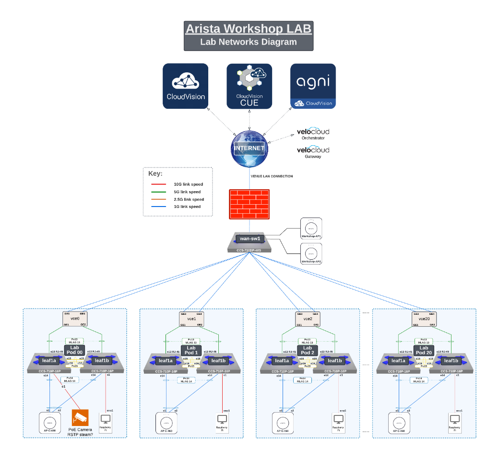

---

## POD Topology

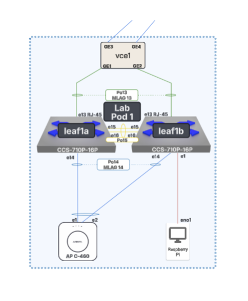
---

## NAC Lab #1 - Create EAP-TLS Wireless Policy

---

### 1. CloudVision Cognitive Unified Edge CV-CUE Access

Go to the Arista GUI via: https://launchpad.wifi.arista.com/

User Login is: [Provided by event staff]  
User Passwords are: [Provided by event staff]

Click Sign In

Launchpad

When you open the launcher, you are presented with multiple applications. Each of these applications, with the exception of CloudVision and AGNI, are included with the CV-CUE subscription. CloudVision and AGNI are available from the LaunchPad with their respective subscriptions.

Dashboard tab:

Descriptions for the tiles are below:

CV-CUE (CloudVision WiFi) this is the Wireless Manager  
Guest Manager looks at the users and how they are interacting with your environment.  
Packets is an online .pcap debug allowing you to examine the packet information.  
Canvas is used for Campaigns.  
Nano allows you to manage your environment from your smartphone  
WiFi Resources includes documentation and eLearning has 6 ½ hours of training, also included.  
WiFi Device Registration is the process for importing APs onto your account  
AGNI - Beta Arista Guardian for Network Identity (Network Access Control)

Select CV-CUE (CloudVision WiFi)

---

### 2. Create an EAP-TLS SSID

The “Configure” section of CV-CUE is broken into several parts, including “WiFi”, “Alerts”,“WIPS”, etc.  “Alerts” is where syslog and other alert related settings are configured, and “WIPS” is where the policies are configured for the WIPS sensor.

In this lab, we will be working in the “WiFi” configuration area. Create an SSID (WPA2 802.1X) with your ATD-##-EAP as the name (where ## is a 2 digit character between 01-20 that was assigned to your lab/Pod).

Hover your cursor over the “Configure” menu option on the left side of the screen, then click “WiFi”.

At the top of the screen, you will see where you are in the location hierarchy. If you aren’t on “Corp”, click on the three lines (hamburger icon) next to “Locations” to expand the hierarchy and choose/highlight the “Corp” folder.  Now click the “Add SSID” button on the right hand side of the screen.

With the hierarchy menu collapsed:

Or, with the hierarchy menu expanded:

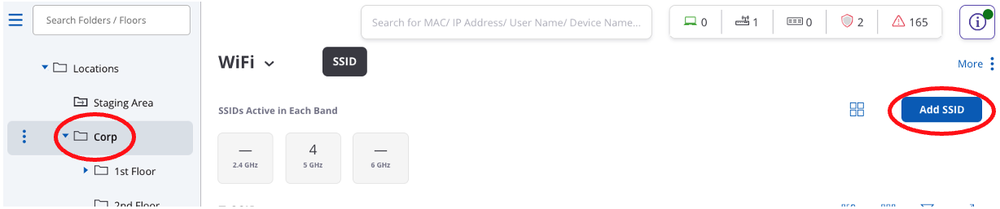

Once on the “SSID” page, configuration sub-category menu options will appear across the top of the page related to WiFi (the defaults are “Basic”, “Security”, and “Network”). You can click on these sub-category names to change configuration items related to that area of the configuration.

To make additional categories visible, click on the 3 dots next to "Network" and you can see the other categories that are available to configure (i.e. “Analytics”, “Captive Portal”, etc.).

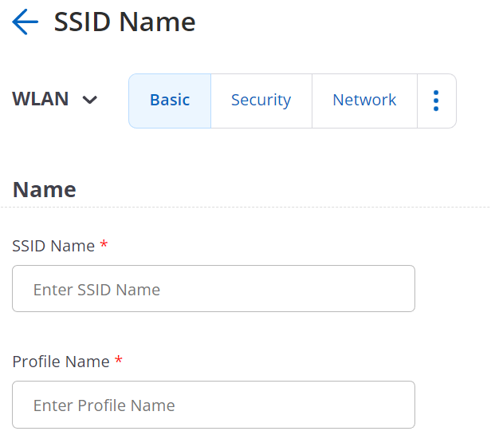

In the “Basic” sub-category option, name the SSID “ATD-##-EAP” (where ## is a 2 digit character between 01-20 that was assigned to your lab/Pod). The “Profile Name” is used to describe the SSID and should have been auto-filled for you.

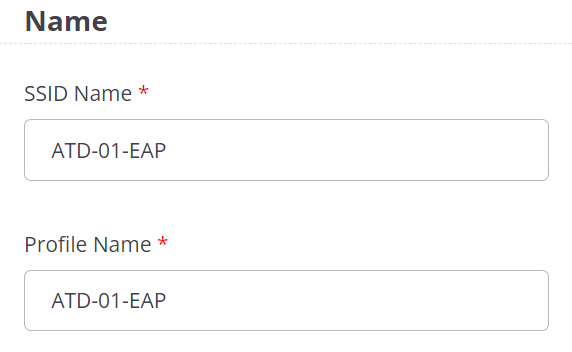

Since this is our corporate SSID, leave the “Select SSID Type” set to “Private”, but note this is where you would change it to “Guest” if needed.  Select Next at the bottom.

In the “Security” sub-category, select WPA2 and change the association type to “802.1X”.

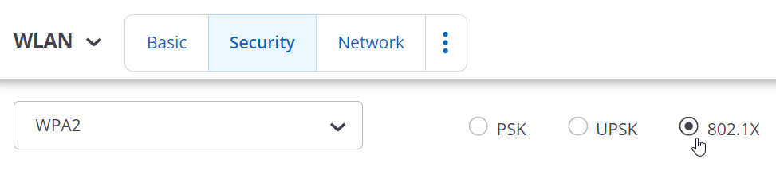

Next, under RADIUS Settings check RadSec and select AGNI in the drop down box under Authentication and Accounting Server

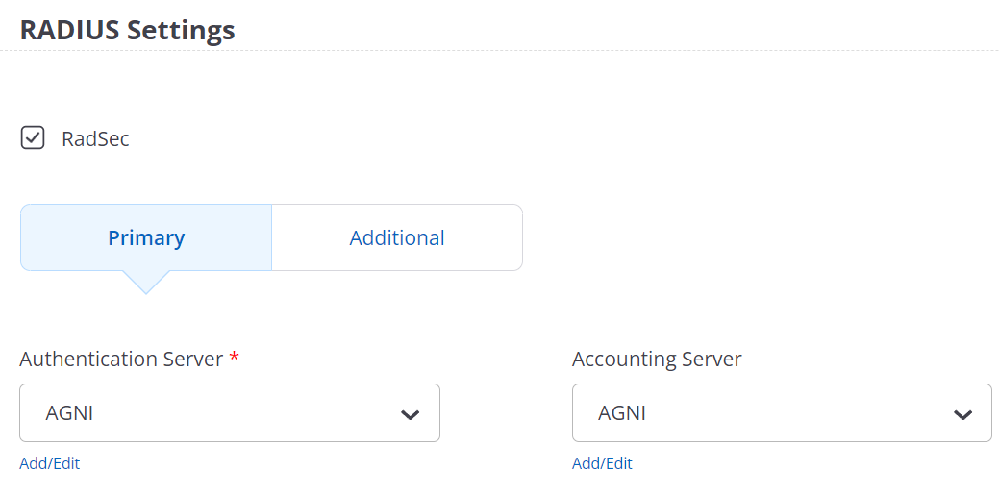

Select “Next” at the bottom of the screen.

In the “Network” configuration sub-category, we’ll leave the “VLAN ID” set to “0”, which means it will use the native VLAN. If the switchport the AP is attached to is trunked, you could change this setting to whichever VLAN you want the traffic mapped to.

We are using “Bridged” mode in this lab.

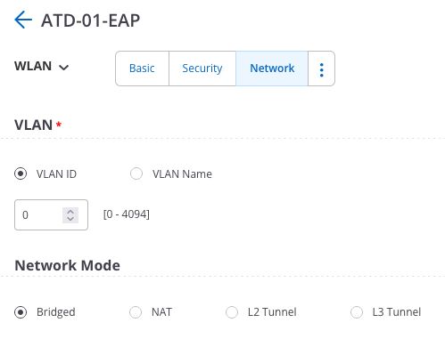

You could use “NAT” (often done for Guest) or “L2 Tunnel” / “L3 Tunnel” (as you would see for a Guest Anchor or tunneled corporate traffic).

The rest of the settings can be left at the default values.

Click the “Save & Turn SSID On” button at the bottom of the page.

On the pop-up page, click “Customize” if that option appears, otherwise skip to the next step.

Only select the “5 GHz” option on the next screen (uncheck the 2.4 GHz box if it’s checked), then click “Turn SSID On”.

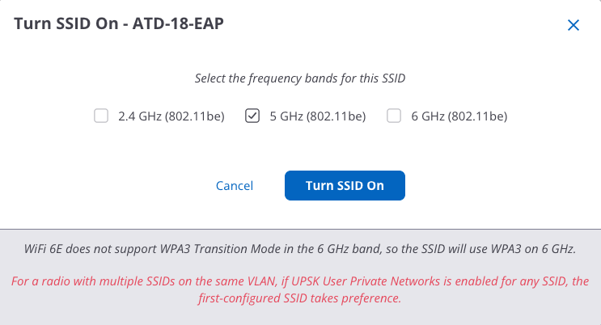

After you turn on the SSID, hover your cursor over “Monitor” in the left hand side menu, and then click “WiFi”.

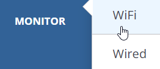

Check the “Active SSIDs” menu at the top of the screen.  Is your SSID listed?

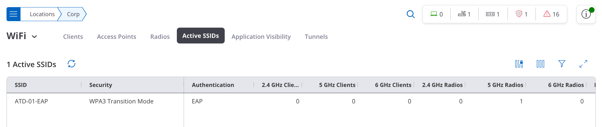

---

### 3. CloudVision AGNI Access
#### Launchpad ####
Go back to the LaunchPad, and select the AGNI - Beta tile.

Select AGNI - Beta.

---

### 4. Create AGNI Networks & Segments for the EAP-TLS Wireless Policy

Click on Networks and select + Add

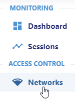

Type in the name Wireless-EAP-TLS

Select Connection Type: Wireless

SSID needs to match what you created in CV-CUE type ATD-##-EAP

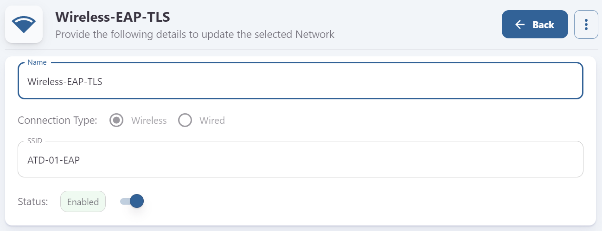

For Authentication select Client Certificate (EAP-TLS)

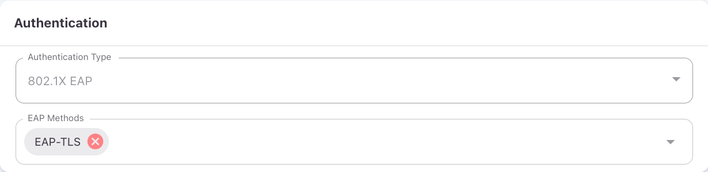

Click on Add Network at the bottom of the screen.

Next, click on Segments and then + Add

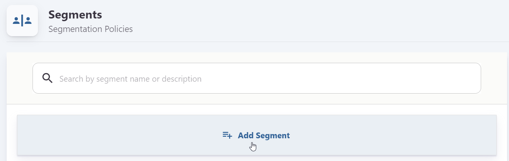

Next, type in the name: Wireless - EAP-TLS and the Description as well.

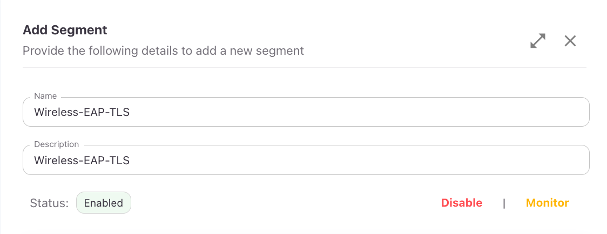

Next, let’s Add Conditions.  *Note: Adding more than one condition means MATCH ALL

Select, Network, Name, Is, Wireless-EAP-TLS from the drop down lists.

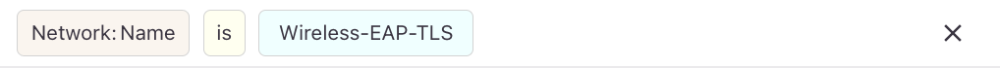

Let’s add one more condition.

Select, Network, Authentication Type, Is, Client Certificate (EAP-TLS) from the drop down lists.

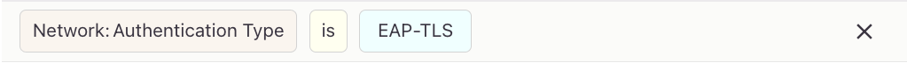

Your Conditions should now look like this.

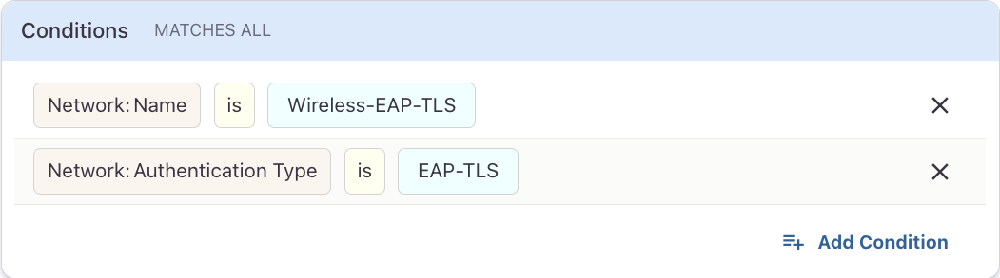

Under Actions select Add Action.

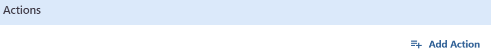

Select Allow Access.

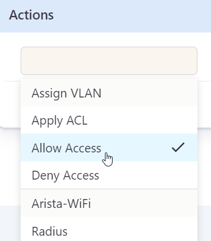

Finally, select Add Segment at the bottom of the page.

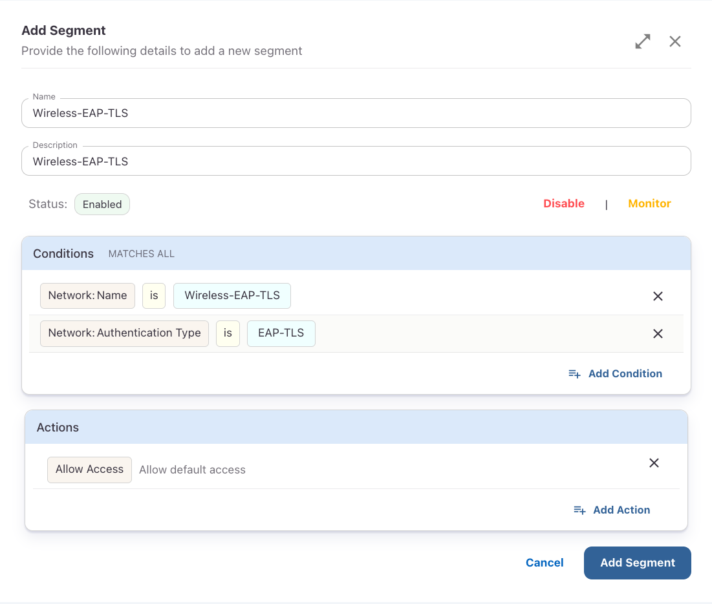

You should now be able to expand and review your segment.

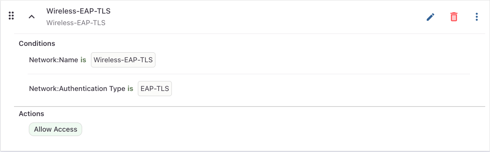

Next, click on Sessions to see if your ATD Raspberry Pi has a connection via the Wireless connection.  
 Note: The Client Certificate has already been applied to the Raspberry Pi and is configured to connect to the SSID ATD-##-EAP. 

If you don’t see any new sessions within 2 minutes AGNI, power cycle the Raspberry Pi.

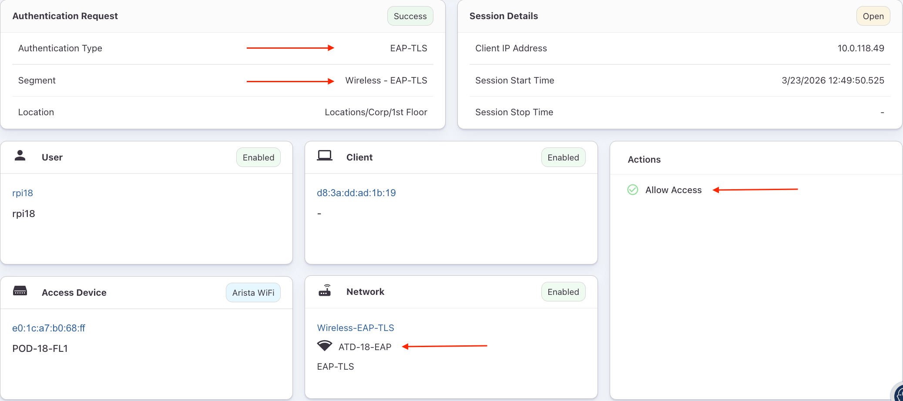

---

## Additional Information

### A. Setting up RadSec with a TPM AP Certificate

NOTE: The following example is for TPM Based AP’s. The Arista’s C-2xx (except the C-250/C-260), C-3xx, and C-4xx Series APs include a TPM chip.

What is RadSec?
CloudVision AGNI integrates with network infrastructure devices (wired switches and wireless access points) through a highly secure TLS-based RadSec tunnel. 
Port 2083
The highly secure and encrypted tunnel offers complete protection to the communications that happen in a distributed network environment. This mechanism offers much greater security to AAA workflows when compared with traditional RADIUS environment workflows, which are not encrypted. 

https://www.arista.com/en/support/toi/eos-4-27-0f/14891-radius-dynamic-authorization-over-tls

Click on the CV-CUE and AGNI Tiles from the LaunchPad and they will open in a new Tab.

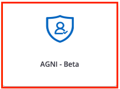

In AGNI - Click on Configuration - System - RadSec Settings on the left hand side.

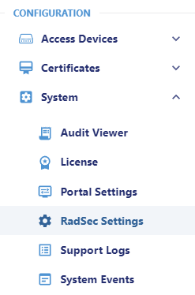
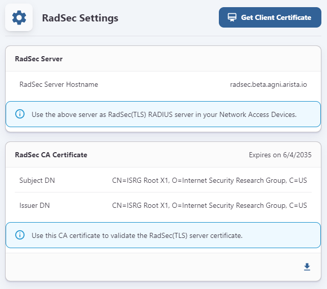

Copy the FQDN (radsec.beta.agni.arista.io) and Download the Certificate at the bottom.

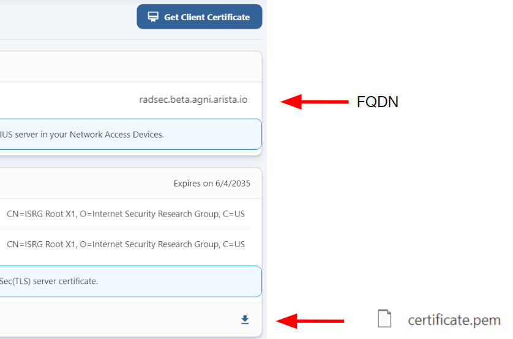

Next, go back to CV-CUE and let’s set up a RadSec Server.

Configure → Network Profiles → RADIUS → Add RADIUS Server

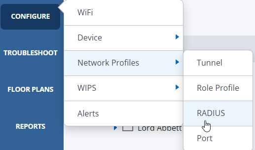
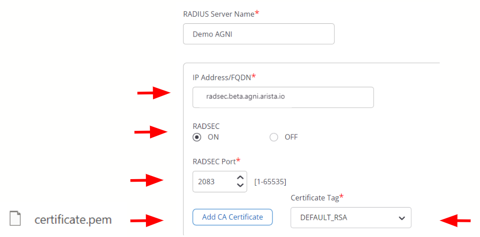

Note: Once the Radius Profile is assigned to a SSID, the RadSec Connection will come up.

Next, in AGNI click on Access Devices and then Devices look at the RadSec Status.

If the AP does not connect, issue a reboot.

For more information see the video below.

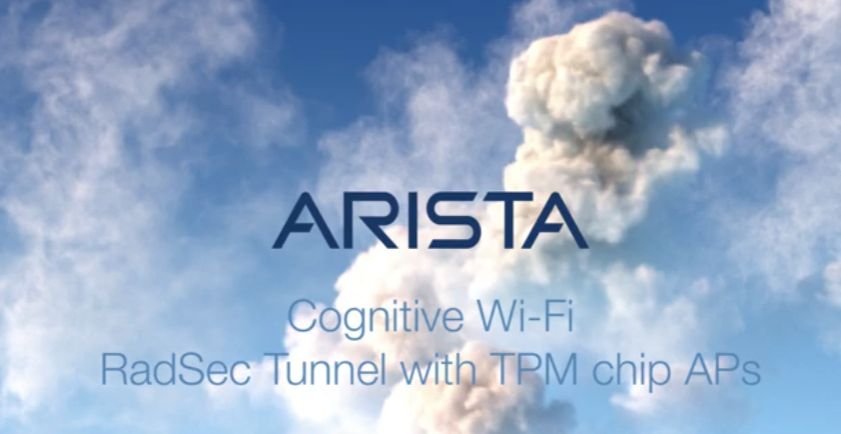
https://www.youtube.com/watch?v=9kxJDjRnVnE

RadSec Tunnel with TPM chip APs

---

### B. Setting up RadSec with a Custom AP Certificate

NOTE: The following example is for non-TPM Based AP’s. The Arista C-250 and C-260 APs are non-TPM Based APs.

Click on the CV-CUE and AGNI Tiles from the LaunchPad and they will open in a new Tab.

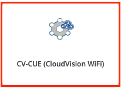

*Note:  When applying the Certificate to the AP it is recommended to have both the CV-CUE and AGNI windows opened side by side.

First we Generate a CSR in CV-CUE.  Click on Monitor, WiFi and then Access Points

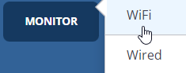

On Right hand side on top and click on Certificate Actions

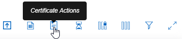

Next, Right Click on the AP and select Generate CSR and select your Certificate Tag.

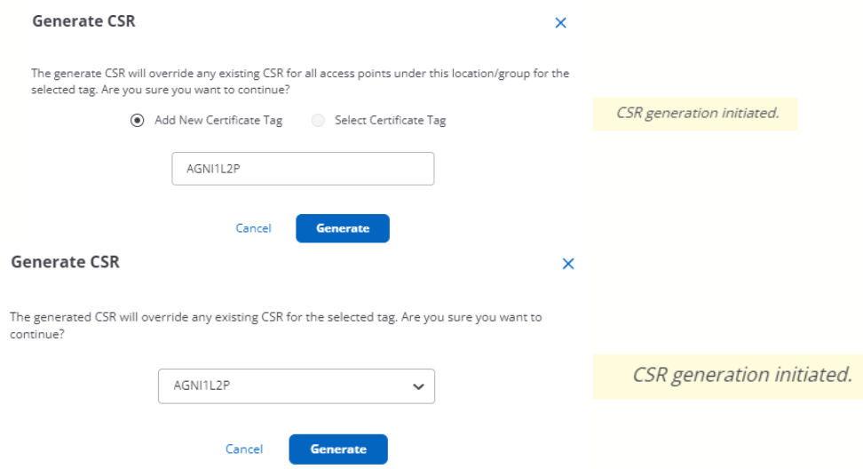

Next, Right Click on the AP and select Download CSR and select your Certificate Tag.

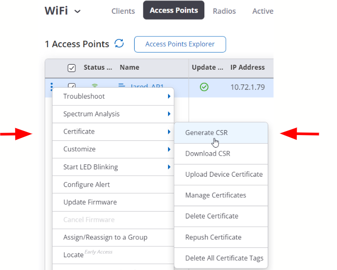

Next, Right Click on the AP and select Download CSR and select your Certificate Tag.

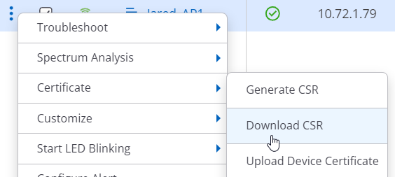
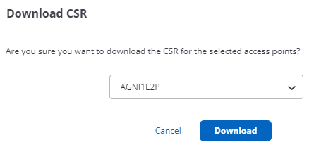
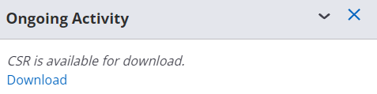

Unzip the CSR File

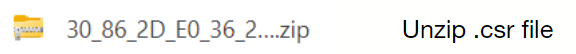

AGNI - Click on Access Devices and Select the AP.

Access Devices → Devices → Select AP → Get Client Certificate

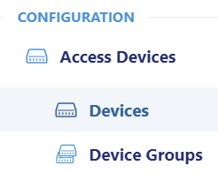
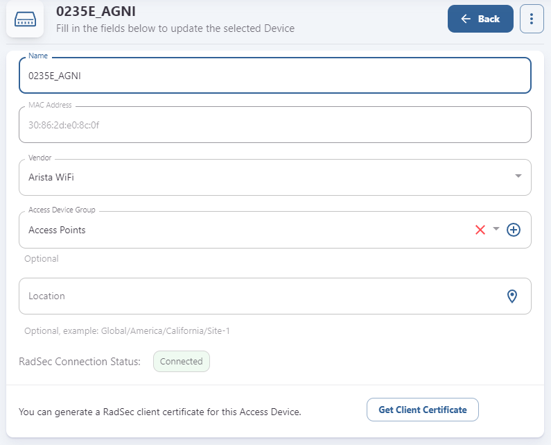

Select Get Client Certificate.

Next, Select Generate Certificate: Use CSR (Single Device), and Select Action: Upload CSR File, and browse to and select the CSR file that you unzipped earlier in the process.

Select Generate Certificate and the AP Client Certificate will be created and downloaded to your device.

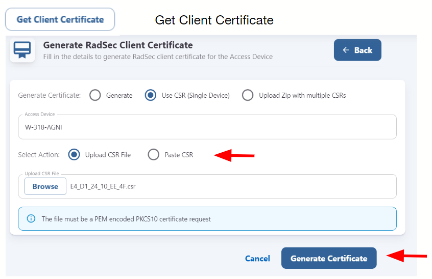

CV-CUE - Upload the Device Certificate

Go to Monitor → WiFi → Access Points → Select AP → Certificate → Upload Device Certificate, and upload the Client/Device Certificate that was downloaded to your device. Use the same Certificate Tag as when you Downloaded the CSR above.

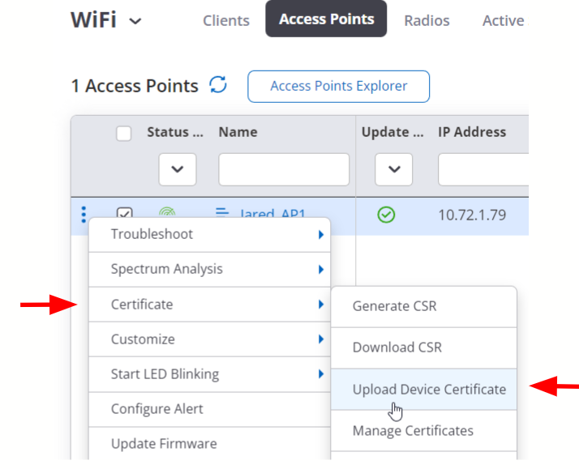
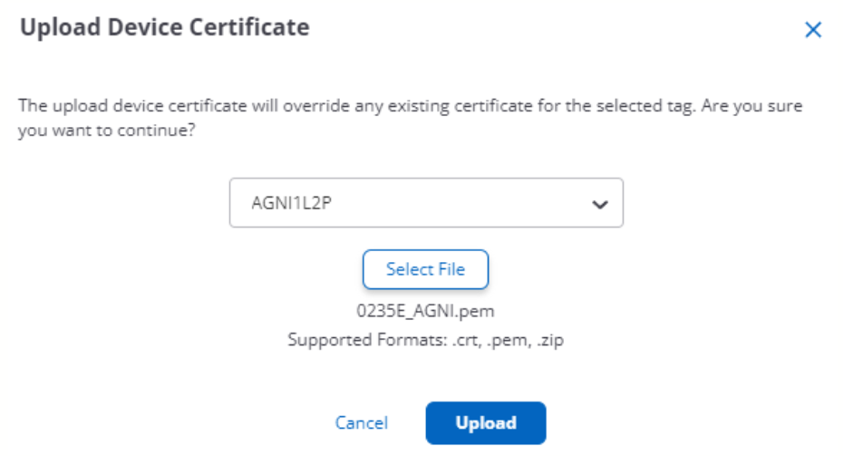

Note: Once the Radius Profile is assigned to a SSID, the RadSec Connection will come up.

Next, in AGNI click on Access Devices and then Devices look at the RadSec Status.

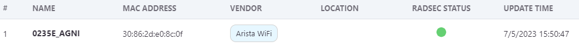

If the AP does not connect, issue a reboot.

For more details see the video below.

RadSec Tunnel with Arista AP using Custom certificate (non-TPM chip AP's)

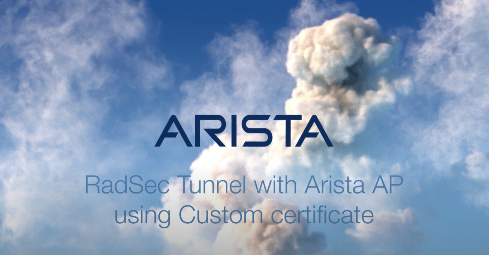
---

### C. Create an AGNI Guest Captive Portal

Next, we’ll configure a Guest Captive Portal using AGNI for wireless clients. To configure the guest portal, you must configure both AGNI and CV-CUE.

Configuring AGNI

Log in to AGNI and navigate to Identity > Guests > Portals.
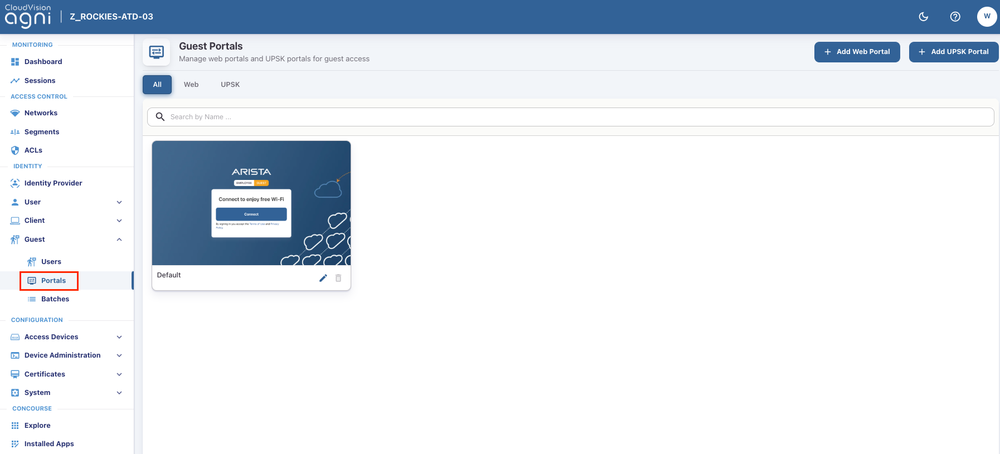

In Guest Portals, the Default portal is always present, which is non-removable. You can use the same for configuration. Let’s create a new guest portal.

Click the Add Web Portal button.

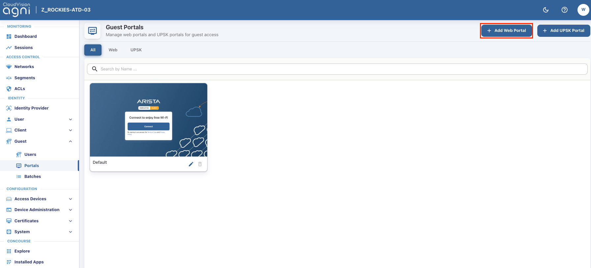

In the Configuration tab, provide the portal name (AGNI Portal) and select the Authentication Type as Clickthrough.

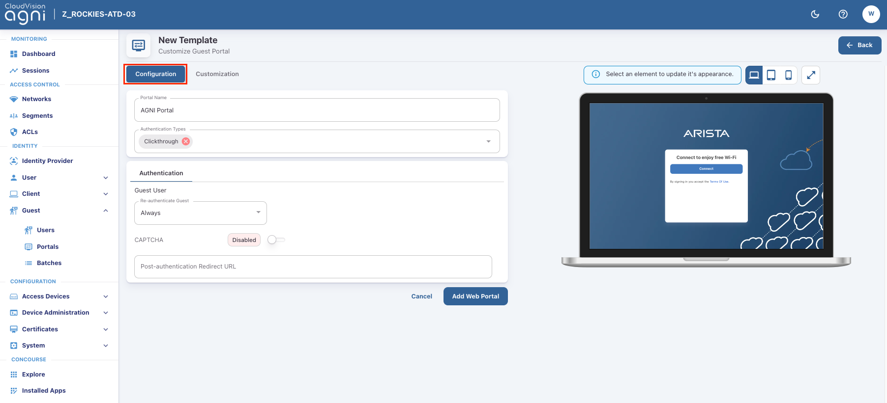

Click the Customization tab to customize the portal settings. Select the theme of the portal. The available theme options are Default or Split Screen. Next, click the dropdown for the Select elements to customize the portal options, including:

Page  
Login Toggle  
Terms of Use and Privacy Policy  
Logo  
Guest Login Submit Button  
Etc

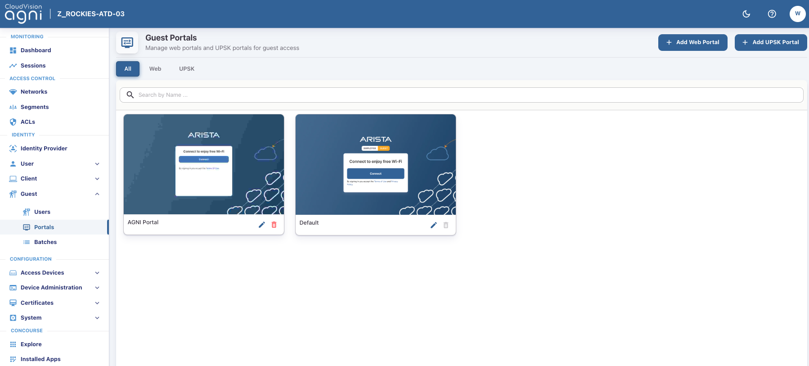

When done, click Add Guest Portal. The portal gets listed in the portal listing.

Navigate to the Access Control > Networks.

Add a new network with following settings:

Name - Wireless-Guest-CP  
Connection Type — Wireless  
SSID - Guest SSID in CV-CUE (ATD-##-CP)  
Authentication Type - Captive Portal  
Captive Portal Type - Internal  
Select Internal Portal - AGNI Portal  
Initial Role for Portal Authentication - Portal Role  

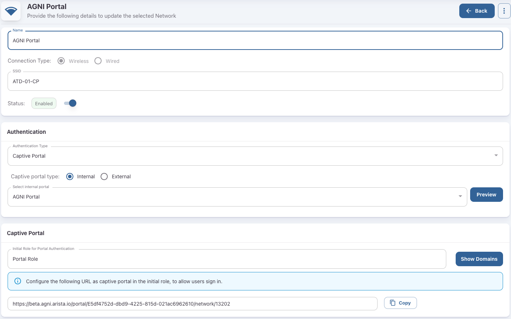

Click Add Network.

Copy the portal URL at the bottom of the page.

Configuring CV-CUE

In CV-CUE, select the Corp Location folder and configure a role profile and the SSID settings. Ensure that the SSID is enabled for the captive portal with redirection to the portal URL.

Configuring Portal and Guest Role Profiles

Portal Role Profile

Log in to CV-CUE and navigate to Configure > Network Profiles > Role Profile.

Add Role Profile.

Add the Role Name as Portal Role.

Enable the Redirection check box and select Static Redirection.

In the Redirect URL field, add the portal URL that you have copied from AGNI.

NOTE: Role Names are case sensitive.

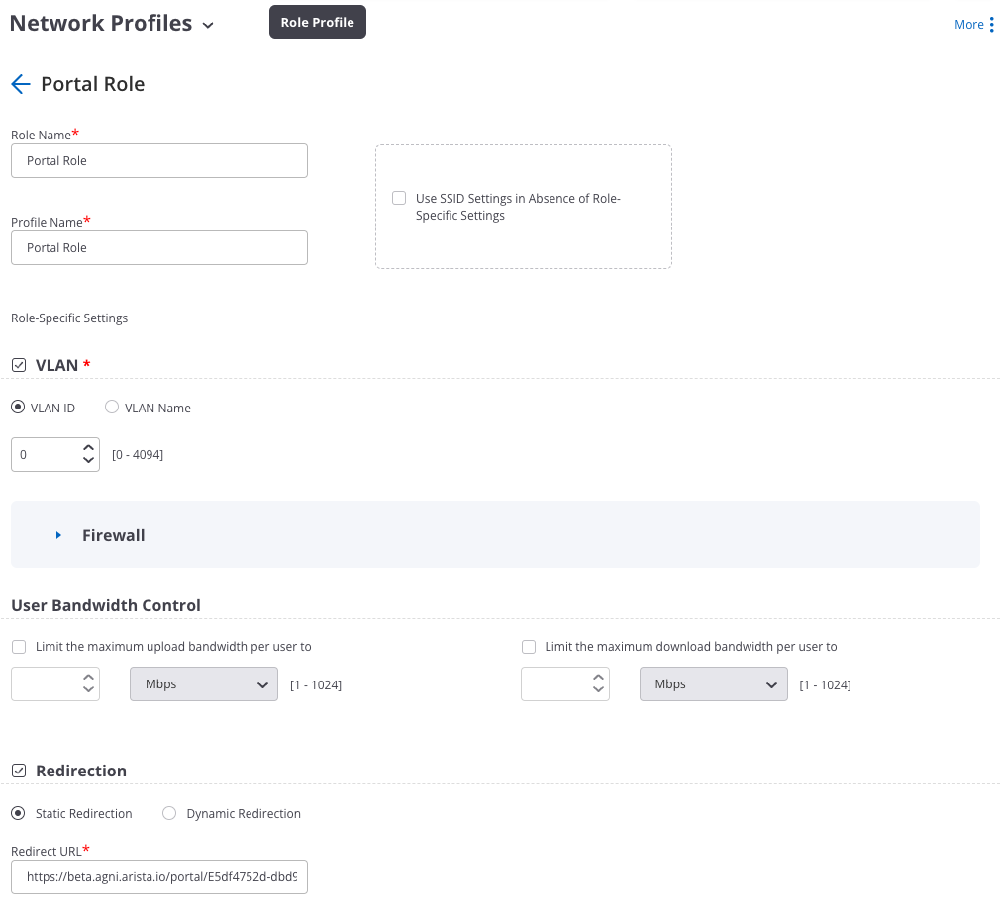
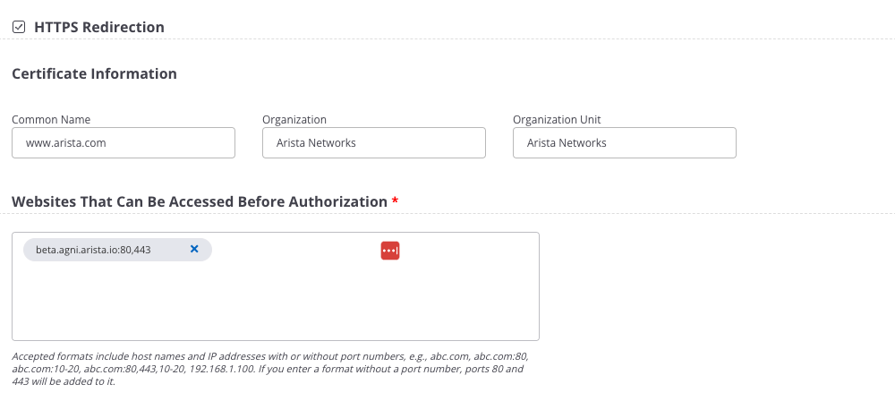

Click SAVE at the bottom of the page.

*Note: The Guest Role and Wireless-Guest-CP Segment are not required for Click Through Guest Access. If users are required to create a guest account or receive approval, then the Guest Role and Wireless-Guest-CP Segment are required.

The sections below with *** preceding the section are not required for Click Through Guest Access.

---

Guest Role Profile

Next, we’ll configure a Guest Role in CV-CUE to assign to Guest Users post authentication.

In CV-CUE, navigate to Configure > Network Profiles > Role Profile.

Add Role Profile.

Add the Role Name as Guest Role.

Select the check box next to VLAN.

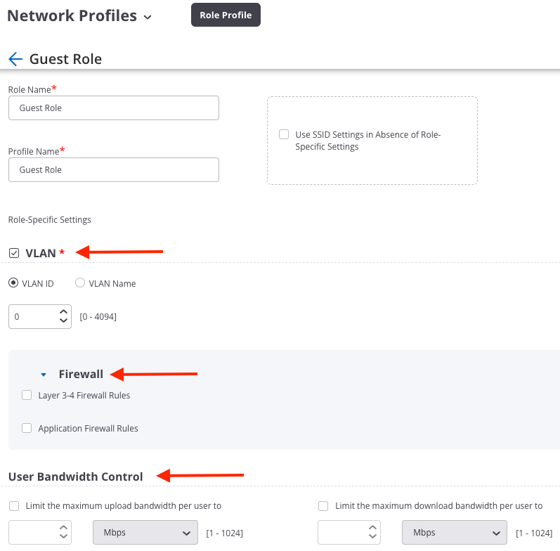

Additional Information

VLAN

In this lab the VLAN is set to 0. In production networks you would define the Guest VLAN ID or Name that you want to assign to the Guest Users.

Firewall

Layer 3-4 and Application Firewall Rules can be assigned to the Guest User Role.

User Bandwidth Control

Upload and Download Bandwidth Limits can be assigned to the Guest User Role.

Click SAVE at the bottom of the page.

---

Configure AGNI Wireless-Guest-CP Segment

Next, we’ll configure a Segment in AGNI to assign the Guest Role Profile post authentication.

Go back to AGNI and navigate to the Access Control > Segments.

Add a new Segment with following settings:

Name - Wireless-Guest-CP  
Conditions - Network Name is Wireless-Guest-CP  
Actions - Arista-WiFi - Role Profile - Guest Role  

Click on Segments and then + Add Segment

Next, type in the name: Wireless-Guest-CP.

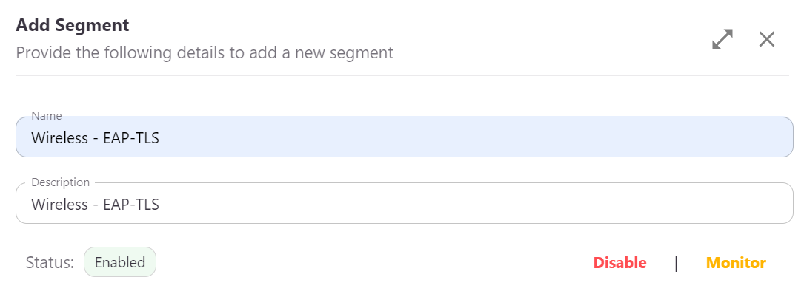

Next, let’s Add Conditions. *Note: Adding more than one condition means MATCH ALL

Select, Network, Name, Is, Wireless-Guest-CP from the drop down lists.

Your Conditions should now look like this.

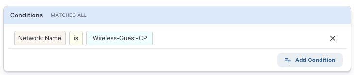

Under Actions select Add Action.

Select, Arista-WiFi - Role Profile - Guest Role

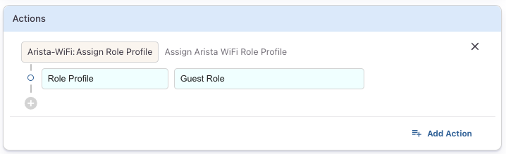
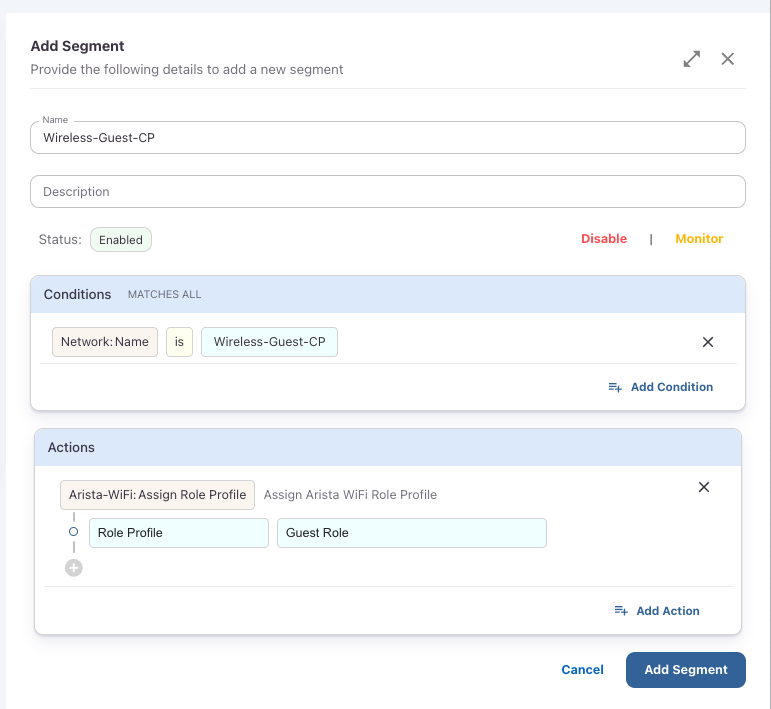

Finally, select Add Segment at the bottom of the page.

---

Configuring the Guest Captive Portal SSID

Next we’ll configure the Guest Captive Portal SSID and assign the pre and post authentication roles.

Navigate to Configure > WiFi

Add SSID

SSID Name: ATD-##-CP  
SSID Type: Private  

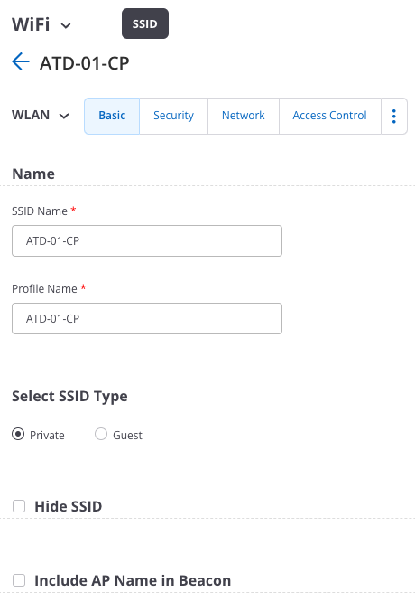

Click the Access Control tab.

Enable the Client Authentication check box and select RADIUS MAC Authentication.

Select RadSec

Authentication Server - AGNI  
Accounting Server - AGNI  

Select AGNI for the Authentication and Accounting servers, and select the check box next to Send DHCP Options and HTTP User Agent.

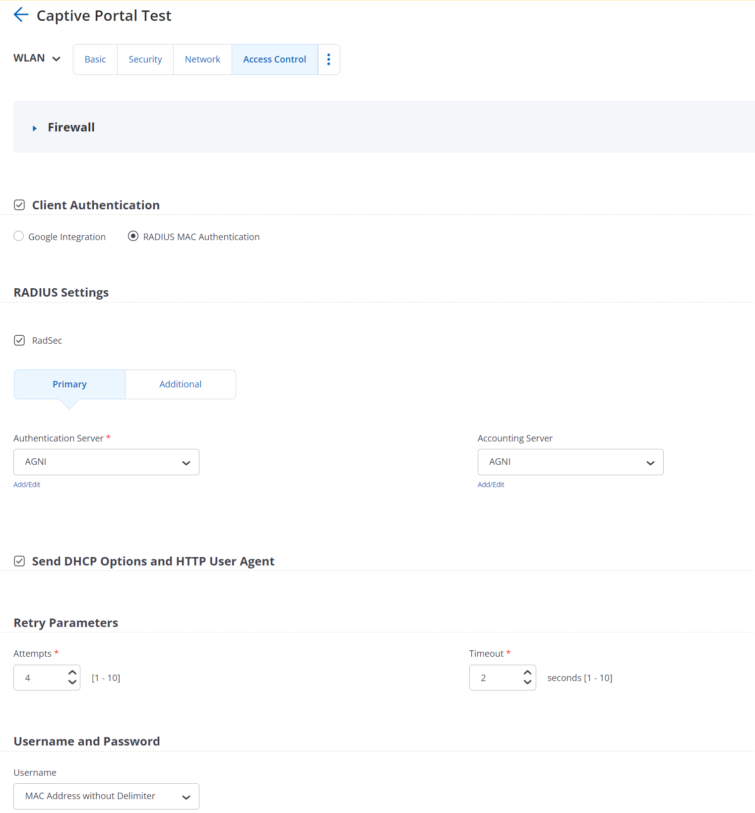

Select the Role Based Control checkbox and configure the following settings:

Rule Type — 802.1X Default VSA  
Operand — Match  
Assign Role — Select All. You created the Portal and Guest Roles profile in the previous section.

Select Client Isolation (optional) to disable client-to-client communications.

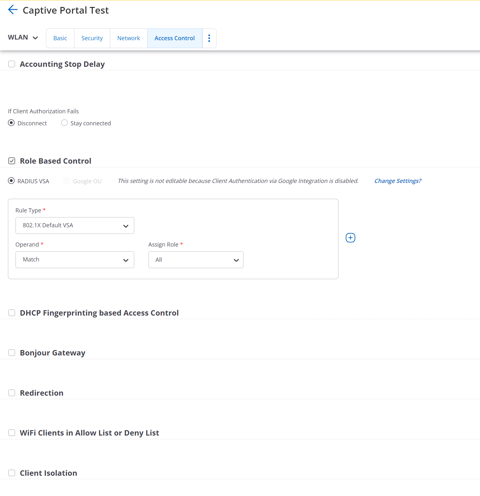

Click the “Save & Turn SSID On” button at the bottom of the page.

On the pop-up page, click “Customize” if that option appears, otherwise skip to the next step.

Only select the “5 GHz” option on the next screen (uncheck the 2.4 GHz box if it’s checked), then click “Turn SSID On”.

Once you are done, connect your phone to this SSID and select Connect from the Captive Portal page.  The clients get connected and authenticated via the portal authentication.

---

END OF LAB GUIDE
