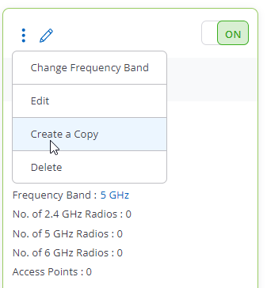
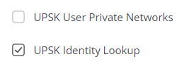
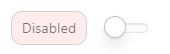

# Campus C-02 AGNI Lab Guide - UPSK Wireless Policy

---

This Lab Guide:

Campus/2026_Campus_Workshop/C-02/Rockies Campus C-02 AGNI Lab Guide - UPSK Wireless Policy

---

## Table of Contents

Full Lab Topology  
POD Topology

NAC Lab #2 - Create UPSK Wireless Policy  
1. Create Identity UPSK SSID:  
2. Create UPSK Network and Segment:  
3. Create an AGNI Local User and Enroll Personal Device  
4. Create an AGNI Client Group  

---

## Full Lab Topology

---

## POD Topology

---

## NAC Lab #2 - Create UPSK Wireless Policy

---

### 1. Create Identity UPSK SSID:

Return to the LaunchPad tab and Log into CV-CUE https://launchpad.wifi.arista.com/, or access the CV-CUE tab in your browser.

Next, we will modify the PSK SSID we created in the CV-CUE lab.

While on the Corp folder, Click on Configure and then WiFi

Next, click on the 3 Dots and select Create a Copy on the SSID ATD-##-PSK where ## is a 2 digit character between 01-20 that was assigned to your lab/Pod

Select - Currently Selected Folders and then Continue.

Click on the new SSID and select Edit.

On the Basic Tab rename the SSID to ATD-##-UPSK, and copy the SSID Name and paste it in the Profile Name field.

Next, click on the Security Tab and change the WPA2 Security from PSK to UPSK

Next, select UPSK Identity Lookup

For more information on UPSK click here: https://arista.my.site.com/AristaCommunity/s/article/Unique-PSKs

Next, Click on the Access Control tab.  Under RADIUS Settings, select RadSec and then AGNI for the Authentication and Accounting Servers, and select Send DHCP Options and HTTP User Agent.

Confirm the Username and Password, Called Station, COA information.

Finally, Save and turn on the SSID.

Please Read!

Only select the “5 GHz” option on the next screen (uncheck the 2.4 GHz box if it’s checked), then click “Turn SSID On”.

---

### 2. Create UPSK Network and Segment:

Return to the LaunchPad tab, and select the AGNI tile, or go to your AGNI tab in your browser.

Click on Networks and then + Add.

Add the following:

Name: Wireless-UPSK  
Connection Type: Wireless  
SSID: ATD-##-UPSK  
Authentication Type: Unique PSK (UPSK)

Add Network

You should now see this listed in your networks.

Next, we will add the Segment.

Under Access Control, click on Segments and then + Add

Name: Wireless-UPSK  
Description: Wireless-UPSK

Click on + Add Condition

Conditions: Network:Authentication Type is UPSK

*Note: Conditions are always Matches ALL.

Click on + Add Action

Actions: Allow Access

Finally, click on Add Segment.

You should now see Wireless-UPSK in the list of segments.

---

### 3. Create an AGNI Local User and Enroll Personal Device

In this section you will create a local user and enroll the MAC of your device.

In AGNI, under Identity, click on User and then + Add User.

Fill out the sections.  Use Arista01! for the password.

Disable - User must change password at next login:

Click Add User

NOTE: You will notice that Password has now changed to UPSK Passphrase

Copy and write down or save to text file the new UPSK Passphrase.

Next, connect your client to ATD-##-UPSK using your UPSK Passphrase.

Click on Sessions and validate your device connection.

Next, validate your device by clicking on User and then Users.  Select your user.

Click on Show Clients

---

### 4. Create an AGNI Client Group

In this section, you will simulate your device as an IoT device.

Disable and forget previously saved lab networks so your wireless connection on your test device does not auto connect.  Under your user client list, delete your device.

Next, you will add your client device as an IoT device in a Client Group.

First, we will need to create the Client Group.

In AGNI, under Identity, click on Client Groups and then + Add.

Name: Corp Approved Devices  
Description: Corp Approved Devices  
User Association: Not user associated  

Enable the Group UPSK.  Copy the UPSK Passphrase

Then click on Add Group

Next, connect your client to ATD-##-UPSK using the Client Group UPSK Passphrase.

Click on Sessions and validate your device connection.

Next Click on your Client.

)

Notice your Client Group.  Here you have the option to change the Client Group your device belongs to.

Next, delete your device from the Client Group - Corp Approved Devices.

Next, under Identity, click on Clients and then + Add Client.

Select the Client Group: Corp Approved Devices

Add in the MAC Address of your test device like your phone that is not randomized.

Then select Add Client

You will then see the Client added to the Group.

Validate and Verify your connection using the Client Group UPSK Passphrase.

---

NAC LAB #2 COMPLETE
