# Campus C-02 AGNI Lab Guide - UPSK Wireless Policy

#### This Lab Guide:
Campus/2026_Campus_Workshop/C-02/Rockies Campus C-02 AGNI Lab Guide - UPSK Wireless Policy

---

## Table of Contents

[Full Lab Topology](#full-lab-topology)  
[POD Topology](#pod-topology)  

**NAC Lab #2 - Create UPSK Wireless Policy**
1. [Create Identity UPSK SSID](#1-create-identity-upsk-ssid)  
2. [Create UPSK Network and Segment](#2-create-upsk-network-and-segment)  
3. [Create an AGNI Local User and Enroll Personal Device](#3-create-an-agni-local-user-and-enroll-personal-device)  
4. [Create an AGNI Client Group](#4-create-an-agni-client-group)  

---

## Full Lab Topology

---

## POD Topology

---

## NAC Lab #2 - Create UPSK Wireless Policy

---

### 1. Create Identity UPSK SSID:

1. Return to the **LaunchPad**, and select the **CV-CUE** tile, or go to your **CV-CUE** tab in your browser.

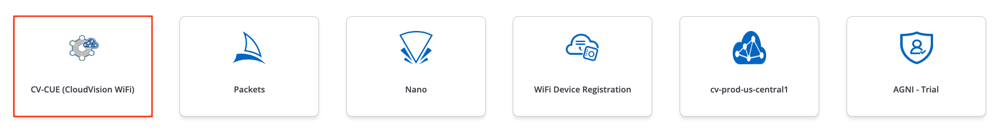

2. Next, we will modify the PSK SSID we created in the CV-CUE lab.

3. While on the **Corp** folder, Click on **Configure** and then **WiFi**

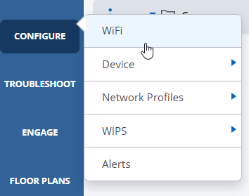

4. Next, click on the 3 Dots and select **Create a Copy** on the SSID **ATD-##-PSK** where **##** is a 2 digit character between 01-20 that was assigned to your lab/Pod

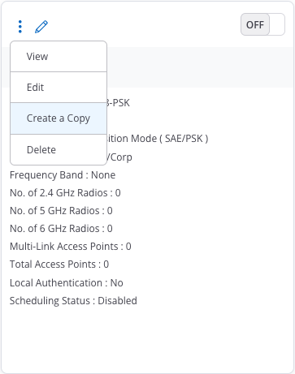

5. **Select - Currently Selected Folders** and then **Continue**.

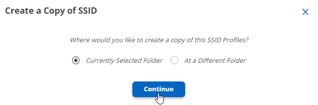

6. Click on the **Pencil icon** in the new copied SSID to **Edit** the SSID.  

**NOTE**: The Profile Name will show **Copy of**

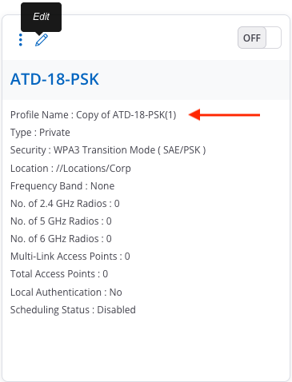

7. On the Basic Tab rename the SSID to **ATD-##-UPSK**, and copy the SSID Name and paste it in the Profile Name field.

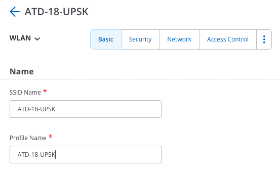

8. Next, click on the Security Tab and change the Security Level to **WPA3 Transition Mode** - **USPK**

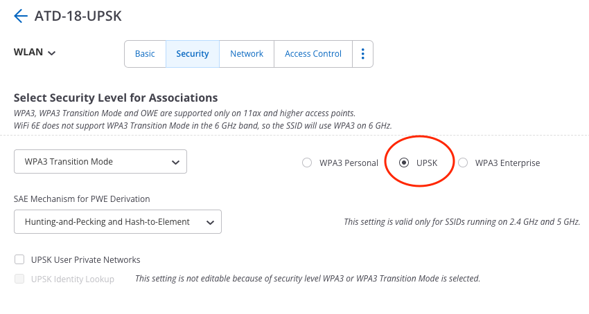

**NOTE**: For more information on UPSK click here: https://arista.my.site.com/AristaCommunity/s/article/Unique-PSKs

9. Next, Click on the **Access Control** tab.  Under **RADIUS Settings**, select **RadSec** and then **AGNI** for the Authentication and Accounting Servers, and select **Send DHCP Options and HTTP User Agent**.

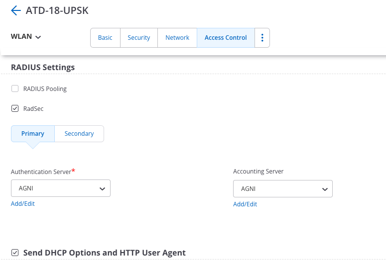

10. Confirm the **Username and Password, Called Station, COA information**.

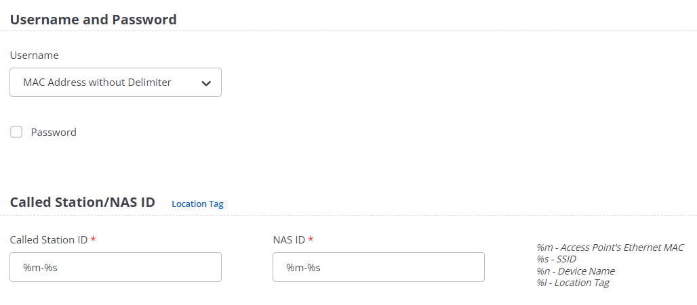
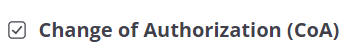

11. Click **Save**.

. 

**Please Read!**

12. **Only select the “5 GHz” option** on the next screen (**uncheck** the 2.4 GHz box if it’s checked), then click **Turn SSID On**.

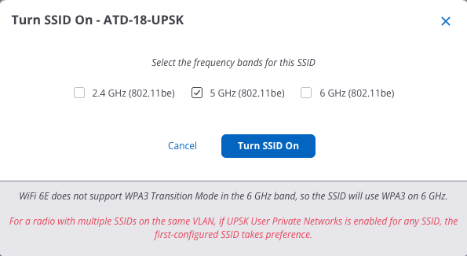  

---

### 2. Create UPSK Network and Segment:

1. Return to the **LaunchPad**, and select the **AGNI - Trial** tile, or go to your **AGNI** tab in your browser.

2. Click on **Networks** and then **+ Add**.

3. Add the following:

- Name: **Wireless-UPSK**  
- Connection Type: **Wireless**  
- SSID: **ATD-##-UPSK**  
- Authentication Type: **Unique PSK (UPSK)**

4. **Click Add Network**

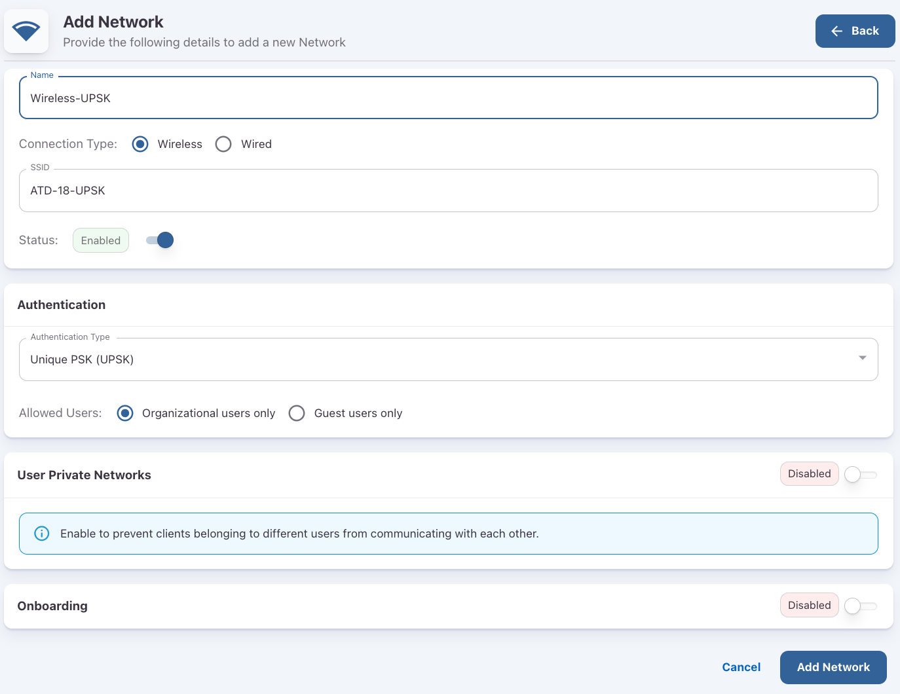

5. You should now see this listed in your **Networks**  .

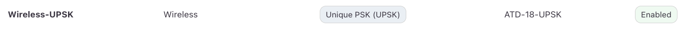

6. **Next**, we will add a **Segment**.

7. Under Access Control, click on **Segments** and then **+ Add**

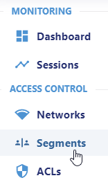
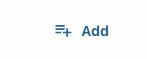

- Name: **Wireless-UPSK**  
- Description: **Wireless-UPSK**

8. Click on **+ Add Condition**

- Conditions: **Network:Authentication Type is UPSK**

**Note:** Conditions are always **MATCHES ALL**.

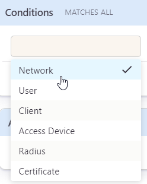
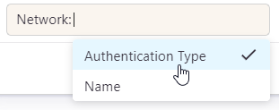
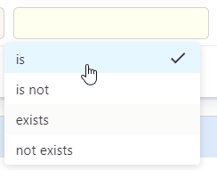
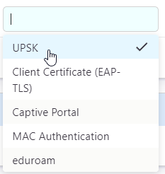
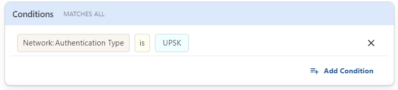

9. Click on **+ Add Action**

- Actions: **Allow Access**

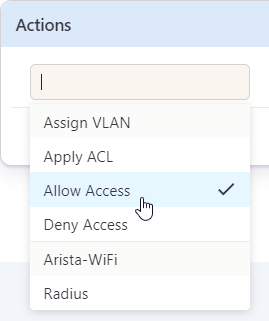
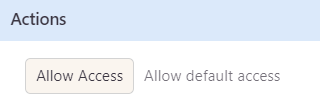
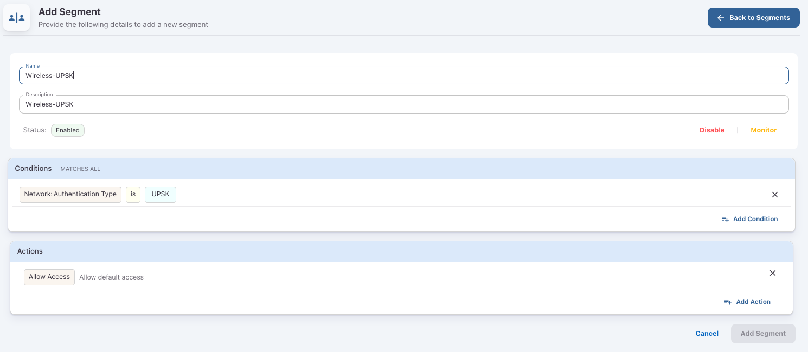

10. Finally, click on **Add Segment**.

11. You should now see **Wireless-UPSK** in the list of segments.

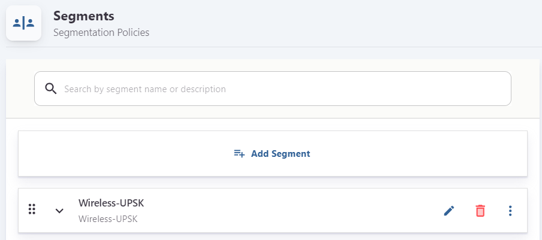

---

### 3. Create an AGNI Local User and Enroll Personal Device

In this section you will create a local user and enroll the MAC of your device.

1. In AGNI, under Identity, click on **User** and then **+ Add User**.

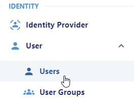

2. Fill out the sections.  Use **Arista01!** for the password.

3. **Disable** - User must change password at next login:

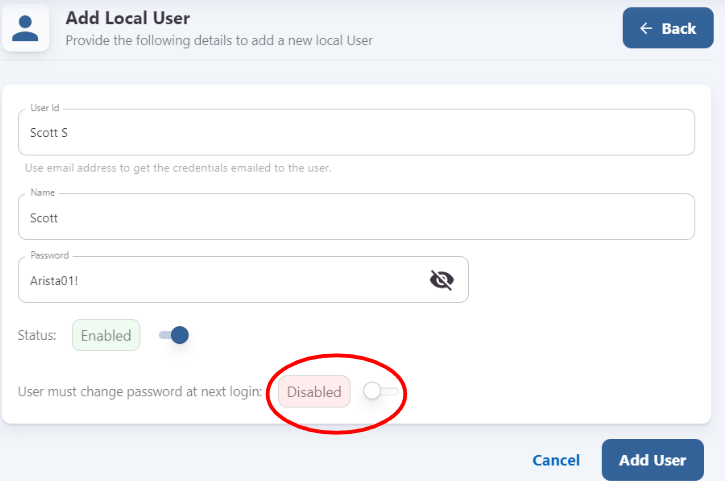

4. Click **Add User**

**NOTE: You will notice that Password has now changed to UPSK Passphrase**

5. **Copy** and write down or save to text file the new **UPSK Passphrase**.

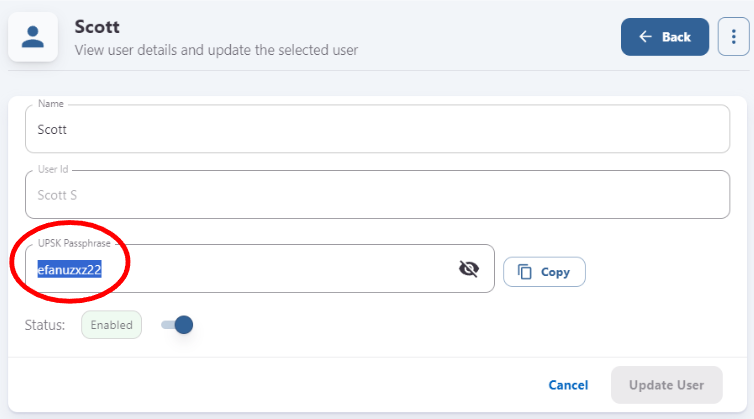

6. Next, connect your client to **ATD-##-UPSK**using your **UPSK Passphrase**.

7. Click on **Monitoring - Sessions** and validate your device connection.

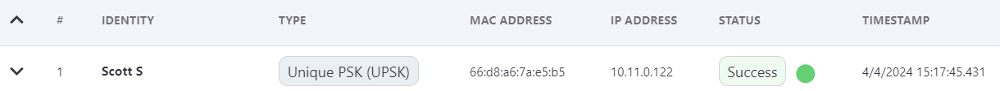
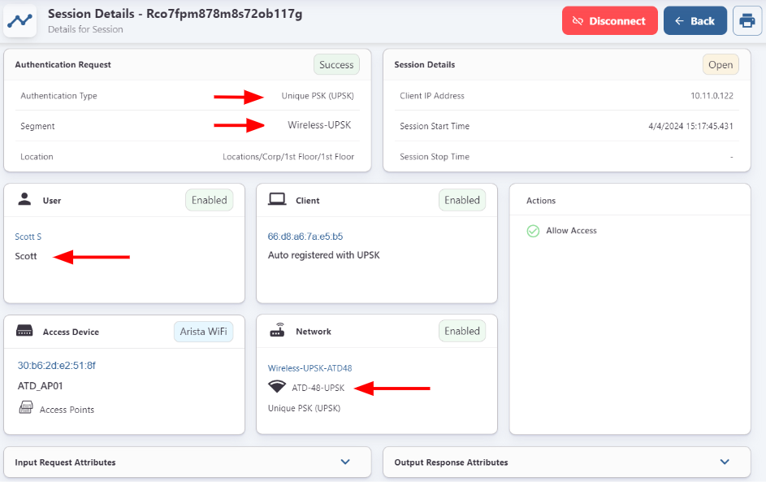

8. Next, validate your device by clicking on **User** and then **Users.  Select your user**.

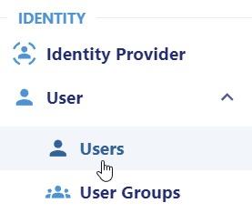

9. Click on **Show Clients**

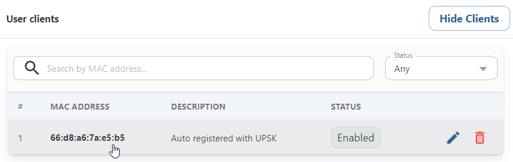

---

### 4. Create an AGNI Client Group

In this section, you will simulate your device as an IoT device.

1. **Disable and forget previously saved lab networks** so your wireless connection on your test device does not auto connect.  

2. Under your user client list, **Delete** your device.

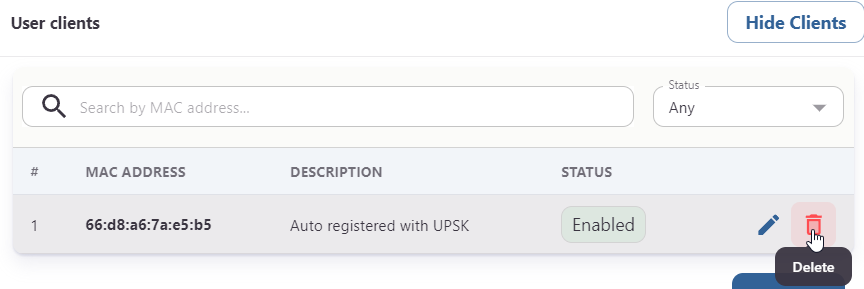
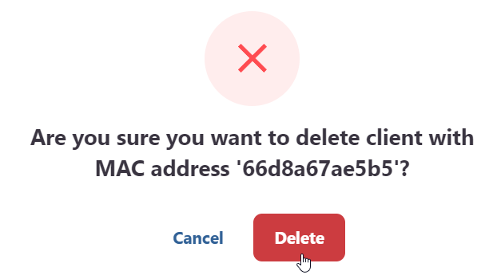

2. Next, you will **add your client device as an IoT device in a Client Group.**

First, we will need to create the Client Group.

3. In **AGNI**, under **Identity**, click on **Client Groupsv and then **+ Add**.

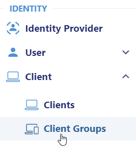

- Name: **Corp Approved Devices**  
- Description: **Corp Approved Devices**  
- User Association: **Not user associated**  

4. **Enable the Group UPSK.  Copy the UPSK Passphrase**

5. Then click on **Add Group**

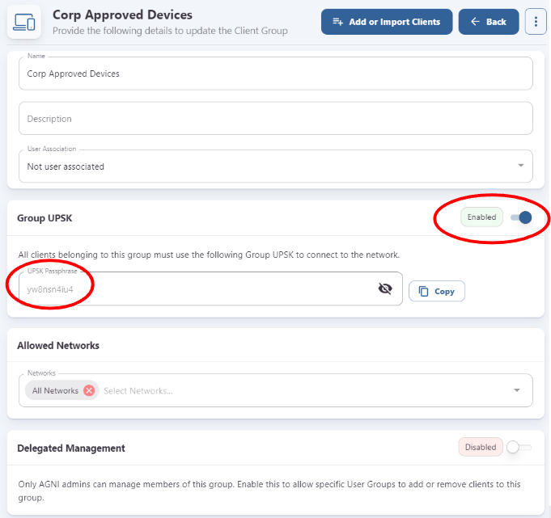

6. Next, connect your client to **ATD-##-UPSK** using the Client Group UPSK Passphrase.

7. Click on Sessions and validate your device connection.

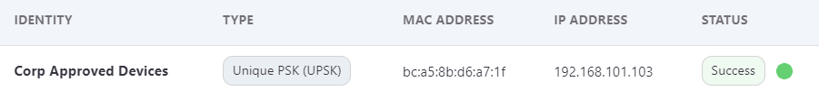
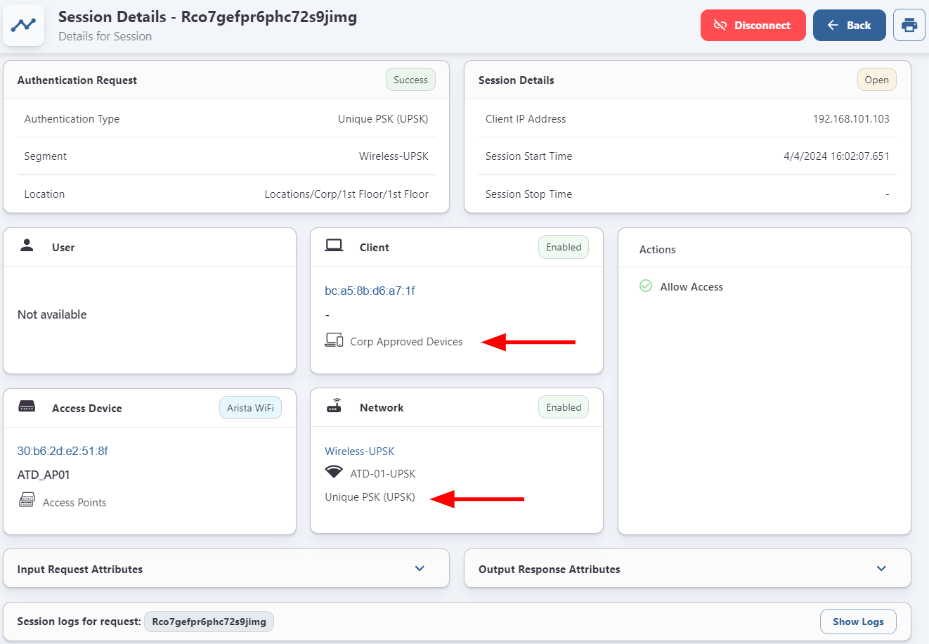

8. Next **Click on your Client**.

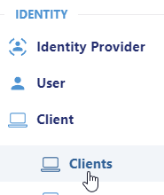)
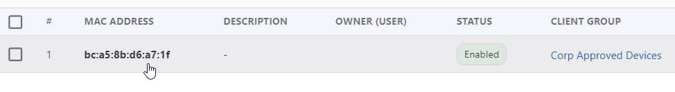

**Notice your Client Group.**  Here you have the option to change the Client Group your device belongs to.

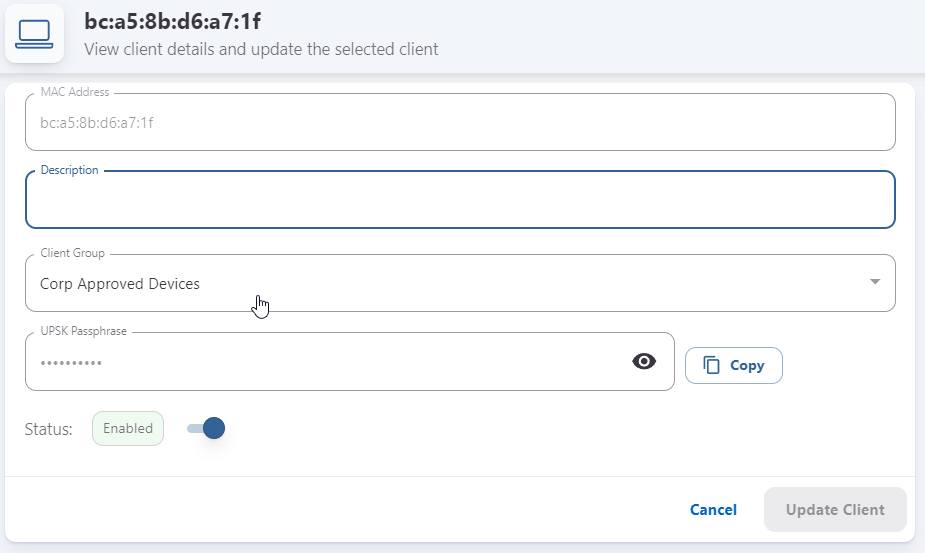

9. Next, delete your device from the **Client Group - Corp Approved Devices.**

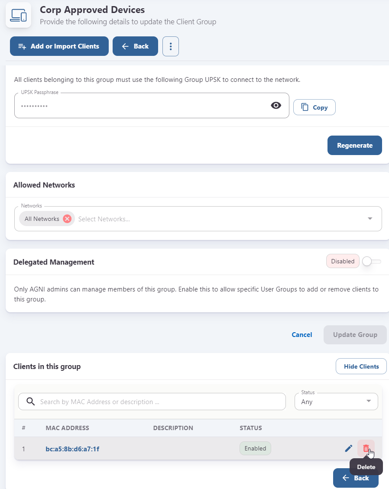
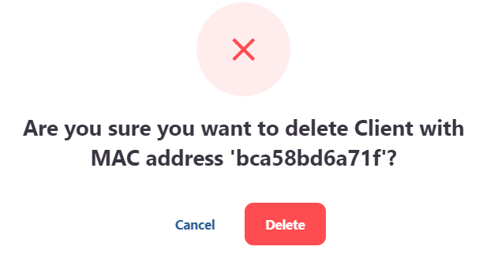

10. Next, under Identity, click on **Clients** and then **+ Add Client**.

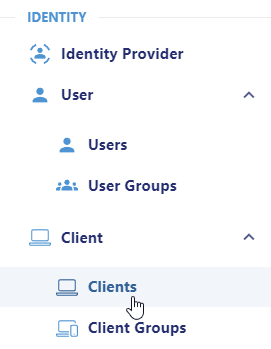

11. Select the Client Group: **Corp Approved Devices**

12. Add in the **MAC Address of your test device** like your phone that is not randomized.

13. Then select **Add Client**

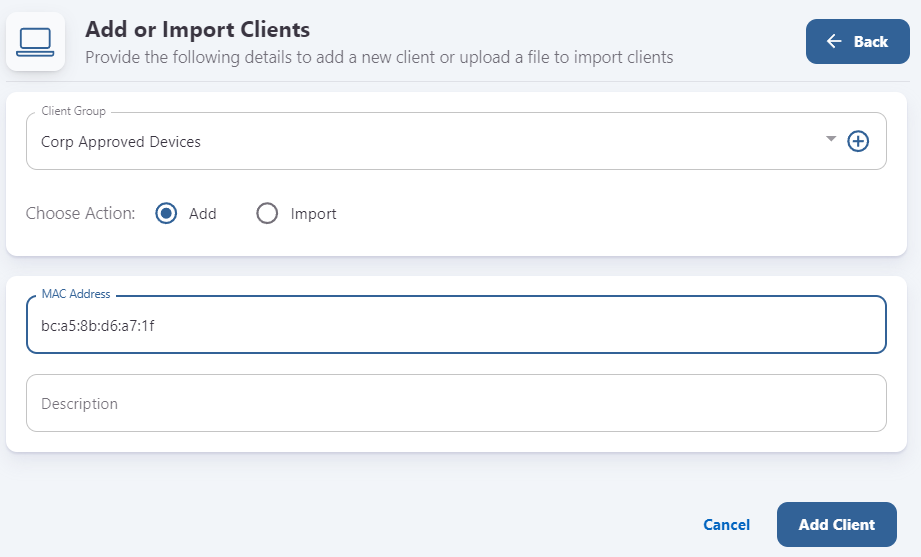

**You should see your Client was added to the Group.**

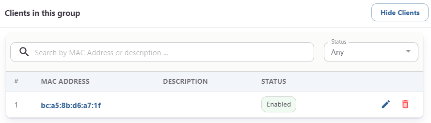

14. **Validate and Verify your connection using the Client Group UPSK Passphrase.**

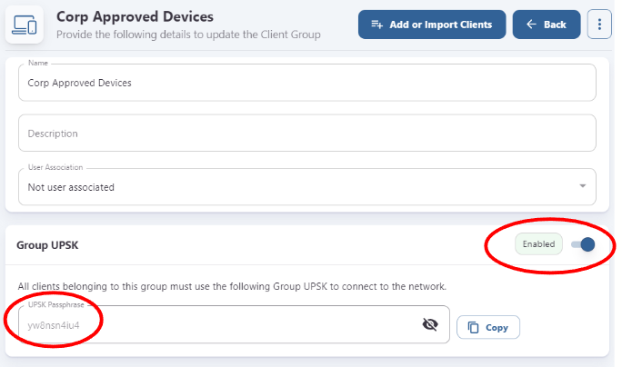
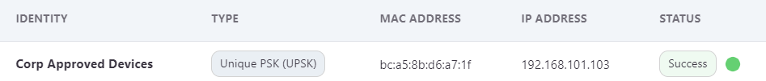
---

**NAC LAB #2 COMPLETE**
