# Campus C-03 AGNI Lab Guide

## EAP-TLS Wired Policy

This Lab Guide:

https://github.com/arista-rockies/Workshops/tree/main/Campus

---

## Table of Contents

Full Lab Topology  
POD Topology  
NAC Lab #3 - Create EAP-TLS Wired Policy  
1. Access CloudVision as a Service  
2. Enable RadSec on campus-pod<xx>-leaf1c  
3. Access AGNI from the LaunchPad.  
4. Create Wired EAP-TLS Network and Segment  
5. Validate and Verify Wired EAP-TLS Device  
Additional Information  
A. 802.1x High-Level Overview  
B. Configuring RadSec profile in EOS  
C. Adding Access Control Lists for Wired Users  

---

## Full Lab Topology

---

## POD Topology

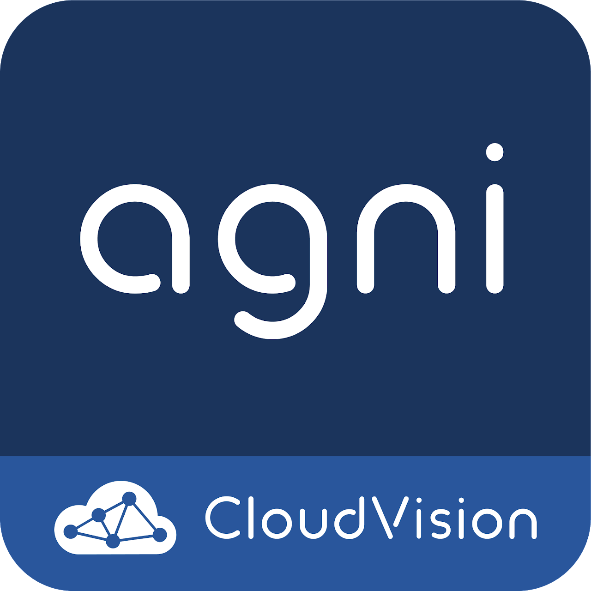

---

## NAC Lab #3 - Create EAP-TLS Wired Policy

---

### 1. Access CloudVision as a Service

In your browser, enter the following URL: https://www.arista.io/ to access CloudVision as a Service (CVaaS).

Enter the Organization name <rockies-training-##> in the “Organization” box, then click “Enter” (where ## is a 2 digit character between 01-20 that was assigned to your lab/Pod).

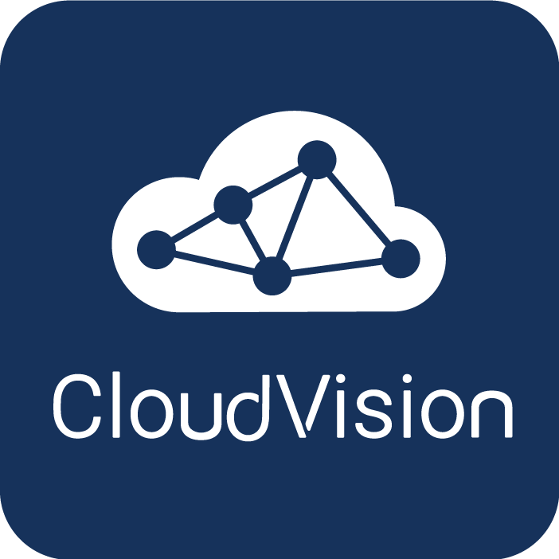

Click the Log in with Launchpad button and provide your assigned lab email address and password:

Email address format: aristarockies##+pod##@gmail.com

You will now be logged into CloudVision.

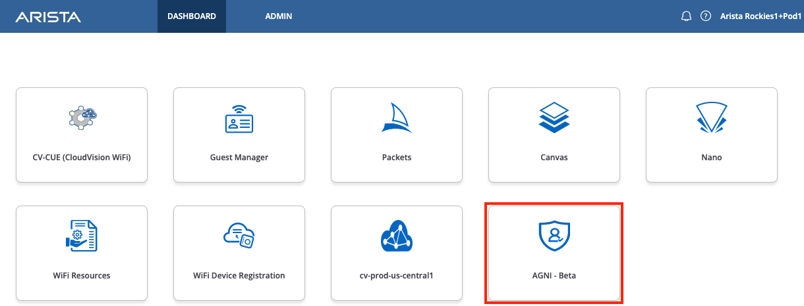

---

### 2. Enable RadSec on campus-pod<xx>-leaf1c

In this lab you will be configuring RadSec on the campus-podXX-leaf1c switches by adding the RadSec configuration to the leaf1c switches via the Static Configuration Studio.

Login to CloudVision, then click on the “Provisioning” menu option, then choose “Studios”.

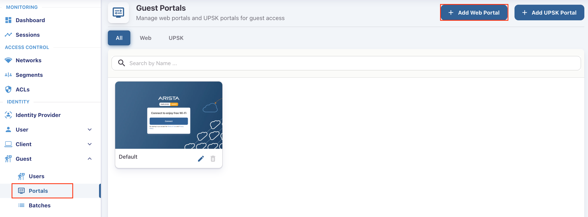

Create a workspace to propose changes to the Network Infrastructure. A workspace acts as a sandbox where you can stage your configuration changes before deploying them.

Click “Create a Workspace”, give it any name you would like and click “Create”.

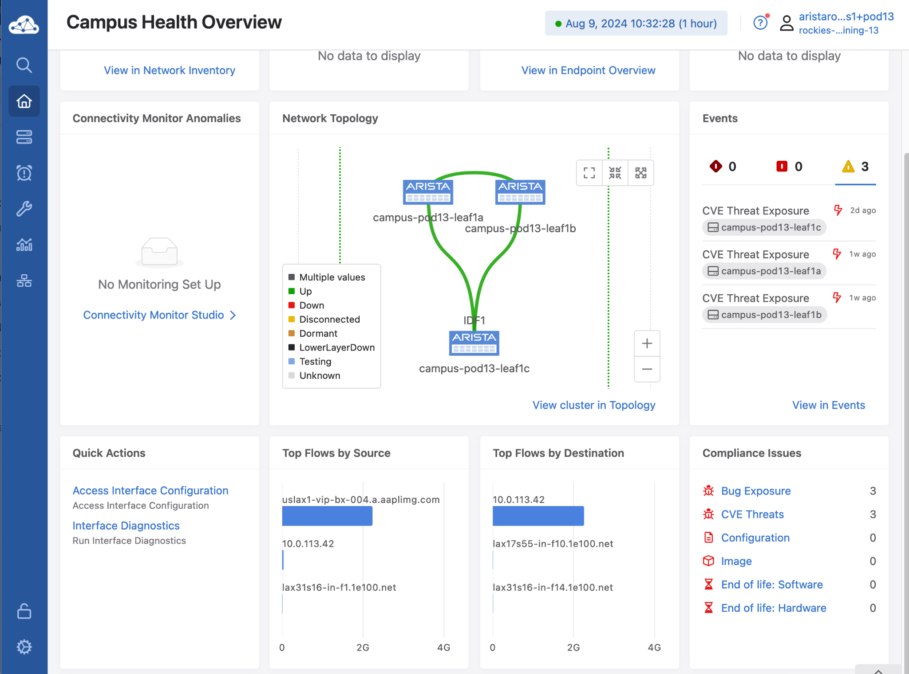

Apply the static configuration to the campus-podXX-leaf1c switch using Static Configuration Studio

Click on Studios at the Top OR Left side navigation pane

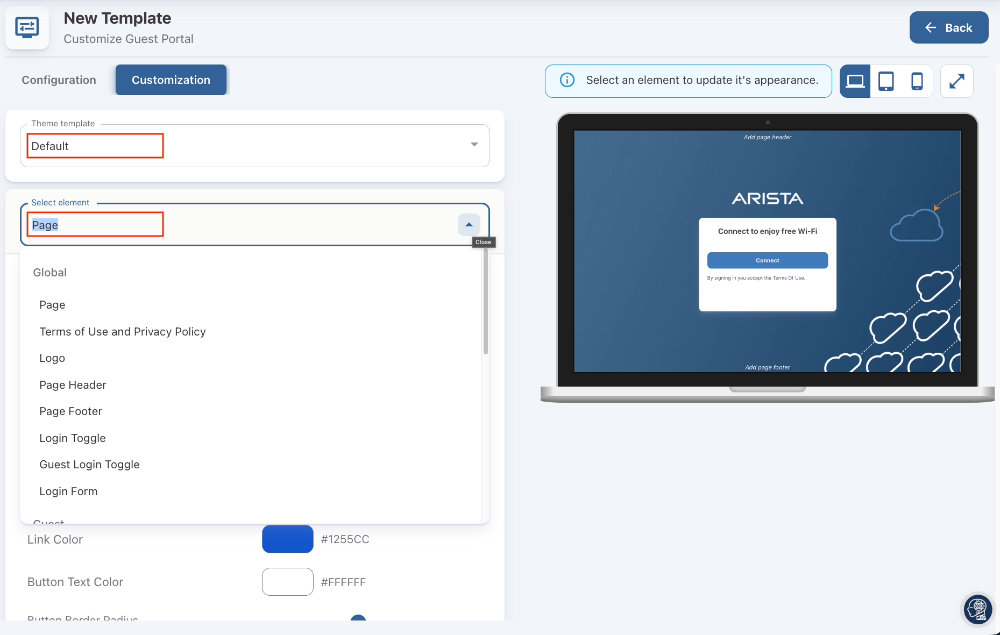

Launch the Static Configuration Studios

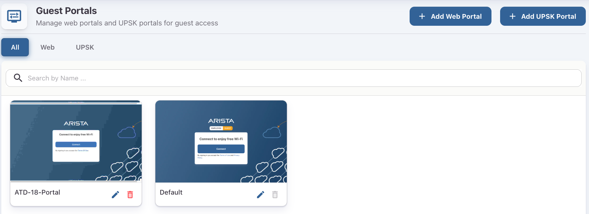

Expand the Device Container Tree and select the “Three Dots” and select “Add Device”.

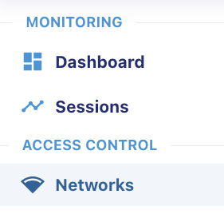

Select the radial button next to “campus-pod<xx>-leaf1c” and select “Add”

In the Device Container window, click on “+ Configlet” followed by “Configlet Library”.

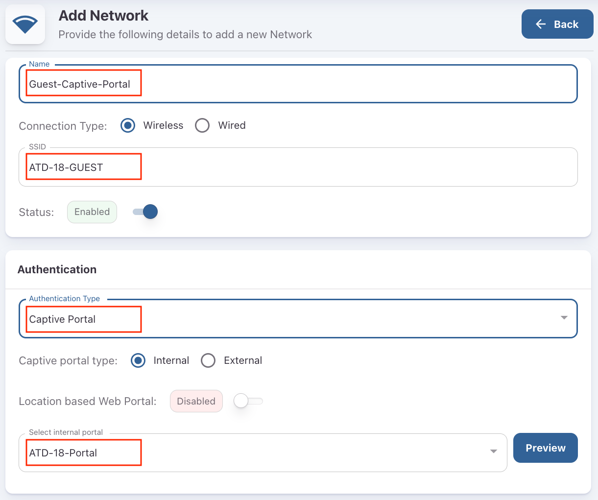

Select the Configlet named “Studios-campus-pod<xx>-radsec-config” and click Assign to add the configlet to the “campus-pod<xx>-leaf1c” switch.

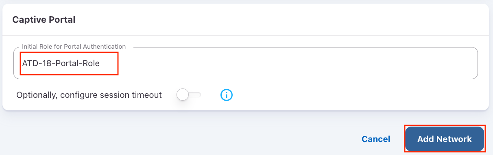

Click Review Workspace to review all the changes proposed to the CloudVision Studio

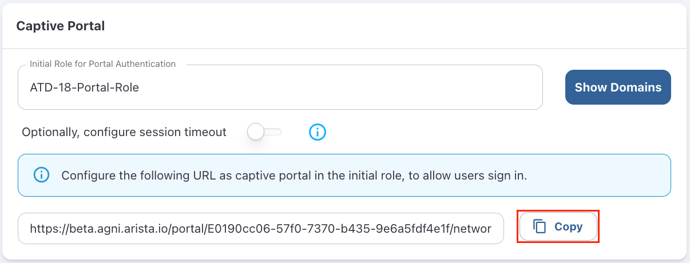

Review and Submit the Workspace

Review the workspace details showing the summary of modified studios, the build status, and the proposed configuration changes for each device.

Click “Submit Workspace”

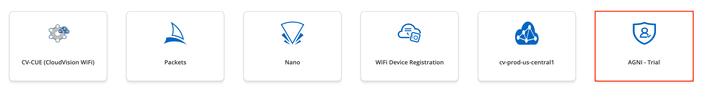

Click “View Change Control”

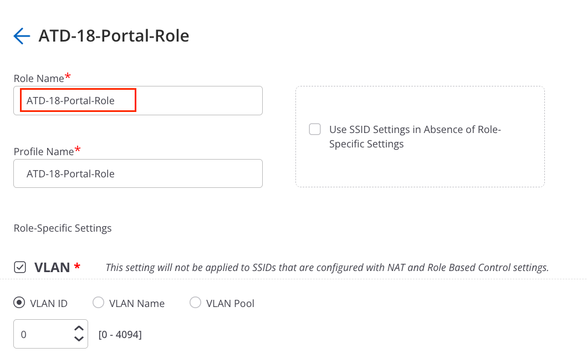

Review, Approve and Execute the Change Control to apply the configuration changes

Click “Review and Approve”

Select “Execute immediately” and click “Approve and Execute”

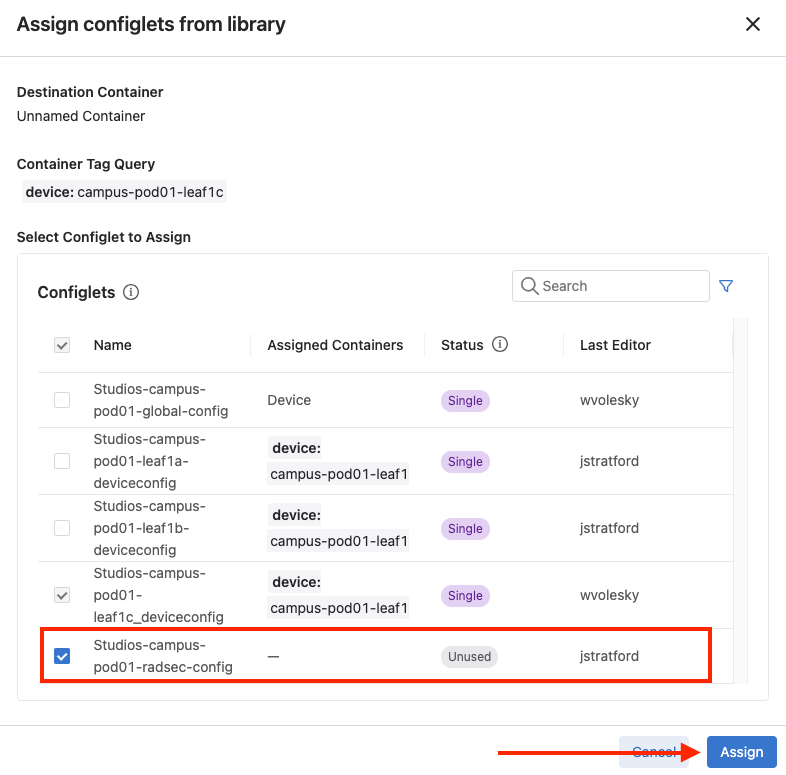

The change control will execute and apply all the RadSec configuration changes to the device. This will enable RadSec connectivity between the campus-pod<xx>-leaf1c switch and AGNI.

*Note: The switch device certificate and the AGNI RadSec root certificate have already been provisioned on the switch.

See Section B. Configuring RadSec profile in EOS for additional information.

---

### 3. Access AGNI from the LaunchPad.

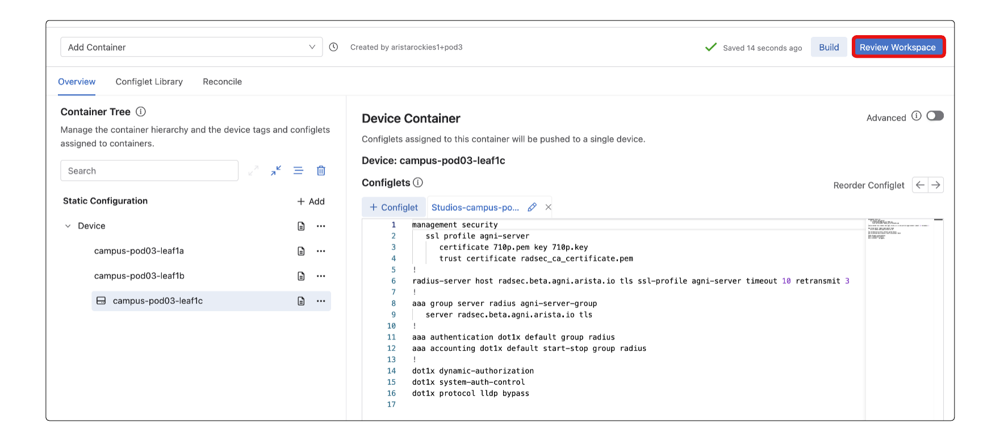

Click on Access Devices - Devices to confirm the RadSec connection is up.

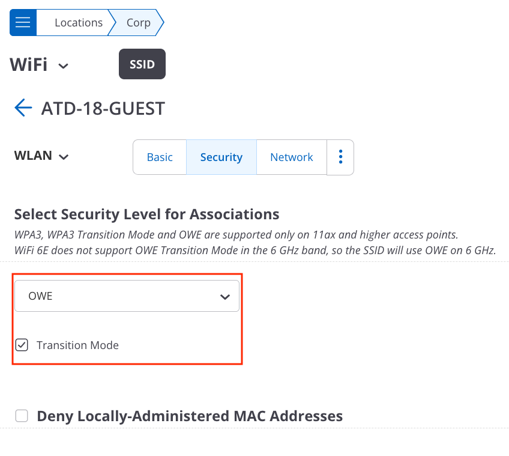

---

### 4. Create Wired EAP-TLS Network and Segment

In this section we will create a Network and Segment in Cloudvision AGNI to utilize a certificate based TLS authentication method on a wired connection with a Raspberry Pi.

Click on Networks and select + Add Network

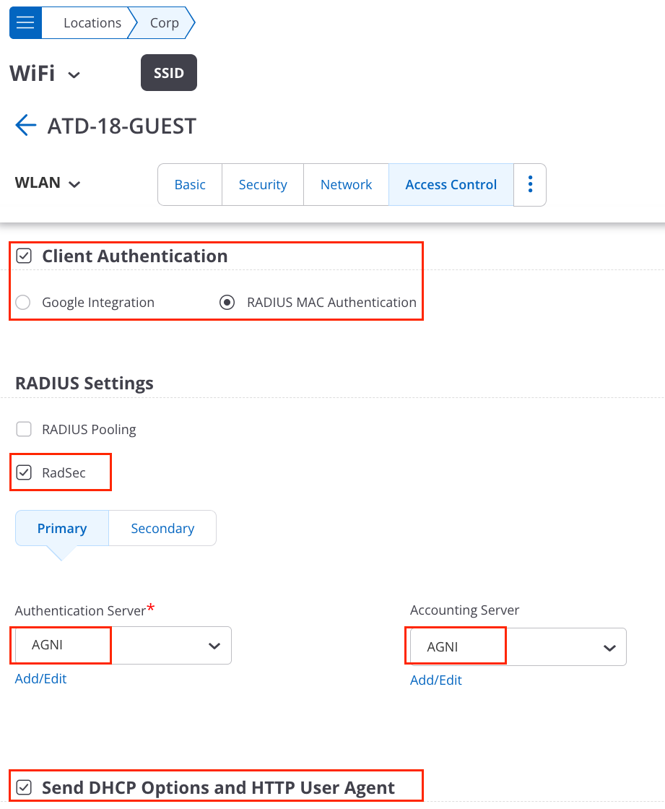

Fill in and select the Following fields on the “Add Network” page.

Name: Wired-EAP-TLS  
Connection Type: Wired  
Access Device Group: Switches  
Status: enabled  
Authentication type: Client Certificate (Eap-TLS)  
Fallback to mac Authentication: Enabled  
MAC Authentication Type: Allow Registered Clients Only  
Onboarding: Enabled  
Authorized User Groups: Employees

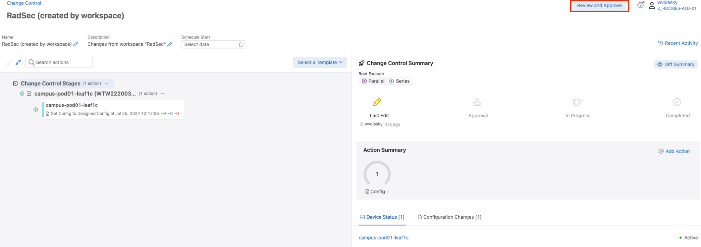

Click on Add Network at the bottom of the screen.

Next, click on Segments and then + Add Segment

Next, type in the name: Wired-EAP-TLS and the Description as well.

Next, let’s Add Conditions.  Note: Adding more than one condition means MATCH ALL

Select, Network, Name, Is, Wired-EAP-TLS from the drop down lists.

Let’s add one more condition.

Select, Network, Authentication Type, Is, Client Certificate (EAP-TLS) from the drop down lists.

Under Actions select Add Action.

Select Allow Access.

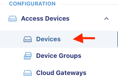

Finally, select Add Segment at the bottom of the page.

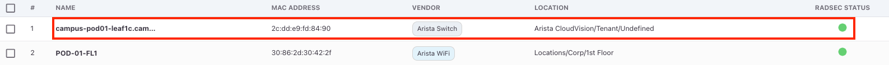

You should now be able to expand and review your segment.

Next, unplug and plug your raspberry Pi into port 2 on the switch and click on Sessions to see if your ATD Raspberry Pi has a connection via the Wired connection.  *Note: The Client Certificate has already been applied to the Raspberry Pi.

---

### 5. Validate and Verify Wired EAP-TLS Device

Once the device is connected you will be able to view the status of the connection and additional session details if you click on the Eye to the right of the device.

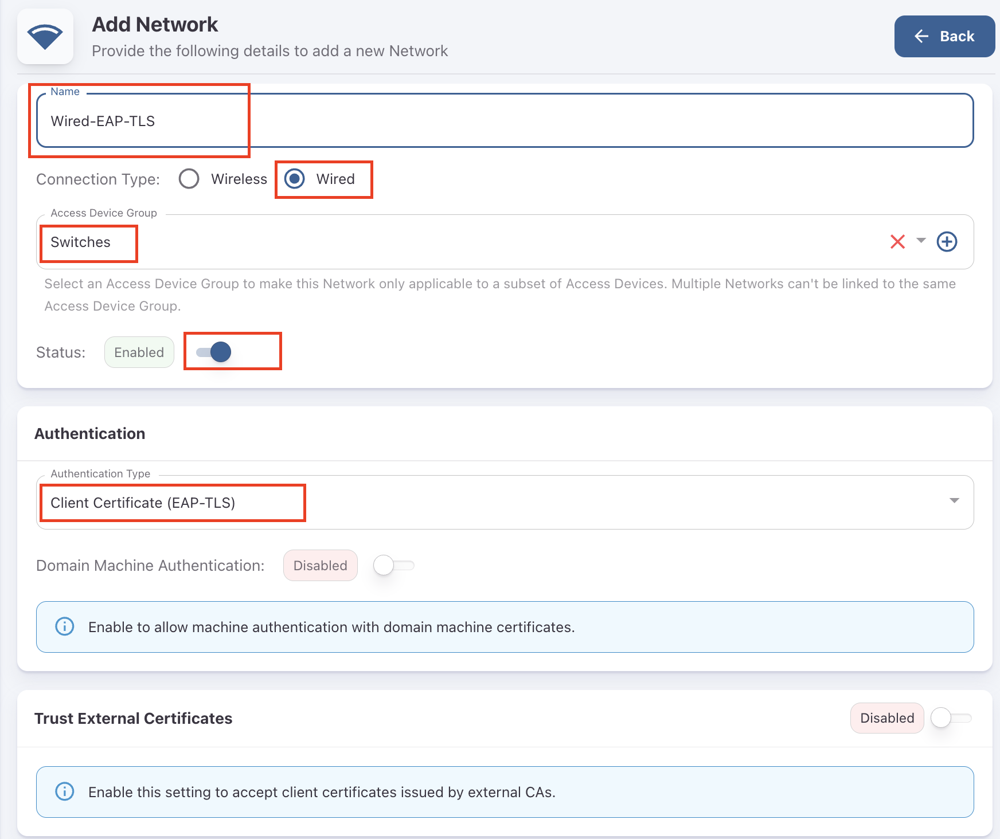

AGNI will then display more in depth session information regarding the device and connection.

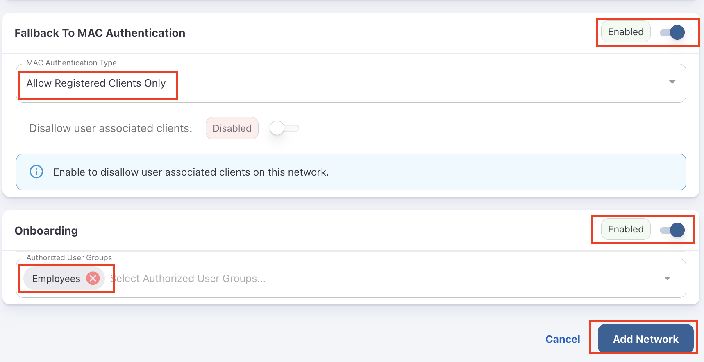

You can also validate the session on the switch by issuing the following commands in the switch CLI

710P-16P#show dot1x host

Port Supplicant MAC Auth State Fallback VLAN

Et2 d83a.dd98.6183 EAPOL SUCCESS NONE

710P-16P#sh dot1x host mac d83a.dd98.6183 detail
Operational:
Supplicant MAC: d83a.dd98.6183
User name: aristaatd01@outlook.com
Interface: Ethernet2
Authentication method: EAPOL
Supplicant state: SUCCESS
Fallback applied: NONE
Calling-Station-Id: D8-3A-DD-98-61-83
Reauthentication behaviour: DO-NOT-RE-AUTH
Reauthentication interval: 0 seconds
VLAN ID:
Accounting-Session-Id: 1x00000004
Captive portal:

AAA Server Returned:
Arista-WebAuth:
Class: Rcnlkerh9ci3s72u197e0|C4151a596-baab-444b-a4fd-ad40946d8b5f
Filter-Id:
Framed-IP-Address: 192.168.101.21 sourceArp
NAS-Filter-Rule:
Service-Type: None
Session-Timeout: 86400 seconds
Termination-Action: RADIUS-REQUEST
Tunnel-Private-GroupId:
Arista-PeriodicIdentity:

---

NAC LAB #3 COMPLETE