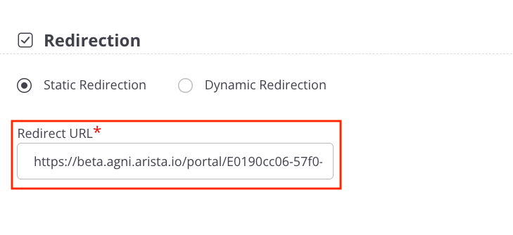

# Campus C-03 AGNI Lab Guide
## Wireless Guest Captive Portal

 

---

## This Lab Guide: [Campus C-03 AGNI Lab Guide - Wireless Guest Captive Portal](https://github.com/arista-rockies/Workshops/blob/main/Campus/2026_Campus_Workshop/C-03/2026_Campus_C-03_AGNI_Lab_Guide-Wireless_Guest_Captive_Porta.md)

## Table of Contents

[Full Lab Topology](#full-lab-topology)  
[POD Topology](#pod-topology)  

---

## NAC Lab #3 - Configuring Guest Captive Portal
1. [Create a Guest Portal in AGNI](#1-create-a-guest-portal-in-agni)  
2. [Create a Network in AGNI](#2-create-a-network-in-agni)  
3. [Create a Role Profile in CV-CUE](#3-create-a-role-profile-in-cv-cue)  
4. [Create a SSID in CV-CUE](#4-create-a-ssid-in-cv-cue)  

---

## Full Lab Topology

---

## POD Topology

---

## NAC Lab #3 - Configuring Guest Captive Portal

## 1. Create a Guest Portal in AGNI

1. Return to the **LaunchPad**, and select the **AGNI - Trial** tile, or go to your **AGNI** tab in your browser.

2. Navigate to **Identity \> Guest \> Portals**.

In **Guest Portals**, the **Default** portal is always present. Let’s create a new guest portal.

3. Click the **Add Web Portal** button. 

- In the **Configuration** tab, provide the Portal Name \- **ATD-\#\#-Portal** (where **\#\#** is a 2 digit character between 01-20 that was assigned to your lab/Pod).

- Click in the **Authentication Types** drop down box to see the available authentication types. We'll use **Clickthrough** for this lab.

- In the **Post-Authentication Redirect URL** box, enter **https://www.arista.com**.

4. Then select **Customization**

5. The available Theme templates are **Default** or **Split Screen**. Select **Default**.

6. Click in the **Select element** drop down box to see the available options to customize the portal settings..

* **Page**  
* **Login Toggle**  
* **Terms of Use and Privacy Policy**  
* **Logo**  
* **Guest Login Submit Button**

7. When done, click **Add Web Portal.** 

8. Click **\<-- Back** to see the new Guest Portal listing.

## 2. Create a Network in AGNI

1. Navigate to the **Access Control \> Networks.**

2. Click on **Networks** and then **\+ Add**.

                                     

3. Add the following:

- Name: **Guest Captive Portal**  
- Connection Type: **Wireless**  
- SSID: **ATD-\#\#-GUEST**  
**Authentication**  
- Authentication Type: **Captive Portal**  
- Captive Portal Type: **Internal**  
- Select internal portal: **ATD-\#\#-Portal**  
**Captive Portal**  
- Initial Role for Portal Authentication: **ATD-\#\#-Portal-Role**  
4. Click **Add Network**	  

 
 

5. **Copy** the **portal URL** at the bottom of the page

**Keep the browser tab for AGNI open.** We’ll return to get the Domains allowlist for the Role Profile in CV-CUE.

## 3. Create a Role Profile in CV-CUE

1. Return to the **LaunchPad**, and select the **CV-CUE** tile, or go to your **CV-CUE** tab in your browser. 

2. In **CV-CUE**, navigate to **Configure \> Network Profiles \> Role Profile.**

3. **Add** Role Profile.

- Add the Role Name as **ATD-\#\#-Portal-Role.**

-  Enable the **Redirection** check box and select **Static Redirection.**

- In the **Redirect URL** field, add the portal URL \- copied from AGNI.

**NOTE:** Role Profiles are case sensitive.

**Keep the browser tab for CV-CUE open.**

4. Return to the **AGNI tab.** From the **Guest Captive Portal** network in **AGNI**, click on **Show Domains**, click on **Copy** to copy the Domains that must be allowlisted.

5. Return to the **CV-CUE Role Profile** tab
- enable the **HTTPS Redirection** check box.

- In the **Websites That Can Be Accessed Before Authentication** field, paste the Domains allowlist you copied from AGNI.

6. Click **Save** to save the **Role Profile**.

## 4. Create a SSID in CV-CUE

1. Navigate to **Configure \> WiFi.**

2. Add a new SSID by clicking on **Add SSID.**

- Provide the SSID Name — **ATD-\#\#-GUEST.**

3. Next, Click on **Security**, then select **OWE Transition Mode.**

**Opportunistic Wireless Encryption (OWE) Transition Mode**  enables a seamless, secure migration from open, unencrypted Wi-Fi to encrypted Wi-Fi (Enhanced Open) without requiring manual network changes by users. It allows OWE-capable devices to use encryption while legacy devices still connect via traditional open methods.

4. Next, Click on the **3 Blue Dots** next to the Network tab.  

5. Click on the **Access Control** tab.

- Enable the **Client Authentication** check box and select **RADIUS MAC Authentication.**

- Select **RadSec.**

- Select the **Authentication** and **Accounting** servers. 

- Select **Send DHCP Options and HTTP User Agent**.

 

- Select the **Role Based Control** checkbox and configure the following settings: 

* Rule Type — **802.1X Default VSA**  
* Operand — **Match**  
* Role — **ATD-\#\#-Portal-Role**. You created the **Portal** role profile while configuring the Role-Profile in the previous section.

* Select the **Client Isolation** checkbox.

 

6. Finally, Click on **Save & Turn SSID On**.

  

**NOTE - Please Read!**  

7. **Only select the “5 GHz” option** on the next screen (**uncheck** the 2.4 & 6GHz boxes), then click “**Turn SSID On**”.

8. **Using your Laptop or Cellphone, connect to the ATD-\#\#-GUEST Captive Portal network.**

9. **Next, Go to Monitoring - Sessions in AGNI and select your Captive Portal session to see your client session details.**

**NAC LAB #3 COMPLETE**
