# Campus C-03 AGNI Lab Guide - Wireless Guest Captive Portal

 

#### This Lab Guide:
Campus/2026_Campus_Workshop/C-03/Rockies Campus C-03 AGNI Lab Guide - Wireless Guest Captive Portal

---

## Table of Contents

Full Lab Topology  
POD Topology

NAC Lab #3 - Configuring Guest Captive Portal  
1. Create a Guest Portal in AGNI  
2. Create a Network in AGNI  
3. Create a Role Profile in CV-CUE  
4. Create a SSID in CV-CUE  

---

## Full Lab Topology

---

## POD Topology

---

## NAC Lab #3 - Configuring Guest Captive Portal

## 1. Create a Guest Portal in AGNI

Return to the LaunchPad tab and Log into AGNI [https://launchpad.wifi.arista.com/](https://launchpad.wifi.arista.com/), or access the AGNI tab in your browser.

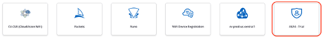

Navigate to **Identity \> Guest \> Portals**.

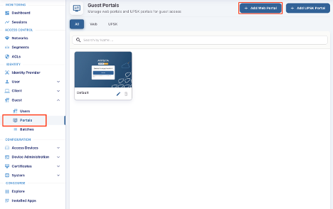

In **Guest Portals**, the **Default** portal is always present. Let’s create a new guest portal.

Click the **Add Web Portal** button. 

In the **Configuration** tab, provide the Portal Name \- **ATD-\#\#-Portal** (where \#\# is a 2 digit character between 01-20 that was assigned to your lab/Pod).

Click in the **Authentication Types** drop down box to see the available authentication types. We'll use **Clickthrough** for this lab.

In the **Post-Authentication Redirect URL** box, enter **https://www.arista.com**.

Then select **Customization**

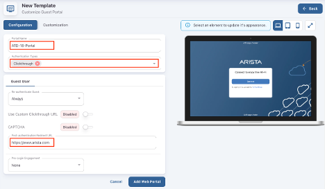

The available Theme templates are **Default** or **Split Screen**. Select **Default**.

Click in the **Select element** drop down box to see the available options to customize the portal settings..

* **Page**  
* **Login Toggle**  
* **Terms of Use and Privacy Policy**  
* **Logo**  
* **Guest Login Submit Button**

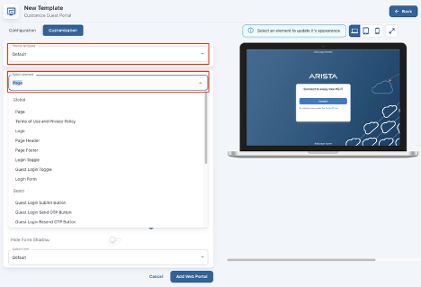

When done, click **Add Web Portal.** 

Click **\<-- Back** to see the new Guest Portal listing.

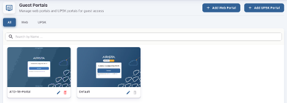

## 2. Create a Network in AGNI

Navigate to the **Access Control \> Networks.**

Click on **Networks** and then **\+ Add**.

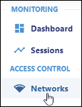                                     

Add the following:

Name: **Guest Captive Portal**  
Connection Type: **Wireless**  
SSID: **ATD-\#\#-GUEST**  
**Authentication**  
Authentication Type: **Captive Portal**  
Captive Portal Type: **Internal**  
Select internal portal: **ATD-\#\#-Portal**  
**Captive Portal**  
Initial Role for Portal Authentication: **ATD-\#\#-Portal-Role**  
Click **Add Network**	  
  
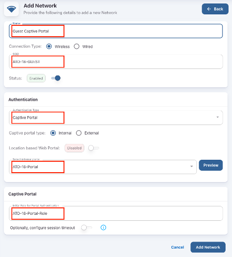 

Copy the portal URL at the bottom of the page.  
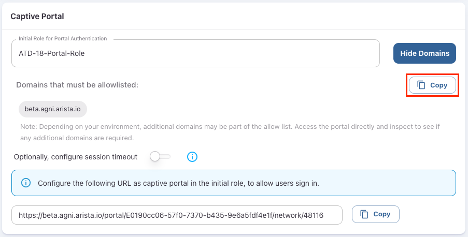

**Keep the browser tab for AGNI open.** We’ll return to get the Domains allowlist for the Role Profile in CV-CUE.

## 3. Create a Role Profile in CV-CUE

Return to the LaunchPad tab and Log into CV-CUE [https://launchpad.wifi.arista.com/](https://launchpad.wifi.arista.com/), or access the CV-CUE tab in your browser. 

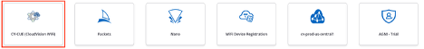

In **CV-CUE**, navigate to **Configure \> Network Profiles \> Role Profile.**

**Add** Role Profile.

Add the Role Name as **ATD-\#\#-Portal-Role.**

Enable the **Redirection** check box and select **Static Redirection.**

In the **Redirect URL** field, add the portal URL \- copied from AGNI.

**NOTE:** Role Profiles are case sensitive.

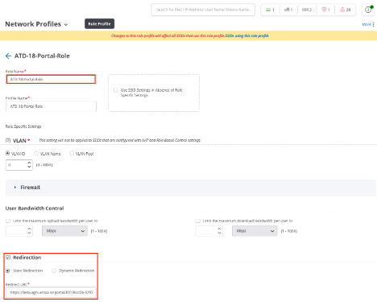

**Keep the browser tab for CV-CUE open.**

Return to the **AGNI tab.** From the **Guest Captive Portal** network in **AGNI**, click on **Show Domains**, click on **Copy** to copy the Domains allowlist.

Return to the **CV-CUE tab**, enable the **HTTPS Redirection** check box.

In the **Websites That Can Be Accessed Before Authentication** field, paste the Domains allowlist you copied from AGNI.

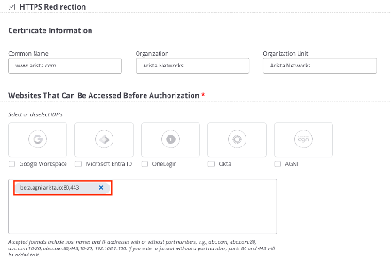

Click **Save** to save the **Network Profile**.

## 4. Create a SSID in CV-CUE

Navigate to **Configure \> WiFi.**

Add a new SSID by clicking on **Add SSID.**

Provide the SSID Name — **ATD-\#\#-GUEST.**

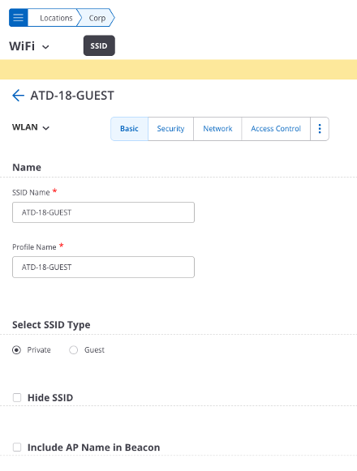

Next, Click on **Security**, then select **OWE Transition Mode.**

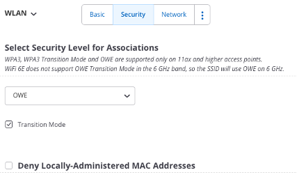

[Opportunistic Wireless Encryption (OWE) Transition Mode](#full-lab-topology) Opportunistic Wireless Encryption (OWE) Transition Mode enables a seamless, secure migration from open, unencrypted Wi-Fi to encrypted Wi-Fi (Enhanced Open) without requiring manual network changes by users. It allows OWE-capable devices to use encryption while legacy devices still connect via traditional open methods.

Next, Click on the **3 Blue Dots** next to the Network tab.  

Click on the **Access Control** tab.

Enable the **Client Authentication** check box and select **RADIUS MAC Authentication.**

Select **RadSec.**

Select the **Authentication** and **Accounting** servers. 

Select **Send DHCP Options and HTTP User Agent**.

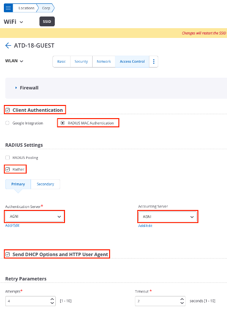 

Select the **Role Based Control** checkbox and configure the following settings: 

* Rule Type — **802.1X Default VSA**  
* Operand — **Match**  
* Role — **ATD-\#\#-Portal-Role**. You created the **Portal** role profile while configuring the Role Profile in the previous section.

Select the **Client Isolation** checkbox.

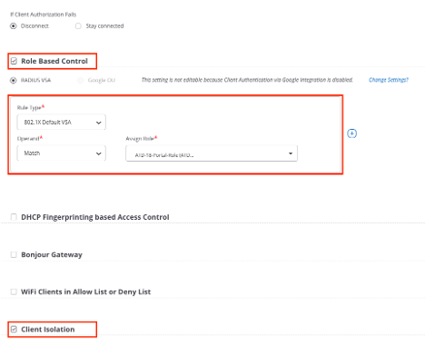 

Finally, Click on **Save & Turn SSID On,** then **Customize**.

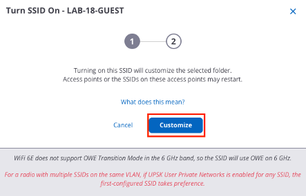  

**Please Read\!**  
**Only select the “5 GHz” option** on the next screen (**uncheck** the 2.4 & 6GHz boxes), then click “**Turn SSID On**”.

**Using your Laptop or Cellphone, connect to the ATD-\#\#-GUEST Captive Portal network.**

**Next, Go to Monitoring - Sessions in AGNI and select your Captive Portal session to see your client session details.**

NAC LAB #3 COMPLETE
