# Campus C-04 AGNI Lab Guide EAP-TLS Wired Policy


  


#### This Lab Guide:
Campus/2026_Campus_Workshop/C-04/Rockies Campus C-04 AGNI Lab Guide - EAP-TLS Wired Policy

---

## Table of Contents

Full Lab Topology  
POD Topology

## NAC Lab #4 - Create EAP-TLS Wired Policy  
1. Access CloudVision as a Service  
2. Enable RadSec on campus-pod<xx>-leaf1c  
3. Access AGNI from the LaunchPad.  
4. Create Wired EAP-TLS Network and Segment  
5. Validate and Verify Wired EAP-TLS Device
    
## Additional Information  
A. 802.1x High-Level Overview  
B. Configuring RadSec profile in EOS  
C. Adding Access Control Lists for Wired Users  

---

## Full Lab Topology


---

## POD Topology


---

## NAC Lab #4 - Create EAP-TLS Wired Policy


### 1. Access CloudVision as a Service

In your browser, enter the following URL: https://www.arista.io/ to access CloudVision as a Service (CVaaS).

Enter the Organization name <rockies-training-##> in the “Organization” box, then click “Enter” (where ## is a 2 digit character between 01-20 that was assigned to your lab/Pod).


Click the Log in with Launchpad button and provide your assigned lab email address and password:

Email address format: aristarockies##+pod##@gmail.com


You will now be logged into CloudVision.

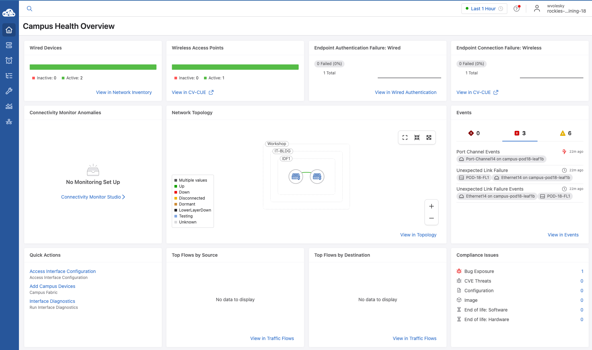

---

### 2. Enable RadSec on campus-pod<xx>-leaf1c

In this lab you will be configuring RadSec on the campus-podXX-leaf1c switches by adding the RadSec configuration to the leaf1c switches via the Static Configuration Studio.

Login to CloudVision, then click on the “Provisioning” menu option, then choose “Studios”.

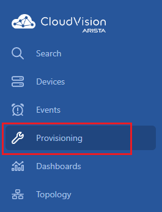


Create a workspace to propose changes to the Network Infrastructure. A workspace acts as a sandbox where you can stage your configuration changes before deploying them.

Click “Create a Workspace”, give it any name you would like and click “Create”.

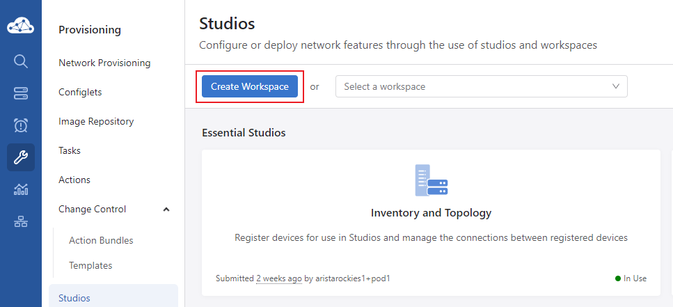
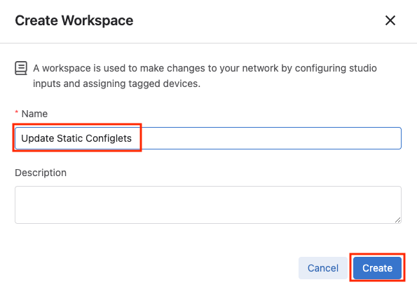

Apply the static configuration to the campus-podXX-leaf1c switch using Static Configuration Studio

Click on Studios at the Top OR Left side navigation pane

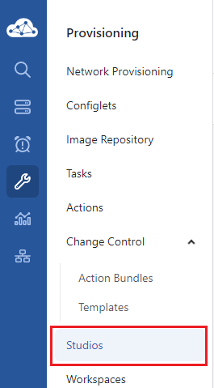
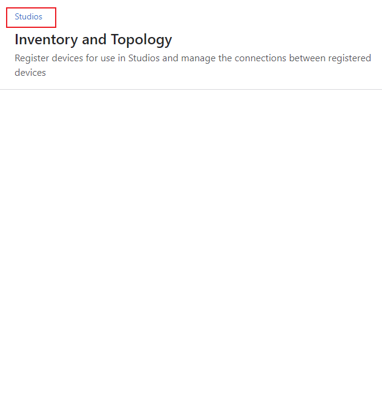

Launch the Static Configuration Studios

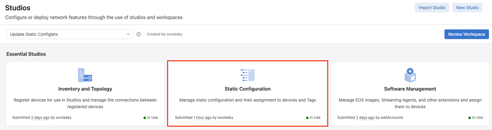

Expand the Device Container Tree and select the “Three Dots” and select “Add Device”.

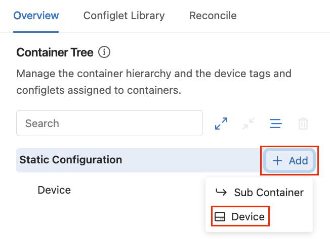

Select the radial button next to “campus-pod<xx>-leaf1c” and select “Add”

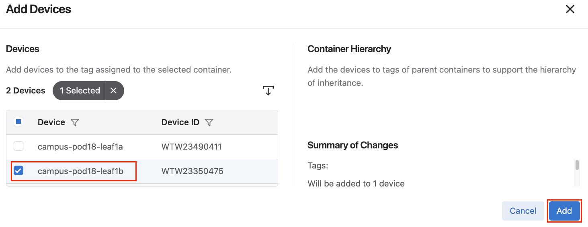

In the Device Container window, click on “+ Configlet” followed by “Configlet Library”.

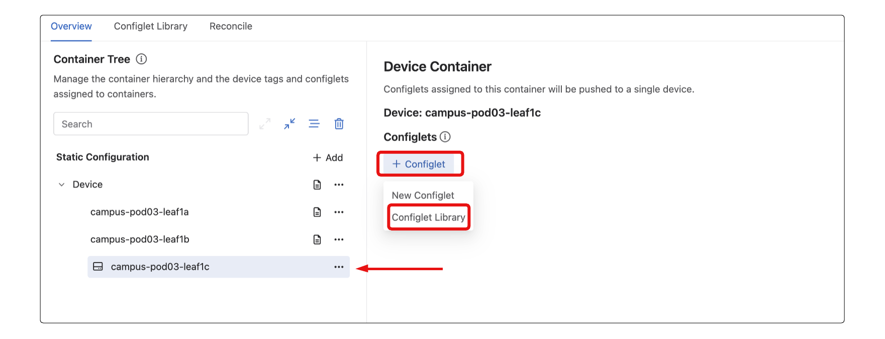

Select the Configlet named “Studios-campus-pod<xx>-radsec-config” and click Assign to add the configlet to the “campus-pod<xx>-leaf1c” switch.

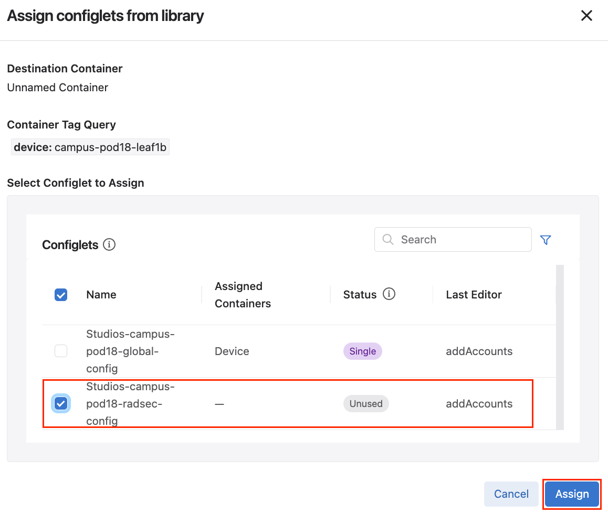

Click Review Workspace to review all the changes proposed to the CloudVision Studio

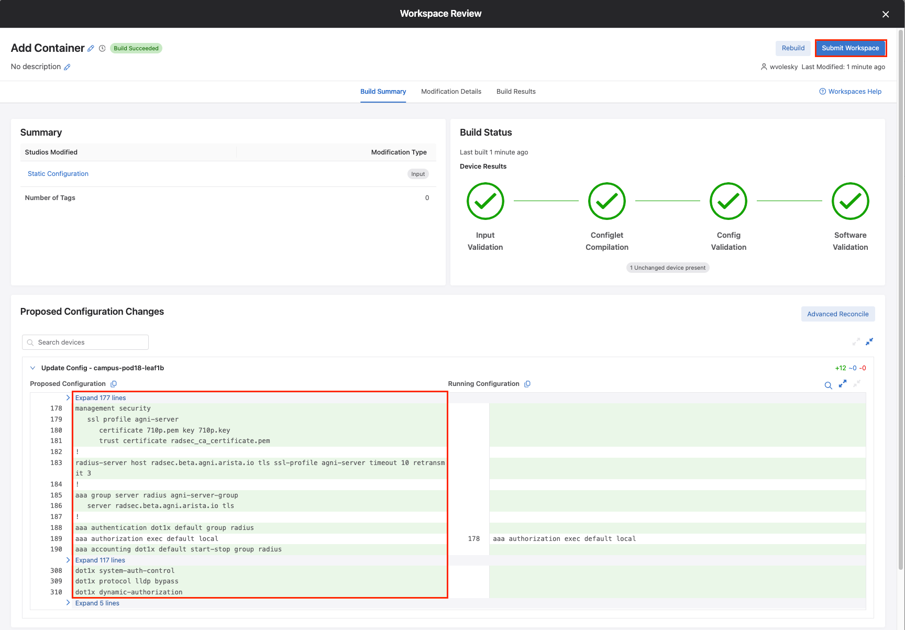

Review and Submit the Workspace

Review the workspace details showing the summary of modified studios, the build status, and the proposed configuration changes for each device.

Click “Submit Workspace”

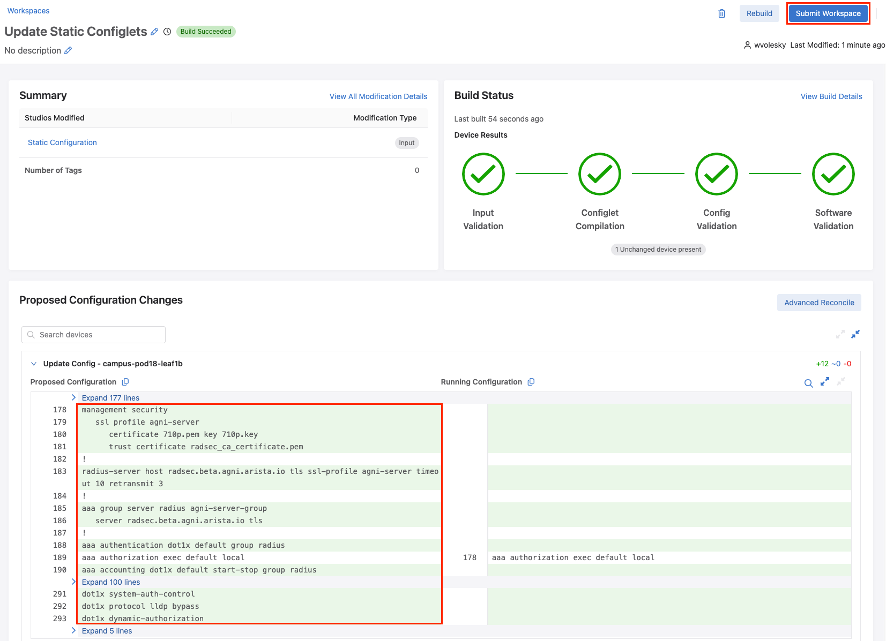

Click “View Change Control”

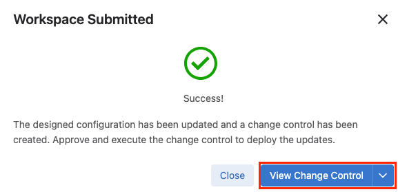

Review, Approve and Execute the Change Control to apply the configuration changes

Click “Review and Approve”

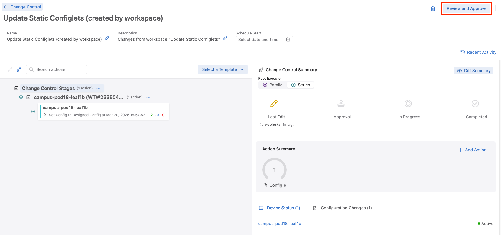

Select “Execute immediately” and click “Approve and Execute”

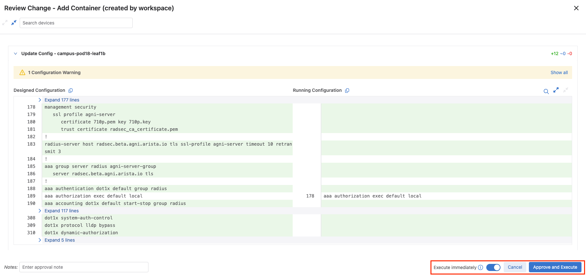

The change control will execute and apply all the RadSec configuration changes to the device. This will enable RadSec connectivity between the campus-pod<xx>-leaf1c switch and AGNI.

*Note: The switch device certificate and the AGNI RadSec root certificate have already been provisioned on the switch.

See Section B. Configuring RadSec profile in EOS for additional information.

---

### 3. Access AGNI from the LaunchPad.

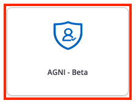

Click on Access Devices - Devices to confirm the RadSec connection is up.


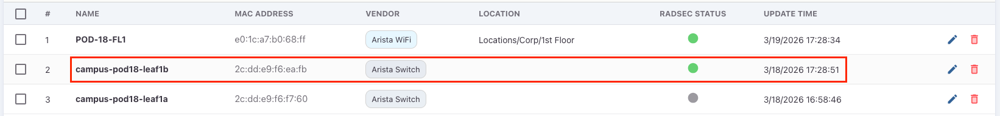

---

### 4. Create Wired EAP-TLS Network and Segment

In this section we will create a Network and Segment in Cloudvision AGNI to utilize a certificate based TLS authentication method on a wired connection with a Raspberry Pi.

Click on Networks and select + Add Network


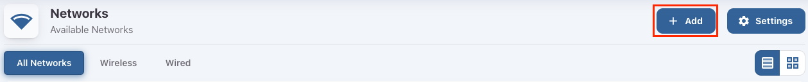

Fill in and select the Following fields on the “Add Network” page.

Name: Wired-EAP-TLS  
Connection Type: Wired  
Access Device Group: Switches  
Status: enabled  
Authentication type: Client Certificate (Eap-TLS)  
Fallback to mac Authentication: Enabled  
MAC Authentication Type: Allow Registered Clients Only  
Onboarding: Enabled  
Authorized User Groups: Employees

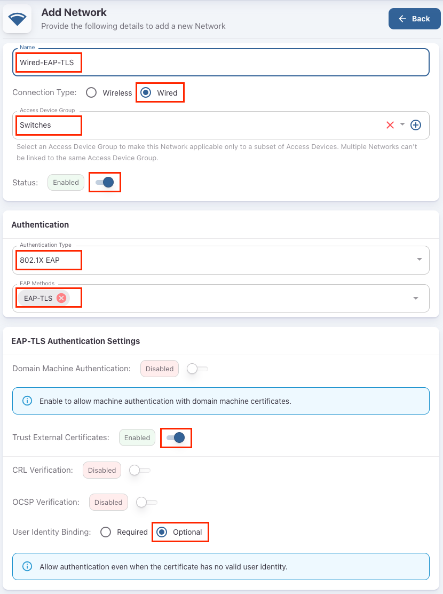


Click on Add Network at the bottom of the screen.


Next, click on Segments and then + Add Segment


Next, type in the name: Wired-EAP-TLS and the Description as well.

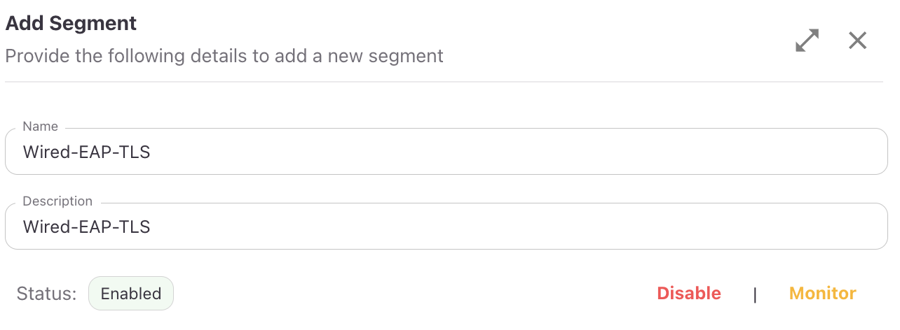

Next, let’s Add Conditions.  Note: Adding more than one condition means MATCH ALL


Select, Network, Name, Is, Wired-EAP-TLS from the drop down lists.

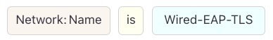


Let’s add one more condition.


Select, Network, Authentication Type, Is, Client Certificate (EAP-TLS) from the drop down lists.

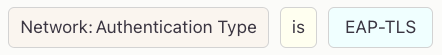

Your Conditions should now look like this.

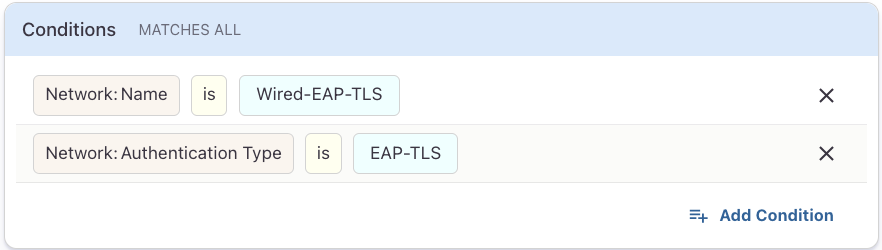

Under Actions select Add Action.


Select Allow Access.


Finally, select Add Segment at the bottom of the page.

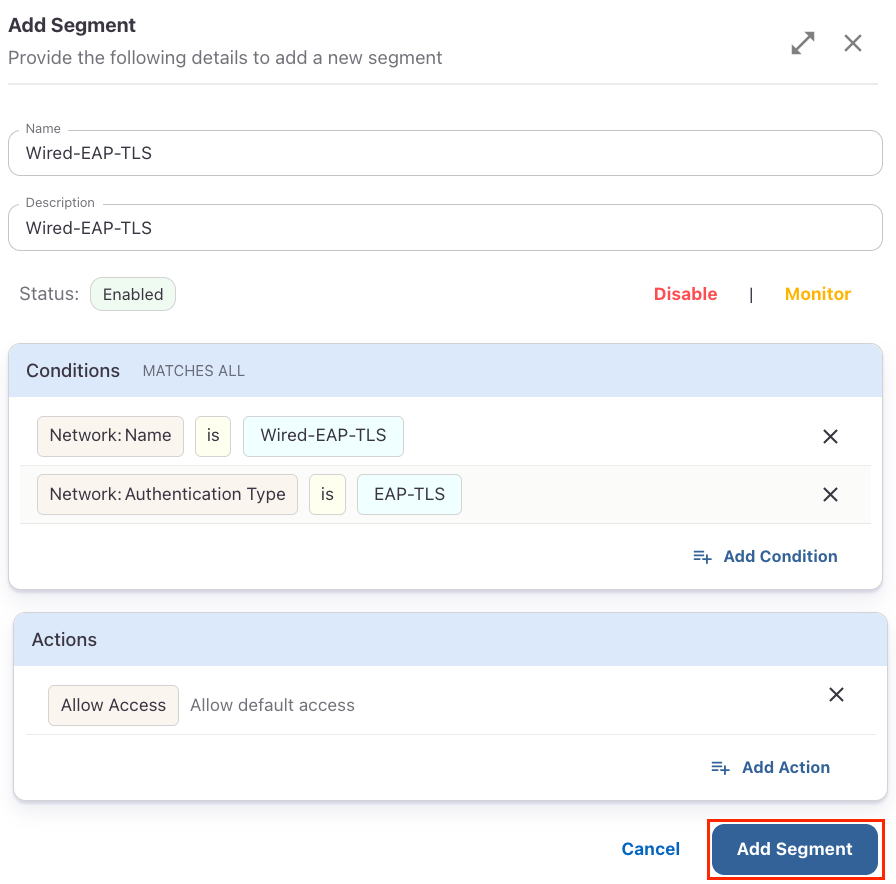

You should now be able to expand and review your segment.

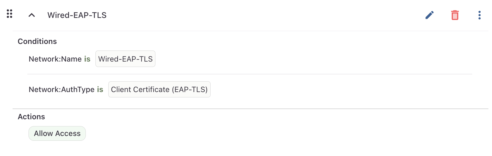

Next, unplug and plug your raspberry Pi into port 2 on the switch and click on Sessions to see if your ATD Raspberry Pi has a connection via the Wired connection.  *Note: The Client Certificate has already been applied to the Raspberry Pi.

---

### 5. Validate and Verify Wired EAP-TLS Device

Once the device is connected you will be able to view the status of the connection and additional session details if you click on the Eye to the right of the device.

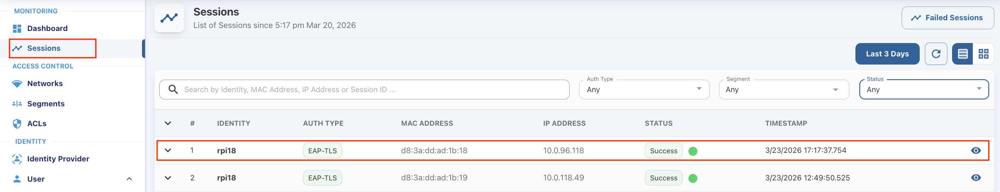

AGNI will then display more in depth session information regarding the device and connection.

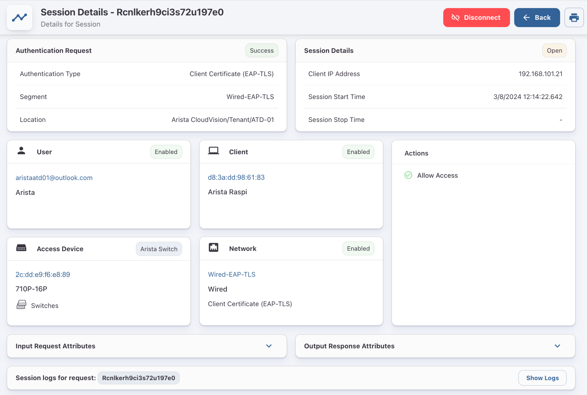

You can also validate the session on the switch by issuing the following commands in the switch CLI

710P-16P#show dot1x host

Port Supplicant MAC Auth State Fallback VLAN

Et2 d83a.dd98.6183 EAPOL SUCCESS NONE

```
710P-16P#sh dot1x host mac d83a.dd98.6183 detail
Operational:
Supplicant MAC: d83a.dd98.6183
User name: aristaatd01@outlook.com
Interface: Ethernet2
Authentication method: EAPOL
Supplicant state: SUCCESS
Fallback applied: NONE
Calling-Station-Id: D8-3A-DD-98-61-83
Reauthentication behaviour: DO-NOT-RE-AUTH
Reauthentication interval: 0 seconds
VLAN ID:
Accounting-Session-Id: 1x00000004
Captive portal:

AAA Server Returned:
Arista-WebAuth:
Class: Rcnlkerh9ci3s72u197e0|C4151a596-baab-444b-a4fd-ad40946d8b5f
Filter-Id:
Framed-IP-Address: 192.168.101.21 sourceArp
NAS-Filter-Rule:
Service-Type: None
Session-Timeout: 86400 seconds
Termination-Action: RADIUS-REQUEST
Tunnel-Private-GroupId:
Arista-PeriodicIdentity:
```

## End of EAP-TLS Wired Policy Lab
---

## Additional Information
## A. 802.1x High-Level Overview

For more information please refer to the TOI.  802.1X on Arista Switches

## Overview

802.1X is an IEEE standard protocol that prevents unauthorized devices from gaining access to the network.  

802.1X defines three device roles:
   
 - Supplicant (client)   
 - Authenticator (switch)   
 - Authentication server (RADIUS)   

Before authentication is successful the switchport is in unauthorized mode and all traffic is blocked, but after authentication has succeeded, normal data can then flow through the switchport. 

### Description 

802.1X port security controls who can send traffic through and receive traffic from individual switch ports. A supplicant needs to authenticate itself using “Extensible Authentication Protocol over Lan” (EAPoL) packets with the switch before it gains full access to the port. Arista switches act as an authenticator, passing the messages from 802.1X supplicants through to the RADIUS server and vice versa. 802.1X can operate in three different modes:  

 - Single Host Mode: Once the 802.1X supplicant is authenticated on the port, ONLY the traffic coming from the supplicant's MAC is allowed through the port.
 - Multi-Host Mode: Once the 802.1X supplicant is authenticated on the port, traffic coming from ANY source MAC is allowed through the port.
 - Multi-Host authenticated Mode: Multiple 802.1X supplicants can be allowed and ONLY the traffic coming from all authenticated supplicant’s MAC is allowed through the port.

Single Host and Multi Host modes allow only one 802.1X supplicant to be authenticated for one port. Once it is successfully authenticated, no other 802.1X supplicant can be authenticated unless the current one logs off, but Multi-Host authenticated Mode allows multiple 802.1X supplicants simultaneously to be authenticated and provided access to the network. From release 4.28.2F, one supplicant can replace another supplicant’s session in single-host mode.  

Apart from 802.1X authentication, Arista switches also support MAC-Based Authentication (MBA) which allows devices not speaking 802.1X to have access to the network. By default the authenticator uses the non delimited MAC address( i.e. 001c73ff9b11) of such devices as the username/password in its RADIUS request packets. Depending on the MAC-Based Authentication configuration on the RADIUS server, it decides whether to authenticate the supplicant or not. Unlike 802.1X supplicants, multiple MBA supplicants can be allowed on a single port (irrespective of 802.1X mode). The MBA configuration is independent of the 802.1X host modes. MBA supplicants will not be considered to allow or reject unauthenticated traffic based on the host mode.  
Note: From release 4.25.1F MBA supplicants can be controlled by Dot1x Host modes.

Arista switches also support Dynamic VLAN assignment, which allows the RADIUS server to indicate the desired VLAN for the supplicant using the tunnel attributes with the Access-Accept message ( “Tunnel-Private-Group-ID” in https://tools.ietf.org/html/rfc2868). Both 802.1X and MBA supplicants can be assigned a VLAN via the RADIUS server using this feature. It should be noted that only one VLAN per port is supported for platforms that do not support “MAC based VLAN assignment”. On these platforms when the first host authenticates, the authenticator port is put in the respective VLAN (via dynamic VLAN assignment) and subsequently, all other hosts must belong to that VLAN as well. For details about which platforms support “MAC Based VLAN Assignment”, please refer to the table in the “Platform Compatibility” paragraph.  

802.1X features are supported on 802.1Q trunk ports allowing the user to have Port-Based Network Access Control ( PNAC ) on such a port.  With this feature, traffic coming into an 802.1X enabled port with a VLAN tag can also be authenticated via both 802.1X or MBA.  

By default, traffic from any unauthenticated device on an 802.1X enabled port is dropped. By configuring Authentication Failure VLAN on the authenticator switch, 802.1X or MBA supplicants’ traffic can be put into a specific VLAN if the supplicant fails to authenticate via the RADIUS server.  

## B. Configuring RadSec profile in EOS  

Reference the following article to Configure the RadSec profile in EOS: 

[Configuring-RadSec-profile-in-EOS](https://arista.my.site.com/AristaCommunity/s/article/Configuring-RadSec-profile-in-EOS)

## C. Adding Access Control Lists for Wired Users
In this section we will add an acl to AGNI which we can push to the switch. 

First navigate to Access Control - > ACLs  and  + Add ACL in the upper right corner

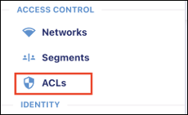  

Next fill in the Name and Description fields with Guest Access and ACL Field with the below config then select Add ACL

#permit servers  
permit in ip from any to 192.168.125.11  
#deny network access  
deny in ip from any to 192.168.0.0/16  
deny in ip from any to 10.0.0.0/8  
#Allow internet access  
permit in ip from any to any  

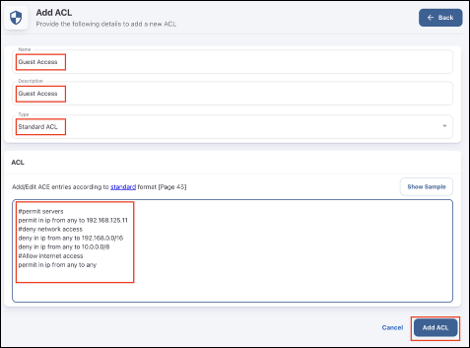

It should now show in the Access Control list 

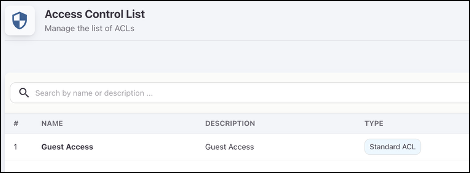

Next we will apply it to a Segment. Navigate to Segments, then select edit on the Wired-EAP-TLS segment
 
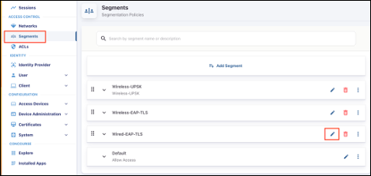

Next under the actions section Select Add Action and choose Apply ACL from the drop down list then choose Standard ACL and Guest Access to build out the Action. When complete it should look as below. You can then select “Update Segment”
 
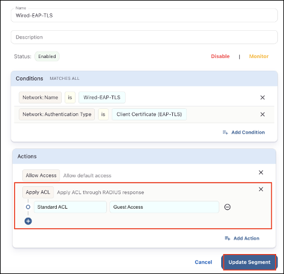

From here navigate back to the Sessions screen and find the client session for the raspberry pi select the eye on the right hand side to view details. 

  

 
At the top of the session details page select the Disconnect button to disconnect and re-authenticate the session. 


Next you will then see a new session come up as the client re-authenticates you can validate the acl being applied by selecting the Eye next to this new session and viewing the details 
 
   
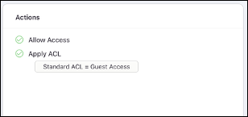 

Next we can validate on the switch by issuing Show dot1x host command  

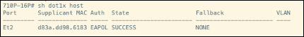 

Take this mac address and issue the command  show dot1x host mac  <mac from above> detail here we will see the Access list applied in the Nas-Filter-Rule
 
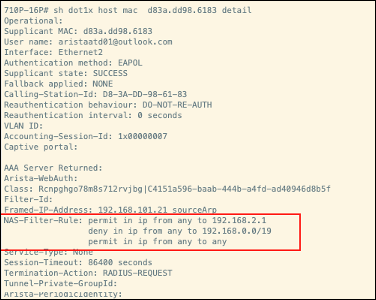 

Lastly issue the show ip access-lists command to view the dynamic access list applied 

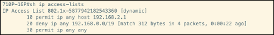    

You can try pinging the device ip from your laptop to confirm acl functionality. 


## NAC LAB #4 COMPLETE
