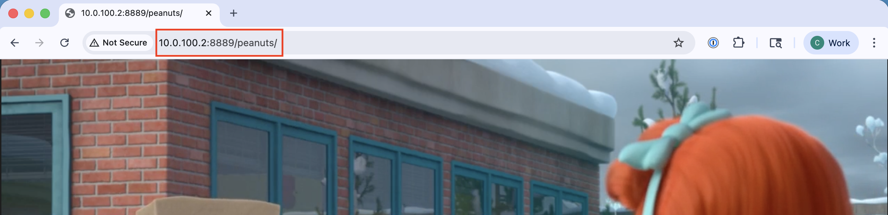
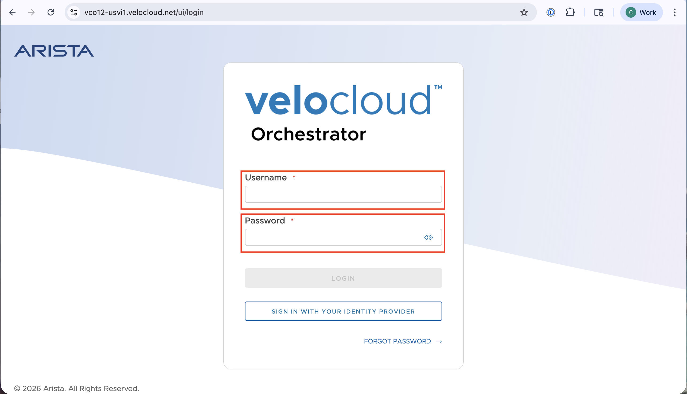
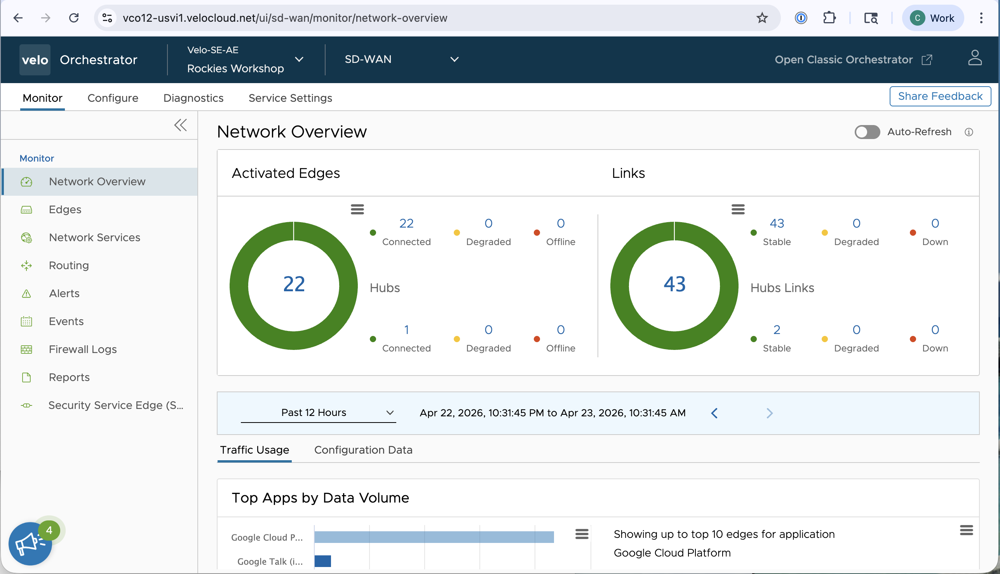
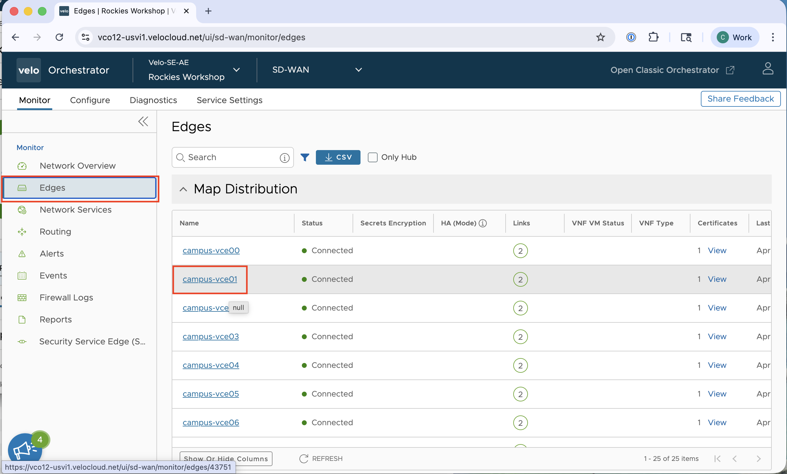
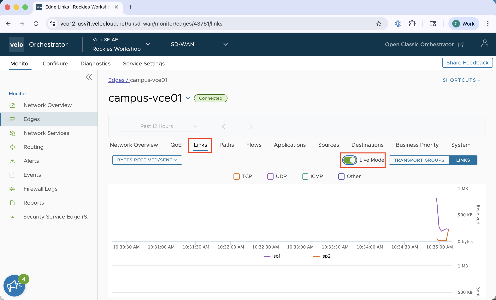
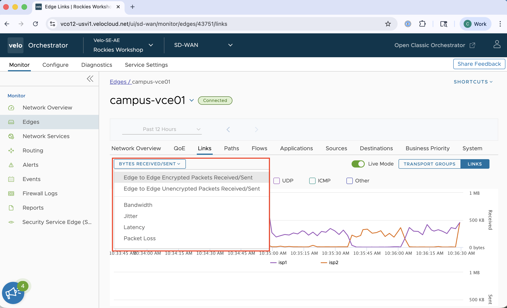
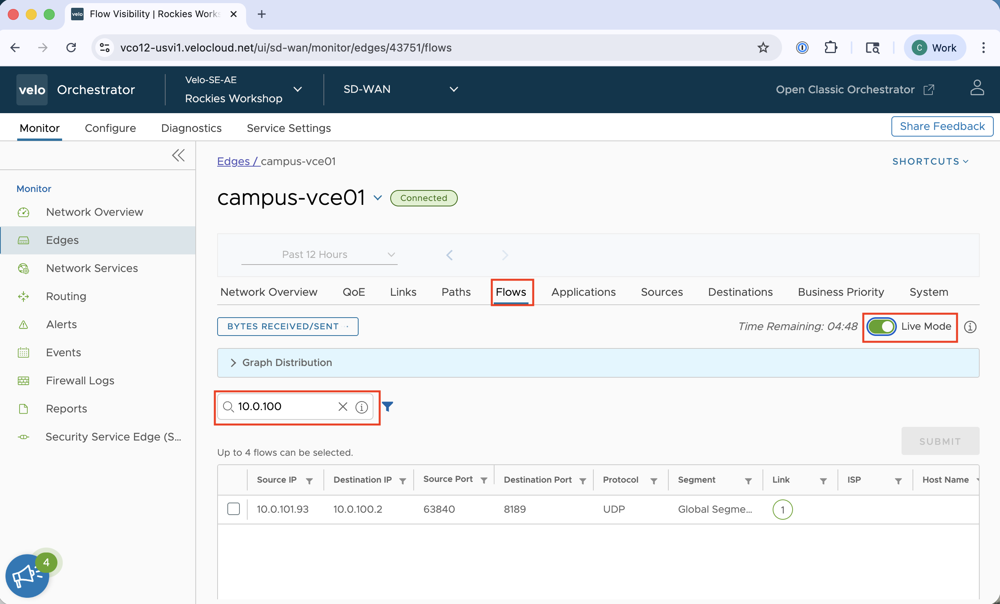

# Campus SD-03
## Test DMPO

<!-- TODO: Add Images -->

---

## This Lab Guide:
[Campus SD-03 VeloCloud Lab Guide - Test DMPO](https://github.com/arista-rockies/Workshops/blob/main/Campus/2026_Campus_Workshop/SD-03/2026_Campus_SD-03_VeloCloud_Lab_Guide_Test_DMPO.md)

## Table of Contents

1. [Full Lab Topoology](#1-full-lab-topology)
2. [POD Topology](#2-pod-topology)
3. [Connect to Video Stream](#3-connect-to-video-stream)
4. [Login to the VeloCloud Orchestrator](#4-login-to-the-velocloud-orchestrator)
5. [Monitor the Traffic Flow](#5-monitor-the-traffic-flow)

---

## 1. Full Lab Topology

---

## 2. POD Topology

---

## 3. Connect to Video Stream

1. Connect your laptop to the “POD-**\#\#**\-FL1” SSID you created previously.

2. Connect to the streaming server via http://10.0.100.2:8889/peanuts

3. You should now see a movie playing that is in-sync with your neighbors.

## 4. Login to the VeloCloud Orchestrator

1. Go to the VeloCloud Orchestrator (VCO) via: https://veco12.velocloud.net/ui/
- Login with you assigned credentials

3. You are now logged into the VCO.

## 5. Monitor the Traffic Flow

1. Click **Edges** on the left menu

2. Click on "campus\-vce**\#\#**" which is the VeloCloud Edge assigned to your POD.

3. Click on **Links** and then enable **Live Mode**.

4. Look at the available metrics to see **Average Throughput**, **Packet Loss**, **Latency** and **Jitter** on both isp1 and isp2.

5. Click on **Flows**, enable **Live Mode** and filter for the media server at **10.0.100.2**.

